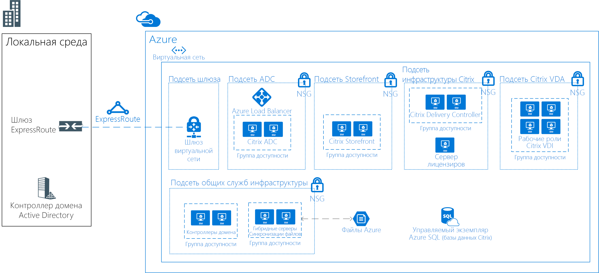

# Виртуальный рабочий стол Linux с использованием CitrixLinux Virtual Desktops with Citrix

Этот пример сценария применим к любой отрасли, для которой требуется инфраструктура виртуальных рабочих столов (VDI) для рабочих столов Linux.This example scenario is applicable to any industry that needs a Virtual Desktop Infrastructure (VDI) for Linux Desktops. VDI — это процесс запуска рабочего стола пользователя в виртуальной машине, что на сервере центра данных.VDI refers to the process of running a user desktop inside a virtual machine that lives on a server in the datacenter. В этом сценарии клиент решил использовать для своих потребностей VDI решение на основе Citrix.The customer in this scenario chose to use a Citrix-based solution for their VDI needs.

Организации часто имеют разнородную среду с несколькими устройствами и операционными системами, которые используют сотрудники.Organizations often have heterogeneous environments with multiple devices and operating systems being used by employees. Обеспечение последовательного доступа к приложениям при сохранении безопасной среды может быть сложной задачей.It can be challenging to provide consistent access to applications while maintaining a secure environment. Решение VDI для рабочих столов Linux позволит вашей организации предоставлять доступ независимо от устройства или ОС, используемых пользователем.A VDI solution for Linux desktops will allow your organization to provide access irrespective of the device or OS used by the end user.

Существуют некоторые преимущества этого решения:Some benefits for this sample solution include the following:
* С использованием общих виртуальных рабочих столов Linux рентабельность инвестиций будет выше, так как к одной и той же инфраструктуре будет предоставлен доступ большему количеству пользователей.Return on investment will be higher with shared Linux virtual desktops by giving more users access to the same infrastructure. Благодаря объединению ресурсов в централизованной среде VDI нет потребности в более мощных устройствах пользователя.By consolidating resources on a centralized VDI environment, the end user devices don't need to be as powerful.
* Производительность будет согласованной независимо от устройства пользователя.Performance will be consistent regardless of the end user device.
* Пользователи могут получить доступ к приложениям Linux с любого устройства (включая устройства не на ОС Linux).Users can access Linux applications from any device (including non-Linux devices).
* Конфиденциальные данные всех распределенных сотрудников могут быть защищены в центре обработки данных Azure.Sensitive data can be secured in the Azure data center for all distributed employees.

## Варианты соответствующего использованияRelevant use cases

Рассмотрите этот сценарий для следующих вариантов использования:Consider this scenario for the following use case:

* Обеспечение безопасного доступа к критически важным специализированным рабочим столам Linux VDI на устройствах с Linux или другой ОСProviding secure access to mission-critical, specialized Linux VDI desktops from Linux or non-Linux devices

## АрхитектураArchitecture

Этот пример сценария демонстрирует возможность доступа корпоративной сети к виртуальным рабочим столам Linux:This example scenario demonstrates allowing the corporate network to access the Linux Virtual Desktops:

* Между локальной средой и Azure устанавливается ExpressRoute для обеспечения быстрой и надежной связи с облаком.An ExpressRoute is established between the on-premises environment and Azure, for fast and reliable connectivity to the cloud.
* Решение Citrix XenDesktop развернуто для VDI.Citrix XenDeskop solution deployed for VDI.
* CitrixVDA работает на Ubuntu (или другом поддерживаемом дистрибутиве).The CitrixVDA run on Ubuntu (or another supported distro).
* Группы безопасности сети Azure будут применять правильные списки управления доступом к сети.Azure Network Security Groups will apply the correct network ACLs.
* Citrix ADC (NetScaler) опубликует и загрузит все службы Citrix.Citrix ADC (NetScaler) will publish and load balance all the Citrix services.
* Доменные службы Active Directory будут использоваться для присоединения к домену серверов Citrix.Active Directory Domain Services will be used to domain join the Citrix servers. Серверы VDA не будут присоединены к домену.VDA servers will not be domain joined.
* Синхронизация гибридных файлов Azure позволит совместное хранилище через решение.Azure Hybrid File Sync will enable shared storage across the solution. Например, это может использоваться в удаленных или домашних решениях.For example, it can be used in remote/home solutions.

В рамках данного сценария используются следующие номера SKU:For this scenario, the following SKUs are used:

- Citrix ADC (NetScaler): 2 x D4sv3 с [NetScaler 12.0 VPX Standard Edition 200 MBPS PAYG image](https://azuremarketplace.microsoft.com/pt-br/marketplace/apps/citrix.netscalervpx-120?tab=PlansAndPrice)Citrix ADC (NetScaler): 2 x D4sv3 with [NetScaler 12.0 VPX Standard Edition 200 MBPS PAYG image](https://azuremarketplace.microsoft.com/pt-br/marketplace/apps/citrix.netscalervpx-120?tab=PlansAndPrice)
- Сервер лицензирования Citrix: 1 x D2s v3Citrix License Server: 1 x D2s v3
- Citrix VDA: 4 x D8s v3Citrix VDA: 4 x D8s v3
- Онлайн-магазин Citrix: 2 x D2s v3Citrix Storefront: 2 x D2s v3
- Контроллер доставки Citrix: 2 x D2s v3Citrix Delivery Controller: 2 x D2s v3
- Контроллеры домена: 2 x D2sv3Domain Controllers: 2 x D2sv3
- Файловые серверы Azure: 2 x D2sv3Azure File Servers: 2 x D2sv3

> [!NOTE]
> Все лицензии (кроме NetScaler) с использованием собственной лицензии (BYOL)All the licenses (other than NetScaler) are bring-your-own-license (BYOL)

### КомпонентыComponents

- [Виртуальная сеть Azure](/azure/virtual-network/virtual-networks-overview) позволяет ресурсам (например, виртуальным машинам) обмениваться данными друг с другом через локальные сети и Интернет.[Azure Virtual Network](/azure/virtual-network/virtual-networks-overview) allows resources such as VMs to securely communicate with each other, the internet, and on-premises networks. Виртуальные сети обеспечивают изоляцию и сегментирование, фильтрацию и маршрутизацию трафика и позволяют устанавливать связь между расположениями.Virtual networks provide isolation and segmentation, filter and route traffic, and allow connection between locations. Для всех ресурсов этого сценария будет использоваться одна виртуальная сеть.One virtual network will be used for all resources in this scenario.
- [Группы безопасности сети Azure](/azure/virtual-network/security-overview) содержат список правил безопасности, которые разрешают или запрещают входящий и исходящий трафик в зависимости от IP-адреса источника или назначения, порта и протокола.[Azure network security groups](/azure/virtual-network/security-overview) contain a list of security rules that allow or deny inbound or outbound network traffic based on source or destination IP address, port, and protocol. Виртуальные сети в этом сценарии защищены с помощью правил группы безопасности сети, которые ограничивают поток трафика между компонентами приложения.The virtual networks in this scenario are secured with network security group rules that restrict the flow of traffic between the application components.
- [Azure Load Balancer](/azure/application-gateway/overview) распределяет входящий трафик в соответствии с правилами и проверками работоспособности.[Azure load balancer](/azure/application-gateway/overview) distributes inbound traffic according to rules and health probes. Подсистема балансировки нагрузки обеспечивает низкую задержку и высокую пропускную способность, а также увеличение масштаба до миллионов потоков для всех приложений, которые используют протоколы TCP и UDP.A load balancer provides low latency and high throughput, and scales up to millions of flows for all TCP and UDP applications. Внутренняя подсистема балансировки нагрузки используется в этом сценарии для распределения трафика в Citrix NetScaler.An internal load balancer is used in this scenario to distribute traffic on the Citrix NetScaler.
- [Служба "Синхронизация гибридных файлов Azure"](https://github.com/MicrosoftDocs/azure-docs/edit/master/articles/storage/files/storage-sync-files-planning.md) будет использоваться для всего общего хранилища.[Azure Hybrid File Sync](https://github.com/MicrosoftDocs/azure-docs/edit/master/articles/storage/files/storage-sync-files-planning.md) will be used for all shared storage. С помощью Синхронизации гибридных файлов хранилище будет реплицироваться в два файловых сервера.The storage will replicate to two file servers using Hybrid File Sync.
- [База данных SQL Azure](/azure/sql-database/sql-database-technical-overview) — это реляционная база данных, предоставляемая по модели "как услуга" (DBaaS), на основе последней стабильной версии ядра СУБД Microsoft SQL Server.[Azure SQL Database](/azure/sql-database/sql-database-technical-overview) is a relational database-as-a-service (DBaaS) based on the latest stable version of Microsoft SQL Server Database Engine. Она будет использоваться для размещения баз данных Citrix.It will be used for hosting Citrix databases.
- [ExpressRoute](/azure/expressroute/expressroute-introduction) позволяет переносить локальные сети в Microsoft Cloud по частному подключению, которое обеспечивается поставщиком услуг подключения.[ExpressRoute](/azure/expressroute/expressroute-introduction) lets you extend your on-premises networks into the Microsoft cloud over a private connection facilitated by a connectivity provider. 
- [Доменные службы Active Directory используются для служб каталогов и аутентификации пользователей[Active Directory Domain Services is used for Directory Services and user authentication
- [Группа доступности Azure](/azure/virtual-machines/windows/tutorial-availability-sets) обеспечит, чтобы при развертывании виртуальных машин в Azure они были распределены между несколькими изолированными аппаратными узлами в кластере.[Azure Availabilty Sets](/azure/virtual-machines/windows/tutorial-availability-sets) will ensure that the VMs you deploy on Azure are distributed across multiple isolated hardware nodes in a cluster. Таким образом, в случае сбоя оборудования или программного обеспечения в Azure затрагивается только подмножество виртуальных машин, а общее решение остается доступным для использования.Doing this ensures that if a hardware or software failure within Azure happens, only a subset of your VMs are impacted and that your overall solution remains available and operational. 
- [Citrix ADC (NetScaler)](https://www.citrix.com/products/citrix-adc) — контроллер доставки приложений, который выполняет анализ трафика конкретного приложения для умного распространения, оптимизации и защиты сетевого трафика слоя 4 – слоя 7 (L4–L7) для веб-приложений.[Citrix ADC (NetScaler)](https://www.citrix.com/products/citrix-adc) is an application delivery controller that performs application-specific traffic analysis to intelligently distribute, optimize, and secure Layer 4-Layer 7 (L4–L7) network traffic for web applications. 
- [Онлайн-магазин Citrix](https://www.citrix.com/products/citrix-virtual-apps-and-desktops/citrix-storefront.html) — это хранилище корпоративного приложения, которое улучшает безопасность и упрощает развертывание, обеспечивая современный, непревзойденный, почти собственный пользовательский интерфейс в Citrix Receiver на любой платформе.[Citrix Storefront](https://www.citrix.com/products/citrix-virtual-apps-and-desktops/citrix-storefront.html) is an enterprise app store that improves security and simplifies deployments, delivering a modern, unmatched near-native user experience across Citrix Receiver on any platform. Онлайн-магазин упрощает управление средами виртуальных приложений Citrix для нескольких местоположений и версий, а также настольных компьютеров.StoreFront makes it easy to manage multi-site and multi-version Citrix Virtual Apps and Desktops environments. 
- [Сервер лицензирования Citrix](https://www.citrix.com/buy/licensing/overview.html) будет управлять лицензиями на продукты Citrix.[Citrix License Server](https://www.citrix.com/buy/licensing/overview.html) will manage the licenses for Citrix products.
- [Citrix XenDesktops VDA](https://docs.citrix.com/en-us/citrix-virtual-apps-desktops-service) позволяет подключаться к приложениям и рабочим столам.[Citrix XenDesktops VDA](https://docs.citrix.com/en-us/citrix-virtual-apps-desktops-service) enables connections to applications and desktops. VDA устанавливается на машине, которая запускает для пользователя приложения или виртуальные рабочие столы.The VDA is installed on the machine that runs the applications or virtual desktops for the user. Он позволяет машинам регистрироваться с контроллерами доставки и управлять соединением высокой четкости (HDX) с пользовательским устройством.It enables the machines to register with Delivery Controllers and manage the High Definition eXperience (HDX) connection to a user device.
- [Контроллер доставки Citrix](https://docs.citrix.com/en-us/xenapp-and-xendesktop/7-15-ltsr/manage-deployment/delivery-controllers) — это серверный компонент, отвечающий за управление доступом пользователя, а также брокерские подключения и подключения по оптимизации.[Citrix Delivery Controller](https://docs.citrix.com/en-us/xenapp-and-xendesktop/7-15-ltsr/manage-deployment/delivery-controllers) is the server-side component responsible for managing user access, plus brokering and optimizing connections. Контроллеры также предоставляют службы создания машин, которые создают образы рабочего стола и сервера.Controllers also provide the Machine Creation Services that create desktop and server images.

### Альтернативные вариантыAlternatives

- Существует несколько участников с решениями VDI, которые поддерживаются в Azure, такие как VMware, Workspot и другие.There are multiple partners with VDI solutions that supported in Azure such as VMware, Workspot, and others. Этот конкретный пример архитектуры основан на развернутом проекте, для которого использовался Citrix.This specific sample architecture is based on a deployed project that used Citrix.
- Citrix предоставляет облачную службу, которая выделяет часть этой архитектуры.Citrix provides a cloud service that abstracts part of this architecture. Это может быть альтернативой этого решения.It could be an alternative for this solution. Дополнительные сведения см. в [Citrix Cloud](https://www.citrix.com/products/citrix-cloud) (Облако Citrix).For more information, see [Citrix Cloud](https://www.citrix.com/products/citrix-cloud).

## РекомендацииConsiderations

- Проверьте [Citrix Linux Requirements](https://docs.citrix.com/en-us/linux-virtual-delivery-agent/current-release/system-requirements) (Требования к Citrix на ОС Linux).Check the [Citrix Linux Requirements](https://docs.citrix.com/en-us/linux-virtual-delivery-agent/current-release/system-requirements).
- Задержка может оказать влияние на решение в целом.Latency can have impact on the overall solution. Проведите для рабочей среды соответствующее тестирование.For a production environment, test accordingly.
- В зависимости от сценария для решения может понадобиться виртуальная машина с GPU для VDA.Depending on the scenario, the solution may need VMs with GPUs for VDA. Для этого решения предполагается, что GPU — необязательное требование.For this solution, it is assumed that GPU is not a requirement.

### Доступность, масштабируемость и безопасностьAvailability, Scalability, and Security

- Этот пример решения предназначен для высокой доступности для всех ролей, отличных от сервера лицензирования.This sample solution is designed for high availability for all roles other than the licensing server. Поскольку среда продолжает функционировать в течение 30-дневного периода отсрочки, если сервер лицензирования находится в автономном режиме, то на этом сервере не требуется дополнительная избыточность.Because the environment continues to function during a 30-day grace period if the license server is offline, no additional redundancy is required on that server.
- Все серверы, предоставляющие аналогичные роли, должны развертываться в [группах доступности](/azure/virtual-machines/windows/manage-availability#configure-multiple-virtual-machines-in-an-availability-set-for-redundancy).All servers providing similar roles should be deployed in [Availability Sets](/azure/virtual-machines/windows/manage-availability#configure-multiple-virtual-machines-in-an-availability-set-for-redundancy).
- Этот пример решения не включает возможности аварийного восстановления.This sample solution does not include Disaster Recovery capabilities. [Служба Azure Site Recovery](/azure/site-recovery/site-recovery-overview) может быть хорошей надстройкой для этой разработки.[Azure Site Recovery](/azure/site-recovery/site-recovery-overview) could be a good add-on to this design.
- Для решения по управлению развертыванием продукта необходимо реализовать решение, например [резервное копирование](/azure/backup/backup-introduction-to-azure-backup), [мониторинг](/azure/monitoring-and-diagnostics/monitoring-overview) и [управление обновлениями](/azure/automation/automation-update-management).For a production deployment management solution should be implemented such as [backup](/azure/backup/backup-introduction-to-azure-backup), [monitoring](/azure/monitoring-and-diagnostics/monitoring-overview) and [update management](/azure/automation/automation-update-management).
- Этот пример решения должен работать примерно для 250 многопоточных пользователей (около 50–60 на сервер VDA) со смешанным использованием.This sample solution should work for about 250 concurrent (about 50-60 per VDA server) users with a mixed usage. Но это будет сильно зависеть от типа используемых приложений.But that will greatly depended on the type of applications being used. Для использования в производстве необходимо выполнить строгое нагрузочное тестирование.For production use, rigorous load testing should be performed.

## Развертывание этого сценарияDeploy this scenario

Сведения о развертывании доступны в официальной [документации Citrix](https://docs.citrix.com/en-us/citrix-virtual-apps-desktops/install-configure.html).For deployment information see the official [Citrix documentation](https://docs.citrix.com/en-us/citrix-virtual-apps-desktops/install-configure.html).

## ЦеныPricing

- Лицензии Citrix XenDesktop не включены в плату за услуги Azure.The Citrix XenDesktop licenses are not included in Azure service charges.
- Лицензия Citrix NetScaler включена в модель с оплатой по мере использования.The Citrix NetScaler license is included in a pay-as-you-go model.
- Использование зарезервированных экземпляров значительно уменьшит вычислительную стоимость решения.Using reserved instances will greatly reduce the compute cost for the solution.
- Стоимость ExpressRoute не включено.The ExpressRoute cost is not included.

## Дальнейшие действияNext Steps

- Документацию Citrix по планированию и развертыванию см. [здесь](https://docs.citrix.com/en-us/citrix-virtual-apps-desktops/install-configure).Check Citrix documentation for planning and deployment [here](https://docs.citrix.com/en-us/citrix-virtual-apps-desktops/install-configure).
- Чтобы развернуть Citrix ADC (NetScaler) в Azure, просмотрите шаблоны диспетчера ресурсов, предоставленные Citrix [здесь](https://github.com/citrix/netscaler-azure-templates).To deploy Citrix ADC (NetScaler) in Azure, review the Resource Manager templates provided by Citrix [here](https://github.com/citrix/netscaler-azure-templates).
