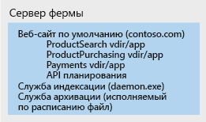
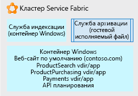

# Использование Service Fabric для декомпозиции монолитных приложенийUsing Service Fabric to decompose monolithic applications

В этом примере будет рассмотрен сценарий декомпозиции большого цельного приложения с помощью платформы [Service Fabric](/azure/service-fabric/service-fabric-overview).In this example scenario, we walk through an approach using [Service Fabric](/azure/service-fabric/service-fabric-overview) as a platform for decomposing an unwieldy monolithic application. Предполагается применение итеративного подхода к расчленению веб-сайта IIS/ASP.NET на множество управляемых микрослужб, формирующих одно приложение.Here we consider an iterative approach to decomposing an IIS/ASP.NET web site into an application composed of multiple, manageable microservices.

Переход от монолитной архитектуры к архитектуре микрослужб обеспечивает ряд преимуществ:Moving from a monolithic architecture to a microservice architecture provides the following benefits:
* возможность изменять и разворачивать один небольшой и понятный блок кода;You can change one small, understandable unit of code and deploy only that unit.
* время развертывания каждого блока кода составляет всего несколько минут;Each code unit requires just a few minutes or less to deploy.
* если в блоке кода присутствует ошибка, прекращается работа только этого блока, а не всего приложения;If there is an error in that small unit, only that unit stops working, not the whole application.
* небольшие блоки кода удобно и распределять среди нескольких команд разработчиков;Small units of code can be distributed easily and discretely among multiple development teams.
* новым разработчикам легче понять функциональность каждого из блоков кода.New developers can quickly and easily grasp the discrete functionality of each unit.

В этом примере рассматривается большое приложение IIS, работающее на ферме серверов, при этом концепция итеративной декомпозиции и размещения может применяться для крупного приложения любого типа.A large IIS application on a server farm is used in this example, but the concepts of iterative decomposition and hosting can be used for any type of large application. Хотя это решение использует Windows, Service Fabric может выполняться и на платформе Linux.While this solution uses Windows, Service Fabric can also run on Linux. Решение может размещаться локально, в Azure или на узлах виртуальных машин любого провайдера облачных услуг.It can be run on-premises, in Azure, or on VM nodes in the cloud provider of your choice.

## Варианты соответствующего использованияRelevant use cases

Этот сценарий актуален для организаций, обладающих крупными целостными веб-приложениями и сталкивающихся с такими проблемами:This scenario is relevant to organizations with large monolithic Web applications that are experiencing:

- Ошибки при незначительных изменениях кода приводят к сбою в работе всего веб-сайта.Errors in small code changes that break the entire website.
- Выпуск обновления занимает многие дни, так как веб-сайт выпускается целиком.Releases taking multiple days due to the need to release update the entire website.
- Продолжительность и сложность подключения к работе новых разработчиков и команд из-за сложного базового кода, а это значит, что одному человеку нужно слишком много знать.Long ramp-up times when onboarding new developers or teams due to the complex code base, requiring a single individual to know more than is feasible.

## АрхитектураArchitecture

Используя Service Fabric в качестве платформы размещения, крупный веб-сайт IIS можно преобразовать в комбинацию микрослужб, как показано на рисунке.Using Service Fabric as the hosting platform, we can convert a large IIS web site into a collection of microservices as shown below:

На рисунке все структурные части большого приложения IIS были разложены на такие компоненты:In the picture above, we decomposed all the parts of a large IIS application into:

- служба маршрутизации или шлюза, принимающая входящие запросы браузера и анализирующая их на предмет того, какие службы должны их обрабатывать, и перенаправляющая запросы к соответствующим службам;A routing or gateway service that accepts incoming browser requests, parses them to determine what service should handle them, and forwards the request to that service.
- четыре приложения ASP.NET Core, которые формально являлись виртуальными каталогами единого веб-сайта IIS и выполнялись как приложения ASP.NET.Four ASP.NET Core applications that were formally virtual directories under the single IIS site running as ASP.NET applications. Теперь приложения разделены на независимые микрослужбы.The applications were separated into their own independent microservices. Это позволяет изменять и обновлять их по отдельности.The effect is that they can be changed, versioned, and upgraded separately. В этом примере мы переписали каждое приложение с помощью .Net Core и ASP.NET Core.In this example, we rewrote each application using .Net Core and ASP.NET Core. Эти микрослужбы изначально создавались как [Reliable Services](/azure/service-fabric/service-fabric-reliable-services-introduction), поэтому им доступны все возможности и преимущества платформы Service Fabric (взаимодействия, отчеты о работоспособности, уведомления и т. д.).These were written as [Reliable Services](/azure/service-fabric/service-fabric-reliable-services-introduction) so they can natively access the full Service Fabric platform capabilities and benefits (communication services, health reports, notifications, etc.).
- *Служба индексирования* Windows теперь содержится в контейнере Windows, поэтому теперь не нужно непосредственно вносить изменения в реестр базового сервера. Приложение может запускаться автономно и развертываться со всеми своими зависимостями как единое целое.A Windows service called *Indexing Service*, placed in a Windows container so that it no longer makes direct changes to registry of the underlying server, but can run self-contained and be deployed with all its dependencies as a single unit.
- Служба архивирования является просто исполняемым файлом, который запускается по расписанию и выполняет некоторые задачи для веб-сайтов.An Archive service, which is just an executable that runs according to a schedule and performs some tasks for the sites. Она размещается непосредственно в виде отдельного исполняемого файла, так как мы определили, что она отлично справляется со своими задачами и не требует никаких изменений.It is hosted directly as a stand-alone executable because we determined it does what it needs to do without modification and it is not worth the investment to change.

## РекомендацииConsiderations

Первая трудность заключается в том, чтобы определить фрагменты кода, которые можно обособить в качестве микрослужб, так чтобы монолитное решение могло их вызывать.The first challenge is to begin to identify smaller bits of code that can be factored out from the monolith into microservices that the monolith can call. Со временем с каждой новой итерацией монолитное приложение раздробляется на коллекцию таких микрослужб, которые понятны разработчикам, легкого модифицируются и быстро разворачиваются с минимальным риском.Iteratively over time, the monolith is broken up into a collection of these microservices that developers can easily understand, change, and quickly deploy at low risk.

Выбор пал на Service Fabric, поскольку эта платформа способна поддерживать различные виды микрослужб.Service Fabric was chosen because it is capable of supporting running all the microservices in their various forms. Например, у вас может быть несколько автономных исполняемых файлов, небольшие новые веб-сайты, небольшие новые интерфейсы API, контейнерные службы и т. д. С помощью Service Fabric службы всех этих типов можно объединить в рамках единого кластера.For example you may have a mix of stand-alone executables, new small web sites, new small APIs, and containerized services, etc. Service Fabric can combine all these service types onto a single cluster.

Чтобы получить такое итоговое разложенное приложение, будем использовать итеративный подход.To get to this final, decomposed application, we used an iterative approach. Мы выбрали большой веб-сайт IIS/ASP.NET, работающий на ферме серверов.We started with a large IIS/ASP.NET web site on a server farm. Целостный узел фермы серверов показан на картинке.A single node of the server farm is pictured below. Он содержит веб-сайт с несколькими виртуальными каталогами, дополнительные службы Windows, которые вызывает веб-сайт, и исполняемый файл, который периодически выполняет обслуживание архива веб-сайта.It contains the original web site with several virtual directories, an additional Windows Service the site calls, and an executable that does some periodic site archive maintenance.

В ходе первой итерации веб-сайт IIS и его виртуальные каталоги были помещены в [контейнер Windows](/azure/service-fabric/service-fabric-containers-overview).On the first development iteration, the IIS site and its virtual directories placed in a [Windows Container](/azure/service-fabric/service-fabric-containers-overview). Это позволяет сохранить работоспособность веб-сайта, ослабив при этом его зависимость от ОС узла сервера.Doing this allows the site to remain operational, but not tightly bound to the underlying server node OS. Контейнер выполняется и оркестрируется базовым узлом Service Fabric, но работоспособность веб-сайта не зависит от каких-либо состояний узла (записей реестра, файлов и т. д.).The container is run and orchestrated by the underlying Service Fabric node, but the node does not have to have any state that the site is dependent on (registry entries, files, etc.). Все эти элементы находятся в контейнере.All of those items are in the container. По той же причине мы поместили службу индексирования в контейнер Windows.We have also placed the Indexing service in a Windows Container for the same reasons. Контейнеры можно разворачивать, обновлять и масштабировать независимо друг от друга.The containers can be deployed, versioned, and scaled independently. Наконец, мы разместили службу архивирования — простой [автономный исполняемый файл](/azure/service-fabric/service-fabric-guest-executables-introduction), так как к нему не предъявляются особые требования.Finally, we hosted the Archive Service a simple [stand-alone executable file](/azure/service-fabric/service-fabric-guest-executables-introduction) since it is a self-contained .exe with no special requirements.

На картинке ниже показано частичное разделение изначального веб-сайта на независимые составляющие и направления для его дальнейшего дробления.The picture below shows how our large web site is now partially decomposed into independent units and ready to be decomposed more as time allows.

Дальнейшие действия направлены на разделение контейнера веб-сайта, показанного в нижней части картинки.Further development focuses on separating the single large Default Web site container pictured above. Каждое приложение виртуального каталога ASP.NET по очереди удаляется из контейнера и переносится в среду ASP.NET Core в виде [Reliable Service](/azure/service-fabric/service-fabric-reliable-services-introduction).Each of the virtual directory ASP.NET apps is removed from the container one at a time and ported to ASP.NET Core [reliable services](/azure/service-fabric/service-fabric-reliable-services-introduction).

После переноса всех виртуальных каталогов веб-сайт переписывается с помощью ASP.NET Core в виде Reliable Service — "надежной службы", принимающей входящие запросы браузера и перенаправляющей их к соответствующему приложению ASP.NET.Once each of the virtual directories has been factored out, the Default Web site is written as an ASP.NET Core reliable service, which accepts incoming browser requests and routes them to the correct ASP.NET application.

### Доступность, масштабируемость и безопасностьAvailability, Scalability, and Security

Платформа Service Fabric [поддерживает различные виды микрослужб](/azure/service-fabric/service-fabric-choose-framework), обеспечивая быстрый и простой обмен вызовами между ними в рамках одного кластера.Service Fabric is [capable of supporting various forms of microservices](/azure/service-fabric/service-fabric-choose-framework) while keeping calls between them on the same cluster fast and simple. Service Fabric — это [отказоустойчивый](/azure/service-fabric/service-fabric-availability-services), самовосстанавливающийся кластер, который позволяет выполнять контейнеры и исполняемые файлы, а также обладает собственным API для написания микрослужб, интегрированных непосредственно в кластер (упомянутые Reliable Services).Service Fabric is a [fault tolerant](/azure/service-fabric/service-fabric-availability-services), self-healing cluster that can run containers, executables, and even has a native API for writing microservices directly to it (the 'Reliable Services' referred to above). Платформа упрощает выполнение задач обновления микрослужб и управления их версиями.The platform facilitates rolling upgrades and versioning of each microservice. Можно произвольно менять масштаб любой выполняемой на платформе микрослужбы в рамках кластера Service Fabric, осуществляя таким образом горизонтальное или вертикальное [масштабирование](/azure/service-fabric/service-fabric-concepts-scalability) требуемой микрослужбы.You can tell the platform to run more or fewer of any given microservice distributed across the Service Fabric cluster in order to [scale](/azure/service-fabric/service-fabric-concepts-scalability) in or out only the microservices you need.

Service Fabric — это кластер, построенный на инфраструктуре виртуальных (или физических) узлов с сетевыми ресурсами, хранилищами и операционными системами.Service Fabric is a cluster built on an infrastructure of virtual (or physical) nodes, which have networking, storage, and an operating system. Таким образом, с помощью Service Fabric может решать задачи администрирования, обслуживания и мониторинга.As such, it has a set of administrative, maintenance, and monitoring tasks.

Также предусмотрены функции управления и контроль над кластером.You'll also want to consider governance and control of the cluster. Точно так же, как вы возражали бы против бесконтрольного развертывания каких-нибудь служб на вашем сервере рабочей базы данных, так и в кластере Service Fabric необходим контроль над тем, какие приложения и кем там размещаются.Just as you would not want people arbitrarily deploying databases to your production database server, neither would you want people deploying applications to the Service Fabric cluster without some oversight.

Ознакомьтесь с тем, какие [сценарии применения](/azure/service-fabric/service-fabric-application-scenarios) позволяет реализовать Service Fabric.Service Fabric is capable of hosting many different [application scenarios](/azure/service-fabric/service-fabric-application-scenarios), take some time to see which ones apply to your scenario.

## ЦеныPricing

Если кластер Service Fabric размещается в Azure, наибольшая часть затрат приходится на плату за количество и размер узлов в кластере.For a Service Fabric cluster hosted in Azure, the largest part of the cost is the number and size of the nodes in your cluster. Azure позволяет быстро и просто создавать кластер, состоящий из базового узла указанного вами размера. Плата за вычислительные ресурсы определяется произведением количества узлов на их размер.Azure allows quick and simple creation of a cluster composed of the underlying node size you specify, but the compute charges are based on the node size multiplied by the number of nodes.

К другим менее заметным статьям расходов относится плата за хранение виртуальных дисков каждого узла и плата за исходящий трафик из Azure (например, сетевой трафик из Azure в браузер пользователя).Other less costly components of cost are the storage charges for each node's virtual disks and network IO egress charges from Azure (for example network traffic out of Azure to a user's browser).

Чтобы получить представление о стоимости услуг, воспользуйтесь [калькулятором цен](https://azure.com/e/52dea096e5844d5495a7b22a9b2ccdde). Он рассчитывает стоимость услуг на основе ориентировочных значений размера кластера, сетевых ресурсов и объема хранилища.To get an idea of cost, we have created an example using some default values for cluster size, networking, and storage: Take a look at the [pricing calculator](https://azure.com/e/52dea096e5844d5495a7b22a9b2ccdde). В калькуляторе можно указать значения, которые наиболее точно соответствуют вашей ситуации.Feel free to update the values in this default calculator to those relevant to your situation.

## Дальнейшие действияNext Steps

Уделите некоторое время знакомству с платформой, изучив [документацию](/azure/service-fabric/service-fabric-overview) и различные [сценарии применения](/azure/service-fabric/service-fabric-application-scenarios) Service Fabric.Take some time to familiarize yourself with the platform by going through the [documentation](/azure/service-fabric/service-fabric-overview) and reviewing the many different [application scenarios](/azure/service-fabric/service-fabric-application-scenarios) for Service Fabric. Из документации можно узнать о том, из чего состоит кластер, какие приложения в нем можно выполнять, какова его программная архитектура и какое обслуживание ему необходимо.The documentation will tell you what a cluster consists of, what it can run on, software architecture, and maintenance for it.

Реальный пример развертывания приложения .NET в Service Fabric представлен в [кратком руководстве](/azure/service-fabric/service-fabric-quickstart-dotnet).To see a demonstration of Service Fabric for an existing .NET application, deploy the Service Fabric [quickstart](/azure/service-fabric/service-fabric-quickstart-dotnet).

Обратитесь к примеру своего существующего приложения и выделите его различные функции.From the standpoint of your current application, begin to think about its different functions. Выберите одну из них и продумайте, как ее можно обособить от остальных.Choose one of them and think through how you can separate only that function from the whole. Проделайте то же самое с другими функциями, поочередно обдумывая каждую отдельную функцию.Take it one discrete, understandable, piece at a time.

## Связанные ресурсыRelated resources

- [Проектирование, создание и использование микрослужб в AzureBuilding Microservices on Azure](/azure/architecture/microservices)
- [Общие сведения о Service FabricService Fabric Overview](/azure/service-fabric/service-fabric-overview)
- [Общие сведения о модели программирования Service FabricService Fabric Programming Model](/azure/service-fabric/service-fabric-choose-framework)
- [Доступность служб структуры службService Fabric Availability](/azure/service-fabric/service-fabric-availability-services)
- [Масштабирование в Service FabricScaling Service Fabric](/azure/service-fabric/service-fabric-concepts-scalability)
- [Service Fabric и контейнерыHosting Containers in Service Fabric](/azure/service-fabric/service-fabric-containers-overview)
- [Развертывание существующего исполняемого файла вручнуюHosting Stand-Alone Executables in Service Fabric](/azure/service-fabric/service-fabric-guest-executables-introduction)
- [Обзор надежных службService Fabric Native Reliable Services](/azure/service-fabric/service-fabric-reliable-services-introduction)
- [Сценарии приложений Service FabricService Fabric Application Scenarios](/azure/service-fabric/service-fabric-application-scenarios)