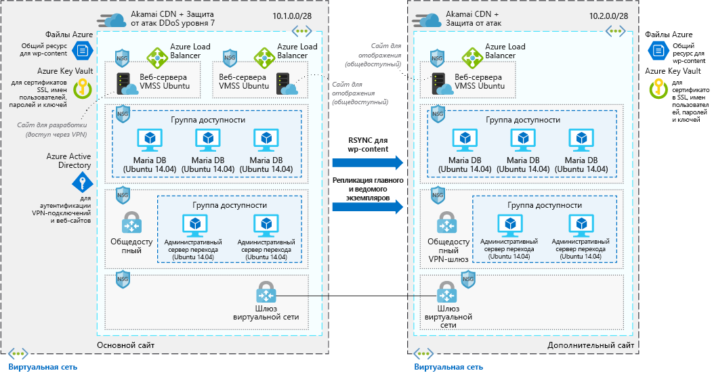

# Веб-сайты WordPress с высоким уровнем масштабируемости и защитыHighly scalable and secure WordPress website

Этот пример сценария применяется для компаний, которым требуется высокий уровень масштабируемости и безопасности для установленного WordPress.This example scenario is applicable to companies that need a highly scalable and secure installation of WordPress. Он основан на развертывании, используемом для большого соглашения, а также он был успешно масштабирован, что позволяет соответствовать скачкам трафика, которые случаются во время подключения к сайту.This scenario is based on a deployment that was used for a large convention and was successfully able to scale to meet the spike traffic that sessions drove to the site.

## Варианты соответствующего использованияRelevant use cases

Другие варианты использования:Other relevant use cases include:

* События службы мультимедиа, из-за которых случились скачки трафика.Media events that cause traffic surges.
* Блоги использующие WordPress в качестве системы управления содержимым.Blogs that use WordPress as their content management system.
* Веб-сайты электронной коммерции или бизнеса, в которых используется WordPress.Business or e-commerce websites that use WordPress.
* Веб-сайты созданные с помощью других систем управления содержимым.Web sites built using other content management systems.

## АрхитектураArchitecture

В этом сценарии рассматривается масштабируемая и защищенная установка WordPress, для которой используются веб-сервера Ubuntu и MariaDB.This scenario covers a scalable and secure installation of WordPress that uses Ubuntu web servers and MariaDB. В этом сценарии существует два различных потока данных. Первый это пользователи, которые питаются получить доступ к веб-сайту.There are two distinct data flows in this scenario the first is users access the website:

1. Пользователи получают доступ к интерфейсу веб-сайта с помощью CDN.Users access the front-end website through a CDN.
2. В качестве точки отсчета в CDN используется балансировщик нагрузки Azure, а также некэшируемые данные.The CDN uses an Azure load balancer as the origin, and pulls any data that isn't cached from there.
3. Балансировщик нагрузки Azure распределяет запросы для масштабируемых наборов виртуальных машин веб-серверов.The Azure load balancer distributes requests to the virtual machine scale sets of web servers.
4. Приложение WordPress извлекает все динамические данные из кластеров Maria DB, а все статическое содержимое размещается в файлах Azure.The WordPress application pulls any dynamic information out of the Maria DB clusters, all static content is hosted in Azure Files.
5. Ключи SSL хранятся в Azure Key Vault.SSL keys are stored Azure Key Vault.

Вторым рабочим процессом является то, как авторы добавляют новое содержимое.The second workflow is how authors contribute new content:

1. Авторы используют безопасное соединение, чтобы подключиться к публичному VPN-шлюзу.Authors connect securely to the public VPN gateway.
2. Сведения о VPN-подключении хранятся в Azure Active Directory.VPN authentication information is stored in Azure Active Directory.
3. Затем подключение устанавливается с полями перехода Администратора.A connection is then established to the Admin jump boxes.
4. После этого, автор сможет подключится к балансировщику нагрузки Azure и создать кластер.From the admin jump box, the author is then able to connect to the Azure load balancer for the authoring cluster.
5. Балансировщик нагрузки Azure распределяет трафик для масштабируемых наборов виртуальных машин веб-серверов, обладающих правами на запись в кластере Maria DB.The Azure load balancer distributes traffic to the virtual machine scale sets of web servers that have write access to the Maria DB cluster.
6. Новое статическое содержимое передается в файлы Azure, а динамическое содержимое записывается в кластер Maria DB.New static content is uploaded to Azure files and dynamic content is written into the Maria DB cluster.
7. Затем данные изменения реплицируются в альтернативный регион с помощью RSYNC или репликации "ведущий — ведомый".These changes are then replicated to the alternate region via rsync or master/slave replication.

### КомпонентыComponents

* [Сеть доставки содержимого Azure(CDN)](/azure/cdn/cdn-overview) является распределенной сетью серверов, эффективно доставляющей пользователям веб-содержимое.[Azure Content Delivery Network (CDN)](/azure/cdn/cdn-overview) is a distributed network of servers that efficiently delivers web content to users. Минимальная задержка в сетях CDN достигается путем сохранения кэшированного содержимого на пограничных серверах в расположениях точек подключения, находящихся рядом с пользователями.CDNs minimize latency by storing cached content on edge servers in point-of-presence locations near to end users.
* [Виртуальные сети](/azure/virtual-network/virtual-networks-overview) позволяют ресурсам (например, виртуальным машинам) обмениваться данными друг с другом через локальные сети и Интернет.[Virtual networks](/azure/virtual-network/virtual-networks-overview) allow resources such as VMs to securely communicate with each other, the Internet, and on-premises networks. Виртуальные сети обеспечивают изоляцию и сегментирование, фильтрацию и маршрутизацию трафика и позволяют устанавливать связь между расположениями.Virtual networks provide isolation and segmentation, filter and route traffic, and allow connection between locations. Для соединения двух сетей используется пиринговая связь.The two networks are connected via Vnet peering.
* [Группы безопасности сети ](/azure/virtual-network/security-overview) содержат список правил безопасности, который разрешает или запрещает входящий и исходящий трафик в зависимости от IP-адреса источника или назначения, порта и протокола.[Network security groups](/azure/virtual-network/security-overview) contain a list of security rules that allow or deny inbound or outbound network traffic based on source or destination IP address, port, and protocol. Виртуальные сети в этом сценарии защищены с помощью правил группы безопасности сети, которые ограничивают поток трафика между компонентами приложения.The virtual networks in this scenario are secured with network security group rules that restrict the flow of traffic between the application components.
* [Балансировщики нагрузки](/azure/load-balancer/load-balancer-overview) распределяют входящий трафик в соответствии с правилами и проверками работоспособности.[Load balancers](/azure/load-balancer/load-balancer-overview) distribute inbound traffic according to rules and health probes. Подсистема балансировки нагрузки обеспечивает низкую задержку и высокую пропускную способность, а также увеличение масштаба до миллионов потоков для всех приложений, которые используют протоколы TCP и UDP.A load balancer provides low latency and high throughput, and scales up to millions of flows for all TCP and UDP applications. В этом сценарии балансировщик нагрузки используется для распределения трафика из сети доставки содержимого во внешние веб-сервера.A load balancer is used in this scenario to distribute traffic from the content deliver network to the front-end web servers.
* [Масштабируемые наборы виртуальных машин][docs-vmss] позволяют создавать и администрировать группы идентичных виртуальных машин с балансировкой нагрузки.[Virtual machine scale sets][docs-vmss] let you create and manage a group of identical load-balanced VMs. Число экземпляров виртуальных машин может автоматически увеличиваться или уменьшаться в зависимости от спроса или по определенному расписанию.The number of VM instances can automatically increase or decrease in response to demand or a defined schedule. В этом сценарии используются два отдельных набора масштабирования виртуальных машин. Первый для интерфейсных веб-серверов обслуживающих содержимое, а второй для интерфейсных веб-серверов используемых для создания содержимого.Two separate virtual machine scale sets are used in this scenario - one for the front-end web-servers serving content, and one for the front-end webservers used to author new content.
* Служба [файлов Azure](/azure/storage/files/storage-files-introduction) предоставляет полностью управляемый общий ресурс в облаке, с помощью которого было размещено все содержимое WordPress в этом сценарии, так что все виртуальные машины обладают доступом к данным.[Azure Files](/azure/storage/files/storage-files-introduction) provides a fully-managed file share in the cloud that hosts all of the WordPress content in this scenario, so that all of the VMs have access to the data.
* [Azure Key Vault](/azure/key-vault/key-vault-overview) используется для хранения и строгого контроля за доступом к паролям, сертификатам и ключам.[Azure Key Vault](/azure/key-vault/key-vault-overview) is used to store and tightly control access to passwords, certificates, and keys.
* [Azure Active Directory (Azure AD)](/azure/active-directory/fundamentals/active-directory-whatis) — это мультитенантный облачный каталог и служба управления удостоверениями.[Azure Active Directory (Azure AD)](/azure/active-directory/fundamentals/active-directory-whatis) is a multi-tenant, cloud-based directory and identity management service. В этом сценарии Azure AD предоставляет службы проверка подлинности веб-сайтов и VPN-туннелей.In this scenario, Azure AD provides authentication services for the website and the VPN tunnels.

### Альтернативные вариантыAlternatives

* [SQL Server для Linux](/azure/virtual-machines/linux/sql/sql-server-linux-virtual-machines-overview) можно заменить хранилищем данных MariaDB.[SQL Server for Linux](/azure/virtual-machines/linux/sql/sql-server-linux-virtual-machines-overview) can replace the MariaDB data store.
* [База данных Azure для MySQL](/azure/mysql/overview) может использоваться для замены хранимых данных в MariaDB (в том случае, если требуется использовать полностью управляемое решение.[Azure database for MySQL](/azure/mysql/overview) can replace the MariaDB data store if you prefer a fully managed solution.

## РекомендацииConsiderations

### ДоступностьAvailability

Экземпляры виртуальных машин, используемых в этом сценарии развертываются в нескольких регионах с помощью данных, реплицированных между ними. Для этого буде использоваться RSYNC (для WordPress) и репликация ведомого экземпляра (для кластеров MariaDB).The VM instances in this scenario are deployed across multiple regions, with the data replicated between the two via RSYNC for the WordPress content and master slave replication for the MariaDB clusters.

Дополнительные сведения по другим вопросам доступности см. в статье [с контрольным списком для обеспечения доступности][availability] в Центре архитектуры Azure.For other availability topics, see the [availability checklist][availability] in the Azure Architecture Center.

### МасштабируемостьScalability

В этом сценарии для двух кластеров серверов веб-интерфейса в каждом регионе используются масштабируемые наборы виртуальных машин.This scenario uses virtual machine scale sets for the two front-end web server clusters in each region. При использовании масштабируемых наборов количество экземпляров виртуальных машин, работающих на уровне интерфейсных приложений, можно автоматически масштабировать в ответ на потребности клиента или на основе определенного расписания.With scale sets, the number of VM instances that run the front-end application tier can automatically scale in response to customer demand, or based on a defined schedule. Дополнительные сведения см. в статье [Обзор автомасштабирования с помощью масштабируемых наборов виртуальных машин Azure][docs-vmss-autoscale].For more information, see [Overview of autoscale with virtual machine scale sets][docs-vmss-autoscale].

Серверная часть — это кластер MariaDB в группе доступности.The back end is a MariaDB cluster in an availability set. Дополнительные сведения см. в статье [Кластер MariaDB (MySQL) — руководство по Azure][mariadb-tutorial].For more information, see the [MariaDB cluster tutorial][mariadb-tutorial].

Для других вопросов масштабируемости, см. раздел [Контрольный список для обеспечения масштабируемости][scalability] в центре архитектуры Azure.For other scalability topics, see the [scalability checklist][scalability] in the Azure Architecture Center.

### БезопасностьSecurity

Весь трафик виртуальных сетей на уровне интерфейсного приложения защищен группами безопасности сети.All the virtual network traffic into the front-end application tier and protected by network security groups. Правила ограничивают поток трафика, так что экземпляры виртуальных машин уровня внешнего приложения могут получить доступ к уровню серверной базы данных.Rules limit the flow of traffic so that only the front-end application tier VM instances can access the back-end database tier. С уровня базы данных запрещено передавать исходящий интернет-трафик.No outbound Internet traffic is allowed from the database tier. Чтобы сократить площади атаки, прямые порты удаленного управления остаются закрытыми.To reduce the attack footprint, no direct remote management ports are open. Дополнительные сведения см. в статье [Группы безопасности приложений и сети][docs-nsg].For more information, see [Azure network security groups][docs-nsg].

Общие рекомендации по разработке безопасных сценариев см. в статье [Документация по системе безопасности Azure][security].For general guidance on designing secure scenarios, see the [Azure Security Documentation][security].

### УстойчивостьResiliency

В сочетании с использованием нескольких регионов, репликации данных и масштабируемыми наборами виртуальных машин в этом сценарии используется балансировщик нагрузки Azure.In combination with the use of multiple regions, data replication and virtual machine scale sets, this scenario uses Azure load balancers. Эти сетевые компоненты распространяют трафик на подключенные экземпляры виртуальной машины и включают проверки работоспособности, которые гарантируют, что трафик распространяется только на работоспособные виртуальные машины.These networking components distribute traffic to the connected VM instances, and include health probes that ensure traffic is only distributed to healthy VMs. Все перечисленные сетевые компоненты работают с помощью CDN.All of these networking components are fronted via a CDN. Это делает сетевые ресурсы и приложение устойчивыми к проблемам, которые в противном случае нарушали бы трафик и влияли бы на доступ пользователя.This makes the networking resources and application resilient to issues that would otherwise disrupt traffic and impact end-user access.

Общие рекомендации по разработке устойчивых решений см. в [этой статье][resiliency].For general guidance on designing resilient scenarios, see [Designing resilient applications for Azure][resiliency].

## ЦеныPricing

Чтобы изучить стоимость выполнения этого сценария, все услуги были предварительно сконфигурированы в калькуляторе стоимости.To explore the cost of running this scenario, all of the services are pre-configured in the cost calculator. Чтобы узнать, как изменится цена для вашего конкретного варианта использования, измените соответствующие переменные в соответствии с ожидаемым трафиком.To see how the pricing would change for your particular use case, change the appropriate variables to match your expected traffic.

Нами был предоставлен предварительно настроен [профиль затрат][pricing] основан на схеме архитектуры, приведенной выше.We have provided a pre-configured [cost profile][pricing] based on the architecture diagram provided above. При настройке калькулятора цен, следует учитывать несколько основных моментов.To configure the pricing calculator for your use case, there are a couple main things to consider:

* Какой объем трафика ожидается с точки зрения ГБ в месяц?How much traffic are you expecting in terms of GB/month? Объем трафика будет иметь наибольшее влияние на затраты, так как он повлияет на число виртуальных машин, которые необходимы для получения данных в масштабируемый набор виртуальных машин.The amount of traffic will have the biggest impact on your cost, as it will impact the number of VMs that are required to surface the data in the virtual machine scale set. Кроме того он будет соотносить с объемом данных, которые проходят через CDN.Additionally, it will directly correlate with the amount of data that is surfaced via the CDN.
* Какой объем данных будет записан на веб-сайт?How much new data are you going to be writing to your website? Данные, записанные на ваш веб-сайт, коррелируют с тем, сколько данных отражено во всех регионах.New data written to your website correlates with how much data is mirrored across the regions.
* Какая часть из содержимого является динамической?How much of your content is dynamic? А какая статической?How much is static? Разница между динамическим и статическим содержимым влияет на то, сколько данных нужно извлечь из уровня базы данных, и сколько будет кэшировано в CDN.The variance around dynamic and static content influences how much data has to be retrieved from the database tier versus how much will be cached in the CDN.

<!-- links -->
[architecture]: ./media/architecture-secure-scalable-wordpress.png
[mariadb-tutorial]: /azure/virtual-machines/linux/classic/mariadb-mysql-cluster
[docs-vmss]: /azure/virtual-machine-scale-sets/overview
[docs-vmss-autoscale]: /azure/virtual-machine-scale-sets/virtual-machine-scale-sets-autoscale-overview
[docs-nsg]: /azure/virtual-network/security-overview
[security]: /azure/security/
[availability]: ../../checklist/availability.md
[resiliency]: /azure/architecture/resiliency/
[scalability]: /azure/architecture/checklist/scalability
[pricing]: https://azure.com/e/a8c4809dab444c1ca4870c489fbb196b
