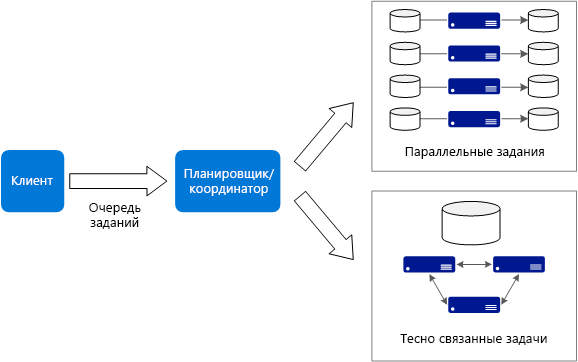

# Стиль архитектуры для больших вычислений

Термин *большие вычисления* означает крупномасштабные рабочие нагрузки, для которых нужно большое количество ядер — сотни или даже тысячи. Такая потребность возникает в разных сценариях, например при обработке изображений, оценке динамики жидкостей, моделировании финансовых рисков, в расчетах для нефтяной и фармацевтической отраслей и при анализе расчетного напряжения.

Ниже приведены стандартные характеристики приложений для больших вычислений:

- Работу можно разделить на дискретные задачи, которые будут одновременно выполняться в множестве ядер.
- Время выполнения каждой задачи ограничено. Принимаются входные данные, выполняется обработка и выводятся результаты. Приложение в целом выполняется в течение конечного периода (от нескольких минут до нескольких дней). Такие задачи обычно решаются единовременным выделением большого количества ядер, число которых постепенно сводится к нулю по мере выполнения приложения. 
- Такому приложению не обязательно работать круглосуточно и ежедневно. Но система должна быть готова к сбоям узлов или самого приложения.
- Задачи приложения могут быть независимыми и выполняться параллельно. Или же они могут быть тесно взаимосвязаны, то есть должны взаимодействовать в процессе выполнения или обмениваться промежуточными результатами. Для такого сценария можно применить технологии высокоскоростной сети, например InfiniBand и удаленный доступ к памяти (RDMA). 
- В зависимости от характера рабочей нагрузки вам могут потребоваться размеры виртуальных машин для больших объемов вычислений (H16r, H16mr или A9).

## Когда следует использовать эту архитектуру

- Для ресурсоемких вычислительных задач, таких как моделирование и обработка больших объемов числовых данных.
- Для моделей с ресурсоемкими вычислениями, которые можно распределить между несколькими ЦП на нескольких компьютерах (от десятков до тысяч ядер).
- Для моделей, обработка которых невозможна в пределах оперативной памяти одного компьютера и которые необходимо распределить между несколькими компьютерами.
- Для длительных вычислений, выполнение которых на одном компьютере потребует слишком много времени.
- Для относительно небольших вычислений, которые нужно повторять сотни или тысячи раз, как, например, моделирование по методу Монте-Карло.

## Преимущества

- Высокая производительность при обработке [с усложненным параллелизмом][embarrassingly-parallel].
- Возможность применить сразу сотни или тысячи ядер для быстрого решения больших проблем.
- Доступ к специализированному высокопроизводительному оборудованию с поддержкой высокоскоростной выделенной сети InfiniBand.
- Возможность подготовить виртуальные машины в необходимом для работы количестве и постепенно удалять их. 

## Сложности

- Управление инфраструктурой виртуальных машин.
- Управление большими объемами обработки числовых данных. 
- Своевременная подготовка тысяч ядер.
- Для задач с высокой взаимозависимостью добавление ядер может привести к снижению эффективности. Возможно, правильное количество ядер удастся определить лишь экспериментальным путем.

## Большие вычисления с помощью пакетной службы Azure

[Пакетная служба Azure][batch] — это управляемая служба для выполнения приложений высокопроизводительных крупномасштабных вычислений (HPC).

Сначала в пакетной службе Azure настраивается пул виртуальных машин, а затем в нее передаются файлы приложения и данных. Пакетная служба подготавливает виртуальные машины, распределяет между ними задачи, запускает задачи и отслеживает ход выполнения. Пакетная служба может автоматически масштабировать виртуальные машины при изменении рабочей нагрузки. Кроме того, пакетная служба поддерживает планирование заданий.

 

## Выполнение больших вычислений на виртуальных машинах

Для управления кластером виртуальных машин, а также планирования и мониторинга заданий HPC вы можете использовать [пакет Microsoft HPC][hpc-pack]. Это позволит вам самостоятельно подготовить виртуальные машины и сетевую инфраструктуру, а также управлять ими. Рекомендуем этот подход, если у вас уже есть рабочие нагрузки HPC, но вы планируете полностью или частично переместить их в Azure. Вы можете переместить в Azure весь кластер HPC или сохранить локальный кластер HPC и использовать Azure для повышения производительности. Дополнительные сведения см. в статье [Использование HPC, пакетной службы и больших вычислений][batch-hpc-solutions].

### Пакет HPC, развернутый в Azure

В этом сценарии кластер HPC создается полностью на платформе Azure.

 
 
В головном узле для кластера выполняются задачи управления и планирования заданий. Для задач с высокой степенью взаимозависимости вы можете применить сеть RDMA, которая обеспечивает взаимодействие между виртуальными машинами с очень высокой пропускной способностью и низкими задержками. Дополнительные сведения см. в статье [Развертывание кластера пакета HPC 2016 в Azure][deploy-hpc-azure].

### Расширение кластера HPC в Azure

В этом сценарии пакет HPC выполняется в локальной среде организации к нему подключаются виртуальные машины Azure для повышения производительности. Головной узел кластера находится в локальной среде. Между локальной и виртуальной сетями Azure устанавливается подключение через ExpressRoute или VPN-шлюз.

 

[batch]: /azure/batch/
[batch-hpc-solutions]: /azure/batch/batch-hpc-solutions
[deploy-hpc-azure]: /azure/virtual-machines/windows/hpcpack-2016-cluster
[embarrassingly-parallel]: https://en.wikipedia.org/wiki/Embarrassingly_parallel
[hpc-pack]: https://technet.microsoft.com/library/cc514029

 
