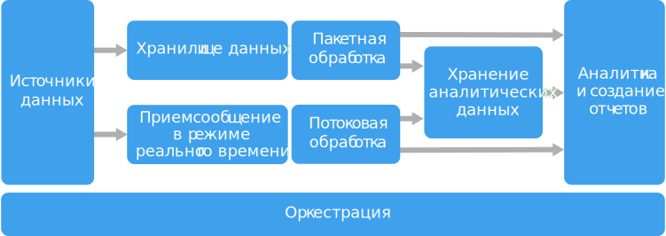

# Стиль архитектуры для обработки больших данных

Архитектура для обработки больших данных позволяет принимать, обрабатывать и анализировать данные, которые являются слишком объемными или слишком сложными для традиционных систем баз данных.

 Решения для обработки больших данных обычно предназначены для одного или нескольких из следующих типов рабочей нагрузки:

- пакетная обработка источников неактивных больших данных;
- обработка больших данных в динамике в режиме реального времени;
- интерактивное изучение больших данных;
- прогнозная аналитика и машинное обучение.

Большинство архитектур для обработки больших данных включают некоторые или все перечисленные ниже компоненты.

- **Источники данных.** Все решения для обработки больших данных начинаются с одного или нескольких источников данных. Примеры приведены ниже.

    - Хранилища данных приложений, например реляционные базы данных.
    - Статические файлы, которые создаются приложениями, например файлы журнала веб-сервера.
    - Источники данных с передачей в режиме реального времени, например устройства Интернета вещей.

- **Хранилище данных.** Данные для пакетной обработки обычно хранятся в распределенном хранилище файлов, где могут содержаться значительные объемы больших файлов в различных форматах. Этот тип хранилища часто называют *озером данных*. Такое хранилище можно реализовать с помощью Azure Data Lake Store или контейнеров больших двоичных объектов в службе хранилища Azure. 

- **Пакетная обработка.** Так как наборы данных очень велики, часто в решении обрабатываются длительные пакетные задания. Для них выполняется фильтрация, статистическая обработка и другие процессы подготовки данных к анализу. Обычно в эти задания входит чтение исходных файлов, их обработка и запись выходных данных в новые файлы. Варианты: выполнение заданий U-SQL в Azure Data Lake Analytics, использование пользовательских заданий Hive, Pig или Map/Reduce в кластере HDInsight Hadoop и применение программ Java, Scala или Python в кластере HDInsight Spark.

- **Прием сообщений в режиме реального времени.** Если решение содержит источники в режиме реального времени, в архитектуре должен быть предусмотрен способ сбора и сохранения сообщений в режиме реального времени для потоковой обработки. Это может быть простое хранилище данных с папкой, в которую входящие сообщения помещаются для обработки. Но для приема сообщений многим решениям требуется хранилище, которое можно использовать в качестве буфера. Такое хранилище должно поддерживать обработку с горизонтальным масштабированием, надежную доставку и другую семантику очереди сообщений. Варианты: концентраторы событий Azure, Центры Интернета вещей и Kafka.

- **Потоковый обмен сообщениями.** После записи сообщений в режиме реального времени в решении нужно выполнить их фильтрацию, статистическую обработку и другие процессы подготовки данных к анализу. Затем обработанные потоковые данные записываются в выходной приемник. Azure Stream Analytics предоставляет управляемую службу потоковой обработки на основе постоянного выполнения запросов SQL для непривязанных потоков. Кроме того, для потоковой передачи можно использовать технологии Apache с открытым кодом, например Storm и Spark Streaming в кластере HDInsight.

- **Хранилище аналитических данных.** Во многих решениях для обработки больших данных данные подготавливаются к анализу. Затем обработанные данные структурируются в соответствии с форматом запросов для средств аналитики. Хранилище аналитических данных, используемое для обработки таких запросов, может быть реляционной базой данных типа Kimball, как можно увидеть в большинстве традиционных решений бизнес-аналитики (BI). Кроме того, данные можно представить с помощью технологии NoSQL с низкой задержкой, такой как HBase или интерактивная база данных Hive, которая предоставляет абстракцию метаданных для файлов данных в распределенном хранилище. Хранилище данных SQL Azure предоставляет управляемую службу для хранения больших объемов данных в облаке. HDInsight поддерживает Interactive Hive, HBase и Spark SQL, которые также можно использовать, чтобы предоставлять данные для анализа.

- **Анализ и создание отчетов.** Большинство решений для обработки больших данных позволяют получить представление о данных при помощи анализа и отчетов. Чтобы расширить возможности анализа данных, можно включить в архитектуру слой моделирования, например модель таблицы или многомерного куба OLAP в Azure Analysis Services. Также можно включить поддержку самостоятельной бизнес-аналитики с использованием технологий моделирования и визуализации в Microsoft Power BI или Microsoft Excel. Анализ и создание отчетов также может выполняться путем интерактивного изучения данных специалистами по их анализу и обработке. Для таких сценариев многие службы Azure поддерживают функции аналитического блокнота, например Jupyter, который позволяет пользователям применять свои навыки работы с Python или R. Для крупномасштабного изучения данных можно использовать Microsoft R Server (отдельно или со Spark).

- **Оркестрация.** Большинство решений для обработки больших данных состоят из повторяющихся рабочих процессов, во время которых преобразуются исходные данные, данные перемещаются между несколькими источниками и приемниками, обработанные данные загружаются в хранилища аналитических данных либо же результаты передаются непосредственно в отчет или на панель мониторинга. Чтобы автоматизировать эти рабочие процессы, вы можете использовать технологию оркестрации, такую как фабрика данных Azure или Apache Oozie и Sqoop.

Azure предоставляет много служб, которые можно использовать в архитектуре для обработки больших данных. Их можно условно разделить на две категории:

- управляемые службы, включая хранилище Azure Data Lake Store, Azure Data Lake Analytics, хранилище данных Azure, Azure Stream Analytics, концентратор событий Azure, Центр Интернета вещей и фабрика данных Azure;
- технологии с открытым кодом на платформе Apache Hadoop, включая HDFS, HBase, Hive, Pig, Spark, Storm, Oozie, Sqoop и Kafka. Эти технологии доступны в Azure в службе Azure HDInsight.

Эти варианты не являются взаимоисключающими, и во многих решениях технологии с открытым объединяются со службами Azure.

## Когда следует использовать эту архитектуру

Используйте эту архитектуру для следующих сценариев:

- хранение и обработка данных в объемах, слишком больших для традиционной базы данных.
- преобразование неструктурированных данных для анализа и создания отчетов;
- запись, обработка и анализ непривязанных потоков данных в режиме реального времени или с низкой задержкой;
- использование службы "Машинное обучение Azure" или Microsoft Cognitive Services.

## Преимущества

- **Возможность выбора технологий.** Можно комбинировать и сопоставлять управляемые службы Azure и технологии Apache в кластерах HDInsight, чтобы с максимальной выгодой применять существующие навыки и инвестировать в технологии.
- **Повышение производительности с помощью параллелизма.** В решениях для обработки больших данных используется преимущество параллелизма, что позволяет применять высокопроизводительные решения, которые могут масштабироваться для работы с большими объемами данных.
- **Эластичное масштабирование.** Все компоненты архитектуры для обработки больших данных поддерживают горизонтальное масштабирование, чтобы вы могли адаптировать решение для малых и больших рабочих нагрузок и платить только за те ресурсы, которые используете.
- **Взаимодействие с существующими решениями.** Компоненты архитектуры для обработки больших данных также используются в соответствующих решениях Интернета вещей и корпоративных решениях бизнес-аналитики, что позволяет создавать интегрированные средства для рабочих нагрузок обработки данных.

## Недостатки

- **Сложность.** Решения для обработки больших данных могут быть очень сложными и содержать множество компонентов для приема данных из нескольких источников. Создание, тестирование и устранение неполадок процессов обработки больших данных может стать непростой задачей. Более того, в нескольких системах может существовать большое количество параметров конфигурации для оптимизации производительности.
- **Набор навыков.** Многие технологии для обработки больших данных являются узкоспециализированными. В них используются платформы и языки, которые не являются стандартными для более общих архитектур приложений. С другой стороны, технологии для обработки больших данных способствуют развитию новых интерфейсов API на основе более традиционных языков. Например, язык U-SQL в Azure Data Lake Analytics построен на комбинации Transact-SQL и C#. Аналогичным образом, API на основе SQL доступны для Hive, HBase и Spark.
- **Зрелость технологий.** Многие из технологий, используемых для обработки больших данных, находятся в развитии. Основные технологии Hadoop, например Hive и Pig, уже сформированы. Но в новые технологии, такие как Spark, с каждым выпуском вносятся значительные изменения и усовершенствования. Управляемые службы, такие как Azure Data Lake Analytics и фабрика данных Azure, являются относительно молодыми по сравнению с другими службами Azure и, скорее всего, с течением времени будут изменяться.
- **Безопасность**. В решениях для обработки больших данных все статические данные обычно хранятся в централизованном озере данных. Защита доступа к этим данным —непростая задача, особенно если данные должны приниматься и использоваться несколькими приложениями и платформами.

## Рекомендации

- **Использование параллелизма.** В большинстве технологий для обработки больших данных рабочая нагрузка распределяется между несколькими единицами обработки. Поэтому статические файлы данных создаются и хранятся в формате, доступном для разбивки. Распределенные файловые системы, такие как HDFS, могут обеспечить оптимизацию производительности чтения и записи. При этом фактическая обработка параллельно выполняется на нескольких узлах кластера. Это сокращает общее время выполнения заданий.

- **Секционирование данных.** Пакетная обработка обычно выполняется регулярно &mdash; например, еженедельно или ежемесячно. Секционированные файлы и структуры данных, такие как таблицы, основаны на темпоральных периодах, которые соответствуют расписанию обработки. Это упрощает прием данных, планирование заданий и устранение ошибок. Кроме того, таблицы разделов, которые используются в запросах Hive, U-SQL или SQL, могут значительно повысить их производительность.

- **Применение семантики схемы при считывании.** Озеро данных позволяет объединять в хранилище файлы в разных форматах — структурированные, частично структурированные и неструктурированные. Используйте семантику *схемы при считывании*, которая проецирует схему на данные при обработке, а не при хранении. Это повышает гибкость решения и предотвращает образование узких мест во время приема данных в результате проверки данных и типов.

- **Обработка данных на месте.** В традиционных решениях бизнес-аналитики для перемещения данных в хранилище часто используется процесс извлечения, преобразования и загрузки (ETL). Для больших объемов данных и разнообразных форматов в решениях для обработки больших данных обычно используются различные вариации ETL, например преобразование, извлечение и загрузка (TEL). При таком подходе данные обрабатываются в распределенном хранилище. Они преобразуются в требуемую структуру перед перемещением в хранилище аналитических данных.

- **Регулирование затрат при тарификации на основе объема и времени использования.** Для заданий пакетной обработки очень важно учитывать два фактора: расходы на единицу вычислительных узлов и поминутная стоимость использования этих узлов для выполнения задания. Например, выполнение пакетного задания может занять восемь часов при использовании четырех узлов кластера. Но может оказаться, что все четыре узла используются для задания только в течение первых двух часов, а после этого достаточно двух узлов. В таком случае выполнение всего задания на двух узлах увеличит общее время, но не удвоит его. Поэтому совокупная стоимость будет меньше. В некоторых бизнес-сценариях длительное время обработки предпочтительнее, чем более высокая цена на применение ресурсов кластера с низкими показателями использования.

- **Разделение кластерных ресурсов.** При развертывании кластеров HDInsight обычно можно повысить производительность, подготовив отдельные кластерные ресурсы для каждого типа рабочей нагрузки. Например, кластеры Spark включают Hive, но при масштабной обработке с использованием Hive и Spark рекомендуем развернуть отдельные выделенные кластеры Spark и Hadoop. Аналогичным образом, при использовании HBase и Storm для потоковой обработки с низкой задержкой и Hive для пакетной обработки рекомендуем развернуть отдельные кластеры для Storm, HBase и Hadoop.

- **Оркестрация приема данных.** Иногда существующие бизнес-приложения могут записывать файлы данных для пакетной обработки непосредственно в контейнеры больших двоичных объектов в хранилище Azure, где они могут использоваться службами HDInsight или Azure Data Lake Analytics. Тем не менее часто требуется выполнять оркестрацию приема данных из локального или внешнего источника в озере данных. Наиболее прогнозируемый и централизованно управляемый подход для этого — рабочий процесс или конвейер оркестрации, например поддерживаемый фабрикой данных Azure или Oozie.

- **Очистка конфиденциальных данных на ранней стадии.** При приеме данных необходимо очищать конфиденциальные данные на ранней стадии, чтобы они не сохранялись в озере данных.
