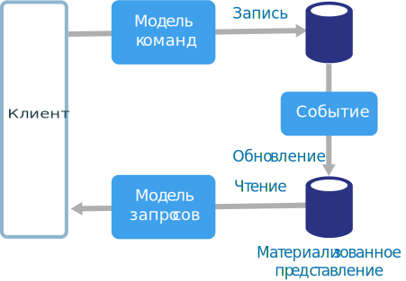
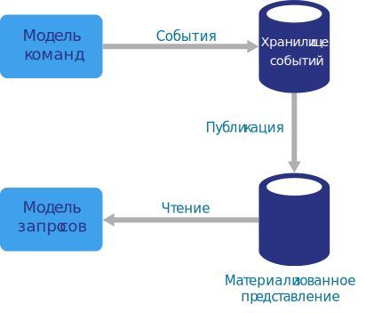

# Стиль архитектуры CQRS

Модель CQRS — это стиль архитектуры, в котором операции чтения отделены от операций записи. 

В традиционных архитектурах аналогичная модель используется в базах данных для выполнения запросов и обновлений. Этот простой подход отлично подходит для базовых операций создания, чтения, обновления и удаления. Но в более сложных приложениях такой подход не всегда будет удобным. Например, при чтении данных приложение может выполнять много разных запросов и возвращать несколько объектов передачи данных разных форм. Это усложняет сопоставление объектов. Для записи данных модель может применять сложные процедуры проверки и процессы бизнес-логики. В результате вы получите слишком сложную модель, которая выполняет слишком много функций.

Еще одна возможная проблема заключается в том, что рабочие нагрузки чтения и записи часто асимметричны и имеют совершенно разные требования к производительности и масштабируемости. 

Модель CQRS устраняет эти проблемы, разделяя потоки чтения и записи: для обновления данных используются **команды**, а для чтения — **запросы**.

- В основе команд должны быть задачи, а не данные. (Например, команда может выполнять функцию "Зарезервировать номер в отеле", но не "Установить значение Reserved для свойства ReservationStatus".) Команды лучше помещать в асинхронную очередь, а не требовать синхронной обработки.

- Запросы никогда не изменяют данные в базе данных. Запрос возвращает объект передачи данных, который не содержит сведения о предметной области.

Для дополнительной изоляции можно физически разделить данные для чтения и данные для записи. В этом случае в базе данных для чтения можно оптимизировать схему данных так, чтобы максимально эффективно выполнять запросы. Например, в ней можно хранить [материализованные представления][materialized-view] данных, чтобы не использовать сложные операции соединения или сложные объектно-реляционные сопоставления. Вы можете даже применить другой тип хранилища данных. Например, база данных для записи останется реляционной, а для чтения вы примените базу данных документов.

Если для чтения и записи используются разные базы данных, для них нужно поддерживать синхронизацию. Обычно для этого модель записи публикует событие при каждом обновлении базы данных. Обновление базы данных и публикации события должны выполняться в рамках одной транзакции. 

Некоторые реализации CQRS используют [шаблон источников событий][event-sourcing]. В этом шаблоне состояние приложения сохраняется как последовательность событий. Каждое событие обозначает некоторый набор изменений в данных. Текущее состояние воссоздается при последовательном воспроизведении событий. В контексте CQRS шаблон источников событий удобен тем, что эти же события могут оповещать другие компоненты, в частности модель чтения. Модель чтения на основе событий поддерживает моментальный снимок текущего состояния, повышая эффективность запросов. Но учтите, что шаблон источников событий усложняет архитектуру.

## Когда следует использовать эту архитектуру

Использовать CQRS можно в системах для совместной работы, где большое число пользователей обращается к одним и тем же данным, особенно если рабочие нагрузки чтения и записи явно асимметричны.

CQRS нельзя считать архитектурой верхнего уровня, применимой в масштабе всей системы. Применяйте CQRS только к тем подсистемам, где заметны явные преимущества от разделения процессов чтения и записи. В противном случае вы только повысите сложность системы, не получая никаких преимуществ.

## Преимущества

- **Независимое масштабирование**. CQRS позволяет раздельно масштабировать рабочие нагрузки чтения и записи, снижая риск конфликтов блокировки.
- **Оптимизация схем данных.**  Для процессов чтения можно применить схему, оптимизированную для запросов, а для процессов записи — другую схему, оптимизированную для обновлений.  
- **Безопасность**. Так будет проще назначить для выполнения операций записи данных только допустимые сущности домена.
- **Четкое разделение зон ответственности**. Разделение процессов чтения и записи позволяет получить более гибкие и простые в обслуживании. Большая часть сложной бизнес-логики переместится в модель записи. Это в некоторой степени упростит модель чтения.
- **Более простые запросы**. Сохраняя в базе данных для чтения материализованное представление данных, вы предотвратите использование приложением сложных соединений в запросах.

## Сложности

- **Сложность**. Основная идея CQRS очень проста. Но ее реализация может привести к усложнению проекта приложения, особенно если добавить шаблон источников событий.

- **Обмен сообщениями**. Сама по себе модель CQRS не требует обмена сообщениями, но сообщения часто применяются для обработки команд и публикации событий обновления. Это означает, что приложению придется обрабатывать сбои и дубликаты при передаче сообщений. 

- **Итоговая согласованность**. Если вы разделите базы данных для чтения и записи, в базе данных для чтения могут оставаться устаревшие данные. 

## Рекомендации

- Дополнительные сведения о реализации CQRS см. в описании [шаблона CQRS][cqrs-pattern].

- Изучите [шаблон источников событий][event-sourcing] и рассмотрите возможность его применения для устранения конфликтов обновления.

- Изучите [шаблон материализованного представления][materialized-view], который можно применять для модели чтения, чтобы оптимизировать схему данных для обработки запросов.

## CQRS в микрослужбах

Модель CQRS особенно удобно использовать с [архитектурой микрослужб][microservices]. Один из принципов микрослужб — отсутствие прямых обращений между одной службой и хранилищем данных другой службы.

На следующей схеме представлены служба A, которая записывает данные в хранилище данных, и служба B, которая хранит материализованное представление данных. Служба A публикует событие при каждой операции записи в хранилище данных. Служба B подписана на эти события.

<!-- links -->

[cqrs-pattern]: ../../patterns/cqrs.md
[event-sourcing]: ../../patterns/event-sourcing.md
[materialized-view]: ../../patterns/materialized-view.md
[microservices]: ./microservices.md
