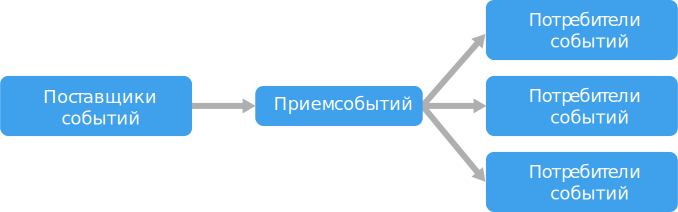

# Стиль архитектуры, управляемой событиями

Управляемая событиями архитектура включает **поставщики событий**, которые создают потоки событий, и **потребители событий**, которые прослушивают эти события. 

События доставляются практически мгновенно, что позволяет потребителям немедленно реагировать на происходящие события. Поставщики не связаны с потребителями — ни один поставщик не знает, кто прослушивает его события. Потребители также не зависят друг от друга, и каждый из них получает все события. Это важное отличие от шаблона [конкурирующих клиентов][competing-consumers], в котором пользователи извлекают сообщения из очереди, и каждое сообщение обрабатывается только один раз (если не возникает ошибок). В некоторых системах, таких как Интернет вещей, события обрабатываются в огромных объемах.

В основе управляемой событиями архитектуры может лежать модель публикации и подписки или модель потока событий. 

- **Публикация и подписка**. Инфраструктура обмена сообщениями поддерживает список подписок. Каждое публикуемое событие отправляется каждому подписчику. Полученное сообщение нельзя воспроизвести повторно. Также оно не доставляется тем подписчикам, которые добавляются позднее. 

- **Потоковая передача событий**. Все события записываются в журнал. События в пределах каждой секции строго упорядочены и сохраняются в течение долгого времени. Клиенты не подписываются на поток, а просто считывают события из любой его части. Каждый клиент самостоятельно управляет своим положением в потоке. Это означает, что клиент может подключиться в любое время и (или) прослушать события повторно.

На стороне получателя есть несколько распространенных вариантов реализации.

- **Обработка простых событий**. Каждое событие немедленно запускает действие в объекте-получателе. Например, в Функциях Azure можно создать триггер служебной шины, который будет выполнять некоторую функцию при каждой публикации сообщения в определенном разделе служебной шины.

- **Обработка сложных событий**. Объект-получатель обрабатывает последовательность событий и отслеживает в них определенные закономерности с помощью некоторого технологического решения, например Azure Stream Analytics или Apache Storm. Например, можно выполнять статистическую обработку показаний встроенного устройства за некоторый период времени, чтобы создавать уведомления, когда скользящее среднее значение выходит за определенные пороговые значения. 

- **Обработка потока событий**. Платформу потоковой передачи данных, например Центр Интернета вещей Azure или Apache Kafka, можно использовать как конвейер для приема событий и передачи их в обработчики потоков. Обработчики потоков определенным образом реагируют на эти процессы или преобразовывают поток. Может существовать несколько обработчиков потока для разных подсистем приложения. Такой подход хорошо подходит для рабочих нагрузок Интернета вещей.

Источник событий может находиться за пределами системы, например это могут быть физические устройства в решении Интернета вещей. В такой ситуации система должна поддерживать прием данных в таких объемах и на такой скорости, которые соответствуют характеристикам источника данных.

На представленной выше логической схеме каждый тип потребителя обозначен отдельным блоком. На практике обычно используется несколько экземпляров каждого поставщика, чтобы они не становились единой точкой отказа. Наличие нескольких экземпляров также может требоваться для обработки событий в нужных объемах и (или) с нужной скоростью. Кроме того, каждый объект-получатель может обрабатывать события в нескольких потоках. Это вызывает определенные сложности, если события должны обрабатываться в строгом порядке или строго один раз. См. руководство по [минимизации координации][minimize-coordination]. 

## Когда следует использовать эту архитектуру

- Для обработки одних и тех же событий несколькими подсистемами. 
- Для обработки в режиме реального времени, с минимальными задержками.
- Для обработки сложных событий, например сопоставления шаблонов или статистической обработки за некоторый период.
- При больших объемах и скоростях поступления данных, например в Интернете вещей.

## Преимущества

- Отправители и получатели независимы друг от друга.
- Нет требуется интеграция "от точки к точке". Очень легко добавлять в систему новые объекты-получатели.
- Объекты-получатели могут реагировать на события сразу при их поступлении. 
- Высокая масштабируемость и распределение. 
- Подсистемы получают независимые представления потока событий.

## Сложности

- Гарантированная доставка. В некоторых системах, особенно в среде Интернета вещей, важно гарантировать доставку событий.
- Обработка событий в строгом порядке и (или) строго один раз. Каждый тип потребителя обычно выполняется на нескольких экземплярах, чтобы обеспечить надежность и масштабируемость. Это создает некоторые трудности, если события должны обрабатываться в строгом порядке (для каждого типа потребителя) или логика их обработки не является идемпотентной.

## Архитектура Интернета вещей

Управляемые событиями архитектуры очень удобны при работе с решениями Интернета вещей. На следующей схеме представлены возможные варианты логической архитектуры для Интернета вещей. Особое внимание в этой схеме уделяется компонентам архитектуры для потоковой передачи событий.

**Облачный шлюз** принимает события от устройств на границе облака, используя надежную службу сообщений с низкой задержкой.

Устройства могут отправлять события в облачный шлюз напрямую или через **полевой шлюз**. Полевой шлюз — это специальное устройство или программа, обычно размещаемые рядом с устройствами, которые получают события и пересылают их в облачный шлюз. Полевой шлюз может выполнять некоторую предварительную обработку событий, собираемых с устройств, например фильтрацию, статистическую обработку или преобразование протоколов.

Полученные события проходят через один или несколько **обработчиков потока**, которые передают данные в другие системы (например, хранилище данных) или выполняют аналитическую или другую обработку.

Ниже приводятся примеры типичных процессов обработки. (Очевидно, что этот список не является исчерпывающим.)

- Сохранение данных о событиях в "холодное" хранилище для архивации или пакетной аналитики.

- Аналитика критического пути, то есть анализ потока событий почти в режиме реального времени для обнаружения аномалий, выявления закономерностей в скользящих диапазонах времени или создания оповещений при выполнении определенных условий в потоке. 

- Обработка специальных типов сообщений, не относящихся к телеметрии, например уведомлений и тревожных сигналов. 

- Машинное обучение.

Серые блоки обозначают компоненты системы Интернета вещей, не связанные напрямую с потоковой передачей событий. Они включены в схему для полноты представления.

- **Реестр устройств** — это база данных о подготовленных устройствах, которая содержит идентификаторы устройств и некоторые метаданные, например расположение.

- **API подготовки** — это общий внешний интерфейс для подготовки и регистрации новых устройств.

- В некоторых решениях Интернета вещей допускается отправка **управляющих сообщений** на устройства.

> В этом разделе представлен общий обзор Интернета вещей, и в нем не упоминается множество тонкостей и проблем, которые необходимо учитывать. Подробный пример использования архитектуре вы найдете в PDF-документе с описанием [эталонной архитектуры Центра интернета вещей Microsoft Azure][iot-ref-arch].

 <!-- links -->

[competing-consumers]: ../../patterns/competing-consumers.md
[iot-ref-arch]: https://azure.microsoft.com/updates/microsoft-azure-iot-reference-architecture-available/
[minimize-coordination]: ../design-principles/minimize-coordination.md

