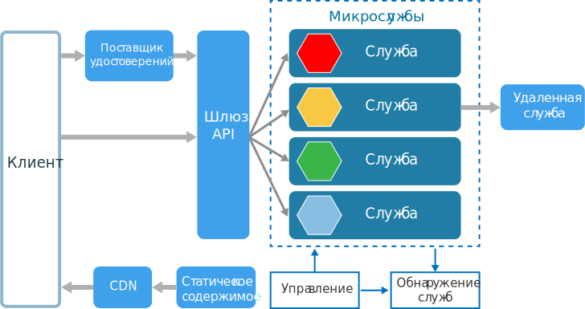
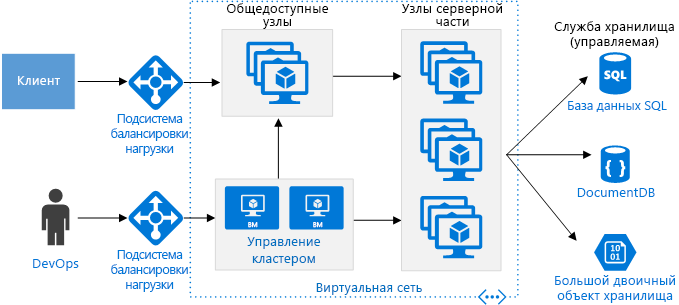

# Стиль архитектуры микрослужбMicroservices architecture style

Архитектура микрослужб представляет собой набор небольших автономных служб.A microservices architecture consists of a collection of small, autonomous services. Каждая служба является самодостаточной и должна реализовывать возможности одной компании.Each service is self-contained and should implement a single business capability. Подробное руководство по разработке архитектуры микрослужб в Azure см. в статье [Проектирование, создание и использование микрослужб в Azure](../../microservices/index.md).For detailed guidance about building a microservices architecture on Azure, see [Designing, building, and operating microservices on Azure](../../microservices/index.md).

 
В каком-то смысле микрослужбы являются естественным результатом развития сервисноориентированных архитектур (SOA). Но микрослужбы и SOA отличаются.In some ways, microservices are the natural evolution of service oriented architectures (SOA), but there are differences between microservices and SOA. Ниже приведены определяющие характеристики микрослужбы.Here are some defining characteristics of a microservice:

- Архитектура микрослужб состоит из небольших, независимых и слабо связанных между собой служб.In a microservices architecture, services are small, independent, and loosely coupled.

- Каждая служба является отдельной базой кода, которой может управлять небольшая команда разработчиков.Each service is a separate codebase, which can be managed by a small development team.

- Службы можно развертывать независимо друг от друга.Services can be deployed independently. Разработчики могут обновлять существующую службу без повторной сборки и повторного развертывания всего приложения.A team can update an existing service without rebuilding and redeploying the entire application.

- Службы отвечают за сохранение собственных данных или внешнего состояния.Services are responsible for persisting their own data or external state. В этом состоит отличие от традиционной модели, в которой сохранение данных обрабатывается на отдельном уровне.This differs from the traditional model, where a separate data layer handles data persistence.

- Службы взаимодействуют между собой с помощью четко определенных API-интерфейсов.Services communicate with each other by using well-defined APIs. Сведения о внутренней реализации каждой службы скрыты от других служб.Internal implementation details of each service are hidden from other services.

- Службы не должны совместно использовать один и тот же стек технологий, библиотеки или платформы.Services don't need to share the same technology stack, libraries, or frameworks.

Помимо самих служб, некоторые компоненты обладают типичной архитектурой микрослужб:Besides for the services themselves, some other components appear in a typical microservices architecture:

**Управление.****Management**. Компонент управления отвечает за размещение служб на узлах, определение сбоев, перераспределение служб между узлами и другие операции.The management component is responsible for placing services on nodes, identifying failures, rebalancing services across nodes, and so forth.  

**Обнаружение служб.****Service Discovery**.  Этот компонент ведет список служб и узлов, на которых находятся службы.Maintains a list of services and which nodes they are located on. Он поддерживает поиск в службах, позволяя найти конечную точку службы.Enables service lookup to find the endpoint for a service. 

**Шлюз API.****API Gateway**. Шлюз API является точкой входа для клиентов.The API gateway is the entry point for clients. Клиенты не вызывают службы напрямую.Clients don't call services directly. Вместо этого они вызывают шлюз API, который пересылает вызов соответствующим службам в серверной части.Instead, they call the API gateway, which forwards the call to the appropriate services on the back end. Шлюз API может собирать ответы от нескольких служб и возвращать совокупный ответ.The API gateway might aggregate the responses from several services and return the aggregated response. 

Преимущества использования API шлюза:The advantages of using an API gateway include:

- Он разделяет клиенты и службы.It decouples clients from services. Можно управлять версиями служб и выполнять их рефакторинг без обновления всех клиентов.Services can be versioned or refactored without needing to update all of the clients.

-  Службы могут использовать протоколы обмена сообщениями, которые не работают в Интернете, например AMQP.Services can use messaging protocols that are not web friendly, such as AMQP.

- Шлюз API может выполнять другие сквозные функции, например аутентификацию, ведение журнала, завершение запросов SSL и балансировку нагрузки.The API Gateway can perform other cross-cutting functions such as authentication, logging, SSL termination, and load balancing.

## Когда следует использовать эту архитектуруWhen to use this architecture

Используйте эту архитектуру для следующих сценариев:Consider this architecture style for:

- крупные приложения, для которых требуется выпуск на высокой скорости;Large applications that require a high release velocity.

- сложные приложения, которым нужна высокая степень масштабируемости;Complex applications that need to be highly scalable.

- приложения с так называемыми "толстыми" доменами или большим количеством поддоменов;Applications with rich domains or many subdomains.

- организация, состоящая из небольших команд разработчиков.An organization that consists of small development teams.

## ПреимуществаBenefits 

- **Независимые развертывания.****Independent deployments**. Вы можете обновить службу без повторного развертывания всего приложения, а также выполнить откат или накат обновления, если что-то работает неправильно.You can update a service without redeploying the entire application, and roll back or roll forward an update if something goes wrong. Исправления ошибок и выпуски компонентов лучше поддаются управлению и в меньшей степени сопряжены с рисками.Bug fixes and feature releases are more manageable and less risky.

- **Независимая разработка.****Independent development**. Одна команда разработчиков может выполнить сборку, тестирование и развертывание службы.A single development team can build, test, and deploy a service. Это позволяет непрерывно внедрять инновации и быстрее выпускать службы.The result is continuous innovation and a faster release cadence. 

- **Небольшие специализированные команды.****Small, focused teams**. Команда может сосредоточиться на одной службе.Teams can focus on one service. Чем меньше объем каждой службы, тем проще понять ее базу кода и тем легче будет его освоить новым членам команды.The smaller scope of each service makes the code base easier to understand, and it's easier for new team members to ramp up.

- **Изоляция ошибок.****Fault isolation**. Если одна служба выходит из строя, приложение продолжает работать.If a service goes down, it won't take out the entire application. Но это не означает, что такая устойчивость доступна по умолчанию.However, that doesn't mean you get resiliency for free. Вам необходимо соблюдать рекомендации по обеспечению устойчивости и следовать конструктивным шаблонам.You still need to follow resiliency best practices and design patterns. См. статью о [проектировании устойчивых приложений для Azure][resiliency-overview].See [Designing resilient applications for Azure][resiliency-overview].

- **Стеки смешанных технологий.****Mixed technology stacks**. Команды могут выбрать технологию, которая лучше всего подходит их службе.Teams can pick the technology that best fits their service. 

- **Детальное масштабирование.****Granular scaling**. Службы можно масштабировать независимо друг от друга.Services can be scaled independently. В то же время из-за более высокой плотности служб на одной виртуальной машине ее ресурсы будут полностью использованы.At the same time, the higher density of services per VM means that VM resources are fully utilized. Благодаря ограничениям размещения службы можно привести в соответствие с профилем виртуальной машины (высокая загрузка ЦП, большой объем памяти и т. д.).Using placement constraints, a services can be matched to a VM profile (high CPU, high memory, and so on).

## СложностиChallenges

- **Сложность.****Complexity**. Приложение для микрослужб содержит больше перемещаемых частей, чем эквивалентное монолитное приложение.A microservices application has more moving parts than the equivalent monolithic application. Каждая служба является простой структурой, но вся система в целом гораздо сложнее.Each service is simpler, but the entire system as a whole is more complex.

- **Разработка и тестирование.****Development and test**. Разработка с учетом зависимостей между службами требует другого подхода.Developing against service dependencies requires a different approach. Существующие средства не всегда предназначены для работы с зависимостями служб.Existing tools are not necessarily designed to work with service dependencies. Рефакторинг между службами может быть сложной задачей.Refactoring across service boundaries can be difficult. Также непросто тестировать зависимости служб, особенно если приложение быстро изменяется.It is also challenging to test service dependencies, especially when the application is evolving quickly.

- **Недостаток управления.****Lack of governance**. Децентрализованный подход к созданию микрослужб имеет свои преимущества, но он также может привести к проблемам.The decentralized approach to building microservices has advantages, but it can also lead to problems. В приложении может появиться так много разных языков и платформ, что его будет трудно обслуживать.You may end up with so many different languages and frameworks that the application becomes hard to maintain. Можно попробовать установить некоторые стандарты для всего проекта, не ограничивая чрезмерно гибкость разработчиков.It may be useful to put some project-wide standards in place, without overly restricting teams' flexibility. В частности, это касается сквозных функций, таких как ведение журнала.This especially applies to cross-cutting functionality such as logging.

- **Перегрузки и задержки сети.****Network congestion and latency**. Использование большого количества мелких детальных служб может привести к интенсивному взаимодействию между ними.The use of many small, granular services can result in more interservice communication. Кроме того, если цепочка зависимостей службы становится слишком длинной (служба A вызывает службу B, которая вызывает службу C и так далее), дополнительная задержка может стать проблемой.Also, if the chain of service dependencies gets too long (service A calls B, which calls C...), the additional latency can become a problem. Необходимо тщательно разрабатывать API-интерфейсы.You will need to design APIs carefully. Не создавайте API-интерфейсы, которые отправляют слишком много сообщений, и найдите места, в которых можно использовать асинхронные модели связи.Avoid overly chatty APIs, think about serialization formats, and look for places to use asynchronous communication patterns.

- **Целостность данных.****Data integrity**. Каждая микрослужба отвечает за сохранение своих данных.With each microservice responsible for its own data persistence. Поэтому может быть сложно поддерживать согласованность данных.As a result, data consistency can be a challenge. Применяйте итоговую согласованность, где это возможно.Embrace eventual consistency where possible.

- **Управление.****Management**. Для успешной работы с микрослужбами требуется современная культура DevOps.To be successful with microservices requires a mature DevOps culture. Коррелированное ведение журнала для разных служб может оказаться сложной задачей.Correlated logging across services can be challenging. Как правило, ведение журнала необходимо коррелировать с несколькими вызовами службы для одной операции пользователя.Typically, logging must correlate multiple service calls for a single user operation.

- **Управление версиями.****Versioning**. Обновления службы не должны нарушать работу служб, зависящих от нее.Updates to a service must not break services that depend on it. Несколько служб могут обновляться в любой момент времени, поэтому без тщательного планирования могут возникнуть проблемы с обратной или прямой совместимостью.Multiple services could be updated at any given time, so without careful design, you might have problems with backward or forward compatibility.

- **Набор навыков.****Skillset**. Микрослужбы являются распределенными системами.Microservices are highly distributed systems. Тщательно оцените знания и опыт своей команды для работы с этими службами.Carefully evaluate whether the team has the skills and experience to be successful.

## РекомендацииBest practices

- Моделируйте службы для определенной сферы деятельности.Model services around the business domain. 

- Децентрализуйте все данные.Decentralize everything. Отдельные команды разработчиков отвечают за проектирование и создание служб.Individual teams are responsible for designing and building services. Избегайте совместного использования кода или схем данных.Avoid sharing code or data schemas. 

- Данные должны храниться в службе, к которой они относятся.Data storage should be private to the service that owns the data. Используйте наиболее подходящее хранилище для каждой службы и каждого типа данных.Use the best storage for each service and data type. 

- Службы взаимодействуют через хорошо спроектированные API-интерфейсы.Services communicate through well-designed APIs. Избегайте утечки сведений о реализации.Avoid leaking implementation details. API-интерфейсы должны моделировать домен, а не внутреннюю реализацию службы.APIs should model the domain, not the internal implementation of the service.

- Избегайте взаимозависимостей между службами.Avoid coupling between services. Взаимозависимости могут возникать при использовании общих схем баз данных и жестких протоколов связи.Causes of coupling include shared database schemas and rigid communication protocols.

- Перенесите нагрузку сквозных функций, таких как аутентификация и завершение SSL-запросов, в шлюз.Offload cross-cutting concerns, such as authentication and SSL termination, to the gateway.

- Храните набор знаний домена за пределами шлюза.Keep domain knowledge out of the gateway. Шлюз должен обрабатывать и перенаправлять клиентские запросы без знания бизнес-правил или логики домена.The gateway should handle and route client requests without any knowledge of the business rules or domain logic. Иначе шлюз становится зависимостью и может привести к взаимозависимости между службами.Otherwise, the gateway becomes a dependency and can cause coupling between services.

- Службы должны иметь слабую взаимозависимость и высокую функциональную слаженность.Services should have loose coupling and high functional cohesion. Функции, которые, вероятно, будут изменяться одновременно, должны упаковываться и развертываться одновременно.Functions that are likely to change together should be packaged and deployed together. Если они находятся в отдельных службах, эти службы в конечном итоге становятся тесно связанными, потому что изменения в одной службе требуют обновления другой службы.If they reside in separate services, those services end up being tightly coupled, because a change in one service will require updating the other service. Слишком частый обмен данными между двумя службами может быть признаком тесной взаимозависимости и низкой слаженности.Overly chatty communication between two services may be a symptom of tight coupling and low cohesion. 

- Изолируйте сбои.Isolate failures. Используйте стратегии обеспечения устойчивости для предотвращения каскадных сбоев в службе.Use resiliency strategies to prevent failures within a service from cascading. См. статьи о [шаблонах устойчивости][resiliency-patterns] и [проектировании устойчивых приложений][resiliency-overview].See [Resiliency patterns][resiliency-patterns] and [Designing resilient applications][resiliency-overview].

## Микрослужбы, использующие службу контейнеров AzureMicroservices using Azure Container Service 

[Службу контейнеров Azure](/azure/container-service/) можно использовать для настройки и подготовки кластера Docker.You can use [Azure Container Service](/azure/container-service/) to configure and provision a Docker cluster. Служба контейнеров Azure поддерживает несколько популярных оркестраторов контейнеров, среди которых Kubernetes, DC/OS и Docker Swarm.Azure Container Services supports several popular container orchestrators, including Kubernetes, DC/OS, and Docker Swarm.

 
**Общедоступные узлы.****Public nodes**. Эти узлы доступны через общедоступную подсистему балансировки нагрузки.These nodes are reachable through a public-facing load balancer. Шлюз API размещается на этих узлах.The API gateway is hosted on these nodes.

**Узлы серверной части.****Backend nodes**. На этих узлах работают службы, к которым клиенты получают доступ через шлюз API.These nodes run services that clients reach via the API gateway. Эти узлы не получают интернет-трафик напрямую.These nodes don't receive Internet traffic directly. Узлы серверной части могут включать несколько пулов виртуальных машин с различными профилями оборудования.The backend nodes might include more than one pool of VMs, each with a different hardware profile. Например, можно создать отдельные пулы для общих вычислительных рабочих нагрузок, рабочих нагрузок с высокой загрузкой ЦП и рабочих нагрузок с использованием большого объема памяти.For example, you could create separate pools for general compute workloads, high CPU workloads, and high memory workloads. 

**Виртуальные машины управления.****Management VMs**. На этих виртуальных машинах работают главные узлы оркестратора контейнеров.These VMs run the master nodes for the container orchestrator. 

**Сеть.****Networking**. Общедоступные узлы, узлы серверной части и виртуальные машины управления помещаются в отдельные подсети в пределах одной виртуальной сети.The public nodes, backend nodes, and management VMs are placed in separate subnets within the same virtual network (VNet). 

**Подсистемы балансировки нагрузки.****Load balancers**.  Внешняя подсистема балансировки нагрузки размещается перед общедоступными узлами.An externally facing load balancer sits in front of the public nodes. Она распределяет запросы из Интернета к общедоступным узлам.It distributes internet requests to the public nodes. Другая подсистема балансировки нагрузки находится перед виртуальными машинами управления. Она пропускает безопасный трафик по протоколу Secure Shell (SSH) к этим виртуальным машинам, используя правила преобразования сетевых адресов.Another load balancer is placed in front of the management VMs, to allow secure shell (ssh) traffic to the management VMs, using NAT rules.

Для обеспечения надежности и масштабируемости каждая служба реплицируется на несколько виртуальных машин.For reliability and scalability, each service is replicated across multiple VMs. Но так как службы занимают относительно мало места (по сравнению с монолитными приложениями), несколько служб обычно размещаются на одной виртуальной машине.However, because services are also relatively lightweight (compared with a monolithic application), multiple services are usually packed into a single VM. Высокая плотность обеспечивает эффективное использование ресурсов.Higher density allows better resource utilization. Если определенная служба не использует много ресурсов, не нужно выделять всю виртуальную машину для выполнения этой службы.If a particular service doesn't use a lot of resources, you don't need to dedicate an entire VM to running that service.

На следующей схеме показаны три узла, на которых работают четыре разные службы (они обозначены разными фигурами).The following diagram shows three nodes running four different services (indicated by different shapes). Обратите внимание, что каждая служба имеет по крайней мере два экземпляра.Notice that each service has at least two instances. 
 

## Микрослужбы, использующие Azure Service FabricMicroservices using Azure Service Fabric

На приведенной ниже схеме показана архитектура микрослужб с использованием [Azure Service Fabric](/azure/service-fabric/).The following diagram shows a microservices architecture using [Azure Service Fabric](/azure/service-fabric/).

Кластер Service Fabric развертывается в одном или нескольких масштабируемых наборах виртуальных машин.The Service Fabric cluster is deployed to one or more VM scale sets. Если вам нужны виртуальные машины разных типов, в кластере может быть несколько масштабируемых наборов виртуальных машин.You might have more than one VM scale set in the cluster, in order to have a mix of VM types. Шлюз API с внешней подсистемой балансировки нагрузки, которая получает запросы клиентов, помещается перед кластером Service Fabric.An API Gateway is placed in front of the Service Fabric cluster, with an external load balancer to receive client requests.

Среда выполнения Service Fabric управляет кластером, в том числе выполняет размещение службы, отработку отказа узла и мониторинг работоспособности.The Service Fabric runtime performs cluster management, including service placement, node failover, and health monitoring. Среда выполнения развертывается непосредственно на узлах кластера.The runtime is deployed on the cluster nodes themselves. Отдельного набора виртуальных машин для управления кластером нет.There isn't a separate set of cluster management VMs.

Службы взаимодействуют между собой с помощью обратного прокси-сервера, встроенного в Service Fabric.Services communicate with each other using the reverse proxy that is built into Service Fabric. Service Fabric предоставляет службу обнаружения, которая может разрешать конечную точку для конкретной службы.Service Fabric provides a discovery service that can resolve the endpoint for a named service.

<!-- links -->

[resiliency-overview]: ../../resiliency/index.md
[resiliency-patterns]: ../../patterns/category/resiliency.md

