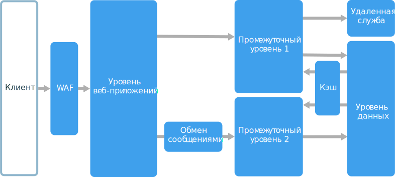

# N-уровневый cтиль архитектуры

В n-уровневой архитектуре приложение разделяется на **логические слои** и **физические уровни**.

Слои — это способ распределения ответственности и управления зависимостями. Каждый слой несет определенную ответственность. В более высоком слое могут использоваться службы из более низкого слоя, но не наоборот.

Уровни разделяются физически путем запуска на разных компьютерах. С одного уровня можно отправлять вызовы непосредственно на другой уровень или использовать асинхронный обмен сообщениями (очередь сообщений). Каждый слой можно разместить на отдельном уровне, но это не обязательно. Вы можете разместить несколько слоев на одном уровне. Физическое разделение уровней улучшает масштабируемость и устойчивость, но также приводит к увеличению задержки из-за дополнительных операций сетевого взаимодействия.

Традиционное трехуровневое приложение содержит уровень представления, средний уровень и уровень базы данных. Средний уровень является необязательным. В более сложных приложениях может быть больше трех уровней. На схеме выше показано приложение с двумя средними уровнями, которые заключают в себе разные области функций.

N-уровневое приложение может иметь **архитектуру с закрытыми слоями** или **архитектуру с открытыми слоями**:

- В архитектуре с закрытыми слоями из слоя могут отправляться вызовы только к слою, расположенному непосредственно под ним.
- В архитектуре с открытыми слоями из слоя могут отправляться вызовы к любому из нижних слоев.

В архитектуре с закрытыми слоями зависимости между слоями ограничены. Но когда из одного слоя просто передаются запросы к следующему слою, может создаваться лишний сетевой трафик.

## Когда следует использовать эту архитектуру

Как правило, n-уровневые архитектуры реализуются в виде приложений IaaS (инфраструктура как услуга), в которых каждый уровень выполняется в отдельном наборе виртуальных машин. Тем не менее n-уровневое приложение не обязательно должно представлять собой "чистую" модель IaaS. Часто целесообразно использовать управляемые службы для реализации некоторых элементов архитектуры, в частности кэширования, обмена сообщениями и хранения данных.

Используйте n-уровневую архитектуру для следующих сценариев:

- простые веб-приложения;
- перенос локального приложения в Azure с минимальным рефакторингом;
- унифицированная разработка локальных и облачных приложений.

N-уровневые архитектуры очень распространены в традиционных локальных приложениях, поэтому они естественным образом подходят для переноса существующих рабочих нагрузок в Azure.

## Преимущества

- Возможность переноса между облаком и локальной средой, а также между облачными платформами.
- Быстрый процесс обучения для большинства разработчиков.
- Естественный процесс перехода от традиционной модели приложений.
- Открытость для разнородных сред (Windows или Linux).

## Сложности

- Можно легко остановиться на среднем уровне, на котором просто выполняются операции CRUD в базе данных, что добавляет дополнительную задержку без выполнения требуемых задач.
- Монолитные конструкции препятствуют независимому развертыванию компонентов.
- На управление приложением IaaS требуется больше усилий, чем на управление приложением, в котором используются только управляемые службы.
- Управление сетевой безопасностью в больших системах может оказаться сложной задачей.

## Рекомендации

- Используйте автоматическое масштабирование с учетом изменений нагрузки. См. [рекомендации по автомасштабированию][autoscaling].
- Используйте асинхронный обмен сообщениями для разделения уровней.
- Кэшируйте данные, имеющие признаки статических. См. [рекомендации по кэшированию][caching].
- Настройте уровень базы данных для обеспечения высокого уровня доступности с помощью такого решения, как [Группы доступности AlwaysOn (SQL Server)][sql-always-on].
- Разместите брандмауэр веб-приложения (WAF) между внешним интерфейсом и Интернетом.
- Разместите каждый уровень в отдельной подсети и используйте подсети в качестве периметра безопасности.
- Ограничьте доступ к уровню данных, разрешив запросы только со средних уровней.

## N-уровневая архитектура на виртуальных машинах

В этом разделе описана рекомендуемая n-уровневая архитектура, выполняющаяся на виртуальных машинах.

Каждый уровень состоит минимум из двух виртуальных машин, расположенных в группе доступности или в масштабируемом наборе виртуальных машин. Наличие нескольких виртуальных машин обеспечивает устойчивость в случае сбоя одной виртуальной машины. Для распределения запросов по виртуальным машинам на уровне используются подсистемы балансировки нагрузки. Уровень можно масштабировать горизонтально путем добавления виртуальных машин в пул.

Каждый уровень также размещается в собственной подсети, то есть внутренние IP-адреса подсетей находятся в одном диапазоне адресов. Это упрощает применение правил групп безопасности сети (NSG) и таблиц маршрутов для отдельных уровней.

На веб- и бизнес-уровнях состояние не отслеживается. Любые виртуальные машины могут обрабатывать любые запросы для этих уровней. Уровень данных должен состоять из реплицированной базы данных. Чтобы обеспечить высокий уровень доступности в Windows, рекомендуем использовать SQL Server с решением "Группы доступности AlwaysOn". Для Linux выберите базу данных, которая поддерживает репликацию, например Apache Cassandra.

Группы NSG позволяют ограничить доступ к каждому уровню. Например, к уровню базы данных можно получить доступ только с бизнес-уровня.

Дополнительные сведения о запуске N-уровневых приложений в Azure:

- [Run Windows VMs for an N-tier application][n-tier-windows] (Запуск виртуальных машин Windows для n-уровневого приложения);
- [Использование N-уровневого приложения с SQL Server в Azure][n-tier-linux]
- [Модуль Microsoft Learn. Обзор N-уровневой архитектуры](/learn/modules/n-tier-architecture/)

### Дополнительные замечания

- N-уровневые архитектуры не ограничиваются тремя уровнями. Как правило, для более сложных приложений используется больше уровней. В этом случае используйте маршрутизацию по протоколу седьмого уровня, чтобы направлять запросы к определенному уровню.

- Уровни соответствуют границам масштабируемости, надежности и безопасности. По возможности используйте отдельные уровни для служб с разными требованиями в этих областях.

- Для автоматического масштабирования используйте масштабируемые наборы виртуальных машин.

- Найдите места в архитектуре, где можно использовать управляемые службы без значительного рефакторинга. В частности, обратите внимание на кэширование, обмен сообщениями, хранилище и базы данных.

- Для более надежной защиты разместите сеть периметра перед приложением. Сеть периметра содержит виртуальные сетевые модули (NVA), реализующие функции безопасности, например брандмауэры и проверку пакетов. Дополнительные сведения см. в статье об [эталонной архитектуре сети периметра][dmz].

- Чтобы обеспечить высокий уровень доступности, разместите два или несколько модулей NVA в группе доступности с внешней подсистемой балансировки нагрузки для распределения запросов из Интернета по экземплярам. Дополнительные сведения см. в статье [Deploy highly available network virtual appliances][ha-nva] (Развертывание виртуальных сетевых модулей высокой доступности).

- Запретите прямой доступ по протоколу RDP или SSH к виртуальным машинам, на которых выполняется код приложения. Вместо этого операторы должны будут входить на переходной узел, который также называется узлом-бастионом. Это виртуальная машина в сети, которую администраторы используют для подключения к другим виртуальным машинам. На переходном узле есть группа NSG, обеспечивающая доступ по протоколу RDP или SSH только с утвержденных общедоступных IP-адресов.

- Вы можете расширить связь между виртуальной сетью Azure и локальной сетью, используя виртуальную частную сеть "сеть — сеть" или Azure ExpressRoute. Дополнительные сведения см. в статье об [эталонной архитектуре гибридной сети][hybrid-network].

- Если для управления удостоверениями ваша организация использует Active Directory, вы можете расширить среду Active Directory в виртуальную сеть Azure. Дополнительные сведения см. в статье об [эталонной архитектуре для управления удостоверениями][identity].

- Если требуется более высокий уровень доступности, чем обеспечивает соглашение об уровне обслуживания Azure для виртуальных машин, реплицируйте приложение в два региона и используйте диспетчер трафика Azure для отработки отказа. Дополнительные сведения см. в статье [Запуск виртуальных машин Windows в нескольких регионах для обеспечения высокой доступности][multiregion-windows] или [Запуск виртуальных машин Linux в нескольких регионах для обеспечения высокой доступности][multiregion-linux].

[autoscaling]: ../../best-practices/auto-scaling.md
[caching]: ../../best-practices/caching.md
[dmz]: ../../reference-architectures/dmz/index.md
[ha-nva]: ../../reference-architectures/dmz/nva-ha.md
[hybrid-network]: ../../reference-architectures/hybrid-networking/index.md
[identity]: ../../reference-architectures/identity/index.md
[multiregion-linux]: ../../reference-architectures/virtual-machines-linux/multi-region-application.md
[multiregion-windows]: ../../reference-architectures/virtual-machines-windows/multi-region-application.md
[n-tier-linux]: ../../reference-architectures/virtual-machines-linux/n-tier.md
[n-tier-windows]: ../../reference-architectures/virtual-machines-windows/n-tier.md
[sql-always-on]: /sql/database-engine/availability-groups/windows/always-on-availability-groups-sql-server