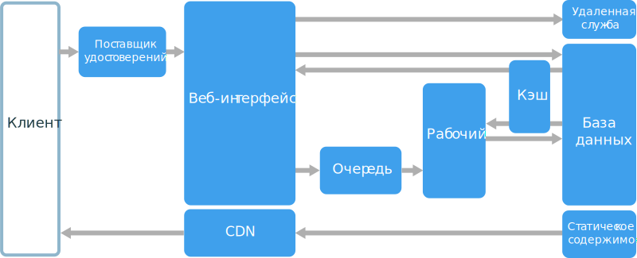

# Стиль архитектуры "Интерфейс — очередь — рабочая роль"Web-Queue-Worker architecture style

Основными компонентами этой архитектуры являются **веб-интерфейс** для обслуживания клиентских запросов и **рабочая роль** для выполнения ресурсоемких задач, долгосрочных рабочих процессов или пакетных заданий.The core components of this architecture are a **web front end** that serves client requests, and a **worker** that performs resource-intensive tasks, long-running workflows, or batch jobs.  Веб-интерфейс взаимодействует с рабочей ролью через **очередь сообщений**.The web front end communicates with the worker through a **message queue**.  

Также в эту архитектуру часто включают другие компоненты, в том числе:Other components that are commonly incorporated into this architecture include:

- одну или несколько баз данных;One or more databases. 
- кэш для хранения значений из базы данных для быстрого чтения;A cache to store values from the database for quick reads.
- сеть доставки содержимого, которая обслуживает статическое содержимое;CDN to serve static content
- удаленные службы, например служба электронной почты или текстовых сообщенийRemote services, such as email or SMS service. (часто это службы сторонних производителей);Often these are provided by third parties.
- поставщик удостоверений для аутентификации.Identity provider for authentication.

Веб-интерфейс и рабочая роль реализованы без отслеживания состояния.The web and worker are both stateless. Сведения о состоянии сеанса можно сохранять в распределенном кэше.Session state can be stored in a distributed cache. Любые длительные задачи выполняются рабочей ролью в асинхронном режиме.Any long-running work is done asynchronously by the worker. Рабочая роль запускается при помещении сообщений в очередь или по расписанию для пакетной обработки.The worker can be triggered by messages on the queue, or run on a schedule for batch processing. Рабочая роль используется не всегда.The worker is an optional component. Если длительные операции не требуются, ее можно не вызывать.If there are no long-running operations, the worker can be omitted.  

Внешний интерфейс может быть реализован как веб-API.The front end might consist of a web API. На стороне клиента веб-API представлен в виде одностраничного приложения, в котором выполняются вызовы через AJAX, или собственного клиентского приложения.On the client side, the web API can be consumed by a single-page application that makes AJAX calls, or by a native client application.

## Когда следует использовать эту архитектуруWhen to use this architecture

Архитектура "Интерфейс — очередь — рабочая роль" обычно реализуется на основе управляемых вычислительных служб, таких как служба приложений Azure или облачные службы Azure.The Web-Queue-Worker architecture is typically implemented using managed compute services, either Azure App Service or Azure Cloud Services. 

Используйте эту архитектуру для следующих сценариев:Consider this architecture style for:

- приложения с относительно несложными функциями;Applications with a relatively simple domain.
- приложения, в которых выполняются долгосрочные процессы или пакетные операции;Applications with some long-running workflows or batch operations.
- если нужно применить управляемые службы вместо решений IaaS (инфраструктура как услуга).When you want to use managed services, rather than infrastructure as a service (IaaS).

## ПреимуществаBenefits

- Это несложная и удобная архитектура.Relatively simple architecture that is easy to understand.
- Она проста в развертывании и управлении.Easy to deploy and manage.
- Четко разделены зоны ответственности.Clear separation of concerns.
- Внешний интерфейс отделен от рабочей роли благодаря механизму асинхронного обмена сообщениями.The front end is decoupled from the worker using asynchronous messaging.
- Внешний интерфейс и рабочую роль можно масштабировать независимо друг от друга.The front end and the worker can be scaled independently.

## СложностиChallenges

- К разработке нужно подходить внимательно, иначе внешний интерфейс и (или) рабочая роль могут стать громоздкими и монолитными компонентами, которые трудно обслуживать и обновлять.Without careful design, the front end and the worker can become large, monolithic components that are difficult to maintain and update.
- Если во внешнем интерфейсе и рабочей роли используются общие схемы данных или модули, могут возникнуть скрытые зависимости.There may be hidden dependencies, if the front end and worker share data schemas or code modules. 

## РекомендацииBest practices

- Предоставлять клиенту хорошо спроектированный API-интерфейс.Expose a well-designed API to the client. См. [рекомендации по проектированию API][api-design].See [API design best practices][api-design].
- Автоматически масштабировать систему с учетом изменений нагрузки.Autoscale to handle changes in load. См. [рекомендации по автомасштабированию][autoscaling].See [Autoscaling best practices][autoscaling].
- Кэшировать данные с признаками статических.Cache semi-static data. См. [рекомендации по кэшированию][caching].See [Caching best practices][caching].
- Использовать сеть доставки содержимого для размещения статического содержимого.Use a CDN to host static content. См. [рекомендации по использованию CDN][cdn].See [CDN best practices][cdn].
- При возможности использовать Polyglot Persistence.Use polyglot persistence when appropriate. См. статью об [использовании подходящего хранилища данных для задания][polyglot].See [Use the best data store for the job][polyglot].
- Секционировать данные, чтобы улучшить масштабируемость, уменьшить количество конфликтов и оптимизировать производительность.Partition data to improve scalability, reduce contention, and optimize performance. См. [рекомендации по секционированию данных][data-partition].See [Data partitioning best practices][data-partition].

## Модель "Интерфейс — очередь — рабочая роль" в службе приложений AzureWeb-Queue-Worker on Azure App Service

В этом разделе описана рекомендуемая архитектура "Интерфейс — очередь — рабочая роль" для службы приложений Azure.This section describes a recommended Web-Queue-Worker architecture that uses Azure App Service. 

Внешний интерфейс реализуется в виде веб-приложения службы приложений Azure, а рабочая роль — как веб-задание.The front end is implemented as an Azure App Service web app, and the worker is implemented as a WebJob. Эти веб-приложение и веб-задание сопоставляются с планом службы приложений, который предоставляет экземпляры виртуальных машин.The web app and the WebJob are both associated with an App Service plan that provides the VM instances. 

В качестве очереди сообщений можно применить очередь служебной шины Azure или очередь службы хранилища Azure.You can use either Azure Service Bus or Azure Storage queues for the message queue. (На схеме представлена очередь службы хранилища Azure.)(The diagram shows an Azure Storage queue.)

В кэше Redis для Azure хранятся сведения о состоянии сеанса и другие данные, к которым нужен доступ с низкой задержкой.Azure Redis Cache stores session state and other data that needs low latency access.

Azure CDN кэширует статическое содержимое, например изображения, документы HTML и CSS.Azure CDN is used to cache static content such as images, CSS, or HTML.

Для хранения данных вы можете выбрать любую технологию, соответствующую требованиям приложения.For storage, choose the storage technologies that best fit the needs of the application. Можно одновременно использовать несколько технологий хранения данных (Polyglot Persistence).You might use multiple storage technologies (polyglot persistence). Эта концепция отражена на схеме в виде блоков службы "База данных SQL Azure" и Azure Cosmos DB.To illustrate this idea, the diagram shows Azure SQL Database and Azure Cosmos DB.  

Дополнительные сведения см. в [описании базовой архитектуры для веб-приложения в службе приложений][scalable-web-app].For more details, see [App Service web application reference architecture][scalable-web-app].

### Дополнительные замечанияAdditional considerations

- Не все транзакции передаются в хранилище через очередь и рабочую роль.Not every transaction has to go through the queue and worker to storage. Простые операции чтения и (или) записи веб-интерфейс может выполнять напрямую.The web front end can perform simple read/write operations directly. Рабочие роли предназначены только для ресурсоемких задач или долго выполняющихся рабочих процессов.Workers are designed for resource-intensive tasks or long-running workflows. В некоторых сценариях рабочая роль не нужна.In some cases, you might not need a worker at all.

- Встроенная в службу приложений функция автоматического масштабирования позволяет изменять количество экземпляров виртуальных машин.Use the built-in autoscale feature of App Service to scale out the number of VM instances. При четко прогнозируемой нагрузке на приложение используйте автоматическое масштабирование на основе расписания.If the load on the application follows predictable patterns, use schedule-based autoscale. Если нагрузка непредсказуема, используйте правила автоматического масштабирования на основе метрик.If the load is unpredictable, use metrics-based autoscaling rules.      

- Возможно, веб-приложение и веб-задание стоит разместить в разных планах службы приложений.Consider putting the web app and the WebJob into separate App Service plans. Тогда они будут выполняться на разных экземплярах виртуальных машин и вы сможете масштабировать их независимо друг от друга.That way, they are hosted on separate VM instances and can be scaled independently. 

- Используйте разные планы службы приложений для рабочей и тестовой сред.Use separate App Service plans for production and testing. Если у вас будет общий план для рабочей среды и тестирования, все задачи тестирования будут выполняться прямо на виртуальных машинах рабочей среды.Otherwise, if you use the same plan for production and testing, it means your tests are running on your production VMs.

- Для управления развертываниями используйте слоты развертывания.Use deployment slots to manage deployments. Это позволит развернуть обновленную версию в промежуточном слоте, а затем переключить на нее рабочий слот.This lets you to deploy an updated version to a staging slot, then swap over to the new version. Кроме того, вы сможете легко вернуться к предыдущей версии, если возникнет проблема с обновлением.It also lets you swap back to the previous version, if there was a problem with the update.

<!-- links -->

[api-design]: ../../best-practices/api-design.md
[autoscaling]: ../../best-practices/auto-scaling.md
[caching]: ../../best-practices/caching.md
[cdn]: ../../best-practices/cdn.md
[data-partition]: ../../best-practices/data-partitioning.md
[polyglot]: ../design-principles/use-the-best-data-store.md
[scalable-web-app]: ../../reference-architectures/app-service-web-app/scalable-web-app.md