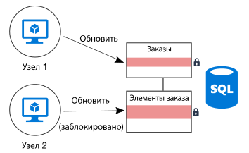
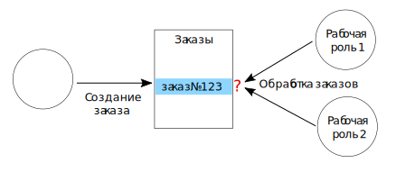

# Минимизация координацииMinimize coordination

## Сведите к минимуму координацию между службами приложений, чтобы обеспечить масштабируемостьMinimize coordination between application services to achieve scalability

Большинство облачных приложений состоит из нескольких служб приложений и веб-интерфейсов, баз данных, бизнес-процессов, отчетов и аналитики и т. д.Most cloud applications consist of multiple application services &mdash; web front ends, databases, business processes, reporting and analysis, and so on. Чтобы обеспечить масштабируемость и надежность, каждая из этих служб должна выполняться на нескольких экземплярах.To achieve scalability and reliability, each of those services should run on multiple instances.

Что произойдет, если два экземпляра попытаются одновременно выполнить операции, влияющие на общее состояние?What happens when two instances try to perform concurrent operations that affect some shared state? В некоторых случаях требуется координация действий между узлами, например для поддержки гарантий ACID.In some cases, there must be coordination across nodes, for example to preserve ACID guarantees. На этой схеме служба `Node2` ожидает, пока `Node1` снимет блокировку базы данных:In this diagram, `Node2` is waiting for `Node1` to release a database lock:

Любая координация связана с ограничением возможностей, предоставляемых горизонтальным масштабированием, и определенными сложностями.Coordination limits the benefits of horizontal scale and creates bottlenecks. В этом примере конфликты блокировки будут возникать все чаще по мере увеличения масштаба приложения и числа экземпляров.In this example, as you scale out the application and add more instances, you'll see increased lock contention. В самом худшем случае экземпляры интерфейса будут находиться в состоянии блокировки большую часть времени.In the worst case, the front-end instances will spend most of their time waiting on locks.

Еще одна распространенная причина, требующая координации, — семантика запроса "только один раз"."Exactly once" semantics are another frequent source of coordination. Например, каждый заказ должен быть обработан только один раз.For example, an order must be processed exactly once. Два рабочих процесса ожидают появления новых заказов.Two workers are listening for new orders. `Worker1` извлекает заказ для обработки.`Worker1` picks up an order for processing. Теперь приложение должно гарантировать следующее: 1) `Worker2` не будет дублировать эту работу, 2) заказ не будет потерян в случае сбоя `Worker1`.The application must ensure that `Worker2` doesn't duplicate the work, but also if `Worker1` crashes, the order isn't dropped.

Вы можете применить для координации рабочих потоков шаблон [Планировщик, агент, контролер][sas-pattern] Но в нашем примере удобнее будет секционировать работу.You can use a pattern such as [Scheduler Agent Supervisor][sas-pattern] to coordinate between the workers, but in this case a better approach might be to partition the work. Каждой рабочей роли назначается некоторое число заказов (например, с привязкой к региону выставления счетов).Each worker is assigned a certain range of orders (say, by billing region). Если рабочий процесс завершится сбоем, его новый экземпляр начнет работу там, где остановился предыдущий, но соседние экземпляры не будут конкурировать.If a worker crashes, a new instance picks up where the previous instance left off, but multiple instances aren't contending.

## РекомендацииRecommendations

**Учитывайте итоговую согласованность**.**Embrace eventual consistency**. Если данные распределяются между несколькими объектами, только координация между ними обеспечит строгую согласованность.When data is distributed, it takes coordination to enforce strong consistency guarantees. Предположим, что определенная операция обновляет две базы данных.For example, suppose an operation updates two databases. Вместо того, чтобы включать эту операцию в одну транзакцию, создайте в системе механизм обеспечения итоговой согласованности. Например, шаблон [компенсирующих транзакций][compensating-transaction] позволит выполнить логический откат в случае сбоя.Instead of putting it into a single transaction scope, it's better if the system can accommodate eventual consistency, perhaps by using the [Compensating Transaction][compensating-transaction] pattern to logically roll back after a failure.

**Используйте события предметной области для синхронизации состояний**.**Use domain events to synchronize state**. [Событие предметной области][domain-event] регистрируется, когда в пределах некоторой предметной области происходит что-то важное.A [domain event][domain-event] is an event that records when something happens that has significance within the domain. Такие события могут прослушиваться всеми заинтересованными службами, что позволяет обойтись без глобальных транзакций для координации действий между несколькими службами.Interested services can listen for the event, rather than using a global transaction to coordinate across multiple services. Чтобы применить такой подход, система должна поддерживать итоговую согласованность (см. предыдущий пункт).If this approach is used, the system must tolerate eventual consistency (see previous item).

**Изучите такие шаблоны, как CQRS и шаблон источников событий**.**Consider patterns such as CQRS and event sourcing**. Эти два шаблона минимизируют вероятность конфликтов между рабочими нагрузками чтения и записи.These two patterns can help to reduce contention between read workloads and write workloads.

- [Шаблон CQRS][cqrs-pattern] разделяет операции чтения и записи.The [CQRS pattern][cqrs-pattern] separates read operations from write operations. В некоторых реализациях данные для чтения физически отделены от данных для записи.In some implementations, the read data is physically separated from the write data.

- В [шаблоне источников событий][event-sourcing] все изменения состояния сохраняются в виде последовательности событий в хранилище постоянного пополнения.In the [Event Sourcing pattern][event-sourcing], state changes are recorded as a series of events to an append-only data store. Добавление одного события в такой поток является атомарной операцией и требует минимальных блокировок.Appending an event to the stream is an atomic operation, requiring minimal locking.

Эти два шаблона дополняют друг друга.These two patterns complement each other. Если к хранилищу, которое в соответствии с шаблоном CQRS используется только для записи, применить источники событий, такое хранилище для чтения сможет ожидать те же события и воспроизводить моментальный снимок текущего состояния, оптимизированный для обработки запросов.If the write-only store in CQRS uses event sourcing, the read-only store can listen for the same events to create a readable snapshot of the current state, optimized for queries. Но прежде, чем внедрять CQRS или источники событий, ознакомьтесь с особенностями такого подхода.Before adopting CQRS or event sourcing, however, be aware of the challenges of this approach. Дополнительные сведения см. в статье о [стиле архитектуры CQRS][cqrs-style].For more information, see [CQRS architecture style][cqrs-style].

**Секционирование данных**.**Partition data**.  Не включайте все данные в одну схему данных, которую используют сразу несколько служб приложения.Avoid putting all of your data into one data schema that is shared across many application services. Архитектура микрослужб принудительно применяет этот принцип, назначая каждой службе собственное хранилище данных.A microservices architecture enforces this principle by making each service responsible for its own data store. В пределах одной базы данных секционирование данных может оптимизировать параллелизм, так как запись в любой из сегментов никак не влияет на службы, использующие для записи другие сегменты.Within a single database, partitioning the data into shards can improve concurrency, because a service writing to one shard does not affect a service writing to a different shard.

**Применяйте идемпотентные операции**.**Design idempotent operations**. Везде, где это возможно, применяйте идемпотентные операции.When possible, design operations to be idempotent. Это позволит всегда обрабатывать их с использованием семантики "как минимум один раз".That way, they can be handled using at-least-once semantics. Предположим, вы помещаете рабочие элементы в очередь.For example, you can put work items on a queue. Если при выполнении операции рабочая роль завершится сбоем, следующая рабочая роль просто выберет тот же рабочий элемент.If a worker crashes in the middle of an operation, another worker simply picks up the work item.

**Используйте параллельную и асинхронную обработку.****Use asynchronous parallel processing**. Если для операция выполняется в несколько этапов, которые выполняются асинхронно (например, вызовы удаленных служб), вы можете вызывать их параллельно и объединять полученные результаты.If an operation requires multiple steps that are performed asynchronously (such as remote service calls), you might be able to call them in parallel, and then aggregate the results. Такой подход предполагает, что каждый шаг никак не зависит от результатов выполнения предыдущего шага.This approach assumes that each step does not depend on the results of the previous step.

**Используйте оптимистическую блокировку, если это возможно**.**Use optimistic concurrency when possible**. Пессимистическое управление параллелизмом подразумевает блокировку базы данных для предотвращения конфликтов.Pessimistic concurrency control uses database locks to prevent conflicts. Это может снижать производительность и доступность системы.This can cause poor performance and reduce availability. Если применить оптимистическое управление параллелизмом, каждая транзакция изменит собственную копию (моментальный снимок) данных.With optimistic concurrency control, each transaction modifies a copy or snapshot of the data. Когда транзакция будет зафиксирована, ядро СУБД проверит эту транзакцию и отклонит ее, если она может повлиять на согласованность базы данных.When the transaction is committed, the database engine validates the transaction and rejects any transactions that would affect database consistency.

База данных SQL Azure и SQL Server поддерживают оптимистический параллелизм, выполняя [изоляцию моментальных снимков][sql-snapshot-isolation].Azure SQL Database and SQL Server support optimistic concurrency through [snapshot isolation][sql-snapshot-isolation]. Некоторые службы хранилища Azure, например [Azure Cosmos DB][cosmosdb-faq] и [служба хранилища Azure][storage-concurrency], поддерживают оптимистическую блокировку с помощью тэгов eTag.Some Azure storage services support optimistic concurrency through the use of Etags, including [Azure Cosmos DB][cosmosdb-faq] and [Azure Storage][storage-concurrency].

**Применяйте MapReduce или другой алгоритм распределенной параллельной обработки**.**Consider MapReduce or other parallel, distributed algorithms**. В зависимости от характера данных и выполняемой работы, иногда ее можно разделить на несколько независимых задач, чтобы выполнять эти задачи параллельно на нескольких узлах.Depending on the data and type of work to be performed, you may be able to split the work into independent tasks that can be performed by multiple nodes working in parallel. См. статью [Стиль архитектуры для больших вычислений][big-compute].See [Big compute architecture style][big-compute].

**Используйте шаблон выбора лидера для координации действий**.**Use leader election for coordination**. В тех случаях, когда операции необходимо координировать, сделайте так, чтобы координатор не был единой точкой отказа в приложении.In cases where you need to coordinate operations, make sure the coordinator does not become a single point of failure in the application. Если реализовать [шаблон выборов лидера][leader-election], в каждый момент времени один из экземпляров будет лидером, который выполняет функции координатора.Using the [Leader Election pattern][leader-election], one instance is the leader at any time, and acts as the coordinator. Если в этом экземпляре происходит сбой, выбирается новый лидер.If the leader fails, a new instance is elected to be the leader.

<!-- links -->

[big-compute]: ../architecture-styles/big-compute.md
[compensating-transaction]: ../../patterns/compensating-transaction.md
[cqrs-style]: ../architecture-styles/cqrs.md
[cqrs-pattern]: ../../patterns/cqrs.md
[cosmosdb-faq]: /azure/cosmos-db/faq
[domain-event]: https://martinfowler.com/eaaDev/DomainEvent.html
[event-sourcing]: ../../patterns/event-sourcing.md
[leader-election]: ../../patterns/leader-election.md
[sas-pattern]: ../../patterns/scheduler-agent-supervisor.md
[sql-snapshot-isolation]: /sql/t-sql/statements/set-transaction-isolation-level-transact-sql
[storage-concurrency]: https://azure.microsoft.com/blog/managing-concurrency-in-microsoft-azure-storage-2/