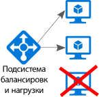
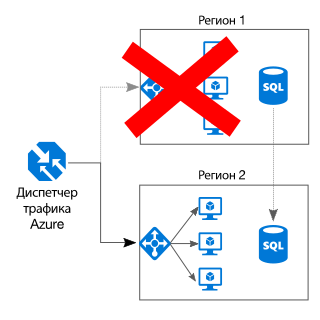

# Обеспечение избыточности всех компонентов

## Обеспечьте избыточность приложения, чтобы устранить все единые точки отказа.

Надежное приложение спокойно обходит любые сбои. Определите критические пути в приложении. Обеспечена ли избыточность для каждой точки этого пути? Если произойдет сбой подсистемы, сможет ли приложение применить другое средство для отработки отказа?

## Рекомендации 

**Оцените бизнес-требования.** Степень избыточности системы влияет на ее стоимость и сложность. Архитектура должна строиться на основе бизнес-требований, таких как целевое время восстановления. Например, развертывание в нескольких регионах обойдется дороже и будет сложнее в управлении, чем развертывание в одном регионе. Для обработки отказа и восстановления размещения потребуются дополнительные операционные процедуры. Дополнительные расходы и усложнение системы могут быть целесообразны для одних бизнес-сценариев, но недопустимы для других.

**Разместите виртуальные машины за подсистемой балансировки нагрузки.** Не допускайте, чтобы критически важные рабочие нагрузки выполнялись только на одной виртуальной машине. Используйте сразу несколько виртуальных машин, подключенных к подсистеме балансировки нагрузки. Если какая-либо виртуальная машина станет недоступной, подсистема балансировки нагрузки переместит трафик на работоспособные виртуальные машины. Дополнительные сведения о развертывании этой конфигурации см. в статье об [использовании нескольких виртуальных машин для повышения масштабируемости и доступности][multi-vm-blueprint].

**Реплицируйте базы данных.** Служба "База данных SQL" и Cosmos DB Azure автоматически реплицируют данные в пределах региона. Вы можете дополнительно включить георепликацию между регионами. Если вы используете для базы данных модель IaaS, выберите службу, которая поддерживает репликацию и отработку отказа, например [Группы доступности Always On SQL Server][sql-always-on]. 

**Включите георепликацию.** При георепликации для службы [База данных SQL Azure][sql-geo-replication] и [Cosmos DB][docdb-geo-replication] создаются вторичные реплики данных с доступом только для чтения в одном или нескольких дополнительных регионах. В случае сбоя для базы данных выполняется отработка отказа и запись осуществляется в одном из дополнительных регионов.

**Используйте секционирование для повышения доступности.** Секционирование базы данных чаще применяется для масштабируемости, но оно позволяет повысить и доступность. Если один сегмент выходит из строя, остальные остаются доступными. Сбой одного сегмента повлияет только на некоторую часть транзакций. 

**Разверните приложение в нескольких регионах**. Чтобы обеспечить максимальную доступность, разверните приложение в нескольких регионах. Тогда приложение сможет выполнить отработку отказа даже в тех редких случаях, когда проблема затрагивает целый регион. На схеме ниже представлено приложение в нескольких регионах, для которого диспетчер трафика Azure управляет отработкой отказа.

**Синхронизируйте отработку отказа для интерфейсной и серверной частей приложения.** Используйте диспетчер трафика Azure для управления отработкой отказа интерфейсной части. Если в одном из регионов интерфейсная часть станет недоступна, диспетчер трафика перенаправит все новые запросы в дополнительный регион. В зависимости от используемого решения базы данных для нее может потребоваться синхронная отработка отказа. 

**Используйте автоматическую отработку отказа, но восстановление размещения выполняйте вручную.** Используйте диспетчер трафика для автоматической отработки отказа, но не применяйте его для автоматического восстановления размещения. Автоматическое восстановление размещения может привести к тому, что приложение вернется в основной регион раньше, чем он полностью восстановит работоспособность. Сначала следует убедиться, что все подсистемы приложения полностью работоспособны, и после этого вручную выполнить восстановление размещения. Кроме того (в зависимости от используемой базы данных), перед восстановлением нужно проверить согласованность данных.

**Добавьте избыточность для диспетчера трафика.** Диспетчер трафика также является точкой возможного сбоя. Просмотрите соглашение об уровне доступности для диспетчера трафика и определите, достаточно ли таких гарантий для выполнения требований к высокой доступности в вашей организации. Если это не так, рекомендуем добавить резервное решение для управления трафиком. Если в службе диспетчера трафика Azure произошел сбой, измените записи CNAME в службе доменных имен, чтобы они указывали на резервную службу управления трафиком.

<!-- links -->

[multi-vm-blueprint]: ../../reference-architectures/virtual-machines-windows/multi-vm.md

[cassandra]: http://cassandra.apache.org/
[docdb-geo-replication]: /azure/documentdb/documentdb-distribute-data-globally
[sql-always-on]: https://msdn.microsoft.com/library/hh510230.aspx
[sql-geo-replication]: /azure/sql-database/sql-database-geo-replication-overview
