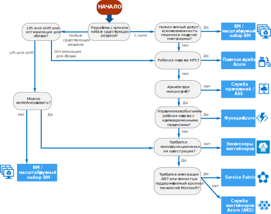

# Дерево принятия решений для вычислительных служб Azure

В Azure доступно несколько способов размещения кода приложения. Термин *вычислительная служба* означает модель размещения вычислительных ресурсов, которые используются для выполнения приложения. С помощью следующей блок-схемы можно выбрать службы вычислений для приложения. В блок-схеме содержится набор ключевых критериев принятия решения, которые соответствуют рекомендациям. 

**Используйте эту блок-схему в качестве отправной точки.** К каждому приложению есть свои требования, поэтому в качестве отправной точки используйте рекомендации. Затем выполните более глубокую очценку, используя такие аспекты как:
 
- Набор возможностей
- [Ограничения служб](/azure/azure-subscription-service-limits)
- [Стоимость](https://azure.microsoft.com/pricing/)
- [Соглашение об уровне обслуживания](https://azure.microsoft.com/support/legal/sla/)
- [Доступность по регионам](https://azure.microsoft.com/global-infrastructure/services/)
- Разработка экосистемы и навыков команды
- [Таблицы сравнения вычислений](./compute-comparison.md)

Если ваше приложение состоит из нескольких рабочих нагрузок, оцените каждую из них отдельно. Полное решение можно внедрить в две или больше службы вычислений.

