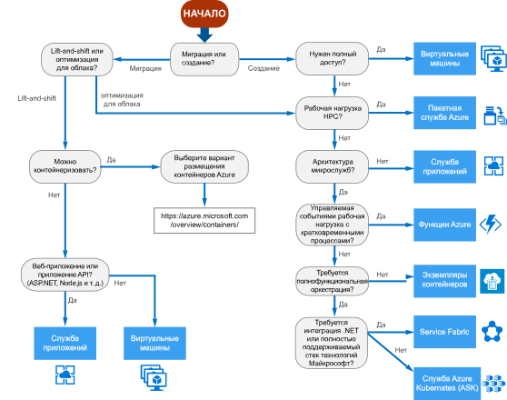

# Дерево принятия решений для вычислительных служб Azure

В Azure доступно несколько способов размещения кода приложения. Термин *вычислительная служба* означает модель размещения вычислительных ресурсов, которые используются для выполнения приложения. С помощью следующей блок-схемы можно выбрать службы вычислений для приложения. В блок-схеме содержится набор ключевых критериев принятия решения, которые соответствуют рекомендациям. 

**Используйте эту блок-схему в качестве отправной точки.** К каждому приложению есть свои требования, поэтому в качестве отправной точки используйте рекомендации. Затем выполните более глубокую очценку, используя такие аспекты как:
 
- Набор возможностей
- [Ограничения служб](/azure/azure-subscription-service-limits)
- [Стоимость](https://azure.microsoft.com/pricing/)
- [Соглашение об уровне обслуживания](https://azure.microsoft.com/support/legal/sla/)
- [Доступность по регионам](https://azure.microsoft.com/global-infrastructure/services/)
- Разработка экосистемы и навыков команды
- [Таблицы сравнения вычислений](./compute-comparison.md)

Если ваше приложение состоит из нескольких рабочих нагрузок, оцените каждую из них отдельно. Полное решение можно внедрить в две или больше службы вычислений.

Дополнительные сведения о вариантах размещения контейнеров в Azure см. на странице https://azure.microsoft.com/overview/containers/.

## Блок-схема

## Определения

- **Первичный** — проект разработки программного обеспечения, создаваемый с нуля. Он не включает существующий код. 

- **Вторичный** — проект разработки программного обеспечения, созданный на основе существующего приложения. Он может включать устаревший код или платформы предыдущих версий.

- **Lift-and-shift** — это стратегия по переноса рабочей нагрузки в облако без повторного проектирования приложения и внесения изменений в код. Также называется *повторным размещением*. См. дополнительные сведения о [Центре миграции Azure](https://azure.microsoft.com/migration/).

- **Оптимизация для облака** — это стратегия переноса в облако путем рефакторинга приложения для использования преимуществ облачных функций и возможностей.

## Дополнительная информация

См. дополнительные сведения о [критериях для выбора вычислительной службы Azure](./compute-comparison.md).
