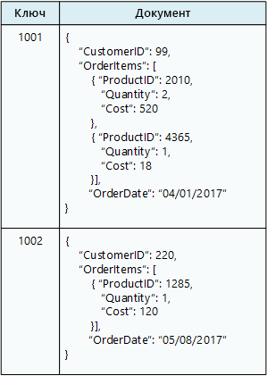

# Выбор правильного хранилища данных

Объем обрабатываемых данных в современных бизнес-системах постоянно растет. Эти данные могут поступать из внешних служб, создаваться самой системой или пользователями. Наборы данных могут имеют очень разные характеристики и требования к обработке. Организации используют данные для оценки тенденций, запуска бизнес-процессов, аудита операций, анализа поведения клиентов и многих других задач. 

Такая разнородность означает, что единственное хранилище данных редко будет оптимальным решением. Вместо этого данные разных типов лучше хранить в разных хранилищах данных, каждое из которых оптимизировано под конкретный шаблон использования или конкретную рабочую нагрузку. Термин *многоязычное хранение* обозначает решения, в которых сочетаются разные технологии хранилища данных.

Выбор правильного хранилища данных, соответствующего всем требованиям, является для проекта ключевым решением. Выбирать приходится буквально из сотен реализаций баз данных SQL и NoSQL. Хранилища данных обычно различают по методам структурирования данных и типам поддерживаемых операций. В этой статье описаны несколько самых распространенных моделей хранилища. Обратите внимание, что некоторые технологии хранилища данных поддерживают несколько моделей хранилища. Например, реляционная СУБД поддерживает технологии хранилища пар "ключ — значение" или графов. В настоящее время существует тенденция применять *многомодельные* системы баз данных, которые поддерживают несколько моделей хранилища. Но узнать о других моделях будет полезно в любом случае. 

Хранилища данных, включенные в одну категорию, не обязательно предоставляют одинаковый набор возможностей. Большинство хранилищ данных выполняют обработку запросов и данных на стороне сервера. Иногда эта функция встроена в подсистему хранилища данных. В других случаях функции обработки данных вынесены в отдельный модуль или несколько модулей для обработки и анализа. Хранилища данных также поддерживают разные интерфейсы программного доступа и управления. 

Для начала вам следует решить, какая модель хранилища отвечает вашим требованиям. Затем найдите конкретное хранилище данных в этой категории, учитывая такие факторы, как набор функций, стоимость и простота управления.

## Реляционные СУБД

Реляционные базы данных хранят данные в наборе двумерных таблиц со строками и столбцами. Каждая таблица имеет собственный набор столбцов, который применяется для каждой строки в этой таблице. Эта модель основана на математических алгоритмах. Большинство поставщиков предлагает один из диалектов языка структурированных запросов (SQL) для извлечения данных и управления ими. Как правило, реляционная СУБД реализует для обновления информации транзакционно согласованный механизм, который соответствует модели ACID (Atomic = атомарность, Consistent = согласованность, Isolated = изоляция, Durable = устойчивость). 

Реляционная СУБД часто поддерживает модель "схема для записи". В этой схеме сначала определяется структура данных, а затем она применяется для всех операций чтения или записи. Это важное отличие от большинства хранилищ данных NoSQL, особенно от хранилищ данных формата "ключ — значение". Такие хранилища используют модель "схема для чтения", при которой клиент использует собственную схему для интерпретации поступающих данных из базы данных, но не имеет никакой информации о формате данных, которые записываются.

Реляционная СУБД очень удобна для сценариев, в которых важна строгая согласованность. Все изменения являются атомарными, а каждая транзакция сохраняет согласованность данных. Однако базовые структуры этой модели не поддерживают горизонтальное масштабирование, при котором хранение и обработка данных распределяются между несколькими компьютерами. Кроме того, сохраняемые в реляционной СУБД должны быть нормализованы для соответствия реляционной структуре. Этот процесс хорошо известен, но может снижать эффективность работы. Сохраняемые логические сущности разделяются на строки в отдельных таблицах, а при выполнении запросов данные собираются снова. 

Соответствующие службы Azure: 

- [База данных SQL Azure][sql-db]
- [База данных Azure для MySQL][mysql]
- [База данных Azure для PostgreSQL][postgres]

## Хранилище пар "ключ — значение"

Хранилище пар "ключ — значение" по сути представляет собой большую хэш-таблицу. Каждое значение сопоставляется с уникальным ключом, и хранилище ключей использует этот ключ для хранения данных, применяя к нему некоторую функцию хэширования. Выбор функции хэширования должен обеспечить равномерное распределение хэшированных ключей по хранилищу данных. 

Большинство хранилищ пар "ключ — значение" поддерживают только самые простые операции запроса, вставки и удаления. Чтобы частично или полностью изменить значение, приложение всегда перезаписывает существующее значение целиком. В большинстве реализаций атомарной операцией считается чтение или запись одного значения. Запись больших значений занимает относительно долгое время. 

Приложение может хранить в наборе значений произвольные данные, но некоторые хранилища пар "ключ — значение" накладывают ограничения на максимальный размер значений. Программное обеспечение хранилища ничего не знает о значениях, которые в нем хранятся. Все сведения о схеме поддерживаются и применяются на уровне приложения. Эти значения по существу являются большими двоичными объектами, которые хранилище извлекает и сохраняет по соответствующему ключу. 

Хранилища пар "ключ — значение" хорошо оптимизированы для приложений, выполняющих простой поиск, но не очень подходят для систем, которым нужно выполнять запросы к нескольким хранилищам пар "ключ — значение". Также хранилища пар "ключ — значение" неудобны для сценариев, где могут выполняться запросы по значению, а не только по ключам. Например, в реляционной базе данных вы можете найти определенную запись с помощью предложения WHERE, но хранилища пар "ключ — значение" обычно не поддерживают такие возможности.

Одно хранилище пар "ключ — значение" очень легко масштабируется, поскольку позволяет удобно распределить данные среди нескольких узлов на разных компьютерах. 

Соответствующие службы Azure: 

- [Cosmos DB][cosmosdb]
- [Кэш Azure Redis][redis-cache]

## Базы данных документов

База данных документов организационно близка к хранилищу пар "ключ — значение", но поддерживает хранение коллекции именованных полей и данных (которые здесь называются документами), которые могут быть простыми скалярными элементами или составными элементами, например списком или дочерней коллекцией. Данные в полях документа можно закодировать разными способами, например в формате XML, YAML, JSON, BSON, или хранить в виде обычного текста. В отличие от хранилища пар "ключ — значение", поля документов доступны системе управления хранилищем, что позволяет приложению выполнять запросы и применять фильтры, основанные на значениях этих полей. 

Как правило, документ содержит все данные одной сущности. Состав элементов для каждой сущности зависит от конкретного приложения. Например, сущность может содержать сведения о клиенте, заказе или и те, и другие. Один документ может содержать сведения, которые в реляционной СУБД обычно распределяются по нескольким реляционным таблицам. 

Хранилище документов не обязывает использовать одинаковую структуру для всех документов. Поддержка свободной формы обеспечивает большую гибкость. Приложения могут хранить в документах разные данные в соответствии с текущими требованиями компании.

Приложение может получать документы по ключу документа. Это уникальный идентификатор документа. Часто к нему применяется хэширование для равномерного распределения данных. Некоторые базы данных документов создают ключ документа автоматически. Другие позволяют указать, какой атрибут документа следует использовать в качестве ключа. Также приложение может запрашивать документы по значениям одного или нескольких полей. Некоторые базы данных документов поддерживают индексирование, что ускоряет поиск документов по одному или нескольким индексированным полям. 

Многие базы данных документов поддерживают обновления "на месте", то есть позволяют приложению изменять значения отдельных полей без перезаписи всего документа. Операции чтения и записи в нескольких полях одного документа обычно являются атомарными.

Соответствующая служба Azure: [Cosmos DB][cosmosdb]

## Базы данных графов

База данных графов хранит сведения двух типов: узлы и грани. Узлы в этой модели можно считать сущностями. Грани определяют связи между узлами. Узлы и грани имеют свойства, которые предоставляют сведения о конкретном узле или грани, примерно как столбцы в реляционной таблице. Грани могут иметь направление, указывающее на характер связи.

База данных графов позволяет приложениям эффективно выполнять запросы, которые проходят через сеть узлов и граней, а также анализировать связи между сущностями. На следующей схеме представлена база данных персонала организации, структурированная в виде графа. Сущностями здесь являются сотрудники и отделы, а грани определяют отношения подчинения и отдел, в котором работает каждый сотрудник. На этом графе грани имеют строгое направление, которое на схеме обозначено стрелками.
 

Такая структура позволяет легко выполнять такие запросы, как "найти всех сотрудников, которые прямо или косвенно подчиняются Светлане" или "найти всех, кто работает в одном отделе с Дмитрием". Процессы сложного анализа выполняются очень быстро, даже на больших графах с большим количеством сущностей и связей. Многие базы данных графов предоставляют язык запросов, который можно использовать для эффективного обхода сети связей. 

Соответствующая служба Azure: [Cosmos DB][cosmosdb]

## Базы данных столбцов

Базы данных столбцов хранят распределяют данные по строкам и столбцам. База данных столбцов в простейшей форме почти неотличима от реляционной базы данных, по крайней мере организационно. Настоящим преимуществом базы данных столбцов является способность денормализованно структурировать разреженные данные. 

Базу данных столбцов можно представить как набор табличных данных со строками и столбцами, в которых столбцы разделяются на определенные группы или *семейства столбцов*. Каждое семейство столбцов включает набор логически связанных столбцов, которые обычно извлекаются или управляются как единое целое. Другие данные, которые используются в других процессах, хранятся отдельно в других семействах столбцов. В семейство столбцов можно динамически добавить новые столбцы, а строки могут быть разреженными (то есть строки не обязаны иметь значение для каждого столбца).

На следующей диаграмме представлен пример таблицы с двумя семействами столбцов: `Identity` и `Contact Info`. Данные для одной сущности имеют одинаковые ключи строк во всех семействах столбцов. Такая структура, в которой строки любого объекта в семействе столбцов могут динамически изменяться, определяет важное преимущество этой категории баз данных. Семейства столбцов очень хорошо подходят для хранения структурированных изменчивых данных.

 

В отличие от хранилища пар "ключ — значение" и баз данных документов, большинство хранилищ столбцов используют для упорядоченного хранения данных сами значения ключей, а не хэш-коды от них. Многие реализации позволяют создавать индексы по определенным столбцам в семействе столбцов. Индексы позволяют получать данные по значениям столбцов, а не ключам строки.

Чтение и запись одной строки для одного семейства столбцов обычно являются атомарными операциями. Но некоторые реализации поддерживают атомарность для всей строки, распределенной по нескольким семействам столбцов.

Соответствующая служба Azure: [HBase в HDInsight][hbase]

## Аналитика данных

Хранилища аналитики данных предоставляют решения для масштабной параллельной обработки, хранения и анализа данных. Данные в них распределяются по нескольким серверам с полностью автономной архитектурой, что позволяет добиться максимальной масштабируемости и минимизировать зависимости. Скорее всего, эти данные не будут статическими, поэтому такие хранилища должны уметь обрабатывать большие объемы информации, поступающей несколькими потоками в разных форматах, не прекращая обработки запросов. 

Соответствующие службы Azure:

- [Хранилище данных SQL][sql-dw]
- [Azure Data Lake][data-lake]

## Базы данных поисковой системы  

База данных поисковой системы позволяет выполнять поиск информации, которая хранится во внешних хранилищах и службах. База данных поисковой системы способна индексировать огромные объемы данных и предоставляет доступ к этим индексам почти в реальном времени. Обычно считается, что базы данных поисковой системы созданы исключительно для веб-сайтов, но многие крупные системы используют их для предоставления функций структурированного и поиска ad-hoc по собственным базам данных.

Ключевые характеристики базы данных поисковой системы — это возможность очень быстро сохранять и индексировать информацию, а также быстро отвечать на поисковые запросы. В некоторых системах поддерживаются многомерные индексы и полнотекстовый поиск по большим объемам текстовых данных. Индексирование может выполняться по модели извлечения, то есть по требованию базы данных, или по модели передачи, то есть по команде из кода внешнего приложения. 

Поддерживается точный или нечеткий поиск. Нечеткий поиск находит документы, которые соответствуют набору условий, и вычисляет для них коэффициент совпадения с этим набором. Некоторые поисковые системы поддерживают лингвистический анализ, который возвращает соответствия с учетом синонимов, категорий (например, `dogs` будет считаться соответствием для `pets`) и морфологии (поиск любых однокоренных слов). 

Соответствующая служба Azure: [Поиск Azure][search]

## Базы данных временных рядов

Данными временных рядов называются наборы значений, которые упорядочены по времени. Соответственно базы данных временных рядов оптимизированы для хранения данных именно такого типа. Базы данных временных рядов должны поддерживать очень большое число операций записи, поскольку обычно в них в режиме реального времени собирается большой объем данных из большого количества источников. Обновления в таких базах данных выполняются редко, а удаление чаще всего является массовой операцией. Размер отдельных записей в базе данных временных рядов обычно невелик, но их очень много, а значит общий размер данных быстро увеличивается.

Базы данных временных рядов хорошо подходят для хранения данных телеметрии. Например, для сбора данных от датчиков Интернета вещей или счетчиков в приложениях или системах.

Соответствующая служба Azure: [Аналитика временных рядов][time-series]

## Хранилище объектов  

Хранилище объектов оптимизировано для хранения и извлечения больших двоичных объектов (изображения, файлы, видео- и аудиопотоки, объекты данных и документы приложений большого размера, образы дисков для виртуальных машин). В хранилище эти типы объекты содержат сохраненные данные, метаданные и уникальный идентификатор для доступа к объекту. Хранилища объектов позволяют управлять чрезвычайно большими объемами неструктурированных данных.  

Соответствующая служба Azure: [хранилище BLOB-объектов][blob]

## Общие файлы   

В некоторых случаях самой эффективной системой хранения и извлечения данных будут простые неструктурированные файлы. Использование общих файловых ресурсов позволяет использовать их совместно через компьютерную сеть. Если созданы необходимые механизмы для поддержки безопасности и одновременного доступа, такое совместное использование данных позволяет распределенным службам с высокой степенью масштабируемости предоставлять доступ к данным для базовых низкоуровневых операций, то есть для простых запросов на чтение и запись.

Соответствующая служба Azure: [хранилище файлов][file-storage]

<!-- links -->

[blob]: https://azure.microsoft.com/services/storage/blobs/
[cosmosdb]: https://azure.microsoft.com/services/cosmos-db/
[data-lake]: https://azure.microsoft.com/solutions/data-lake/
[file-storage]: https://azure.microsoft.com/services/storage/files/
[hbase]: /azure/hdinsight/hdinsight-hbase-overview
[mysql]: https://azure.microsoft.com/services/mysql/
[postgres]: https://azure.microsoft.com/services/postgresql/
[redis-cache]: https://azure.microsoft.com/services/cache/
[search]: https://azure.microsoft.com/services/search/
[sql-db]: https://azure.microsoft.com/services/sql-database
[sql-dw]: https://azure.microsoft.com/services/sql-data-warehouse/
[time-series]: https://azure.microsoft.com/services/time-series-insights/