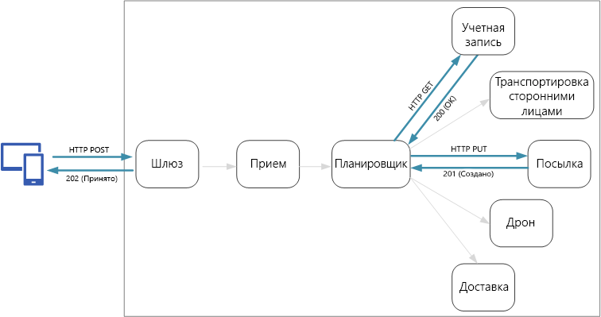
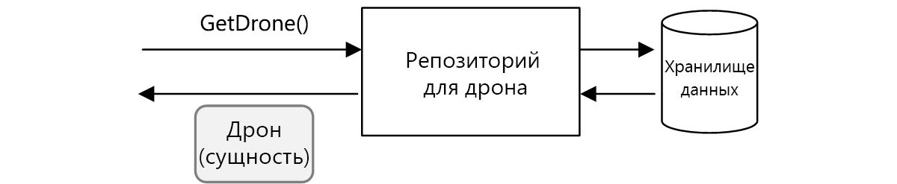
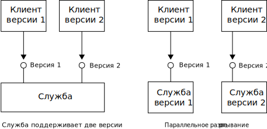

# <a name="designing-microservices-api-design"></a>Проектирование микрослужб: проектирование API

Правильное проектирование API важно в архитектуре микрослужб, так как весь обмен данными между службами происходит либо через сообщения, либо через вызовы API. API должны быть эффективными и не допускать создания [множественных операций ввода-вывода](../antipatterns/chatty-io/index.md). Так как службы разрабатывают отдельные команды, API должны иметь четко определенную семантику и схемы управления версиями, чтобы обновления не прерывали работу других служб.



Важно различать два типа API:

- общедоступные API, которые вызываются клиентскими приложениями; 
- серверные API, которые используются для обмена данными между службами.

Эти два варианта использования имеют различные требования. Общедоступный API должен быть совместим с клиентскими приложениями (браузерными приложениями или собственными мобильными приложениями). В большинстве случаев это означает, что общедоступный API будет использовать REST по протоколу HTTP. Однако для серверных API нужно учитывать производительность сети. Обмен данными между службами может привести к большому трафику. Это зависит от степени детализации ваших служб. У них могут быстро появиться ограничения ввода-вывода. Поэтому важна скорость сериализации и объем полезных данных. К известным альтернативным вариантам использования REST по протоколу HTTP относятся gRPC, Apache Avro и Apache Thrift. Эти протоколы поддерживают двоичную сериализацию и, как правило, эффективнее протокола HTTP.

## <a name="considerations"></a>Рекомендации

Когда вы выбираете способ реализации API, нужно обратить внимание на следующие аспекты.

**Сравнение REST и RPC**. Рассмотрим компромиссы между использованием интерфейса на основе REST и интерфейса на основе RPC.

- REST моделирует ресурсы, что может быть стандартным способом выражения модели предметной области. В этом случае мы имеем единый интерфейс, основанный на HTTP-командах, что способствует развитию. Такой интерфейс имеет четко определенную семантику с точки зрения идемпотентности, побочных эффектов и кодов отклика. Кроме того, он обеспечивает связь без учета состояния, что повышает масштабируемость. 

- Интерфейс RPC более ориентирован на операции или команды. Интерфейсы RPC похожи на вызовы локальных методов. Это может привести к проектированию API, выполняющих слишком частый обмен данными. Однако это не должно быть так. Просто, проектируя интерфейс, нужно быть крайне осторожным.

Для интерфейса RESTful наиболее распространенным вариантом является REST по протоколу HTTP с использованием JSON. Для интерфейса на основе RPC существует несколько популярных платформ, в том числе gRPC, Apache Avro и Apache Thrift.

**Эффективность**. Рассмотрите возможность повышения эффективности с точки зрения скорости, объема памяти и полезных данных. Обычно интерфейс на основе gRPC быстрее, чем REST по протоколу HTTP.

**Язык описания интерфейса (IDL)**. IDL используется для определения методов, параметров и возвращаемых значений API. IDL может использоваться для создания клиентского кода, кода сериализации и документации API. IDL также могут использовать инструменты тестирования API, такие как Postman. Такие платформы, как gRPC, Avro и Thrift, определяют свои собственные спецификации IDL. REST по протоколу HTTP не имеет стандартного формата IDL. Типичным вариантом является OpenAPI (ранее известный как Swagger). Вы также можете создать HTTP REST API, не используя формальный язык описания, но тогда у вас не будет преимуществ создания и тестирования кода.

**Сериализация**. Как объекты сериализуются по сети? Применяются текстовые форматы (в первую очередь JSON) и двоичные форматы, такие как буфер протокола. Двоичные форматы обычно быстрее, чем текстовые. Однако JSON имеет преимущества в плане взаимодействия, так как большинство языков и платформ поддерживают сериализацию JSON. Одним форматам сериализации нужна фиксированная схема, а другим — компиляция файла описания схемы. В таком случае вам необходимо включить этот шаг в процесс сборки. 

**Поддержка платформ и языков**. Протокол HTTP поддерживается практически каждой платформой и языком. Платформы gRPC, Avro и Thrift также имеют библиотеки для языков C++, C#, Java и Python. Thrift и gRPC также поддерживают язык Go. 

**Совместимость и взаимодействие**. Если вы выберете протокол gRPC, вам нужен будет слой преобразования протокола между общедоступным API и серверной частью. Эту функцию может выполнять [шлюз](./gateway.md). Если вы используете ПО слоя взаимодействия между службами, узнайте, какие протоколы с ней совместимы. Например, linkerd имеет встроенную поддержку HTTP, Thrift и gRPC. 

Если вам не нужны преимущества производительности двоичного протокола, мы рекомендуем выбрать REST по протоколу HTTP. Для этого варианта не нужны специальные библиотеки. Он обеспечивает минимальную взаимозависимость, потому что вызывающим объектам не нужна клиентская заглушка для связи со службой. Существуют широкие экосистемы инструментов для поддержки определений схем, тестирования и мониторинга конечных точек HTTP RESTful. И наконец, протокол HTTP совместим с браузерными клиентами, поэтому вам не нужен слой преобразования протокола между клиентом и серверной частью. 

Однако, если вы выбираете REST по протоколу HTTP, на ранней стадии процесса разработки необходимо выполнить тестирование производительности и нагрузки, чтобы проверить, достаточно ли хорошо он работает для вашего сценария.

## <a name="restful-api-design"></a>Проектирование API-интерфейсов RESTful

Существует много ресурсов по проектированию API-интерфейсов RESTful. Вот некоторые из них:

- [Проектирование API](../best-practices/api-design.md) 

- [Руководство по реализации API](../best-practices/api-implementation.md) 

- [Рекомендации по REST API от Microsoft](https://github.com/Microsoft/api-guidelines)

Ниже приведены моменты, на которые следует обратить внимание.

- Будьте осторожнее с API, в которых недостаточно подробностей о внутренней реализации или которые просто отражают внутреннюю схему базы данных. API должен моделировать предметную область. Это контракт между службами, и в идеале это должно измениться только при добавлении новых функций, а не просто потому, что вы выполнили рефакторинг кода или нормализовали таблицу базы данных. 

- Для разных типов клиентов (например, мобильного приложения и классического браузера) могут потребоваться разные объемы полезных данных или шаблоны взаимодействия. Рассмотрите возможность использования [схемы отдельных серверных частей для каждого интерфейса](../patterns/backends-for-frontends.md), чтобы для каждого клиента создать отдельные серверные части, которые предоставляют оптимальный интерфейс.

- Подумайте о том, как сделать операции с побочными эффектами идемпотентными и реализовать их в качестве методов PUT. Это позволит выполнять безопасные повторные попытки и сможет повысить отказоустойчивость. Этот вопрос подробней описан в главе о [приеме данных и рабочем процессе](./ingestion-workflow.md#idempotent-vs-non-idempotent-operations), а также в главе об [обмене данными между службами](./interservice-communication.md).

- Методы HTTP могут иметь асинхронную семантику, при которой метод немедленно возвращает ответ, а служба выполняет операцию асинхронно. В таком случае метод должен вернуть код отклика [HTTP 202](https://www.w3.org/Protocols/rfc2616/rfc2616-sec10.html), который обозначает, что запрос был принят для обработки, однако она еще не завершена.

## <a name="mapping-rest-to-ddd-patterns"></a>Сопоставление шаблонов REST и DDD

Такие шаблоны как сущность, статистическое выражение и объект-значение, предназначены для установки определенных ограничений на объекты в вашей модели предметной области. Во многих обсуждениях DDD шаблоны моделируются с помощью понятий объектно-ориентированного (OO) языка, таких как конструкторы или методы получения и задания свойств. Например, *объекты-значения* должны быть неизменными. В OO-языке программирования для этого необходимо назначить значения в конструкторе и сделать свойства доступными только для чтения:

```ts
export class Location {
    readonly latitude: number;
    readonly longitude: number;

    constructor(latitude: number, longitude: number) {
        if (latitude < -90 || latitude > 90) {
            throw new RangeError('latitude must be between -90 and 90');
        }
        if (longitude < -180 || longitude > 180) {
            throw new RangeError('longitude must be between -180 and 180');
        }
        this.latitude = latitude;
        this.longitude = longitude;
    }
}
```

Такие методы кодирования особенно важны при сборке стандартного монолитного приложения. При наличии большой базы кода многие подсистемы могут использовать объект `Location`, поэтому для него важно обеспечить правильное поведение. 

Другим примером является шаблон репозитория, который гарантирует, что другие части приложения не будут выполнять прямые операции чтения или записи в отношении хранилища данных:



Однако в архитектуре микрослужб службы не используют одинаковые базы кода и хранилища данных. Вместо этого они обмениваются данными через API. Рассмотрим случай, когда служба "Планировщик" запрашивает информацию о дроне из службы дронов. У службы дронов есть внутренняя модель дрона, выраженная через код. Однако планировщик этого не видит. Он возвращает *представление* сущности дрона, возможно объекта JSON, в ответе HTTP.


Служба "Планировщик" не может изменять внутренние модели службы дронов или записывать в ее хранилище данных. Это означает, что контактная зона кода, реализующего службу дронов, меньше по сравнению с зоной кода в стандартном монолитном приложении. Если служба дронов определяет класс расположения, область действия этого класса ограничена &mdash;, никакая другая служба не будет непосредственно использовать этот класс. 

Поэтому данное руководство не фокусируется на методах кодирования, так как они относятся к тактическим шаблонам DDD. Однако вы также можете моделировать многие шаблоны DDD через API-интерфейсы REST. 

Например: 

- Статистические выражения естественным образом сопоставляются с *ресурсами* в REST. Например, статистическое выражение поставки будет отображаться в качестве ресурса в API доставки.

- Статистические выражения — это границы согласованности. Операции статистического вычисления никогда не должны оставлять статистическое выражение в несогласованном состоянии. Поэтому следует избегать создания API, которые позволяют клиенту манипулировать внутренним состоянием статистического выражения. Вместо этого создайте API, которые предоставляют статистические выражения в качестве ресурсов.

- Сущности имеют уникальные идентификаторы. В REST ресурсы имеют уникальные идентификаторы в виде URL-адресов. Создайте URL-адреса ресурсов, которые соответствуют идентификатору предметной области сущности. Сопоставление URL-адреса с идентификатором предметной области может быть непрозрачным для клиента.

- Получить доступ к дочерним сущностям статистического выражения можно путем перехода от корневого объекта. Если вы следуете принципам [HATEOAS](https://en.wikipedia.org/wiki/HATEOAS), для вас дочерние сущности могут быть доступны через ссылки в представлении родительской сущности. 

- Так как объекты-значения неизменяемы, обновления выполняются путем замены всего объекта-значения. Для REST реализуйте обновления через запросы PUT или PATCH. 

- Репозиторий позволяет клиентам запрашивать, добавлять и удалять объекты в коллекции, абстрагируя детали базового хранилища данных. В REST коллекция может представлять собой отдельный ресурс с методами запроса коллекции или добавления новых сущностей в коллекцию.

Во время проектирования API-интерфейсов обратите внимание на то, как они выражают модель предметной области, не только данные внутри модели, а бизнес-операции и ограничения на данные.

| Концепция DDD | Эквивалент в REST | Пример | 
|-------------|-----------------|---------|
| Статистическое выражение | Ресурс | `{ "1":1234, "status":"pending"... }` | 
| Удостоверение | URL-адрес | `https://delivery-service/deliveries/1` |
| Дочерние сущности | Ссылки | `{ "href": "/deliveries/1/confirmation" }` |
| Обновление объектов-значений | PUT или PATCH | `PUT https://delivery-service/deliveries/1/dropoff` |
| Репозиторий | Коллекция | `https://delivery-service/deliveries?status=pending` |


## <a name="api-versioning"></a>Управление версиями API

API — это контракт между службой и клиентами или объектами-получателями. При изменениях API возникает риск нарушения работы клиентов, которые зависят от API, будь то внешние клиенты или другие микрослужбы. Поэтому мы рекомендуем минимизировать количество изменений API. Часто для изменений в базовой реализации не нужны изменения в API. Однако в какой-то момент вам понадобится добавить новые функции или новые возможности, требующие изменения имеющегося API.

По возможности обеспечьте обратную совместимость изменений API. Например, не удаляйте поле из модели, потому что это может нарушить работу клиентов, которым оно необходимо. Добавление поля не нарушает совместимость, так как клиенты должны игнорировать в ответе любые поля, которые они не понимают. Однако служба должна обрабатывать случаи, когда устаревший клиент игнорирует новые поля в запросе. 

Обеспечьте поддержку управления версиями в контракте API. Если вы разработали критически важное изменение API, выпустите новую версию. По-прежнему поддерживайте предыдущую версию и позвольте клиентам выбирать версию для вызова. Для этого существует два способа. Один из них — просто предоставить обе версии в одной службе. Другим вариантом является параллельный запуск двух версий службы и маршрутизация запросов к той или иной версии на основе правил маршрутизации HTTP. 



Поддержка нескольких версий сопровождается затратами: время разработки, тестирование и операционные издержки. Поэтому лучше как можно быстрее отказаться от старых версий. Что касается внутренних API, команда, владеющая API, может работать с другими командами, чтобы помочь им перейти на новую версию. Это нужно, если необходим процесс управления в нескольких командах. Для внешних (общедоступных) API может быть сложнее отказаться от версии API, особенно если API используется третьими лицами или собственными клиентскими приложениями. 

Если реализация службы изменилась, нужно обозначить изменение версией. Версия предоставляет важную информацию при устранении ошибок. Во время выполнения анализа первопричин полезно знать, какая версия службы была вызвана. Рассмотрите возможность использования [семантической организации номера версии](https://semver.org/) для версий службы. При такой организации используется формат *основная.дополнительная.исправление*. Тем не менее клиенты должны выбрать API только по основному номеру версии или, возможно, по дополнительной версии при наличии значительных (но не критических) изменений между дополнительными версиями. Другими словами, для клиентов лучше выбирать между версиями API 1 и 2 и не выбирать версию 2.1.3. При таком уровне детализации существует вероятность, что вам придется поддерживать увеличение количества версий. 

Дальнейшее обсуждение управления версиями API см. в разделе [Управление версиями веб-API RESTful](../best-practices/api-design.md#versioning-a-restful-web-api).

> [!div class="nextstepaction"]
> [Прием данных и рабочий процесс](./ingestion-workflow.md)