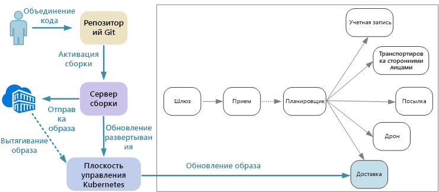
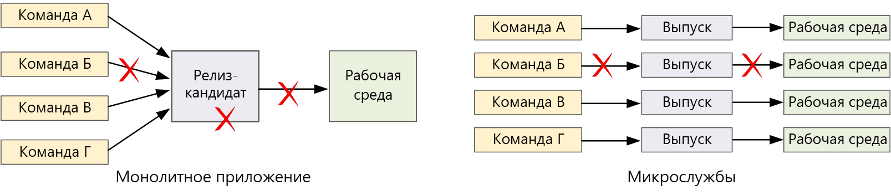

# Разработка микрослужб: непрерывная интеграция

Непрерывная интеграция и непрерывная поставка (CI/CD) являются основным требованием для достижения успеха в работе с микрослужбами. Без хорошо налаженного процесса непрерывной интеграции и поставки невозможно добиться гибкости, которую обеспечивают микрослужбы. При наличии нескольких баз кода и разнородных сред сборки для различных служб возникают определенные проблемы с непрерывной интеграцией и поставкой микрослужб. В этой главе содержится описание проблем и рекомендованные подходы для их решения.

Одной из важнейших причин внедрения архитектуры микрослужб является ускорение жизненного цикла. 

В исключительно монолитном приложении находится один конвейер сборки, выходные данные которого представляют собой исполняемый файл приложения. Все данные разработки поступают в этот конвейер. При обнаружении ошибки с высоким приоритетом необходимо интегрировать, протестировать и опубликовать исправление, из-за чего может быть отложен выпуск новых функций. В действительности этих проблем можно избежать при наличии хорошо организованных модулей и при использовании ветвей компонентов, что помогает свести к минимуму влияние изменений кода. Но так как объем данных приложения со временем увеличивается и оно становится более сложным, а также добавляются дополнительные функции, процесс выпуска для монолитного приложения становится нестабильным и часто нарушается. 

Принципы работы с микрослужбами предусматривают, что цепочка выпуска не может быть длинной, когда каждая команда должна становиться в очередь. Команда, создающая службу "A", может выпустить обновление в любое время, не ожидая объединения, тестирования и развертывания изменений в службе "B". Чтобы это обеспечить, чрезвычайно важно наладить процесс непрерывной интеграции и поставки. Конвейер выпуска должен быть автоматическим и очень надежным, чтобы свести к минимуму риски развертывания обновлений. Если вы выполняете выпуск в рабочую среду каждый день или несколько раз в день, регрессии или перерывы в работе должны возникать очень редко. В то же время в случае развертывания неправильного обновления необходимо располагать надежным способом быстро выполнить откат или накат до предыдущей версии службы.

Когда идет речь о непрерывной интеграции и поставке, имеются в виду несколько связанных процессов: непрерывная интеграция, непрерывная поставка и непрерывное развертывание.

- Непрерывная интеграция подразумевает частое слияние изменений кода с главной ветвью с использованием автоматизированных процессов сборки и тестирования. Благодаря этому код в главной ветви всегда соответствует рабочему уровню.

- Непрерывная поставка означает, что изменения кода, которые прошли процесс непрерывной интеграции, автоматически публикуются в рабочей среде. Для развертывания в рабочей среде может потребоваться утверждение вручную, в противном случае оно выполняется автоматически. В результате этого код всегда будет *готов* к развертыванию в рабочей среде.

- Непрерывное развертывание означает, что изменения кода, прошедшие процесс непрерывной интеграции и поставки, автоматически развертываются в рабочей среде.

В контексте Kubernetes и микрослужб на этапе непрерывной интеграции происходит сборка и тестирование образов контейнеров и помещение этих образов в реестр контейнеров. На этапе развертывания спецификации pod обновляются, чтобы был выбран самый последний образ рабочей среды.

## Сложности

- **Множество небольших независимых баз кода**. Каждая команда отвечает за создание собственной службы со своим собственным конвейером сборки. В некоторых организациях команды могут использовать отдельные репозитории кода. Это может привести к ситуации, когда многие команды знают, как создать систему, но никто в организации не знает, как развернуть все приложение. Например, что происходит в сценарии аварийного восстановления, если необходимо быстро выполнить развертывание в новый кластер?   

- **Множество языков программирования и платформ**. При том, что каждая команда использует свой собственный набор технологий, могут возникнуть сложности в создании процесса сборки, применимого для всей организации. Процесс сборки должен быть достаточно гибким, чтобы любая команда могла использовать его независимо от выбранного языка программирования или платформы. 

- **Интеграция и нагрузочное тестирование**. Так как команды выпускают обновления независимо друг от друга, с разработкой надежного и комплексного тестирования могут возникнуть сложности, особенно если у службы есть зависимости от других служб. Кроме того, запуск полного рабочего кластера может быть дорогостоящим, поэтому маловероятно, что каждая команда сможет запустить весь собственный кластер в производственных масштабах только для тестирования. 

- **Управление выпусками**. Любая команда должна иметь возможность развернуть обновление в рабочей среде. Это не означает, что у каждого участника команды есть на это разрешения. Но при наличии централизованной роли диспетчера выпусков может снизиться скорость развертываний. Чем больше автоматизирован процесс непрерывной интеграции и поставки и чем выше его надежность, тем меньше потребность в центральном администрировании. С другой стороны, могут применяться различные политики для выпуска обновлений основных компонентов и небольших исправлений ошибок. Децентрализация вовсе не подразумевает отсутствие управления.

- **Управление версиями образов контейнеров**. Во время цикла разработки и тестирования процесс непрерывной интеграции и поставки включает в себя сборку многих образов контейнера. Только некоторые из них становятся кандидатами для выпуска, а затем только некоторые из этих релиз-кандидатов помещаются в рабочую среду. Вы должны иметь четкую стратегию управления версиями, чтобы знать, какие образы сейчас развернуты в рабочей среде, и выполнить откат до предыдущей версии при необходимости. 

- **Обновления службы**. Обновление службы до новой версии не должно нарушать работу других служб, зависящих от нее. Если выполняется последовательное обновление, в течение определенного периода времени могут быть запущены несколько версий. 
 
Эти трудности определяют основные противоречия. С одной стороны, командам необходимо работать независимо друг от друга, насколько это возможно. С другой стороны, требуется некоторое координирование, чтобы один человек мог выполнять такие задачи, как запуск интеграционного теста, повторное развертывание всего решения в новый кластер или откат неправильного обновления. 
 
## Подходы непрерывной интеграции и поставки для микрослужб

Каждой группе поддержки рекомендуется выполнить контейнеризацию среды сборки. В этом контейнере должны быть все средства сборки, необходимые для сборки артефактов кода для их службы. Часто вы можете найти официальный образ Docker для вашего языка программирования и платформы. После этого можно воспользоваться `docker run` или Docker Compose для запуска сборки. 

При таком подходе настраивать новую среду сборки совсем несложно. Разработчику, желающему выполнить сборку кода, не нужно устанавливать набор средств сборки. Достаточно лишь запустить образ контейнера. Впрочем, для выполнения этой задачи можно настроить ваш сервер сборки, что гораздо важнее. Таким образом, вам не требуется устанавливать эти средства на сервере сборки или управлять конфликтующими версиями средств. 

При локальной разработке и тестировании используйте Docker для запуска службы внутри контейнера. В рамках этого процесса может потребоваться запустить другие контейнеры, в которых есть службы имитации или тестовые базы данных, необходимые для локального тестирования. Вы можете использовать Docker Compose, чтобы координировать эти контейнеры, либо Minikube, чтобы запустить Kubernetes локально. 

Когда код будет готов, подайте запрос на вытягивание и выполните слияние в главную ветвь. Это запустит на сервере сборки задание:

1. Сборка ресурсов кода. 
2. Выполнение модульных тестов кода.
3. Создание образа контейнера.
4. Проверка образа контейнера путем выполнения функциональных тестов в запущенном контейнере. На этом шаге можно перехватить ошибки в файле Docker, например неправильную точку входа.
5. Отправка образа в реестр контейнеров.
6. Обновление тестового кластера с помощью нового образа для запуска тестов интеграции.

Когда образ будет готов к работе в рабочей среде, обновите файлы развертывания, указав последний образ, включительно с файлами конфигурации Kubernetes. Затем примените обновление в рабочем кластере.

Ниже приведены некоторые рекомендации по повышению надежности развертываний.
 
- Определите действующие для всей организации соглашения для тегов контейнеров, управления версиями и соглашения об именовании ресурсов, развернутых в кластере (модули, службы и т. д.). В результате этого будет легче диагностировать проблемы с развертыванием. 

- Создайте два отдельных реестра контейнеров: один для разработки и тестирования, а другой — для рабочей среды. Не отправляйте образ в реестр рабочей среды, пока не будете готовы к его развертыванию в рабочей среде. При использовании такого подхода с семантическим управлением версиями образов контейнеров можно уменьшить вероятность случайного развертывания версии, не утвержденной для выпуска.

## Обновление служб

Есть различные стратегии обновления службы, которая уже находится в рабочей среде. Здесь рассматриваются три распространенных варианта: последовательное обновление, "сине-зеленое" развертывание и ранний выпуск.

### Последовательное обновление 

В последовательном обновлении развертываются новые экземпляры службы, которые сразу же начинают получать запросы. При появлении новых экземпляров предыдущие экземпляры удаляются.

Последовательное обновление — это поведение по умолчанию в Kubernetes при обновлении спецификации pod для развертывания. Контроллер развертывания создает новый набор реплик для обновленных модулей pod. Затем он масштабирует новый набор реплик, при этом уменьшая масштаб старого набора реплик, чтобы сохранить необходимое количество реплик. Пока не готовы новые модули pod, старые модули не удаляются. Kubernetes сохраняет журнал обновлений, чтобы можно было использовать kubectl для отката обновления при необходимости. 

Если служба выполняет длительную задачу запуска, можно настроить пробу готовности. Проба готовности сообщает, когда контейнер готов к получению трафика. Kubernetes не будет отправлять трафик в модуль pod, пока проба не сообщит об успешном выполнении. 

Одной из проблем последовательного обновления является то, что во время обновления и старая, и новая версии выполняются и получают трафик. В течение этого периода любой запрос может перенаправляться в одну из двух версий. Это может вызвать проблемы в зависимости от масштаба изменений в обеих версиях. 

### "Сине-зеленое" развертывание

При "сине-зеленом" развертывании новая версия развертывается параллельно с предыдущей версией. После проверки новой версии весь трафик сразу же переходит из предыдущей версии в новую. После переключения трафика выполняется мониторинг приложения на наличие проблем. Если что-то пойдет не так, можно вернуться обратно к старой версии. При условии, что проблем нет, старую версию можно удалить.

В более традиционных монолитных или n-уровневых приложениях "сине-зеленое" развертывание обычно подразумевает подготовку двух идентичных сред. Понадобится развернуть новую версию в промежуточной среде, а затем перенаправить трафик клиента в промежуточную среду. Например, путем переключения виртуальных IP-адресов.

В Kubernetes для выполнения "сине-зеленых" развертываний не нужно подготавливать отдельный кластер. Вместо этого можно воспользоваться селекторами. Создайте новый ресурс развертывания с новой спецификацией pod и другим набором меток. Создайте это развертывание, не удаляя предыдущее развертывание и не изменяя службу, которая указывает на него. После запуска новых модулей pod можно обновить селектор службы в соответствии с новым развертыванием. 

Преимущество "сине-зеленого" развертывания состоит в том, что служба выполняет переключение всех модулей pod в одно и то же время. После обновления службы все новые запросы будут направляться в новую версию. Недостатком является то, что во время обновления выполняется в два раза больше модулей pod для службы (текущих и следующих). Если для модулей pod требуется больший объем ресурсов ЦП или памяти, может потребоваться временно развернуть кластер, чтобы справиться с потреблением ресурсов. 

### Ранний выпуск

В раннем выпуске обновленная версия развертывается в небольшое количество клиентов. Затем отслеживается поведение новой службы, прежде чем развернуть ее для всех клиентов. Так вы можете выполнить медленный выпуск контролируемым способом, наблюдать за реальными данными, а также обнаруживать проблемы, прежде чем они затронут всех клиентов.

Ранний выпуск сложнее в управлении, чем "сине-зеленое" развертывание или последовательное обновление, так как необходимо динамически направлять запросы в разные версии службы. В Kubernetes можно настроить службу так, чтобы охватить два набора реплик (по одному для каждой версии) и регулировать счетчики реплики вручную. Тем не менее этот подход не детализирован из-за того, как Kubernetes распределяет нагрузку между модулями pod. Например, при наличии десяти реплик сместить трафик можно только с шагом приращения 10 %. При использовании ПО слоя взаимодействия между службами можно использовать правила маршрутизации для реализации более сложной стратегии раннего выпуска. Ниже приведены некоторые ресурсы, которые могут оказаться полезными:

- Kubernetes без ПО слоя взаимодействия между службами: [Canary deployments](https://kubernetes.io/docs/concepts/cluster-administration/manage-deployment/#canary-deployments) (Ранние развертывания);
- Linkerd: [Dynamic request routing](https://linkerd.io/features/routing/) (Маршрутизация динамических запросов);
- Istio: [Canary Deployments using Istio](https://istio.io/blog/canary-deployments-using-istio.html) (Ранние развертывания с использованием Istio).

## Заключение

В последние годы произошло кардинальное изменение в отрасли: переход от создания *систем записи* до создания *систем взаимодействия*.

Системы записи — это традиционные приложения операционных отделов организации для управления клиентскими данными. В основе этих систем часто лежит реляционная СУБД, которая является единым источником достоверных данных. Термин "система вовлечения, или взаимодействия" ввел Джеффри Мур (Geoffrey Moore) в работе 2011 г. *Systems of Engagement and the Future of Enterprise IT* (Системы взаимодействия и будущее корпоративной ИТ-среды). Системы взаимодействия — это приложения, ориентированные на поддержку связи и совместную работу. Они дают пользователям возможность взаимодействовать в режиме реального времени. Они должны быть доступными круглосуточно. Новые функции вводятся регулярно, при этом приложение не отключается. Пользователи рассчитывают на большее и не допускают непредвиденных задержек или простоев.

На стороне потребителя удобство работы может иметь определенную ценность для бизнеса. От количества времени, которое пользователь работает с приложением, напрямую зависит прибыль компании. И в области бизнес-систем ожидания пользователей изменились. Если эти системы предназначены для высокоэффективного взаимодействия и совместной работы, в них должны быть учтены особенности клиентских приложений.

Микрослужбы являются ответом на этот изменяющийся ландшафт. Разбивая монолитное приложение на группу слабо связанных служб, мы можем управлять циклом выпуска каждой службы и выполнять частые обновления без перерывов в работе и внесения критических изменений. Микрослужбы также гарантируют масштабируемость, изоляцию от сбоев и устойчивость. В то же время облачные платформы упрощают создание и запуск микрослужб с помощью автоматической подготовки вычислительных ресурсов, оркестраторов контейнеров как услуги и управляемых событиями бессерверных сред.

Но, как мы уже увидели, архитектуры микрослужб также таят в себе много проблем. Чтобы добиться успеха, необходимо начать с надежной архитектуры. Следует тщательно проанализировать предметную область, выбрать технологии, моделировать данные, спроектировать API-интерфейсы и создать современную культуру DevOps. Мы надеемся, что это руководство и сопутствующая [эталонная реализация](https://github.com/mspnp/microservices-reference-implementation) помогли пролить свет на ваш вопрос. 

