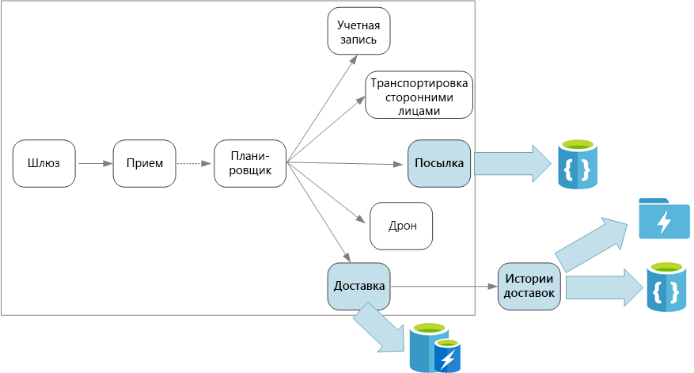

# Проектирование микрослужб: рекомендации по работе с данными

В этой главе содержатся рекомендации по управлению данными в архитектуре микрослужб. Так как каждая микрослужба управляет собственными данными, их обеспечение их целостности и согласованности является критически важной задачей.

Основной принцип работы микрослужб заключается в том, что каждая служба управляет собственными данными. Две службы не могут использовать одно и то же хранилище данных. Наоборот, каждая служба отвечает за собственное хранилище данных, которое напрямую недоступно для других служб.

Это позволяет устранить непреднамеренную взаимозависимость между службами, которая может возникнуть, когда службы совместно используют одни и те же базовые схемы данных. Если в схему данных вносятся изменения, их нужно согласовать в каждой службе, которая зависит от этой базы данных. Изолируя хранилище данных каждой службы, мы можем ограничить область изменений и сохранить гибкость полностью независимых развертываний. Кроме того, у каждой микрослужбы могут быть собственные модели данных, запросы или шаблоны операций чтения и записи. При использовании общего хранилища данных для каждой команды ограничивается возможность оптимизировать хранилище данных для какой-либо службы. 

Следовательно, это предполагает применение подхода [Polyglot Persistence](https://martinfowler.com/bliki/PolyglotPersistence.html), когда в одном приложении используется несколько технологий хранения данных. Для работы одной службы могут требоваться возможности схемы при чтении, свойственные базе данных документов. Для другой — целостность данных, предоставляемая реляционной СУБД. Каждая команда может выбрать подходящий вариант для своей службы. Дополнительные сведения о подходе Polyglot Persistence см. в статье [Использование подходящего хранилища данных для задания](../guide/design-principles/use-the-best-data-store.md). 

> [!NOTE]
> Службы могут использовать один и тот же физический сервер базы данных. Проблема возникает, если службы используют одни и те же схему или набор таблиц базы данных для операций чтения и записи.

## Сложности

Управление данными с применением такого распределенного подхода сопряжено с некоторыми сложностями. Во-первых, данные в хранилищах данных могут стать избыточными (когда один и тот же элемент данных хранится в нескольких расположениях). Например, данные могут храниться как часть транзакции и при этом храниться в других расположениях для анализа, создания отчетов или архивации. Дублированные и секционированные данные могут нарушить целостность и согласованность данных. Если связи между данными охватывают несколько служб, вы не сможете использовать традиционные методы управления данными для реализации этих связей.

В традиционном моделировании данных применяется правило "один факт в одном расположении". Каждая сущность представлена в схеме только один раз. Другие сущности могут ссылаться на нее, но не дублировать. Очевидное преимущество традиционного подхода заключается в том, что обновления выполняются в одном расположении, позволяя избежать проблем с согласованностью данных. Проектируя архитектуру микрослужб, вам следует продумать, как выполнять обновления в нескольких службах и управлять итоговой согласованностью, если данные хранятся в нескольких расположениях без строгой согласованности. 

## Подходы к управлению данными

Универсального подхода, который будет приемлемым во всех сценариях, нет. Но ниже приведены некоторые общие рекомендации по управлению данными в архитектуре микрослужб.

- Применяйте итоговую согласованность, где это возможно. Определите, где в системе требуется строгая согласованность или транзакции ACID, а где — окончательная согласованность.

- Если требуется обеспечить строгую согласованность, одна служба может представлять источник истины для определенной сущности, который предоставляется через API. Другие службы могут содержать собственную копию данных или набор данных, которые в итоге согласовываются с основными данными, но не считаются источником истины. Например, представьте систему электронной коммерции со службой для обработки заказов клиента и службой рекомендации. Служба рекомендаций может прослушивать события из службы обработки заказов, но в ситуациях, когда клиент запрашивает возмещение, полный журнал транзакций хранится в службе заказов, а не службе рекомендаций.

- Для транзакций используйте такие шаблоны, как [Планировщик, агент, контролер](../patterns/scheduler-agent-supervisor.md) и [Компенсирующие транзакции](../patterns/compensating-transaction.md), чтобы обеспечить согласованность данных в нескольких службах.  Возможно, потребуется хранить дополнительный фрагмент данных, в котором записано состояние единицы работы, охватывающей несколько служб, чтобы избежать частичного сбоя между этими службами. Например, оставьте рабочий элемент в долгосрочной очереди, пока осуществляется многоэтапная транзакция. 

- Храните только данные, которые требуются службе. Службе может потребоваться только набор данных о сущности домена. Например, в ограниченном контексте доставки нужно знать, какой клиент связан с определенной доставкой. Но нам не требуется адрес клиента для выставления счета, который управляется в ограниченном контексте счетов. Здесь поможет тщательный анализ и использование разработки на основе домена (DDD). 

- Подумайте, являются ли службы согласованными и слабо связанными. Если две службы постоянно обмениваются данными, в результате чего через API-интерфейсы проходят множественные операции, потребуется изменить границы служб, объединив эти службы или выполнив рефакторинг их функций.

- Используйте [стиль архитектуры, управляемой событиями](../guide/architecture-styles/event-driven.md). В рамках этого подхода служба публикует событие, если изменяются ее общедоступные модели или сущности. Заинтересованные службы можно подписать на эти события. Например, другая служба может использовать эти события для создания материализованного представления данных, которое больше подходит для запросов. 

- Служба, которой принадлежат события, должна опубликовать схему, с помощью которой можно автоматизировать сериализацию и десериализацию событий, чтобы избежать тесной взаимозависимости между издателями и подписчиками. Используйте схему JSON для таких платформ, как [Microsoft Bond](https://github.com/Microsoft/bond), Protobuf или Avro.  
 
- При больших масштабах события могут вызывать проблемы на уровне системы, поэтому рекомендуется использовать агрегирование или пакетную обработку, чтобы уменьшить общую нагрузку. 

## Доставка беспилотными летательными аппаратами: выбор хранилища данных 

Пример ограниченного контекста доставки даже с несколькими службами иллюстрирует некоторые моменты, рассматриваемые в этом разделе. 

Когда пользователь планирует новую доставку, запрос клиента содержит сведения о доставке, например пункт выдачи заказа и конечный пункт доставки, а также о посылке, например размер и вес. Эта информация определяет единицу работы, которую служба приема событий отправляет в концентраторы событий. Важно, чтобы единица работы оставалась в постоянном хранилище, когда служба планировщика выполняет рабочий процесс. Так запросы на доставку не будут утеряны. Подробное описание рабочего процесса см. в статье [Проектирование микрослужб: прием данных и рабочий процесс](./ingestion-workflow.md). 

Разные серверные службы отвечают за разные блоки информации в запросе и также имеют разные профили чтения и записи. 

### Служба доставки

В службе доставки хранится информация о каждой запланированной или выполняемой доставке. Эта служба прослушивает события, передаваемые от беспилотных летательных аппаратов, и отслеживает состояние выполняемых доставок. Служба также отправляет события домена с обновлениями состояния доставки.

Ожидается, что пользователи будут часто проверять состояние доставки, пока они ожидают свою посылку. Поэтому для службы доставки требуется такое хранилище данных, в котором преимущество отдается пропускной способности (чтение и запись) при долговременном хранении данных. Кроме того, служба доставки не выполняет сложные запросы или операции анализа. Она просто получает данные о последнем состоянии определенной доставки. Команда разработчиков службы доставки выбрала кэш Redis для Azure, чтобы обеспечить высокий уровень производительности операций чтения и записи. В кэше Redis хранится информация с коротким сроком хранения. После выполнения доставки в качестве системы записи используется служба истории доставок.

### Служба истории доставок

Служба истории доставок прослушивает события состояния доставки, передаваемые от службы доставки. Она сохраняет эти данные в долговременном хранилище. Есть два варианта использования этих исторических данных, которые имеют разные требования к хранилищу данных. 

В первом сценарии данные агрегируются для анализа, чтобы оптимизировать бизнес или улучшить качество услуг. Важно отметить, что служба истории доставок не осуществляет фактический анализ данных. Она отвечает только за прием и хранение. В этом сценарии нужно оптимизировать хранилище для анализа большого набора данных, используя подход схемы при чтении для размещения различных источников данных. [Azure Data Lake Store](/azure/data-lake-store/) отлично подходит для этого сценария. Data Lake Store имеет файловую систему Apache Hadoop, которая совместима с распределенной файловой системой Hadoop и адаптирована к различным сценариям анализа данных. 

Во втором сценарии пользователи могут просмотреть историю завершенной доставки. Azure Data Lake не очень подходит для этого сценария. Для достижения оптимальной производительности рекомендуется хранить данные временных рядов в Data Lake в папках, секционированных по датам. Дополнительные сведения см. в статье [Настройка Azure Data Lake Store для повышения производительности](/azure/data-lake-store/data-lake-store-performance-tuning-guidance). Но такая структура не подходит для поиска отдельных записей по идентификатору. Если метка времени неизвестна, для поиска по идентификатору требуется проверить всю коллекцию. Таким образом, служба истории доставок также содержит набор исторических данных в Cosmos DB для ускоренного поиска. Записи не должны все время храниться в Cosmos DB. Старые записи можно архивировать, например через месяц. Это можно сделать, запуская нерегулярную пакетную обработку.

### Служба посылок

В службе посылок хранится информация о всех посылках. Требования к хранилищу данных для этой службы: 

- долговременное хранение;
- возможность обрабатывать большое количество пакетов, для чего требуется высокая пропускная способность операций записи;
- поддержка простых запросов по идентификатору посылки; отсутствие сложных соединений и требований для обеспечения целостности данных.

Так как данные о посылках не являются реляционными, можно использовать базу данных для хранения документов. Тогда Cosmos DB сможет достичь высокой пропускной способности с использованием сегментированных коллекций. Команда, которая работает со службой посылок, знакома со стеком MEAN (MongoDB, Express.js, AngularJS и Node.js.), поэтому она выбрала [MongoDB API](/azure/cosmos-db/mongodb-introduction) для Cosmos DB. Это позволит ей эффективно применить свой опыт работы с MongoDB и воспользоваться преимуществами Cosmos DB, управляемой службой Azure.

> [!div class="nextstepaction"]
> [Обмен данными между службами](./interservice-communication.md)