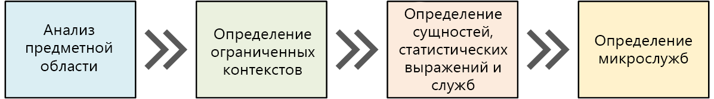
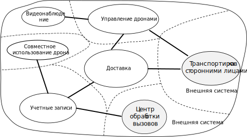
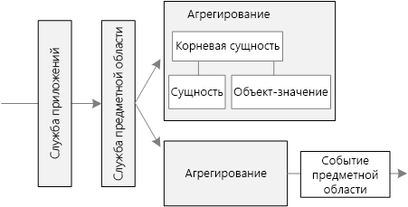
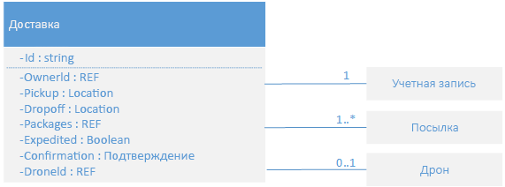
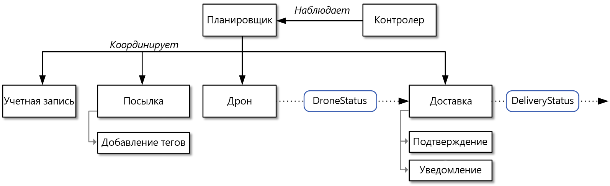

# Проектирование микрослужб: анализ предметной областиDesigning microservices: Domain analysis 

Одной из основных проблем, связанных с микрослужбами, является определение границ отдельных служб.One of the biggest challenges of microservices is to define the boundaries of individual services. Общее правило состоит в том, что служба должна выполнять что-то одно, но правильное применение этого правила требует тщательного планирования.The general rule is that a service should do "one thing" &mdash; but putting that rule into practice requires careful thought. Механического процесса, создающего "правильную" структуру, не существует.There is no mechanical process that will produce the "right" design. Необходимо подробно рассмотреть предметную отрасль, требования и цели вашего бизнеса.You have to think deeply about your business domain, requirements, and goals. В противном случае можно столкнуться с непродуманной структурой, в которой есть некоторые нежелательные характеристики, такие как скрытые зависимости между службами, тесная взаимозависимость или плохо разработанные интерфейсы.Otherwise, you can end up with a haphazard design that exhibits some undesirable characteristics, such as hidden dependencies between services, tight coupling, or poorly designed interfaces. В этой главе рассматривается проектирование микрослужб с использованием предметно-ориентированного подхода.In this chapter, we take a domain-driven approach to designing microservices. 

Микрослужбы нужно разрабатывать с учетом бизнес-возможностей, а не горизонтальных слоев, таких как доступ к данным или обмен сообщениями.Microservices should be designed around business capabilities, not horizontal layers such as data access or messaging. Кроме того, службы должны иметь слабую взаимозависимость и высокую функциональную слаженность.In addition, they should have loose coupling and high functional cohesion. Микрослужбы *имеют слабую взаимозависимость*, если можно изменить одну службу без необходимости одновременного обновления других служб.Microservices are *loosely coupled* if you can change one service without requiring other services to be updated at the same time. Микрослужба считается *слаженной*, если у нее есть одна определенная цель, например управление учетными записями пользователей или отслеживание истории поставок.A microservice is *cohesive* if it has a single, well-defined purpose, such as managing user accounts or tracking delivery history. Служба должна содержать знания о предметной области и отделять эти знания от клиентов.A service should encapsulate domain knowledge and abstract that knowledge from clients. Например, клиент должен иметь возможность запланировать полет дрона, не зная подробностей алгоритма планирования или управления парком дронов.For example, a client should be able to schedule a drone without knowing the details of the scheduling algorithm or how the drone fleet is managed.

Предметно-ориентированное проектирование (DDD) предоставляет платформу, которая может помочь в разработке набора хорошо продуманных микрослужб.Domain-driven design (DDD) provides a framework that can get you most of the way to a set of well-designed microservices. Этот алгоритм имеет два отдельных этапа: стратегический и тактический.DDD has two distinct phases, strategic and tactical. На стратегическом этапе определяется масштабная структура системы.In strategic DDD, you are defining the large-scale structure of the system. Этот этап помогает гарантировать, что архитектура ориентирована на бизнес-возможности.Strategic DDD helps to ensure that your architecture remains focused on business capabilities. Тактический этап предоставляет набор конструктивных шаблонов, которые можно использовать для создания модели предметной области.Tactical DDD provides a set of design patterns that you can use to create the domain model. Эти шаблоны включают в себя сущности, статистические выражения и службы предметных областей.These patterns include entities, aggregates, and domain services. Эти тактические шаблоны помогают создавать микрослужбы, имеющие слабую взаимозависимость и хорошую слаженность.These tactical patterns will help you to design microservices that are both loosely coupled and cohesive.

В этой и следующей главах мы рассмотрим приведенные ниже шаги, применяя их к приложению доставки с помощью дронов:In this chapter and the next, we'll walk through the following steps, applying them to the Drone Delivery application: 

1. Начните с анализа предметной области бизнеса, чтобы разобраться в функциональных требованиях приложения.Start by analyzing the business domain to understand the application's functional requirements. В результате вы получите неформальное описание предметной области, которое можно разделить на более формальный набор моделей предметных областей.The output of this step is an informal description of the domain, which can be refined into a more formal set of domain models. 

2. Затем определите *ограниченные контексты* предметной области.Next, define the *bounded contexts* of the domain. Каждый ограниченный контекст содержит модель предметной области, которая представляет определенную подобласть крупного приложения.Each bounded context contains a domain model that represents a particular subdomain of the larger application. 

3. В рамках ограниченного контекста примените тактические шаблоны DDD, чтобы определить сущности, статистические выражения и службы предметных областей.Within a bounded context, apply tactical DDD patterns to define entities, aggregates, and domain services. 
 
4. На основе результатов предыдущего шага идентифицируйте микрослужбы в своем приложении.Use the results from the previous step to identify the microservices in your application.

В этой главе мы рассмотрим первые три шага, которые в первую очередь касаются предметно-ориентированного проектирования.In this chapter, we cover the first three steps, which are primarily concerned with DDD. В следующей главе мы определим микрослужбы.In the next chapter, we will identify the microservices. Важно помнить, что предметно-ориентированное проектирование — это итеративный текущий процесс.However, it's important to remember that DDD is an iterative, ongoing process. Ограничения службы не зафиксированы.Service boundaries aren't fixed in stone. По мере развития приложения можно разбить службу на несколько небольших служб.As an application evolves, you may decide to break apart a service into several smaller services.

> [!NOTE]
> Эта глава не предназначена для демонстрации полного и исчерпывающего анализа предметной области.This chapter is not meant to show a complete and comprehensive domain analysis. Мы намеренно приводим небольшой пример, чтобы продемонстрировать основные аспекты.We deliberately kept the example brief, in order to illustrate the main points. Общие сведения о проблемно-ориентированном проектировании можно найти в *одноименной книге* Эрика Эванса (Eric Evans), в которой был впервые представлен этот термин.For more background on DDD, we recommend Eric Evans' *Domain-Driven Design*, the book that first introduced the term. Другим хорошим справочником является книга Вона Вернона (Vaughn Vernon) *Реализация методов предметно-ориентированного проектирования*.Another good reference is *Implementing Domain-Driven Design* by Vaughn Vernon. 

## Анализ предметной областиAnalyze the domain

Используя подход DDD, можно создавать микрослужбы так, чтобы каждая форма службы естественным образом совпадала с функциональным бизнес-требованием.Using a DDD approach will help you to design microservices so that every service forms a natural fit to a functional business requirement. Так вы сможете избежать ловушки, когда ограничения организации или технологии будут определять структуру.It can help you to avoid the trap of letting organizational boundaries or technology choices dictate your design.

Прежде чем написать код, необходимо иметь общее представление о создаваемой системе.Before writing any code, you need a bird's eye view of the system that you are creating. DDD начинается с моделирования предметной области бизнеса и создания *ее модели*.DDD starts by modeling the business domain and creating a *domain model*. Модель предметной области является абстрактной моделью предметной области бизнеса.The domain model is an abstract model of the business domain. Она извлекает и организует знания о предметной области, а также предоставляет общий язык для разработчиков и экспертов соответствующей сферы.It distills and organizes domain knowledge, and provides a common language for developers and domain experts. 

Начните с составления схемы всех бизнес-функций и их связей.Start by mapping all of the business functions and their connections. Это совместный процесс, в котором участвуют эксперты в соответствующей сфере, архитекторы ПО и другие заинтересованные лица.This will likely be a collaborative effort that involves domain experts, software architects, and other stakeholders. Какой-либо конкретный формализм использовать необязательно.You don't need to use any particular formalism.  Нарисуйте схему на бумаге или доске.Sketch a diagram or draw on whiteboard.

Создавая схему, можно начать определять дискретные подобласти.As you fill in the diagram, you may start to identify discrete subdomains. Какие функции тесно связаны?Which functions are closely related? Какие функции являются основными для бизнеса, а какие предоставляют вспомогательные службы?Which functions are core to the business, and which provide ancillary services? Что такое схема зависимостей?What is the dependency graph? На начальном этапе технологии и подробности реализации не важны.During this initial phase, you aren't concerned with technologies or implementation details. Все же следует отметить место, где приложение нужно будет интегрировать с внешними системами, такими как CRM, система обработки оплаты или выставления счетов.That said, you should note the place where the application will need to integrate with external systems, such as CRM, payment processing, or billing systems. 

## Доставка с помощью дронов: анализ предметной области бизнесаDrone Delivery: Analyzing the business domain.

После первоначального анализа предметной области команда Fabrikam создала приблизительный эскиз, представляющий предметную область "Доставка с помощью дронов".After some initial domain analysis, the Fabrikam team came up with a rough sketch that depicts the Drone Delivery domain.

 

- Функция **Доставка** размещается в центре схемы, так как она является основной для бизнеса.**Shipping** is placed in the center of the diagram, because it's core to the business. Все остальное в схеме предназначено для обеспечения этой функции.Everything else in the diagram exists to enable this functionality.
- **Управление дронами** также является ключевой бизнес-функцией.**Drone management** is also core to the business. Функция, которая тесно связана с управлением дронами, включает **их ремонт** и использование **прогнозного анализа** для прогнозирования, когда дроны нуждаются в обслуживании.Functionality that is closely related to drone management includes **drone repair** and using **predictive analysis** to predict when drones need servicing and maintenance. 
- **Анализ ETA** предоставляет оценки времени приема и доставки.**ETA analysis** provides time estimates for pickup and delivery. 
- **Транспортировка сторонними лицами** позволяет приложению планировать другие способы транспортировки, если груз невозможно полностью отправить с помощью дрона.**Third-party transportation** will enable the application to schedule alternative transportation methods if a package cannot be shipped entirely by drone.
- **Совместное использование дрона** является возможным расширением основной бизнес-функции.**Drone sharing** is a possible extension of the core business. В определенные часы у компании может быть избыточное количество дронов, которые можно сдавать в аренду, чтобы они не простаивали.The company may have excess drone capacity during certain hours, and could rent out drones that would otherwise be idle. Этой возможности не будет в первоначальной версии.This feature will not be in the initial release.
- **Видеонаблюдение** является еще одной областью расширения деятельности для компании.**Video surveillance** is another area that the company might expand into later.
- **Учетные записи пользователей**, **Выставление счетов** и **Центр обработки вызовов** — это подобласти, используемые для поддержки основных бизнес-процессов.**User accounts**, **Invoicing**, and **Call center** are subdomains that support the core business.
 
Обратите внимание, что на этом этапе никаких решений о реализации и технологиях не принималось.Notice that at this point in the process, we haven't made any decisions about implementation or technologies. Некоторые из подсистем могут включать внешние программные системы или сторонние службы.Some of the subsystems may involve external software systems or third-party services. Тем не менее приложению необходимо взаимодействовать с этими системами и службами, поэтому важно включить их в модель предметной области.Even so, the application needs to interact with these systems and services, so it's important to include them in the domain model. 

> [!NOTE]
> Если приложение зависит от внешней системы, есть риск, что может произойти утечка схемы данных внешней системы или API в приложение, что может скомпрометировать архитектурный проект.When an application depends on an external system, there is a risk that the external system's data schema or API will leak into your application, ultimately compromising the architectural design. Это особенно верно в отношении устаревших систем, которые могут не следовать современным рекомендациям и могут использовать сложные схемы данных или устаревшие API.This is particularly true with legacy systems that may not follow modern best practices, and may use convoluted data schemas or obsolete APIs. В этом случае важно иметь четко определенную границу между внешними системами и приложением.In that case, it's important to have a well-defined boundary between these external systems and the application. Рассмотрите возможность использования [шаблона подавления](../patterns/strangler.md) или [шаблона уровня защиты от повреждений](../patterns/anti-corruption-layer.md) для этой цели.Consider using the [Strangler Pattern](../patterns/strangler.md) or the [Anti-Corruption Layer Pattern](../patterns/anti-corruption-layer.md) for this purpose.

## Определение ограниченных контекстовDefine bounded contexts

Модель предметной области включает представления реальных вещей &mdash; пользователей, дронов, грузов и т. д.The domain model will include representations of real things in the world &mdash; users, drones, packages, and so forth. Однако это не значит, что каждая часть системы должна использовать одни и те же представления для одних и тех же вещей.But that doesn't mean that every part of the system needs to use the same representations for the same things. 

Например, подсистемы, обрабатывающие ремонт дронов и прогнозную аналитику, должны представлять множество физических характеристик дронов, таких как история обслуживания, пробег, срок службы, номер модели, характеристики работы и т. д.For example, subsystems that handle drone repair and predictive analysis will need to represent many physical characteristics drones, such as their maintenance history, mileage, age, model number, performance characteristics, and so on. Однако при планировании доставки это нам неинтересно.But when it's time to schedule a delivery, we don't care about those things. Подсистеме планирования необходимо знать, доступен ли дрон, а также предполагаемое время для приема и доставки (ETA).The scheduling subsystem only needs to know whether a drone is available, and the ETA for pickup and delivery. 

Если бы мы попытались создать единую модель для обеих этих подсистем, это было бы излишне сложным.If we tried to create a single model for both of these subsystems, it would be unnecessarily complex. С течением времени модель будет все сложнее видоизменять, так как любые изменения должны будут удовлетворять несколько команд, работающих над отдельными подсистемами.It would also become harder for the model to evolve over time, because any changes will need to satisfy multiple teams working on separate subsystems. Поэтому зачастую лучше разрабатывать отдельные модели, которые представляют один и тот же объект реального мира (в данном случае дрон) в двух разных контекстах.Therefore, it's often better to design separate models that represent the same real-world entity (in this case, a drone) in two different contexts. Каждая модель содержит только те функции и атрибуты, которые имеют отношение к конкретному контексту.Each model contains only the features and attributes that are relevant within its particular context.

Именно здесь вступает в действие концепция *ограниченных контекстов*, существующая в рамках предметно-ориентированного проектирования.This is where the DDD concept of *bounded contexts* comes into play. Ограниченный контекст — это просто граница внутри предметной области, где применяется конкретная модель предметной области.A bounded context is simply the boundary within a domain where a particular domain model applies. Рассматривая предыдущую схему, можно группировать функции в зависимости от того, будут ли различные функции использовать одну модель предметной области.Looking at the previous diagram, we can group functionality according to whether various functions will share a single domain model. 

 
 
Ограниченные контексты не обязательно изолировать друг от друга.Bounded contexts are not necessarily isolated from one another. На этой схеме сплошные линии, соединяющие ограниченные контексты, представляют места, где взаимодействуют два ограниченных контекста.In this diagram, the solid lines connecting the bounded contexts represent places where two bounded contexts interact. Например, область "Доставка" зависит от области "Учетные записи пользователей" для получения информации о клиентах и от области "Управление дронами" для планирования полетов отдельных дронов.For example, Shipping depends on User Accounts to get information about customers, and on Drone Management to schedule drones from the fleet.

В книге *Проблемно-ориентированное проектирование* Эрик Эванс описывает шаблоны по поддержке целостности модели предметной области при взаимодействии с другим ограниченным контекстом.In the book *Domain Driven Design*, Eric Evans describes several patterns for maintaining the integrity of a domain model when it interacts with another bounded context. Одним из основных принципов микрослужб является то, что службы обмениваются данными через четко определенные API.One of the main principles of microservices is that services communicate through well-defined APIs. Этот подход соответствует двум шаблонам, которые Эванс называет открытой службой размещения и опубликованным языком.This approach corresponds to two patterns that Evans calls Open Host Service and Published Language. Идея открытой службы размещения заключается в том, что подсистема определяет формальный протокол (API), через который другие подсистемы могут взаимодействовать с ней.The idea of Open Host Service is that a subsystem defines a formal protocol (API) for other subsystems to communicate with it. Опубликованный язык расширяет эту идею, публикуя API в форме, которую другие команды могут использовать для написания клиентов.Published Language extends this idea by publishing the API in a form that other teams can use to write clients. В главе, посвященной [созданию API](./api-design.md), мы обсудим использование [спецификации OpenAPI](https://www.openapis.org/specification/repo) (ранее известной как Swagger) для определения описаний зависящего от языка интерфейса для REST API, выраженных в формате JSON или YAML.In the chapter on [API Design](./api-design.md), we discuss using [OpenAPI Specification](https://www.openapis.org/specification/repo) (formerly known as Swagger) to define language-agnostic interface descriptions for REST APIs, expressed in JSON or YAML format.

В оставшейся части этого руководства мы сконцентрируемся на ограниченном контексте доставки.For the rest of this journey, we will focus on the Shipping bounded context. 

## Тактическое предметно-ориентированное проектированиеTactical DDD

На стратегическом этапе предметно-ориентированного проектирования составляется схема предметной области бизнеса и определяются ограниченные контексты для модели предметной области.During the strategic phase of DDD, you are mapping out the business domain and defining bounded contexts for your domain models. На тактическом этапе модели предметной области определяются с более высокой точностью.Tactical DDD is when you define your domain models with more precision. Тактические шаблоны применяются в рамках одного ограниченного контекста.The tactical patterns are applied within a single bounded context. В архитектуре микрослужб нас особенно интересуют шаблоны статистических выражений и сущностей.In a microservices architecture, we are particularly interested in the entity and aggregate patterns. Применение этих шаблонов помогает определить естественные границы служб в приложении (см. в [следующей главе](./microservice-boundaries.md)).Applying these patterns will help us to identify natural boundaries for the services in our application (see [next chapter](./microservice-boundaries.md)). Как правило, микрослужба должна быть не меньше статистического выражения и не больше ограниченного контекста.As a general principle, a microservice should be no smaller than an aggregate, and no larger than a bounded context. Сначала рассмотрим тактические шаблоны.First, we'll review the tactical patterns. Затем мы применим их к ограниченному контексту доставки в приложении доставки с помощью дронов.Then we'll apply them to the Shipping bounded context in the Drone Delivery application. 

### Общие сведения о тактических шаблонахOverview of the tactical patterns

Этот раздел содержит краткую сводку тактических шаблонов DDD. Так что, если вы уже знакомы с ними, можете переходить к следующему разделу.This section provides a brief summary of the tactical DDD patterns, so if you are already familiar with DDD, you can probably skip this section. Более подробно шаблоны описаны в главах 5&ndash;6 книги Эрика Эванса и в книге Вона Вернона *Реализация методов предметно-ориентированного проектирования*.The patterns are described in more detail in chapters 5 &ndash; 6 of Eric Evans' book, and in *Implementing Domain-Driven Design* by Vaughn Vernon. 

**Сущности**.**Entities**. Сущность представляет собой объект с уникальным идентификатором, который сохраняется с течением времени.An entity is an object with a unique identity that persists over time. Например, в банковском приложении клиенты и учетные записи выступают сущностями.For example, in a banking application, customers and accounts would be entities. 

- У сущности в системе есть уникальный идентификатор, который может использоваться для поиска или извлечения объекта.An entity has a unique identifier in the system, which can be used to look up or retrieve the entity. Это не означает, что идентификатор всегда предоставляется пользователям напрямую.That doesn't mean the identifier is always exposed directly to users. Это может быть GUID или первичный ключ в базе данных.It could be a GUID or a primary key in a database. 
- Идентификатор может охватывать несколько ограниченных контекстов. Срок его действия может превышать время существования приложения.An identity may span multiple bounded contexts, and may endure beyond the lifetime of the application. Например, номера банковских счетов или идентификаторы, выданные правительством, не привязаны к времени существования конкретного приложения.For example, bank account numbers or government-issued IDs are not tied to the lifetime of a particular application.
- Атрибуты сущности могут изменяться со временем.The attributes of an entity may change over time. Например, имя или адрес пользователя могут измениться, но сущность останется одной и той же.For example, a person's name or address might change, but they are still the same person. 
- Сущность может содержать ссылки на другие сущности.An entity can hold references to other entities.
 
**Объекты-значения**.**Value objects**. Объект-значение не имеет идентификатора.A value object has no identity. Он определяется только значениями его атрибутов.It is defined only by the values of its attributes. Объекты-значения также являются неизменяемыми.Value objects are also immutable. Чтобы обновить объект-значение, всегда создавайте новый экземпляр для замены старого.To update a value object, you always create a new instance to replace the old one. Объекты-значения могут иметь методы, которые внедряют логику предметной области, но эти методы не должны иметь побочных эффектов для состояния объекта.Value objects can have methods that encapsulate domain logic, but those methods should have no side-effects on the object's state. К самым распространенным примерам объектов-значений относятся цвета, даты и время, а также значения валюты.Typical examples of value objects include colors, dates and times, and currency values. 

**Статистические выражения**.**Aggregates**. Статистическое выражение определяет границу согласованности одной или нескольких сущностей.An aggregate defines a consistency boundary around one or more entities. Одна сущность в статистическом выражении является корневой.Exactly one entity in an aggregate is the root. Поиск выполняется по идентификатору корневой сущности.Lookup is done using the root entity's identifier. Любые другие сущности в статистическом выражении являются дочерними элементами корневой сущности, на которые ссылаются следующие указатели корневой сущности.Any other entities in the aggregate are children of the root, and are referenced by following pointers from the root. 

Статистические выражения предназначены для моделирования транзакционных инвариантов.The purpose of an aggregate is to model transactional invariants. Вещи в реальном мире имеют сложные сети связей.Things in the real world have complex webs of relationships. Клиенты размещают заказы, заказы содержат продукты, продукты поставляются поставщиками и т. д.Customers create orders, orders contain products, products have suppliers, and so on. Если приложение изменяет несколько связанных объектов, как оно гарантирует согласованность?If the application modifies several related objects, how does it guarantee consistency? Как отслеживать инварианты и применять их?How do we keep track of invariants and enforce them?  

Традиционные приложения часто используют транзакции базы данных для обеспечения согласованности.Traditional applications have often used database transactions to enforce consistency. Однако в распределенном приложении это, как правило, нецелесообразно.In a distributed application, however, that's often not feasible. Одна бизнес-транзакция может охватывать несколько хранилищ данных, долго выполняться или включать сторонние службы.A single business transaction may span multiple data stores, or may be long running, or may involve third-party services. В конечном итоге обеспечение требуемых для предметной области инвариантов зависит от приложения, а не от уровня данных.Ultimately it's up to the application, not the data layer, to enforce the invariants required for the domain. Вот что должны моделировать статистические выражения.That's what aggregates are meant to model.

> [!NOTE]
> Статистическое выражение может состоять из одной сущности без каких-либо дочерних сущностей.An aggregate might consist of a single entity, without child entities. Этот объект является статистическим выражением благодаря транзакционной границе.What makes it an aggregate is the transactional boundary.

**Службы предметных областей и службы приложений**.**Domain and application services**. В терминологии DDD служба является объектом, который реализует логику без удержания какого-либо состояния.In DDD terminology, a service is an object that implements some logic without holding any state. Эванс различает *службы предметных областей*, которые содержат логику предметной области, и *службы приложений*, которые предоставляют технические функциональные возможности, такие как проверка подлинности пользователя или отправка текстового сообщения.Evans distinguishes between *domain services*, which encapsulate domain logic, and *application services*, which provide technical functionality, such as user authentication or sending an SMS message. Службы предметных областей часто используются для моделирования реакции на событие, охватывающей несколько сущностей.Domain services are often used to model behavior that spans multiple entities. 

> [!NOTE]
> Термин *служба* перегружен в разработке программного обеспечения.The term *service* is overloaded in software development. Приведенное здесь определение не связано непосредственно с микрослужбами.The definition here is not directly related to microservices.

**События предметной области**.**Domain events**. События предметной области могут использоваться для уведомления других частей системы, когда происходит событие.Domain events can be used to notify other parts of the system when something happens. Как следует из названия, события предметной области должны означать что-то внутри предметной области.As the name suggests, domain events should mean something within the domain. Например, "в таблицу вставлена запись" не является событием предметной области.For example, "a record was inserted into a table" is not a domain event. "Доставка отменена" — пример события предметной области."A delivery was cancelled" is a domain event. События предметной области особенно важны в архитектуре микрослужб.Domain events are especially relevant in a microservices architecture. Так как микрослужбы распределены и не имеют общих хранилищ данных, события предметной области предоставляют микрослужбам способ координации друг с другом.Because microservices are distributed and don't share data stores, domain events provide a way for microservices to coordinate with each other. В главе об [обмене данными между службами](./interservice-communication.md) более подробно рассматривается асинхронный обмен сообщениями.The chapter [Interservice communication](./interservice-communication.md) discusses asynchronous messaging in more detail.
 
Есть также несколько других шаблонов DDD, которые не перечислены здесь, включая фабрики, репозитории и модули.There are a few other DDD patterns not listed here, including factories, repositories, and modules. Эти шаблоны могут быть полезны при реализации микрослужбы, однако они менее актуальны при разработке границ между микрослужбами.These can be useful patterns for when you are implementing a microservice, but they are less relevant when designing the boundaries between microservice.

## Доставка с помощью дронов: применение шаблоновDrone delivery: Applying the patterns

Мы начнем со сценариев, которые должен обрабатывать ограниченный контекст доставки.We start with the scenarios that the Shipping bounded context must handle.

- Клиент может запросить дрон, чтобы быстро принять товар у компании, зарегистрированной в службе доставки с помощью дронов.A customer can request a drone to pick up goods from a business that is registered with the drone delivery service.
- Отправитель создает тег (штрихкод или RFID) для размещения на грузе.The sender generates a tag (barcode or RFID) to put on the package. 
- Дрон примет и доставит груз из исходного расположения в целевое.A drone will pick up and deliver a package from the source location to the destination location.
- Когда клиент планирует доставку, система выдает предполагаемое время приема и доставки на основе информации о маршруте, погодных условиях и исторических данных.When a customer schedules a delivery, the system provides an ETA based on route information, weather conditions, and historical data. 
- Когда дрон в пути, пользователь может отслеживать его расположение и последнее ETA.When the drone is in flight, a user can track the current location and the latest ETA. 
- Пока дрон не получил груз, клиент может отменить доставку.Until a drone has picked up the package, the customer can cancel a delivery.
- Клиент уведомляется о завершении доставки.The customer is notified when the delivery is completed.
- Отправитель может запросить подтверждение от клиента в форме подписи или отпечатка пальца.The sender can request delivery confirmation from the customer, in the form of a signature or finger print.
- Пользователи могут просмотреть историю завершенной доставки.Users can look up the history of a completed delivery.

В этих сценариях команды разработки определили следующие **сущности**:From these scenarios, the development team identified the following **entities**.

- доставка;Delivery
- PackagePackage
- дрон;Drone
- Учетная запись.Account
- ПодтверждениеConfirmation
- УведомлениеNotification
- ТегTag

Первые четыре сущности (доставка, груз, дрон и учетная запись) являются **статистическими выражениями**, которые представляют границы согласованности транзакций.The first four, Delivery, Package, Drone, and Account, are all **aggregates** that represent transactional consistency boundaries. Подтверждения и уведомления являются дочерними сущностями доставки, а теги — дочерними сущностями грузов.Confirmations and Notifications are child entities of Deliveries, and Tags are child entities of Packages. 

**Объекты-значения** в этом проекте включают расположение, ETA, вес и размер груза.The **value objects** in this design include Location, ETA, PackageWeight, and PackageSize. 

Для демонстрации ниже приведена схема UML статистического выражения доставки.To illustrate, here is a UML diagram of the Delivery aggregate. Обратите внимание, что оно содержит ссылки на другие статистические выражения, включая учетную запись, груз и дрон.Notice that it holds references to other aggregates, including Account, Package, and Drone.

Есть два события предметной области:There are two domain events:

- когда дрон выполняет доставку, одноименная сущность отправляет события DroneStatus (состояние дрона), которые описывают его расположение и состояние (в пути, приземлился);While a drone is in flight, the Drone entity sends DroneStatus events that describe the drone's location and status (in-flight, landed).

- сущность доставки отправляет события DeliveryTracking при каждом изменении этапа доставки.The Delivery entity sends DeliveryTracking events whenever the stage of a delivery changes. К ним относятся DeliveryCreated (доставка создана), DeliveryRescheduled (доставка перепланирована), DeliveryHeadedToDropoff (груз направляется в конечный пункт) и DeliveryCompleted (доставка завершена).These include DeliveryCreated, DeliveryRescheduled, DeliveryHeadedToDropoff, and DeliveryCompleted. 

Обратите внимание, что эти события описывают вещи, которые важны в модели предметной области.Notice that these events describe things that are meaningful within the domain model. Они описывают что-то о предметной области и не привязаны к конкретной конструкции языка программирования.They describe something about the domain, and aren't tied to a particular programming language construct.

Команда разработчиков определила еще одну область функций, которая не соответствует полностью ни одной из уже описанных сущностей.The development team identified one more area of functionality, which doesn't fit neatly into any of the entities described so far. Некоторая часть системы должна координировать все шаги, связанные с планированием или обновлением доставки.Some part of the system must coordinate all of the steps involved in scheduling or updating a delivery. Таким образом, команда разработчиков добавляет две **службы предметных областей** в проект: *планировщик*, управляющий действиями, и *контролер*, отслеживающий состояние каждого шага, чтобы определить, есть ли шаги, которые завершились со сбоем и в каких истекло время ожидания. Это разновидность [шаблона "планировщик, агент, контролер"](../patterns/scheduler-agent-supervisor.md).Therefore, the development team added two **domain services** to the design: a *Scheduler* that coordinates the steps, and a *Supervisor* that monitors the status of each step, in order to detect whether any steps have failed or timed out. This is a variation of the [Scheduler Agent Supervisor pattern](../patterns/scheduler-agent-supervisor.md).

> [!div class="nextstepaction"]
> [Определение границ микрослужбыIdentifying microservice boundaries](./microservice-boundaries.md)
