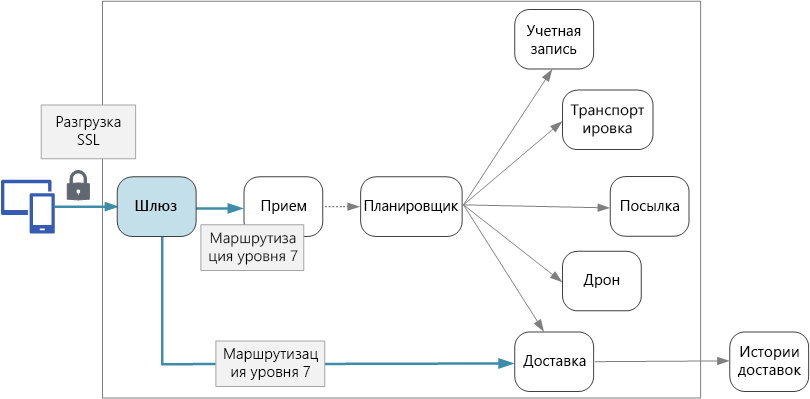

# Проектирование микрослужб. Шлюзы API

В архитектуре микрослужб клиент может взаимодействовать с несколькими внешними службами. Учитывая этот факт, как клиент узнает, какую конечную точку вызывать? Что происходит, когда появляются новые службы или выполняется рефакторинг существующих? Как службы обрабатывают завершение SSL-запросов, аутентификацию и другие операции? *Шлюз API* поможет ответить на эти вопросы.

<!-- markdownlint-disable MD026 -->

## Что такое шлюз API?

<!-- markdownlint-enable MD026 -->

Шлюз API находится между клиентами и службами. Он выполняет роль обратного прокси-сервера, который перенаправляет запросы от клиентов к службам. Он также может выполнять такие специализированные задачи, как аутентификация, завершение SSL-запросов и ограничение частоты. Если этот шлюз не будет развернут, клиенты должны будут отправлять запросы непосредственно к внешним службам. Но при предоставлении клиентам непосредственного доступа к службам могут возникнуть некоторые проблемы.

- Это может усложнить клиентский код. Клиент должен отслеживать несколько конечных точек и обрабатывать ошибки, сохраняя отказоустойчивость.
- Так создается взаимозависимость между клиентом и сервером. Клиент должен знать, каким образом выполняется разбивка отдельных служб. Из-за этого усложняется поддержка клиента и выполнение рефакторинга служб.
- Для одной операции может потребоваться вызвать несколько служб. Это может привести к увеличению круговых путей в сети между клиентом и сервером, из-за чего возникает значительная задержка.
- Каждая общедоступная служба должна обрабатывать такие операции, как аутентификация, SSL-запросы и ограничение частоты клиента.
- Службы должны предоставлять понятный для клиента протокол, например HTTP или WebSocket. Это ограничивает выбор [протоколов связи](./interservice-communication.md).
- Службы с общедоступными конечными точками являются целью потенциальных атак и должны быть защищены.

Шлюз помогает решить эти проблемы, разделив клиенты и службы. Шлюзы могут выполнять разные функции, не все из которых вам могут потребоваться. Функции можно сгруппировать в соответствии со следующими задачами:

[Маршрутизация шлюза.](../patterns/gateway-routing.md) Использование шлюза в качестве обратного прокси-сервера для перенаправления запросов на одну или несколько серверных служб с помощью маршрутизации уровня 7. Шлюз предоставляет одну конечную точку для клиентов и позволяет разделить клиенты и службы.

[Агрегация шлюза.](../patterns/gateway-aggregation.md) Использование шлюза для объединения нескольких отдельных запросов в один. Этот шаблон применяется, если необходимо выполнить одну операцию вызова к нескольким серверным службам. Клиент отправляет один запрос к шлюзу. Этот шлюз распределяет запросы между разными серверными службами, затем объединяет результаты и отправляет их запрашивающему клиенту. Это позволяет сократить число вызовов между клиентом и серверной частью.

[Разгрузка шлюза.](../patterns/gateway-offloading.md) Использование шлюза для передачи функций отдельных служб в шлюз, в частности специализированных операций. Этот шаблон можно использовать для объединения этих функций, вместо того, чтобы каждая служба отвечала за их реализацию. Это особенно полезно для компонентов, для реализации которых необходимы специальные действия. Например, для аутентификации и авторизации.

Ниже приведены некоторые примеры функций, которые можно передать в шлюз:

- завершение SSL-запросов;
- Authentication
- список разрешенных IP-адресов;
- ограничение частоты клиента (регулирование количества запросов);
- Ведение журналов и мониторинг
- кэширование ответов;
- Брандмауэр веб-приложения
- сжатие GZIP;
- обслуживание статического содержимого.

## Выбор технологии шлюза

Вот несколько параметров для реализации шлюза API в приложении.

- **Обратный прокси-сервер.** Nginx и HAProxy — популярные обратные прокси-серверы, которые поддерживают такие функции, как SSL-запросы, балансировка нагрузки и маршрутизация уровня 7. Оба сервера являются бесплатными продуктами с открытым кодом и платными выпусками, которые предусматривают дополнительные возможности и варианты поддержки. Nginx и HAProxy — это современные продукты с широкими наборами функций и высоким уровнем производительности. Их можно расширить с помощью сторонних модулей или путем написания пользовательских скриптов в Lua. Nginx также поддерживает модуль создания скриптов на базе JavaScript, который называется NginScript.

- **Входящий контроллер сетки службы.** При использовании слоя взаимодействия между службами, например linkerd или Istio, попробуйте использовать функции, предоставленные входящим контроллером для этой сетки службы. Например, входящий контроллер Istio поддерживает маршрутизацию уровня 7, переадресацию HTTP, повторные попытки и другие функции.

- [Шлюз приложений Azure.](/azure/application-gateway/) Шлюз приложений — управляемая служба балансировки нагрузки, которая может выполнять маршрутизацию уровня 7 и завершение SSL-запросов. Эта служба также предоставляет брандмауэр веб-приложения (WAF).

- [Служба управления Azure API.](/azure/api-management/) Служба управления API — это комплексное решение, обеспечивающее публикацию API во внешние и внутренние клиенты. Она предоставляет возможности, которые можно использовать для управления общедоступным API, в включая ограничение частоты, использование списка разрешенных IP-адресов и аутентификацию с помощью Azure Active Directory или других поставщиков удостоверений. Служба управления API не выполняет балансировку нагрузки, поэтому ее следует использовать в сочетании с подсистемой балансировки нагрузки, например шлюзом приложений или обратным прокси-сервером. Сведения об использовании службы управления API со шлюзом приложений см. в руководстве по [интеграции службы управления API во внутреннюю виртуальную сеть со шлюзом приложений](/azure/api-management/api-management-howto-integrate-internal-vnet-appgateway).

При выборе технологии шлюза учитывайте следующее:

**Функции.** Все варианты, перечисленные выше, поддерживают маршрутизацию уровня 7, но не обязательно поддерживают остальные функции. Вы можете развернуть несколько шлюзов в зависимости от функций, которые вам нужны.

**Развертывание**. Шлюз приложений Azure и управление API являются управляемыми службами. Nginx и HAProxy обычно выполняются в контейнерах внутри кластера, а также могут быть развернуты на выделенных виртуальных машинах за пределами кластера. Такая конфигурация изолирует шлюз от остальной части рабочей нагрузки, но увеличивает затраты на управление.

**Управление.** Когда обновляются службы или добавляются новые, может потребоваться обновить правила маршрутизации шлюза. Рассмотрим, как управлять этим процессом. Такие же рекомендации применимы к управлению SSL-сертификатами, спискам разрешенных IP-адресов и другим аспектам конфигурации.

## Развертывание Nginx или HAProxy в Kubernetes

Серверы Nginx или HAProxy можно развернуть в Kubernetes как [ReplicaSet](https://kubernetes.io/docs/concepts/workloads/controllers/replicaset/) или [DaemonSet](https://kubernetes.io/docs/concepts/workloads/controllers/daemonset/), определяющие образ контейнера Nginx или HAProxy. Используйте ConfigMap для хранения файла конфигурации прокси-сервера и подключения ConfigMap в качестве тома. Создайте службу типа LoadBalancer, чтобы предоставлять доступ к шлюзу через Azure Load Balancer.

Или создайте входящий контроллер. Входящий контроллер является ресурсом Kubernetes, который развертывает подсистему балансировки нагрузки или обратный прокси-сервер. Есть несколько вариантов реализации контроллера, в том числе Nginx и HAProxy. Отдельный ресурс, который называется входящим, определяет параметры входящего контроллера, например правила маршрутизации и сертификаты TLS. В этом случае не нужно управлять сложными файлами конфигурации, которые относятся к конкретной технологии прокси-сервера.

Шлюз является потенциально проблемным местом или единой точкой сбоя в системе, поэтому всегда следует развертывать как минимум две реплики для обеспечения высокого уровня доступности. В зависимости от нагрузки в дальнейшем может потребоваться развернуть реплики.

Также попробуйте запустить шлюз на выделенном наборе узлов в кластере. Этот подход отличается следующими преимуществами:

- Изоляция. Весь входящий трафик передается на фиксированный набор узлов, которые могут быть изолированы от серверных служб.

- Стабильная конфигурация. Если шлюз настроен неправильно, все приложение может стать недоступным.

- Производительность. Для шлюза можно использовать определенную конфигурацию виртуальной машины, чтобы увеличить производительность.

> [!div class="nextstepaction"]
> [Ведение журналов и мониторинг](./logging-monitoring.md)
