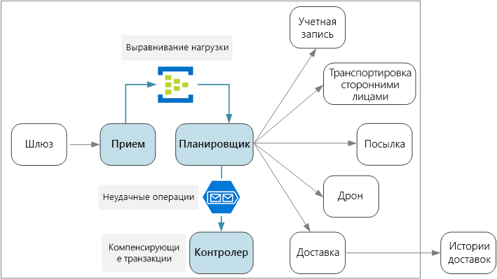
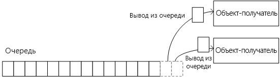
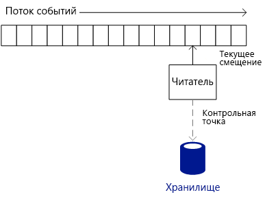
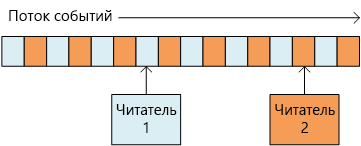
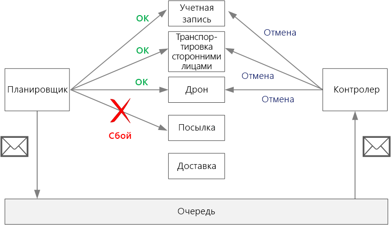

# <a name="designing-microservices-ingestion-and-workflow"></a>Проектирование микрослужб: прием данных и рабочий процесс

У микрослужб часто есть рабочий процесс, который охватывает несколько служб для одной транзакции. Рабочий процесс должен быть надежным. Он не должен терять транзакции или оставлять их в частично завершенном состоянии. Также важно управлять скоростью приема входящих запросов. Когда большое количество небольших служб обмениваются данными друг с другом, большой пакет входящих запросов может вызвать перегрузку взаимодействия служб. 



## <a name="the-drone-delivery-workflow"></a>Рабочий процесс доставки с помощью дронов

Чтобы запланировать доставку в приложении доставки с помощью дронов, необходимо выполнить следующие операции:

1. Проверьте состояние учетной записи пользователя (служба учетных записей).
2. Создайте сущность посылки (служба посылок).
3. Проверьте, требуется ли для этой доставки транспортировка сторонними лицами на основе местоположения для выемки и доставки (сторонняя служба транспортировки).
4. Запланируйте выемку с помощью дрона (служба дронов).
5. Создайте сущность доставки (служба доставки).

Это ядро ​​всего приложения, поэтому сквозной процесс должен быть эффективным и надежным. Необходимо решить некоторые задачи:

- **Выравнивание нагрузки.** Большое количество клиентских запросов может перегрузить систему сетевым трафиком между службами. Это также может переполнять серверные зависимости, такие как службы хранения или удаленные службы. Это может привести к регулированию вызывающих служб, что замедлит обратную реакцию в системе. Поэтому важно загрузить уровни запросов, поступающих в систему, путем помещения их в буфер или очередь для обработки. 

- **Гарантированная доставка.** Чтобы избежать удаления каких-либо клиентских запросов, компонент приема данных должен гарантировать по меньшей мере однократную доставку сообщений. 

- **Обработка ошибок**. Если какая-либо из служб возвращает код ошибки или происходит повторяющаяся ошибка, доставка не может быть запланирована. Код ошибки может указывать на ожидаемое условие ошибки (например, учетная запись клиента заблокирована) или неожиданную ошибку сервера (HTTP 5xx). Служба также может быть недоступна, в результате чего истекает время ожидания сетевого вызова. 

Сначала мы рассмотрим принимающую часть уравнения &mdash;, как система может принимать входящие запросы пользователей с высокой пропускной способностью. Затем мы рассмотрим, как приложение доставки с помощью дронов может реализовать надежный рабочий процесс. Оказывается, что архитектура подсистемы приема данных влияет на серверную часть рабочего процесса. 

## <a name="ingestion"></a>Прием

С учетом бизнес-требований команда разработчиков определила следующие нефункциональные требования к приему данных:

- Постоянная пропускная способность — 10 000 запросов в секунду.
- Возможность обрабатывать пиковые нагрузки до 50 000 запросов/с без удаления клиентских запросов или превышения времени ожидания.
- Задержка менее 500 мс на уровне 99-го процентиля.

Требования к обработке случайного пикового трафика представляют определенные трудности при проектировании. Теоретически систему можно масштабировать для обработки максимального объема ожидаемого трафика. Тем не менее, подготовка большого количества ресурсов будет очень неэффективной. Большую часть времени приложение не будет нуждаться в такой емкости, поэтому основные компоненты будут простаивать, а оплата продолжит взиматься.

Рекомендуется поместить входящие запросы в буфер и позволить ему действовать как средство выравнивания уровня нагрузки. При такой структуре служба приема должна быть способна обрабатывать максимальную скорость приема данных в течение коротких периодов времени, но серверные службы должны обрабатывать только максимальную длительную нагрузку. При буферизации на стороне интерфейса серверным службам не нужно обрабатывать большие пиковые нагрузки трафика. В масштабе, требуемом для приложения доставки с помощью дронов, для выравнивания нагрузки подходят [Центры событий Azure](/azure/event-hubs/). Центры событий обеспечивают низкую задержку и высокую пропускную способность и являются экономически эффективным решением при высоких объемах приема данных. 

В нашем тестировании мы использовали концентратор событий уровня "Стандартный" с 32 разделами и 100 единицами пропускной способности. Мы наблюдали прием около 32 000 событий в секунду с задержкой примерно 90 мс. Сейчас ограничение по умолчанию составляет 20 единиц пропускной способности, но клиенты Azure могут запросить дополнительные единицы, отправив запрос в службу технической поддержки. Дополнительные сведения см. в статье [Квоты на Центры событий](/azure/event-hubs/event-hubs-quotas). Как и в случае со всеми метриками производительности, на производительность могут повлиять многие факторы, такие ​​как объем полезных данных сообщения, поэтому не рассматривайте эти числа в качестве эталона. Если требуется более высокая пропускная способность, служба приема может сегментироваться между несколькими концентраторами событий. Для более высокой пропускной способности [Центры событий ценовой категории "Выделенный"](/azure/event-hubs/event-hubs-dedicated-overview) предлагают развертывания с одним клиентом, которые могут принимать более 2 миллионов событий в секунду.

Важно понять, как Центры событий могут достичь такой высокой пропускной способности. Это влияет на то, как клиент должен потреблять сообщения от Центров событий. В Центрах событий не используются *очереди*. Вместо этого они используют *поток событий*. 

Отдельный потребитель может удалить сообщение из очереди, и следующий потребитель не увидит его. Таким образом, очереди позволяют использовать [шаблон конкурирующих потребителей](../patterns/competing-consumers.md) для обработки сообщений в параллельном режиме и повышения масштабируемости. Для большей отказоустойчивости потребитель блокирует сообщение и снимает блокировку после его обработки. Если происходит сбой потребителя, например, на узле, на котором он работает, возникает сбой, срок блокировки истекает и сообщение возвращается в очередь. 



Центры событий, в свою очередь, используют потоковую семантику. Потребители считывают поток независимо друг от друга в своем темпе. Каждый потребитель отвечает за отслеживание своего текущего положения в потоке. Потребитель должен записывать свою текущую позицию в постоянное хранилище с предопределенным интервалом. Таким образом, если работа потребителя приостановлена (например, происходит сбой потребителя или сбой узла), то новый экземпляр может возобновить чтение потока с последней записанной позиции. Этот процесс называется *установкой контрольных точек*. 

Из соображений производительности потребитель обычно не создает контрольную точку после каждого сообщения. Вместо этого он создает контрольные точки с фиксированным интервалом, например, после обработки *n* сообщений или каждые *n* секунд. Как следствие, если происходит сбой потребителя, некоторые события могут обрабатываться дважды, потому что новый экземпляр всегда начинает с последней контрольной точки. Существует компромисс: частая установка контрольных точек может понизить производительность, а редкая установка означает, что после сбоя повторится больше событий.  


 
Центры событий не предназначены для конкурирующих потребителей. Хотя несколько потребителей могут считывать поток, каждый из них проходит поток независимо. Вместо этого Центры событий используют шаблон секционированных потребителей. Концентратор событий может иметь до 32 разделов. Горизонтальное масштабирование достигается путем назначения отдельных потребителей для каждого раздела.

Что это значит для рабочего процесса доставки с помощью дрона? Чтобы получить максимальную выгоду от использования Центров событий, планировщик доставки не может ожидать обработки каждого сообщения перед переходом к следующему. Если это произойдет, он проведет большую часть своего времени, ожидая завершения сетевых вызовов. Вместо этого он должен обрабатывать пакеты сообщений параллельно, используя асинхронные вызовы для серверных служб. Как мы увидим, выбор правильной стратегии создания контрольных точек также важен.  

## <a name="workflow"></a>Рабочий процесс

Мы рассмотрели три варианта чтения и обработки сообщений: узел обработчика событий, очереди служебной шины и библиотека IoTHub React. Мы выбрали IoTHub React, потому что она помогает начать работу с узлом обработчика событий. 

### <a name="event-processor-host"></a>Узел обработчика событий

Узел обработчика событий предназначен для пакетной обработки сообщений. Приложение реализует интерфейс `IEventProcessor`, а узел обработчика создает один экземпляр обработчика событий для каждого раздела в концентраторе событий. Узел обработчика событий затем вызывает метод `ProcessEventsAsync` каждого обработчика событий с пакетами сообщений о событиях. Приложение контролирует процесс создания контрольных точек внутри метода `ProcessEventsAsync`, а узел обработчика событий записывает контрольные точки в хранилище Azure. 

Внутри раздела узел обработчика событий ожидает возврата `ProcessEventsAsync` перед вызовом следующего пакета. Этот подход упрощает модель программирования, так как код обработки событий не должен быть реентерабельным. Однако это также означает, что обработчик событий обрабатывает один пакет за раз, что приводит к ограничению скорости, с которой узел обработчика может передавать сообщения.

> [!NOTE] 
> Фактически узел обработчика не *ожидает* снятия блокировки потока. Метод `ProcessEventsAsync` является асинхронным, поэтому узел обработчика может выполнять другую работу параллельно с выполнением метода. Но пока метод не вернется, он не доставит другой пакет сообщений для этого раздела. 

В приложении дронов пакеты сообщений могут обрабатываться параллельно. Но ожидание завершения обработки всего пакета по-прежнему может стать узким местом. Обработка не может быть быстрее самого медленного сообщения в пакете. Любое изменение времени отклика может создать длинный "хвост", когда несколько медленных ответов будут отягощать всю систему. Наши тесты производительности показали, что при таком подходе мы не достигли целевой пропускной способности. Это *не* означает, что вам следует избегать использования узла обработчика событий. Для достижения высокой пропускной способности избегайте выполнения длительных задач внутри метода `ProcesssEventsAsync`. Быстро обрабатывайте каждый пакет.

### <a name="iothub-react"></a>Библиотека IotHub React 

[IotHub React](https://github.com/Azure/toketi-iothubreact) — это библиотека Akka Streams для чтения событий из концентратора событий. Akka Streams — это платформа программирования на основе потоков, которая реализует спецификацию [реактивных потоков](https://www.reactive-streams.org/). Она позволяет создавать эффективные потоковые конвейеры, где все потоковые операции выполняются асинхронно, а конвейер корректно обрабатывает обратную реакцию. Замедленная обратная реакция возникает, когда источник событий генерирует события с более высокой скоростью, чем подчиненные потребители могут получить их. Это в точности соответствует ситуации, когда система доставки с помощью дронов создает пик трафика. Если серверные службы работают медленнее, IoTHub React замедлит работу. Если емкость увеличивается, IoTHub React отправляет больше сообщений по конвейеру.

Akka Streams также является очень естественной моделью программирования для потоковой передачи событий из Центров событий. Вместо циклического перебора пакетов событий нужно определить набор операций, которые будут применяться к каждому событию, а обработку потоковой передачи выполняет Akka Streams. Akka Streams определяет конвейер потоковой передачи, включающий в себя *источники*, *потоки* и *приемники*. Источник генерирует поток вывода, поток обрабатывает входной поток и создает поток вывода, а приемник потребляет поток без каких-либо выходных данных.

Ниже приведен код в службе планировщика, который настраивает конвейер Akka Streams:

```java
IoTHub iotHub = new IoTHub();
Source<MessageFromDevice, NotUsed> messages = iotHub.source(options);

messages.map(msg -> DeliveryRequestEventProcessor.parseDeliveryRequest(msg))
        .filter(ad -> ad.getDelivery() != null).via(deliveryProcessor()).to(iotHub.checkpointSink())
        .run(streamMaterializer);
```

Этот код настраивает Центры событий в качестве источников. Оператор `map` десериализует каждое сообщение о событии в класс Java, который представляет запрос на доставку. Оператор `filter` удаляет любые объекты `null` из потока. Это предотвращает случаи, когда сообщение нельзя десериализовать. Оператор `via` присоединяет источник к потоку, обрабатывающему каждый запрос на доставку. Метод `to` соединяет поток с приемником контрольной точки, который встроен в IoTHub React.

IoTHub React использует другую стратегию установки контрольных точек, нежели процессор узла событий. Контрольные точки записываются приемником контрольных точек, что является завершающим этапом в конвейере. Структура Akka Streams позволяет конвейеру продолжать передавать данные, а приемник записывает контрольную точку. Это означает, что вышестоящим стадиям обработки данных не нужно ждать создания контрольной точки. Можно настроить так, чтобы контрольная точка создавалась после истечения времени ожидания или обработки определенного количества сообщений.

Метод `deliveryProcessor` создает поток Akka Streams:  

```java
private static Flow<AkkaDelivery, MessageFromDevice, NotUsed> deliveryProcessor() {
    return Flow.of(AkkaDelivery.class).map(delivery -> {
        CompletableFuture<DeliverySchedule> completableSchedule = DeliveryRequestEventProcessor
                .processDeliveryRequestAsync(delivery.getDelivery(), 
                        delivery.getMessageFromDevice().properties());
        
        completableSchedule.whenComplete((deliverySchedule,error) -> {
            if (error!=null){
                Log.info("failed delivery" + error.getStackTrace());
            }
            else{
                Log.info("Completed Delivery",deliverySchedule.toString());
            }
                                
        });
        completableSchedule = null;
        return delivery.getMessageFromDevice();
    });
}
```

Поток вызывает статический метод `processDeliveryRequestAsync`, который выполняет фактическую обработку каждого сообщения.

### <a name="scaling-with-iothub-react"></a>Масштабирование с IoTHub React

Служба планировщика разработана таким образом, что каждый экземпляр контейнера считывает данные из одного раздела. Например, если концентратор событий содержит 32 раздела, служба планировщика развертывается с 32 репликами. Это обеспечивает большую гибкость с точки зрения горизонтального масштабирования. 

В зависимости от размера кластера на узле кластера может выполняться несколько модулей pod службы планировщика. Но если службе планировщика требуется больше ресурсов, кластер можно развернуть, чтобы распределить модули pod между большим количеством узлов. Наши тесты производительности показали, что служба планировщика связана с памятью и потоками, поэтому производительность сильно зависит от размера виртуальной машины и количества модулей pod на каждом узле.

Каждый экземпляр должен знать, из какого раздела концентратора событий следует выполнять чтение. Чтобы настроить номер раздела, воспользуемся типом ресурса [StatefulSet](https://kubernetes.io/docs/concepts/workloads/controllers/statefulset/) в Kubernetes. Модули pod в StatefulSet имеют постоянный идентификатор, который содержит числовой индекс. В частности, имя модуля — `<statefulset name>-<index>`, и это значение доступно контейнеру через [Downward API](https://kubernetes.io/docs/tasks/inject-data-application/downward-api-volume-expose-pod-information/) Kubernetes. Во время выполнения служба планировщика считывает имя модуля pod и использует его индекс в качестве идентификатора раздела.

Если вам нужно еще больше масштабировать службу планировщика, вы можете назначить несколько модулей pod для каждого раздела концентратора событий, чтобы несколько модулей считывали каждый раздел. Однако в этом случае каждый экземпляр будет считывать все события в назначенном разделе. Чтобы избежать дублирования обработки, нужно использовать алгоритм хэширования, чтобы каждый экземпляр пропускал часть сообщений. Таким образом, несколько модулей чтения могут получать поток, но каждое сообщение обрабатывается только одним экземпляром. 
 


### <a name="service-bus-queues"></a>Очереди служебной шины

Третий вариант, который мы рассмотрели, заключался в копировании сообщений из Центров событий в очередь служебной шины, а затем настройке службы планировщика для чтения сообщений через служебную шину. Может показаться странным записывать входящие запросы в Центры событий только для того, чтобы скопировать их в служебную шину.  Однако идея заключалась в том, чтобы использовать различные преимущества каждой службы: Центры событий для выравнивания пиков интенсивного трафика, а семантику очереди в служебной шине для обработки рабочей нагрузки с использованием шаблона конкурирующих потребителей. Помните, что приоритет устойчивой пропускной способности меньше чем ожидаемой максимальной нагрузки, поэтому для обработки очереди служебной шины не требуется такая же скорость, как для приема сообщений.
 
При таком подходе в результате нашей экспериментальной концепции удалось достичь показателя — 4000 операций в секунду. Для тестов использовались макеты сервисных служб, которые не выполняли никакой реальной работы, а просто добавляли фиксированную задержку для каждой службы. Обратите внимание, что наши показатели производительности намного меньше теоретических максимальных значений для служебной шины. Возможные причины расхождения:

- Отсутствие оптимальных значений для различных параметров клиента, таких как ограничение пула подключений, степень параллелизации, количество предварительной выборки и размер пакета.

- Узкие места сетевых операций ввода-вывода.

- Использование режима [PeekLock](/rest/api/servicebus/peek-lock-message-non-destructive-read) вместо [ReceiveAndDelete](/rest/api/servicebus/receive-and-delete-message-destructive-read), что необходимо для обеспечения по меньшей мере однократной доставки сообщений.

Последующие тесты производительности помогли бы обнаружить первопричину и решить эти проблемы. Тем не менее, библиотека IotHub React помогла нам достичь целевых показателей, поэтому мы выбрали этот вариант. С другой стороны, служебная шина также приемлема для этого сценария.

## <a name="handling-failures"></a>Обработка сбоев 

Существует три общих класса сбоя, которые следует учитывать.

1. В подчиненной службе может возникать повторяющаяся ошибка. Это может быть любой сбой, который не устранится сам по себе. Повторяющиеся ошибки включают в себя обычные условия ошибки, такие как недопустимые входные данные метода. К ним также относятся необработанные исключения в коде приложения или сбой процесса. При возникновении такой ошибки вся бизнес-транзакция должна быть отмечена как сбой. Может потребоваться отменить другие шаги в той же транзакции, которые уже выполнены. (См. раздел "Компенсирующие транзакции" ниже.)
 
2. В подчиненной службе может возникнуть временная ошибка, например истечение времени ожидания сети. Эти ошибки часто можно решить, просто повторив вызов. Если операция по-прежнему завершается сбоем после определенного количества попыток, такая ошибка считается повторяющейся. 

3. В самой службе планировщика может возникнуть ошибка (например, из-за сбоя узла). В этом случае Kubernetes предоставит новый экземпляр службы. Однако любые транзакции, которые уже начали выполняться, должны быть возобновлены. 

## <a name="compensating-transactions"></a>Компенсирующие транзакции

Если происходит повторяющаяся ошибка, текущая транзакция может находиться в состоянии *частичного сбоя*, когда один или несколько шагов уже завершены успешно. Например, если служба дронов уже запланировала доставку с помощью дрона, она должна быть отменена. В этом случае приложение должно отменить успешно выполненные шаги с помощью [компенсирующей транзакции](../patterns/compensating-transaction.md). В некоторых случаях это нужно выполнить во внешней системе или даже с использованием операции в ручном режиме. 

Если логика компенсирующих транзакций сложна, можно создать отдельную службу, которая отвечает за этот процесс. В приложении доставки с помощью дронов служба планировщика ставит неудачные операции в выделенную очередь. Отдельная микрослужба, называемая контролером, выполняет чтение из этой очереди и вызывает API отмены для служб, которые необходимо компенсировать. Это разновидность [шаблона "планировщик, агент, контролер"][scheduler-agent-supervisor]. Служба "Контролер" может выполнять и другие действия, такие как уведомление пользователя с помощью текстового сообщения или электронной почты или отправка предупреждения на панель управления операций. 



## <a name="idempotent-vs-non-idempotent-operations"></a>Идемпотентные и неидемпотентные операции

Чтобы избежать потери каких-либо запросов, служба планировщика должна гарантировать, что все сообщения обрабатываются хотя бы один раз. Центры событий могут обеспечить по крайней мере однократную доставку, если клиент создает контрольные точки надлежащим образом.

Если служба планировщика завершается сбоем, она может остановиться в процессе обработки одного или нескольких клиентских запросов. Эти сообщения повторно обработает другой экземпляр планировщика. Что произойдет, если запрос будет обработан дважды? Важно предотвратить дублирование какой-либо работы. В конце концов, мы не хотим, чтобы система отправляла два дрона для одного и того же груза.

Один из подходов состоит в том, чтобы сделать все операции идемпотентными. Операция является идемпотентной, если ее можно вызвать несколько раз, не создавая дополнительных побочных эффектов после первого вызова. Другими словами, клиент может вызывать операцию один, два или много раз, и результат будет таким же. По сути, служба должна игнорировать повторяющиеся вызовы. Чтобы метод с побочными эффектами был идемпотентным, служба должна иметь возможность обнаруживать повторяющиеся вызовы. Например, можно настроить так, чтобы вызывающий объект присваивал идентификатор, вместо того, чтобы служба генерировала новый идентификатор. Затем служба может проверить наличие дубликатов идентификаторов.

> [!NOTE]
> Согласно спецификации HTTP методы GET, PUT и DELETE должны быть идемпотентными. Методы POST не обязательно должны быть идемпотентными. Если метод POST создает новый ресурс, обычно это не гарантирует, что эта операция является идемпотентной. 

Не всегда просто написать идемпотентный метод. Другой вариант — планировщик должен отслеживать ход каждой транзакции в надежном хранилище. Всякий раз, когда он обрабатывает сообщение, он будет искать состояние в надежном хранилище. После каждого шага он записывает результат в хранилище. Такой подход может оказать влияние на производительность.

## <a name="example-idempotent-operations"></a>Пример идемпотентных операций

Спецификация HTTP указывает, что методы PUT должны быть идемпотентными. Спецификация определяет идемпотентность следующим образом.

>  Метод запроса считается идемпотентным, если предполагаемый эффект на сервере с несколькими идентичными запросами с этим методом совпадает с эффектом для одного такого запроса. ([RFC 7231](https://tools.ietf.org/html/rfc7231#section-4))

Важно понимать разницу между семантикой PUT и POST при создании новой сущности. В обоих случаях клиент отправляет представление сущности в тексте запроса. Значения URI при этом разные.

- Для метода POST URI представляет родительский ресурс новой сущности, такой как коллекция. Например, чтобы создать новую доставку, можно использовать URI `/api/deliveries`. Сервер создает сущность и назначает ей новый URI, например `/api/deliveries/39660`. Этот URI возвращается в заголовке Location ответа. Каждый раз, когда клиент отправляет запрос, сервер создает новый объект с новым URI.

- Для метода PUT URI определяет сущность. Если сущность с таким URI уже существует, сервер заменяет существующую сущность версией из запроса. Если сущности с таким URI не существует, сервер создает ее. Предположим, клиент отправляет запрос PUT к `api/deliveries/39660`. Предполагая, что доставки с этим URI не существует, сервер создает новую. Теперь если клиент снова отправляет тот же запрос, сервер заменяет существующую сущность.

Ниже приведена реализация метода PUT в службе доставки. 

```csharp
[HttpPut("{id}")]
[ProducesResponseType(typeof(Delivery), 201)]
[ProducesResponseType(typeof(void), 204)]
public async Task<IActionResult> Put([FromBody]Delivery delivery, string id)
{
    logger.LogInformation("In Put action with delivery {Id}: {@DeliveryInfo}", id, delivery.ToLogInfo());
    try
    {
        var internalDelivery = delivery.ToInternal();

        // Create the new delivery entity.
        await deliveryRepository.CreateAsync(internalDelivery);

        // Create a delivery status event.
        var deliveryStatusEvent = new DeliveryStatusEvent { DeliveryId = delivery.Id, Stage = DeliveryEventType.Created };
        await deliveryStatusEventRepository.AddAsync(deliveryStatusEvent);

        // Return HTTP 201 (Created)
        return CreatedAtRoute("GetDelivery", new { id= delivery.Id }, delivery);
    }
    catch (DuplicateResourceException)
    {
        // This method is mainly used to create deliveries. If the delivery already exists then update it.
        logger.LogInformation("Updating resource with delivery id: {DeliveryId}", id);

        var internalDelivery = delivery.ToInternal();
        await deliveryRepository.UpdateAsync(id, internalDelivery);

        // Return HTTP 204 (No Content)
        return NoContent();
    }
}
```

Ожидается, что большинство запросов создадут новые сущности, поэтому метод вызывает `CreateAsync` в объекте репозитория, а затем обрабатывает все исключения дубликатов ресурсов, обновляя ресурс. 

> [!div class="nextstepaction"]
> [Шлюзы API](./gateway.md)

<!-- links -->

[scheduler-agent-supervisor]: ../patterns/scheduler-agent-supervisor.md