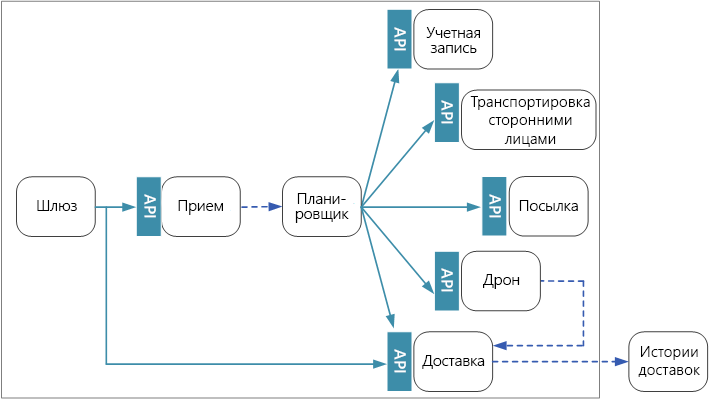
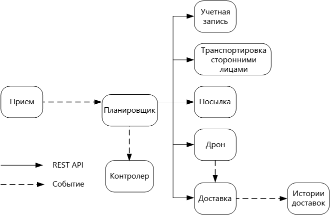

# Проектирование микрослужб: обмен данными между службами

Обмен данными между микрослужбами должен быть эффективным и надежным. При взаимодействии большого количества небольших служб для выполнения одной транзакции это может оказаться сложной задачей. В этой главе мы рассмотрим компромиссы между асинхронным обменом сообщениями и синхронными API-интерфейсами. Затем мы рассмотрим некоторые из проблем, возникающих при разработке устойчивого обмена данными между службами, и роль, которую может играть слой взаимодействия между службами.

## Сложности 

Вот некоторые из основных проблем, возникающих при обмене данными между службами. Слои взаимодействия между службами, описанные далее в этой главе, предназначены для решения многих из этих задач.

**Устойчивость.** Могут существовать десятки и даже сотни экземпляров любой определенной микрослужбы. Экземпляр может завершиться ошибкой по ряду причин. Может произойти сбой на уровне узла, например сбой оборудования или перезагрузка виртуальной машины. Экземпляр может аварийно завершить работу либо быть перегружен запросами, не имея возможности обрабатывать новые запросы. Любое из этих событий может вызвать сбой сетевого вызова. Существует два конструктивных шаблона, которые могут повысить устойчивость сетевых вызовов между службами.

- **[Повторные попытки](../patterns/retry.md)**. Сетевой вызов может завершиться сбоем из-за временной ошибки, которая исчезает сама по себе. Вместо завершения вызова вызывающий объект обычно повторяет операцию несколько раз или до тех пор, пока не истечет настроенный период времени ожидания. Тем не менее, если операция не является идемпотентной, повторные попытки могут вызвать непредвиденные побочные эффекты. Начальный вызов может быть выполнен успешно, но вызывающий объект никогда не получит ответ. Если вызывающий объект повторяет попытку, операция может вызываться дважды. Как правило, небезопасно повторять методы POST или PATCH, потому что они не обязательно будут идемпотентными.

- **[Автоматический выключатель](../patterns/circuit-breaker.md)**. Слишком много неудавшихся запросов могут вызвать узкое место, так как ожидающие запросы накапливаются в очереди. Эти заблокированные запросы могут содержать критические системные ресурсы, такие как память, потоки, подключения к базе данных и т. д., что может привести к каскадным сбоям. С помощью шаблона автоматического выключения (прерывателя) в службе можно предотвратить повторное выполнение операции, которая, вероятнее всего, завершится ошибкой. 

**Балансировка нагрузки**. Когда служба "A" вызывает службу "B", запрос должен достичь работающего экземпляра службы "B". В Kubernetes тип ресурса `Service` обеспечивает стабильный IP-адрес для всех групп модулей pod. Сетевой трафик на IP-адрес службы отправляется в pod с помощью правил iptable. По умолчанию выбирается случайный модуль pod. Слой взаимодействия между службами (см. ниже) может обеспечить более интеллектуальные алгоритмы балансировки нагрузки на основе наблюдаемой задержки или других метрик.

**Распределенная трассировка**. Одна транзакция может охватывать несколько служб. Это может затруднить наблюдение за общей производительностью и работоспособностью системы. Даже если каждая служба создает журналы и метрики, при отсутствии определенного метода связать их вместе они имеют ограниченное использование. В главе о [ведении журнала и мониторинге](./logging-monitoring.md) более подробно рассматривается вопрос распределенной трассировки, но здесь он упоминается как проблема.

**Управление версиями службы**. Развертывая новую версию службы, команда должна предотвратить нарушение работы каких-либо других служб или внешних клиентов, которые зависят от нее. Кроме того, можно выполнять несколько версий службы параллельно и перенаправлять запросы к определенной версии. Дополнительные сведения см. в разделе [Управление версиями API](./api-design.md#api-versioning).

**Шифрование TLS и взаимная проверка подлинности TLS**. По соображениям безопасности можно зашифровать трафик между службами с помощью TLS и использовать взаимную проверку подлинности TLS для аутентификации вызывающих объектов.

## Синхронный и асинхронный обмен сообщениями

Существует два основных шаблона обмена сообщениями, с помощью которых микрослужбы могут взаимодействовать. 

1. Синхронный обмен данными. В этом шаблоне служба вызывает API, который предоставляет другая служба, используя протокол, такой как HTTP или gRPC. Это шаблон синхронного обмена сообщениями, потому что вызывающий объект ожидает ответа от получателя. 

2. Асинхронная передача сообщений. В этом шаблоне служба отправляет сообщение, не дожидаясь ответа, поэтому одна или несколько служб обрабатывают сообщения асинхронно.

Важно различать асинхронный ввод-вывод и асинхронный протокол. Асинхронный ввод-вывод означает, что вызывающий поток не блокируется, пока не завершится операция ввода-вывода. Он важен для производительности и является элементом реализации с точки зрения архитектуры. Асинхронный протокол подразумевает, что отправитель не ждет ответа. Протокол HTTP — это синхронный протокол, хотя клиент HTTP может использовать асинхронный ввод-вывод при отправке запроса. 

Каждый шаблон имеет свои недостатки. "Запрос — ответ" является вполне понятной парадигмой, поэтому разработка API может показаться более естественной, чем проектирование системы обмена сообщениями. Тем не менее асинхронный обмен сообщениями имеет некоторые преимущества, которые могут быть очень полезными в архитектуре микрослужб.

- **Слабая взаимозависимость**. Отправителю сообщения не нужно знать об объекте-получателе. 

- **Несколько подписчиков**. С помощью модели публикации и подписки несколько клиентов могут подписаться на получение событий. Дополнительные сведения см. в статье [Стиль архитектуры, управляемой событиями](/azure/architecture/guide/architecture-styles/event-driven).

- **Изоляция сбоев**. Если объект-получатель вышел из строя, отправитель все равно может отправлять сообщения. Сообщения будут доставлены, когда объект-получатель восстановится. Эта возможность особенно полезна в архитектуре микрослужб, так как каждая служба имеет свой собственный жизненный цикл. В любой момент времени служба может стать недоступной или быть заменена более новой версией. Асинхронный обмен сообщениями может обрабатывать прерывистый простой. С другой стороны, в синхронных API нижестоящая служба должна быть доступна, иначе операция завершится ошибкой. 
 
- **Скорость реагирования**. Вышестоящая служба может отвечать быстрее, если она не ждет ответа от нижестоящих служб. Это особенно удобно использовать в архитектуре микрослужб. Если имеется цепочка зависимостей служб (служба "A" вызывает "B", которая вызывает "C" и т. д.), то ожидание синхронных вызовов может привести к неприемлемым задержкам.

- **Выравнивание нагрузки**. Очередь может выступать в качестве буфера для выравнивания рабочей нагрузки, поэтому получатели могут обрабатывать сообщения с нужной им скоростью. 

- **Рабочие процессы**. Очереди можно использовать для управления рабочим процессом, устанавливая конечную точку для сообщения после каждого шага рабочего процесса.

Однако существуют некоторые проблемы с эффективностью использования асинхронного обмена сообщениями.

- **Взаимозависимость с инфраструктурой обмена сообщениями**. Использование определенной инфраструктуры обмена сообщениями может вызвать тесную связь с этой инфраструктурой. Потом будет сложно переключиться на другую инфраструктуру обмена сообщениями.

- **Задержка**. Если очереди сообщений заполняются, то совокупная задержка обработки операций может стать очень высокой.  

- **Стоимость**. При высокой пропускной способности инфраструктура обмена сообщениями может быть дорогостоящей.

- **Сложность.** Обработка асинхронного обмена сообщениями является непростой задачей. Например, нужно обрабатывать дублирующиеся сообщения, удаляя дубликаты либо делая операции идемпотентными. При использовании асинхронного обмена сообщениями также трудно реализовать семантику "запрос — ответ". Для отправки ответа потребуется другая очередь, а также способ коррелировать запросы и ответные сообщения.

- **Пропускная способность**. Если сообщения требуют *семантику очереди*, то очереди могут стать узким местом в системе. Каждое сообщение требует наличия хотя бы одной операции постановки в очередь и одной операции вывода из очереди. Более того, семантика очереди обычно требует некоторой блокировки внутри инфраструктуры обмена сообщениями. Если очередь выступает управляемой службой, может появиться дополнительная задержка, так как очередь является внешней по отношению к виртуальной сети кластера. Можно устранить эти проблемы, используя пакетные сообщения, но это усложнит код. Если сообщения не требуют семантики очереди, можно использовать *поток* событий вместо очереди. Дополнительные сведения см. в статье [Стиль архитектуры, управляемой событиями](../guide/architecture-styles/event-driven.md).  

## Доставка с помощью дронов: выбор шаблонов обмена сообщениями

Учитывая приведенные выше соображения, команда разработчиков сделала следующие выборы в отношении проектирования приложения доставки с помощью дронов.

- Служба приема предоставляет открытый интерфейс REST API, который клиентские приложения используют для планирования, обновления или отмены поставок.

- Служба приема использует концентраторы событий для отправки асинхронных сообщений в службу планировщика. Асинхронные сообщения необходимы для реализации выравнивания нагрузки, которая необходима для приема данных. Дополнительные сведения о взаимодействии служб приема данных и планировщика см. в главе о [приеме данных и рабочем процессе][ingestion-workflow].

- Службы учетной записи, доставки, посылок, дронов и транспортных услуг третьих лиц предоставляют внутренние интерфейсы REST API. Служба планировщика вызывает эти API для выполнения запроса пользователя. Одной из причин использования синхронных API является то, что планировщику необходимо получить ответ от каждой из нижестоящих служб. Сбой в любой из нижестоящих служб означает, что вся операция завершилась неудачно. Тем не менее потенциальная проблема — это объем задержки, которая возникает при вызове серверных служб. 

- Если в какой-либо нижестоящей службе произошла повторяющаяся ошибка, вся транзакция должна быть отмечена как завершившаяся сбоем. Для обработки этого случая служба планировщика отправляет асинхронное сообщение контролеру, который может запланировать компенсирующие транзакции, как описано в главе о [приеме данных и рабочем процессе][ingestion-workflow].   

- Служба доставки предоставляет открытый API, который клиенты могут использовать для получения состояния доставки. В главе о [шлюзах API](./gateway.md) рассматривается, как шлюз API может скрывать базовые службы от клиента, поэтому клиенту не нужно знать, какие API предоставляют те или иные службы. 

- Пока дрон находится в полете, служба дронов отправляет события, которые содержат сведения о текущем местоположении и состоянии дрона. Служба доставки принимает эти события для отслеживания состояния доставки.

- При изменении состояния доставки служба доставки отправляет событие состояния доставки, например `DeliveryCreated` или `DeliveryCompleted`. Любая служба может подписаться на получение этих событий. В текущей версии архитектуры служба доставки является единственным подписчиком, но позже могут появиться другие подписчики. Например, события могут попадать в службу аналитики в режиме реального времени. Так как планировщик не должен ожидать ответа, добавление большего количества подписчиков не влияет на путь основного рабочего процесса.

Обратите внимание, что события состояния доставки являются производными от событий расположения дронов. Например, когда дрон достигает места доставки и выгружает груз, служба доставки преобразует это в событие DeliveryCompleted (доставка завершена). Это пример подхода с учетом модели предметной области. Как описано выше, управление дронами принадлежит к отдельному ограниченному контексту. События дронов передают их физическое расположение. С другой стороны, события доставки представляют собой изменения состояния доставки, что является другой бизнес-сущностью.

## Использование слоя взаимодействия между службами

*Слой взаимодействия между службами* — это программный уровень, который обрабатывает обмен данными между службами. Слои взаимодействия между службами предназначены для решения многих проблем, перечисленных в предыдущем разделе. Они позволяют перенести ответственность за эти проблемы от самих микрослужб на общий уровень. Слой взаимодействия между службами выступает в качестве прокси-сервера, который перехватывает сетевой обмен данными между микрослужбами в кластере. 

> [!NOTE]
> Слой взаимодействия между службами является примером [шаблона посредника](../patterns/ambassador.md) &mdash; вспомогательной службы, которая отправляет сетевые запросы от имени приложения. 

Сейчас основными вариантами слоя взаимодействия между службами в Kubernetes являются [linkerd](https://linkerd.io/) и [Istio](https://istio.io/). Обе эти технологии быстро развиваются. Во время написания этого руководства последний выпуск Istio был 0.2, поэтому он все еще очень новый. Тем не менее и linkerd, и Istio предоставляют следующие функции: 

- Балансировка нагрузки на уровне сеанса, основанная на наблюдаемых задержках или количестве ожидающих запросов. Это может повысить производительность по сравнению с балансировкой нагрузки уровня 4, предоставляемой Kubernetes. 

- Маршрутизация уровня 7 на основе URL-адреса, заголовка узла, версии API или других правил уровня приложения.

- Повторение невыполненных запросов. Слой взаимодействия между службами распознает коды ошибок HTTP и может автоматически повторять невыполненные запросы. Можно настроить максимальное количество попыток, а также время ожидания, чтобы ограничить максимальную задержку. 

- Автоматическое выключение. Если экземпляр последовательно не выполняет запросы, слой взаимодействия между службами временно пометит его как отключенный. Через некоторое время он снова попробует связаться с экземпляром. Можно настроить автоматический выключатель на основе различных критериев, таких как количество последовательных сбоев.  

- Слой взаимодействия между службами фиксирует показатели вызовов между службами, такие как объем запроса, задержка, уровень ошибок и успешности, а также размеры ответов. Слой взаимодействия между службами также позволяет распределенную трассировку путем добавления информации о корреляции для каждого прыжка в запросе.

- Взаимная проверка подлинности TLS для вызовов между службами.

Вам нужен слой взаимодействия между службами? Предоставляемые им преимущества в распределенной системе, безусловно, убедительны. Если у вас нет слоя взаимодействия между службами, вам необходимо будет рассмотреть каждую из проблем, упомянутых в начале главы. Вы можете решать такие проблемы, как повторение запросов, автоматический выключатель и распределенная трассировка без слоя взаимодействия между службами, но она перемещает эти проблемы из отдельных служб на выделенный уровень. С другой стороны, слои взаимодействия между службами являются относительно новой технологией, которая все еще дорабатывается. Развертывание слоя взаимодействия между службами усложняет установку и настройку кластера. Так как запросы теперь маршрутизируются через прокси-сервер слоя взаимодействия между службами, а также потому, что на каждом узле кластера теперь выполняются дополнительные службы, возможны последствия для производительности. Следует выполнять тщательную проверку производительности и нагрузочное тестирование перед развертыванием слоя взаимодействия между службами в рабочей среде.

> [!div class="nextstepaction"]
> [Проектирование API](./api-design.md)

<!-- links -->

[ingestion-workflow]: ./ingestion-workflow.md
