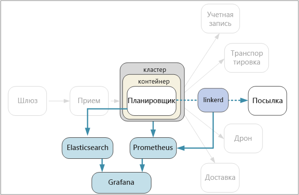

# <a name="designing-microservices-logging-and-monitoring"></a>Проектирование микрослужб. Ведение журналов и мониторинг

В любом сложном приложении в определенный момент возникают проблемы. Если вы используете приложение для микрослужб, вам необходимо отслеживать, что происходит между десятками и даже сотнями служб. Ведение журнала и мониторинг очень важны, так как они обеспечивают целостное представление о системе.



В архитектуре микрослужб может быть особенно сложно выявить точную причину ошибок или узких мест производительности. Операция одного пользователя может включать использование нескольких служб. Службы могут достичь лимита сетевых операций ввода-вывода внутри кластера. Цепочки вызовов между службами могут вызвать замедленную обратную реакцию в системе, что приводит к высокой задержке или каскадным сбоям. Более того, чаще всего неизвестно, на каком узле будет запущен конкретный контейнер. Контейнеры, размещенные на одном и том же узле, могут конкурировать за ограниченные ресурсы ЦП или память.

Чтобы выяснить причину, нужно собрать данные телеметрии от приложения.  Данные телеметрии можно разделить на *журналы* и *метрики*. [Azure Monitor](/azure/monitoring-and-diagnostics/monitoring-overview) собирает журналы и метрики по всей платформе Azure.

**Журналы** — это текстовые записи о событиях, происходящих во время работы приложения. Они включают в себя журналы приложений (трассировочных операторов) и журналы веб-сервера. Журналы главным образом используются для экспертизы и анализа первопричины.

**Метрики** — это числовые значения, которые можно проанализировать. С их помощью можно наблюдать за системой в режиме реального времени (или близком к реальному времени) и анализировать тенденции производительности с течением времени. Метрики можно подразделить на следующие категории:

- Метрики **уровня узла**, в том числе использование ЦП, памяти, сети, диска и файловой системы. Они помогают понять выделение ресурсов для каждого узла в кластере и устранять возникшие выбросы.

- Метрики **контейнеров**. Если службы запускаются в контейнерах, вам необходимо собирать метрики на уровне контейнера, а не только на уровне виртуальной машины. Azure Monitor можно настроить для мониторинга рабочих нагрузок в контейнерах, размещенных в Azure Kubernetes Service (AKS). Дополнительные сведения см. в статье с [обзором Azure Monitor для контейнеров](/azure/monitoring/monitoring-container-insights-overview). Для прочих оркестраторов контейнеров используйте [решение для мониторинга контейнеров в службе Log Analytics](/azure/log-analytics/log-analytics-containers).

- Метрики **приложения**. Сюда входят все метрики, которые важны для понимания поведения службы. Например, количество входящих HTTP-запросов в очереди, задержка запросов или длина очереди сообщений. Приложения также могут создавать собственные метрики для определенной области, например, количество бизнес-транзакций, обработанных в минуту. Используйте службу [Application Insights](/azure/application-insights/app-insights-overview), чтобы активировать метрики приложения.

- Метрики **зависимых служб**. Службы могут вызывать другие внешние службы или конечные точки, например службы PaaS или SaaS. Сторонние службы могут предоставлять метрики. В противном случае вам придется использовать собственные метрики приложения для отслеживания статистики задержки и частоты ошибок.

## <a name="considerations"></a>Рекомендации

В статье [Мониторинг и диагностика](../best-practices/monitoring.md) приводятся общие рекомендации по мониторингу приложения. Ниже приведены некоторые особенности, на которые стоит обратить внимание в контексте архитектуры микрослужб.

**Настройка и управление**. Будете ли вы использовать управляемую службу для ведения журнала и мониторинга или развертывать компоненты ведения журнала и мониторинг в качестве контейнеров внутри кластера? Дополнительные сведения об этих вариантах см. ниже в разделе [Варианты технологий](#technology-options).

**Скорость приема**. С какой пропускной способностью система может принимать события телеметрии? Что произойдет, если эта скорость будет превышена? Например, система может регулировать клиентов. В этом случае данные телеметрии будут потеряны или же это может привести к уменьшению выборки данных. Иногда вы можете снизить этот риск, уменьшив объем собираемых данных:

- Выполните статистическое вычисление метрик путем расчета статистики (например, среднего и стандартного отклонения) и отправки их в систему мониторинга.
- Уменьшите выборку данных, то есть обрабатывайте только определенный процент событий.
- Сгруппируйте данные, чтобы уменьшить количество сетевых вызовов к службе мониторинга.

**Стоимость**. Стоимость приема и хранения данных телеметрии может быть высокой, особенно для больших объемов. В некоторых случаях она даже может превысить стоимость выполнения приложения. В этом случае необходимо сократить объем данных телеметрии с помощью статистической обработки, уменьшения выборки или пакетной обработки данных, как описано выше.

**Точность данных**. Насколько точны метрики? Средние значения могут скрыть выбросы, особенно в масштабе. Кроме того, если частота выборки слишком низкая, она может сгладить колебания данных. Может показаться, что все запросы имеют одинаковую сквозную задержку, однако же на самом деле значительная часть запросов занимает гораздо больше времени.

**Задержка**. Чтобы гарантировать мониторинг и оповещения в режиме реального времени, данные телеметрии должны быть быстродоступны. Как быстро данные появляются на панели мониторинга? Через несколько секунд? Через несколько минут?

**Хранилище.** Для журналов наиболее эффективной может быть запись событий во временное хранилище в кластере и настройка агента для отправки файлов в постоянное хранилище.  В конечном итоге данные должны быть перенесены в долгосрочное хранилище. Там они будут доступны для ретроспективного анализа. В архитектуре микрослужб может сформироваться большой объем данных телеметрии, поэтому стоимость хранения этих данных важна. Кроме того, следует учитывать метод запроса данных.

**Панель мониторинга и визуализация.** Имеете ли вы целостное представление о системе во всех службах как в пределах кластера, так и во внешних службах? Если вы пишете телеметрические данные и журналы в несколько расположений, сможет ли панель мониторинга отобразить их и сопоставить? На панели мониторинга должны отображаться по крайней мере следующие сведения:

- Общее выделение ресурсов для производительности и роста. Сюда входит количество контейнеров, метрики файловой системы, сеть и распределение основных компонентов.
- Метрики контейнеров коррелируют на уровне службы.
- Метрики системы коррелируют с контейнерами.
- Ошибки и выбросы службы.

## <a name="distributed-tracing"></a>Распределенная трассировка

Как уже упоминалось, одна из сложностей при использовании микрослужб состоит в понимании потока событий между службами. Одна операция или транзакция может содержать множество вызовов к разным службам. Чтобы восстановить всю последовательность шагов, каждая служба должна распространять *идентификатор корреляции*, который действует как уникальный идентификатор для этой операции. Идентификатор корреляции обеспечивает [распределенную трассировку](https://microservices.io/patterns/observability/distributed-tracing.html) между службами.

Первая служба, получающая запрос клиента, должна создать идентификатор корреляции. Если служба выполняет HTTP-вызов к другой службе, она помещает идентификатор корреляции в заголовок запроса. Точно так же при отправке асинхронного сообщения служба помещает идентификатор корреляции в сообщение. Нисходящие службы продолжают распространять идентификатор корреляции, чтобы он проходил через всю систему. Кроме того, весь код, который записывает метрики приложения или события журнала, должен включать идентификатор корреляции.

Если вызовы службы сопоставлены, вы можете рассчитать операционные метрики, такие как сквозная задержка для полной транзакции, количество успешных транзакций в секунду и процент неудачных транзакций. Наличие идентификаторов корреляции в журналах приложений позволяет выполнять анализ первопричины. Если операция не удалась, вы можете найти операторы журнала для всех вызовов службы, которые были частью одной операции.

Ниже приведены рекомендации по реализации распределенной трассировки.

- В настоящее время нет стандартного HTTP-заголовка для идентификаторов корреляции. Ваша команда должна стандартизировать значение пользовательского заголовка. Выбор может зависеть от механизма ведения журнала или платформы мониторинга либо используемой платформы слоя взаимодействия между службами.

- Если ваша инфраструктура обмена сообщениями поддерживает добавление метаданных в сообщения, для асинхронных сообщений нужно включить идентификатор корреляции в качестве метаданных. В противном случае включите его как часть схемы сообщений.

- Вместо одного непрозрачного идентификатора вы можете отправить *контекст корреляции*, который содержит больше информации, например отношения при вызове.

- Пакет SDK для Azure Application Insights автоматически внедряет контекст корреляции в HTTP-заголовки и включает идентификатор корреляции в журналы Application Insights. Если вы решите использовать возможности корреляции, встроенные в Application Insights, для некоторых служб все равно может потребоваться распространение заголовков корреляции (в зависимости от используемых библиотек). Дополнительные сведения см. в статье [Корреляция данных телеметрии в Application Insights](/azure/application-insights/application-insights-correlation).

- Если вы используете Istio или linkerd в качестве платформы слоя взаимодействия между службами, эти технологии автоматически создают заголовки корреляции, когда HTTP-вызовы маршрутизируются через прокси-серверы слоя взаимодействия между службами. Службы должны переадресовывать соответствующие заголовки.

  - Istio: [сведения о трассировке распределенных запросов](https://istio-releases.github.io/v0.1/docs/tasks/zipkin-tracing.html)
  - Linkerd: [сведения о заголовках контекста](https://linkerd.io/config/1.3.0/linkerd/index.html#http-headers)

- Рассмотрим, как выполнять общий сбор журналов. Возможно, вы захотите стандартизировать метод включения идентификаторов корреляции в журналах между всеми командами. Используйте структурированный или полуструктурированный формат (например, JSON) и определите общее поле для хранения идентификатора корреляции.

## <a name="technology-options"></a>Варианты технологии

**Application Insights** — это управляемая служба Azure, которая принимает и сохраняет данные телеметрии, а также предоставляет средства для анализа и поиска данных. Чтобы использовать Application Insights, вам необходимо установить пакет инструментирования в приложении. Данный пакет выполняет мониторинг приложения и отправляет данные телеметрии службе Application Insights. Он также может извлечь данные телеметрии из среды узла. Application Insights предоставляет встроенную корреляцию и отслеживание зависимостей. Этот пакет позволяет отслеживать метрики системы, приложений и служб Azure в одном месте.

Обратите внимание, что Application Insights регулирует скорость передачи данных, чтобы она не превышала максимальный предел. Дополнительные сведения см. в разделе [Ограничения Application Insights](/azure/azure-subscription-service-limits#application-insights-limits). Одна операция может создавать несколько событий телеметрии, поэтому, если в приложении большой объем трафика, может произойти регулирование. Чтобы устранить эту проблему, вы можете выполнить выборку для уменьшения трафика телеметрии. Однако при этом ваши метрики будут менее точными. Дополнительные сведения см. в статье [Выборка в Application Insights](/azure/application-insights/app-insights-sampling). Вы также можете уменьшить объем данных путем предварительного агрегирования метрик, то есть вычислить статистические значения (например, среднее и стандартное отклонение) и отправить их вместо необработанной телеметрии. Дополнительные сведения об использовании Application Insights в масштабе см. в руководстве по [мониторингу и аналитике в Azure в нужном масштабе среды](https://blogs.msdn.microsoft.com/azurecat/2017/05/11/azure-monitoring-and-analytics-at-scale/).

Кроме того, изучите модель ценообразования для Application Insights, так как плата взымается в зависимости от объема данных. Дополнительные сведения см. в статье [Управление ценами и объемом данных в Application Insights](/azure/application-insights/app-insights-pricing). Служба Application Insights вам не подходит, если приложение создает большой объем данных телеметрии и вы не хотите выполнять выборку или агрегирование данных.

Если Application Insights не соответствует вашим требованиям, мы рекомендуем вам следующие подходы с использованием популярных технологий с открытым исходным кодом.

Что касается метрик системы и контейнера, можно экспортировать метрики в базу данных временных рядов, например **Prometheus** или **InfluxDB**, выполняющиеся в кластере.

- InfluxDB — это система принудительной отправки. Агент должен принудительно отправлять метрики. Вы можете использовать [Heapster][heapster]. Это служба, которая собирает с kubelet метрики на уровне кластера, объединяет данные и отправляет их в InfluxDB или другие решения хранилища временных рядов. Служба контейнеров Azure развертывает Heapster как часть установки кластера. Другой вариант — [Telegraf](https://www.influxdata.com/time-series-platform/telegraf/). Это агент для сбора метрик и создания отчетов.

- Prometheus — это система извлечения по запросу. Она периодически извлекает метрики из настроенных расположений. Prometheus может получать метрики, созданные cAdvisor или kube-state-metrics. [kube-state-metrics][kube-state-metrics] — это служба, которая собирает метрики с сервера API Kubernetes и делает их доступными для Prometheus (или службы, совместимой с конечной точкой клиента Prometheus). В то время как Heapster собирает метрики, которые создает и пересылает в приемник Kubernetes, служба kube-state-metrics создает свои метрики и делает их доступными для извлечения через конечную точку. Для метрик системы используйте [Node exporter](https://github.com/prometheus/node_exporter). Это средство экспорта Prometheus для метрик системы. Prometheus поддерживает данные с плавающей запятой, а не строки, поэтому эта система подходит для метрик системы, но не для журналов.

- Для визуализации и отслеживания данных используйте средство с панелью мониторинга, например **Kibana** или **Grafana**. Вы также можете запустить службу панели мониторинга в контейнере кластера.

Для журналов приложений используйте **Fluentd** и **Elasticsearch**. Fluentd — это сборщик данных с открытым исходным кодом, а Elasticsearch — это база данных документов, которая оптимизирована для работы в качестве поисковой системы. При таком подходе каждая служба отправляет журналы в `stdout` и `stderr`, а Kubernetes записывает эти потоки в локальную файловую систему. Fluentd собирает журналы, при необходимости дополняет их метаданными из Kubernetes и отправляет их в Elasticsearch. Создавайте панель мониторинга для Elasticsearch с помощью Kibana, Grafana или другого аналогичного средства. Fluentd запускается в кластере в качестве daemonset. Это означает, что для каждого узла назначен один модуль Fluentd. Вы можете настроить Fluentd для сбора журналов kubelet и журналов контейнера. При больших объемах запись журналов в локальную файловую систему может стать узким местом производительности, особенно если несколько служб запущены на одном узле. Выполните мониторинг задержки диска и использования файловой системы в рабочей среде.

Одно из преимуществ использования Fluentd и Elasticsearch заключается в том, что службам не требуются дополнительные зависимости библиотек. Каждая служба просто записывает в `stdout` и `stderr`, а Fluentd выполняет экспорт журналов в Elasticsearch. Кроме того, разработчикам в командах не нужно настраивать инфраструктуру ведения журнала. Единственная сложность состоит в том, чтобы настроить кластер Elasticsearch для рабочего развертывания, выполняющий масштабирование для обработки вашего трафика.

Другим вариантом является отправка журналов в Microsoft Operations Management Suite (OMS) Log Analytics. Служба [Log Analytics][log-analytics] собирает данные журнала в центральном репозитории, а также объединяет данные из других служб Azure, которые приложение использует. Дополнительные сведения см. в статье [Мониторинг кластера Службы контейнеров Azure с помощью Microsoft Operations Management Suite (OMS)][k8s-to-oms].

## <a name="example-logging-with-correlation-ids"></a>Пример: ведение журнала с использованием идентификаторов корреляции

Чтобы проиллюстрировать некоторые из моментов, представленных в этой главе, рассмотрим пример того, как служба посылок реализует ведение журнала. Служба посылок написана на языке TypeScript. Она использует веб-платформу [Koa](https://koajs.com/) для Node.js. Доступно множество библиотек ведения журнала Node.js. Мы выбрали [Winston](https://github.com/winstonjs/winston). Это популярная библиотека ведения журналов, которая отвечает нашим требованиям к производительности.

Чтобы инкапсулировать детали реализации, мы определили абстрактный интерфейс `ILogger`:

```ts
export interface ILogger {
    log(level: string, msg: string, meta?: any)
    debug(msg: string, meta?: any)
    info(msg: string, meta?: any)
    warn(msg: string, meta?: any)
    error(msg: string, meta?: any)
}
```

Ниже представлена реализация `ILogger`, которая служит оболочкой для библиотеки Winston. Она вводит идентификатор корреляции в качестве параметра конструктора в каждое сообщение журнала.

```ts
class WinstonLogger implements ILogger {
    constructor(private correlationId: string) {}
    log(level: string, msg: string, payload?: any) {
        var meta : any = {};
        if (payload) { meta.payload = payload };
        if (this.correlationId) { meta.correlationId = this.correlationId }
        winston.log(level, msg, meta)
    }
  
    info(msg: string, payload?: any) {
        this.log('info', msg, payload);
    }
    debug(msg: string, payload?: any) {
        this.log('debug', msg, payload);
    }
    warn(msg: string, payload?: any) {
        this.log('warn', msg, payload);
    }
    error(msg: string, payload?: any) {
        this.log('error', msg, payload);
    }
}
```

Службе посылок необходимо извлечь идентификатор корреляции из HTTP-запроса. Например, если вы используете linkerd, идентификатор корреляции находится в заголовке `l5d-ctx-trace`. В веб-платформе Koa HTTP-запрос хранится в объекте Context, который проходит через конвейер обработки запросов. Мы можем определить функцию ПО промежуточного слоя, чтобы получить идентификатор корреляции из этого объекта и инициализировать средство ведения журнала. (Функция ПО промежуточного слоя в Koa — это функция, которая выполняется для каждого запроса.)

```ts
export type CorrelationIdFn = (ctx: Context) => string;

export function logger(level: string, getCorrelationId: CorrelationIdFn) {
    winston.configure({
        level: level,
        transports: [new (winston.transports.Console)()]
        });
    return async function(ctx: any, next: any) {
        ctx.state.logger = new WinstonLogger(getCorrelationId(ctx));
        await next();
    }
}
```

Это ПО промежуточного слоя вызывает определяемую вызывающим объектом функцию `getCorrelationId`, чтобы получить идентификатор корреляции. Затем оно создает экземпляр средства ведения журнала и помещает его внутри `ctx.state`, который является словарем пар "ключ — значение", используемым в Koa для передачи информации по конвейеру.

ПО промежуточного слоя для средства ведения журнала добавляется в конвейер во время запуска:

```ts
app.use(logger(Settings.logLevel(), function (ctx) {
    return ctx.headers[Settings.correlationHeader()];  
}));
```

После настройки можно легко добавить операторы ведения журнала в код. Ниже приведен пример метода, который ищет посылку. Выполняются два вызова метода `ILogger.info`.

```ts
async getById(ctx: any, next: any) {
  var logger : ILogger = ctx.state.logger;
  var packageId = ctx.params.packageId;
  logger.info('Entering getById, packageId = %s', packageId);

  await next();

  let pkg = await this.repository.findPackage(ctx.params.packageId)

  if (pkg == null) {
    logger.info(`getById: %s not found`, packageId);
    ctx.response.status= 404;
    return;
  }

  ctx.response.status = 200;
  ctx.response.body = this.mapPackageDbToApi(pkg);
}
```

Нам не нужно включать идентификатор корреляции в операторы ведения журнала, так как это уже сделано автоматически с помощью функции ПО промежуточного слоя. Это делает код ведения журнала более простым и снижает вероятность того, что разработчик забудет включить идентификатор корреляции. Так как все операторы ведения журнала используют абстрактный интерфейс `ILogger`, в случае необходимости позже было бы легко заменить реализацию средства ведения журнала.

> [!div class="nextstepaction"]
> [Непрерывная интеграция и поставка](./ci-cd.md)

<!-- links -->

[app-insights]: /azure/application-insights/app-insights-overview
[heapster]: https://github.com/kubernetes/heapster
[kube-state-metrics]: https://github.com/kubernetes/kube-state-metrics
[k8s-to-oms]: /azure/container-service/kubernetes/container-service-kubernetes-oms
[log-analytics]: /azure/log-analytics/
