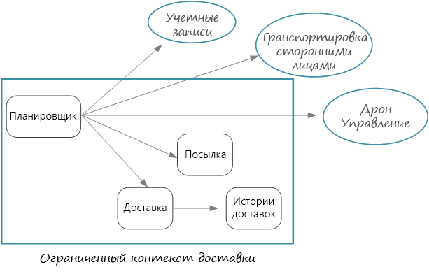
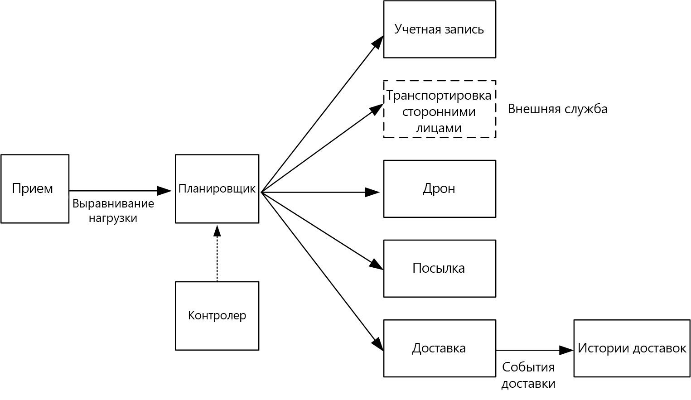

# Проектирование микрослужб: определение границ микрослужбыDesigning microservices: Identifying microservice boundaries

Какой размер является подходящим для микрослужбы?What is the right size for a microservice? Вам часто приходилось слышать ответ наподобие "не слишком большой и не слишком маленький". Это, конечно, верно, но как реализовать это на практике?You often hear something to the effect of, "not too big and not too small" &mdash; and while that's certainly correct, it's not very helpful in practice. Если вы начнете с тщательно разработанной модели предметной области, то так гораздо легче рассуждать о микрослужбах.But if you start from a carefully designed domain model, it's much easier to reason about microservices.

## От модели предметной области к микрослужбамFrom domain model to microservices

В [предыдущей части](./domain-analysis.md) мы определили набор ограниченных контекстов для приложения доставки с помощью дронов.In the [previous chapter](./domain-analysis.md), we defined a set of bounded contexts for the Drone Delivery application. Затем мы подробнее рассмотрели один из ограниченных контекстов, а именно ограниченный контекст доставки, и определили для него набор сущностей, статистических выражений и служб предметных областей.Then we looked more closely at one of these bounded contexts, the Shipping bounded context, and identified a set of entities, aggregates, and domain services for that bounded context.

Теперь вы готовы перейти от модели предметной области к разработке приложения.Now we're ready to go from domain model to application design. Ниже представлен подход, который можно использовать для определения микрослужб на основе модели предметной области.Here's an approach that you can use to derive microservices from the domain model.

1. Начните с ограниченного контекста.Start with a bounded context. В целом функциональность в микрослужбе не должна охватывать более одного ограниченного контекста.In general, the functionality in a microservice should not span more than one bounded context. Согласно определению ограниченный контекст помечает границу конкретной модели предметной области.By definition, a bounded context marks the boundary of a particular domain model. Если микрослужба охватывает разные модели предметной области, вам нужно вернуться назад и уточнить анализ предметной области.If you find that a microservice mixes different domain models together, that's a sign that you may need to go back and refine your domain analysis.

2. Затем проанализируйте статистические выражения в модели предметной области.Next, look at the aggregates in your domain model. Статистические выражения часто являются хорошими кандидатами для микрослужбы.Aggregates are often good candidates for microservices. Хорошо спроектированные статистические выражения демонстрируют характеристики хорошо спроектированной микрослужбы, например:A well-designed aggregate exhibits many of the characteristics of a well-designed microservice, such as:

    - Статистические выражения скорее происходят из бизнес-требований, нежели из технических соображений, таких как доступ к данным или обмен сообщениями.An aggregates is derived from business requirements, rather than technical concerns such as data access or messaging.  
    - Статистические выражения должны иметь высокую функциональную слаженность.An aggregate should have high functional cohesion.
    - Статистическое выражение является границей сохраняемости.An aggregate is a boundary of persistence.
    - Статистические выражения должны быть слабо связаны.Aggregates should be loosely coupled. 
    
3. Службы предметных областей также являются хорошими кандидатами для микрослужб.Domain services are also good candidates for microservices. Это операции без учета состояния в нескольких статистических выражениях.Domain services are stateless operations across multiple aggregates. Типичным примером является рабочий процесс, который охватывает несколько микрослужб.A typical example is a workflow that involves several microservices. Такой пример реализован в приложении доставки с помощью дронов.We'll see an example of this in the Drone Delivery application.

4. И наконец, рассмотрим требования, не касающиеся функциональности.Finally, consider non-functional requirements. Рассмотрите такие факторы, как размер команды, тип данных, технологии, требования к масштабируемости, доступности и безопасности.Look at factors such as team size, data types, technologies, scalability requirements, availability requirements, and security requirements. Возможно, из-за них вам придется разделить микрослужбу на две или более меньшие службы или сделать противоположное (объединить несколько микрослужб в одну).These factors may lead you to further decompose a microservice into two or more smaller services, or do the opposite and combine several microservices into one. 

Когда вы определите микрослужбы в приложении, поверьте структуру на соответствие следующим условиям:After you identify the microservices in your application, validate your design against the following criteria:

- Каждая из служб отвечает за одну функциональность.Each service has a single responsibility.
- Между службами отсутствуют частые вызовы.There are no chatty calls between services. Если после разделения функциональности на две службы они станут отправлять слишком много вызовов, это может быть признаком того, что функции принадлежат к одной службе.If splitting functionality into two services causes them to be overly chatty, it may be a symptom that these functions belong in the same service.
- Каждая из служб достаточно небольшая, так что ее может независимо создать команда из нескольких человек.Each service is small enough that it can be built by a small team working independently.
- Нет никаких взаимных зависимостей, из-за которых необходимо развертывать две или больше микрослужб в связке.There are no inter-dependencies that will require two or more services to be deployed in lock-step. Всегда должна быть возможность развернуть службу без повторного развертывания других служб.It should always be possible to deploy a service without redeploying any other services.
- Службы не имеют тесной связи и могут развиваться независимо.Services are not tightly coupled, and can evolve independently.
- Границы вашей службы не будут создавать проблем с согласованностью или целостностью данных.Your service boundaries will not create problems with data consistency or integrity. Иногда важно поддерживать согласованность данных, разместив функциональность в одной микрослужбе.Sometimes it's important to maintain data consistency by putting functionality into a single microservice. Тем не менее, подумайте, действительно ли вам нужна высокая согласованность.That said, consider whether you really need strong consistency. Существуют стратегии для обеспечения итоговой согласованности в распределенной системе, а преимущества декомпозиции служб часто перевешивают проблемы поддержки такой согласованности.There are strategies for addressing eventual consistency in a distributed system, and the benefits of decomposing services often outweigh the challenges of managing eventual consistency.

Прежде всего, важно быть прагматичным и помнить, что предметно-ориентированное проектирование является итеративным процессом.Above all, it's important to be pragmatic, and remember that domain-driven design is an iterative process. В случае сомнений начинайте с недетализированных микрослужб.When in doubt, start with more coarse-grained microservices. Разделить микрослужбу на две меньшие службы проще, чем выполнить рефакторинг функциональности между несколькими существующими микрослужбами.Splitting a microservice into two smaller services is easier than refactoring functionality across several existing microservices.
  
## Доставка с помощью дронов: определение микрослужбDrone Delivery: Defining the microservices

Напомним, что команда разработчиков определила четыре статистических выражения &mdash; "Доставка", "Посылка", "Дрон" и "Учетная запись" &mdash; и две службы предметных областей "Планировщик" и "Контролер".Recall that the development team had identified the four aggregates &mdash; Delivery, Package, Drone, and Account &mdash; and two domain services, Scheduler and Supervisor. 

"Доставка" и "Посылка" являются очевидными кандидатами для микрослужб.Delivery and Package are obvious candidates for microservices. "Планировщик" и "Контролер" координируют действия, выполняемые другими микрослужбами, поэтому имеет смысл внедрить эти службы предметных областей в качестве микрослужб.The Scheduler and Supervisor coordinate the activities performed by other microservices, so it makes sense to implement these domain services as microservices.  

"Дрон" и "Учетная запись" интересны тем, что они принадлежат к другим ограниченным контекстам.Drone and Account are interesting because they belong to other bounded contexts. Один из вариантов заключается в том, чтобы "Планировщик" напрямую вызывал ограниченные контексты "Дрон" и "Учетная запись".One option is for the Scheduler to call the Drone and Account bounded contexts directly. Также можно создать микрослужбы"Дрон" и "Учетная запись" внутри ограниченного контекста доставки.Another option is to create Drone and Account microservices inside the Shipping bounded context. Эти микрослужбы будут посредниками между ограниченными контекстами, предоставляя API или схемы данных, которые более подходят для контекста доставки.These microservices would mediate between the bounded contexts, by exposing APIs or data schemas that are more suited to the Shipping context.

Подробности об ограниченных контекстах "Дрон" и "Учетная запись" выходят за рамки этого руководства, поэтому мы создали для них макеты служб в нашей эталонной реализации.The details of the Drone and Account bounded contexts are beyond the scope of this guidance, so we created mock services for them in our reference implementation. Но в этой ситуации необходимо учитывать некоторые факторы:But here are some factors to consider in this situation:

- Какова нагрузка на сеть для прямого вызова другого ограниченного контекста?What is the network overhead of calling directly into the other bounded context? 

- Подходит ли схема данных другого ограниченного контекста для этого контекста или лучше иметь схему, предназначенную для этого ограниченного контекста?Is the data schema for the other bounded context suitable for this context, or is it better to have a schema that's tailored to this bounded context? 

- Является ли другой ограниченный контекст устаревшей системой?Is the other bounded context a legacy system? Если так, то можно создать службу, которая действует как [уровень защиты от повреждений](../patterns/anti-corruption-layer.md) для преобразования между старой системой и современным приложением.If so, you might create a service that acts as an [anti-corruption layer](../patterns/anti-corruption-layer.md) to translate between the legacy system and the modern application. 

- Какова структура команды?What is the team structure? Легко ли взаимодействовать с командой, ответственной за другой ограниченный контекст?Is it easy to communicate with the team that's responsible for the other bounded context? Если нет, тогда создайте службу, которая будет посредником между двумя контекстами, что может помочь снизить стоимость взаимодействия между командами.If not, creating a service that mediates between the two contexts can help to mitigate the cost of cross-team communication.

До сих пор мы не рассматривали каких-либо нефункциональных требований.So far, we haven't considered any non-functional requirements. Думая о требованиях к пропускной способности приложений, команда разработчиков решила создать отдельную микрослужбу приема, которая отвечает за прием клиентских запросов.Thinking about the application's throughput requirements, the development team decided to create a separate Ingestion microservice that is responsible for ingesting client requests. Эта микрослужба будет выполнять [выравнивание нагрузки](../patterns/queue-based-load-leveling.md), помещая входящие запросы в буфер для обработки.This microservice will implement [load leveling](../patterns/queue-based-load-leveling.md) by putting incoming requests into a buffer for processing. Планировщик будет считывать запросы из буфера и выполнять рабочий процесс.The Scheduler will read the requests from the buffer and execute the workflow. 

Чтобы удовлетворить нефункциональные требования, команде пришлось создать еще одну дополнительную службу.Non-functional requirements led the team to create one additional service. До сих пор все службы касались процесса планирования и доставки посылок в режиме реального времени.All of the services so far have been about the process of scheduling and delivering packages in real time. Но для анализа данных системе также необходимо сохранять историю каждой доставки в объект для долговременного хранения.But the system also needs to store the history of every delivery in long-term storage for data analysis. Команда возложила ответственность за это на службу доставки.The team considered making this the responsibility of the Delivery service. Тем не менее, требования к хранилищу данных совершенно различны для исторического анализа и текущих операций (см. [рекомендации в отношении данных](./data-considerations.md)).However, the data storage requirements are quite different for historical analysis versus in-flight operations (see [Data considerations](./data-considerations.md)). Поэтому команда решила создать отдельную службу истории доставки, которая будет прослушивать события для отслеживания доставки из службы доставки и записывать их в долговременное хранилище.Therefore, the team decided to create a separate Delivery History service, which will listen for DeliveryTracking events from the Delivery service and write the events into long-term storage.

На следующей схеме показана структура на этом конкретном этапе:The following diagram shows the design at this point:
 

## Выбор варианта вычисленияChoosing a compute option

Термин *вычислительная служба* означает модель размещения вычислительных ресурсов, которые используются для выполнения приложения.The term *compute* refers to the hosting model for the computing resources that your application runs on. Для архитектуры микрослужб особенно популярными являются два подхода:For a microservices architecture, two approaches are especially popular:

- Служба оркестратора, которая управляет службами, выполняющимися на выделенных узлах (виртуальных машинах).A service orchestrator that manages services running on dedicated nodes (VMs).
- Бессерверная архитектура, которая использует функции как услугу (FaaS).A serverless architecture using functions as a service (FaaS). 

Хотя это не единственные варианты, они оба являются проверенными подходами к созданию микрослужб.While these aren't the only options, they are both proven approaches to building microservices. В приложение могут быть включены оба эти подхода.An application might include both approaches.

### Оркестраторы службService orchestrators

Оркестратор выполняет задачи, связанные с развертыванием набора служб и управлением ним.An orchestrator handles tasks related to deploying and managing a set of services. К этим задачам относятся размещение служб на узлах, мониторинг состояния работоспособности служб, перезапуск неработоспособных служб, балансировка нагрузки сетевого трафика между экземплярами службы, обнаружение служб, масштабирование количества экземпляров службы и применение обновления конфигурации.These tasks include placing services on nodes, monitoring the health of services, restarting unhealthy services, load balancing network traffic across service instances, service discovery, scaling the number of instances of a service, and applying configuration updates. Популярными оркестрами являются Kubernetes, DC/OS, Docker Swarm и Service Fabric.Popular orchestrators include Kubernetes, DC/OS, Docker Swarm, and Service Fabric. 

- [Служба контейнеров Azure](/azure/container-service/) (ACS) — это служба Azure, которая позволяет развертывать готовые для рабочей среды кластеры Kubernetes, DC/OS или Docker Swarm.[Azure Container Service](/azure/container-service/) (ACS) is an Azure service that lets you deploy a production-ready Kubernetes, DC/OS, or Docker Swarm cluster.

- [Служба контейнеров Azure](/azure/aks/) (AKS) является управляемой службой Kubernetes.[AKS (Azure Container Service)](/azure/aks/) is a managed Kubernetes service. AKS реализует среду Kubernetes и предоставляет конечные точки API Kubernetes, а также содержит и администрирует плоскость управления Kubernetes, выполняя автоматические обновления, автоматическое исправление, автомасштабирование и другие задачи управления.AKS provisions Kubernetes and exposes the Kubernetes API endpoints, but hosts and manages the Kubernetes control plane, performing automated upgrades, automated patching, autoscaling, and other management tasks. Вы можете думать об AKS как о "программных интерфейсах API Kubernetes как услуге".You can think of AKS as being "Kubernetes APIs as a service." В момент написания этой статьи доступна предварительная версия AKS.At the time of writing, AKS is still in preview. Тем не менее, ожидается, что AKS станет предпочтительным вариантом для выполнения Kubernetes в Azure.However, it's expected that AKS will become the preferred way to run Kubernetes in Azure. 

- [Service Fabric](/azure/service-fabric/) — это платформа распределенных систем для упаковки и развертывания микрослужб, а также управления ими.[Service Fabric](/azure/service-fabric/) is a distributed systems platform for packaging, deploying, and managing microservices. Микрослужбы могут быть развернуты в Service Fabric в виде контейнеров, исполняемых двоичных файлов или [Reliable Services](/azure/service-fabric/service-fabric-reliable-services-introduction).Microservices can be deployed to Service Fabric as containers, as binary executables, or as [Reliable Services](/azure/service-fabric/service-fabric-reliable-services-introduction). Используя модель программирования Reliable Services, службы могут напрямую использовать API программирования Service Fabric, чтобы отправлять запросы к системе, формировать отчеты о состоянии, получать уведомления об изменениях конфигурации и кода, а также обнаруживать другие службы.Using the Reliable Services programming model, services can directly use Service Fabric programming APIs to query the system, report health, receive notifications about configuration and code changes, and discover other services. Ключевое отличие Service Fabric — активная ориентация на создание служб с отслеживанием состояния с использованием [Reliable Collections](/azure/service-fabric/service-fabric-reliable-services-reliable-collections).A key differentiation with Service Fabric is its strong focus on building stateful services using [Reliable Collections](/azure/service-fabric/service-fabric-reliable-services-reliable-collections).

### КонтейнерыContainers

Иногда о контейнерах и микрослужбах говорят так, как будто это одно и то же.Sometimes people talk about containers and microservices as if they were the same thing. Это в корне неверно. Для создания микрослужб не нужны контейнеры. Тем не менее, контейнеры имеют некоторые преимущества, которые особенно актуальны для микрослужб, в частности:While that's not true &mdash; you don't need containers to build microservices &mdash; containers do have some benefits that are particularly relevant to microservices, such as:

- **Мобильность.****Portability**. Образ контейнера представляет собой изолированный пакет, для запуска которого не нужно устанавливать библиотеки или другие зависимости.A container image is a standalone package that runs without needing to install libraries or other dependencies. Благодаря этому их легче развертывать.That makes them easy to deploy. Контейнеры можно быстро запустить и остановить, что позволяет развернуть новые экземпляры, чтобы обрабатывать большую нагрузку или восстанавливаться после сбоев узлов.Containers can be started and stopped quickly, so you can spin up new instances to handle more load or to recover from node failures. 

- **Плотность**.**Density**. По сравнению с виртуальными машинами, контейнеры имеют меньшую плотность, так как они совместно используют ресурсы ОС.Containers are lightweight compared with running a virtual machine, because they share OS resources. Благодаря этому можно упаковать несколько контейнеров в единый узел, что особенно полезно, когда приложение состоит из множества небольших служб.That makes it possible to pack multiple containers onto a single node, which is especially useful when the application consists of many small services.

- **Изоляция ресурсов**.**Resource isolation**. Вы можете ограничить объем ресурсов памяти и ЦП, которые доступны для контейнера, чтобы неконтролируемый процесс не исчерпал ресурсы узла.You can limit the amount of memory and CPU that is available to a container, which can help to ensure that a runaway process doesn't exhaust the host resources. Дополнительные сведения см. в статье [Шаблон отсеков](../patterns/bulkhead.md).See the [Bulkhead Pattern](../patterns/bulkhead.md) for more information.

### Бессерверная архитектура (функции как услуга)Serverless (Functions as a Service)

При использовании бессерверной архитектуры не нужно управлять виртуальными машинами или инфраструктурой виртуальных сетей.With a serverless architecture, you don't manage the VMs or the virtual network infrastructure. Вместо этого, вы развертываете код, который будет передан службой размещения в виртуальную машину для выполнения.Instead, you deploy code and the hosting service handles putting that code onto a VM and executing it. Этот подход поддерживает небольшие детализированные функции, которые координируются с использованием триггеров, основанных на событиях.This approach tends to favor small granular functions that are coordinated using event-based triggers. Например, сообщение, помещенное в очередь, может запустить функцию, которая считывает из очереди и обрабатывает сообщение.For example, a message being placed onto a queue might trigger a function that reads from the queue and processes the message.

[Функции Azure][functions] — это независимая от сервера служба вычислений, которая поддерживает различные триггеры функций, в том числе HTTP-запросы, очереди служебной шины и события концентраторов событий.[Azure Functions][functions] is a serverless compute service that supports various function triggers, including HTTP requests, Service Bus queues, and Event Hubs events. Полный список см. в статье [Основные понятия триггеров и привязок в Функциях Azure][functions-triggers].For a complete list, see [Azure Functions triggers and bindings concepts][functions-triggers]. Также рассмотрите возможность использования [Сетки событий Azure][event-grid]. Это управляемая служба маршрутизации событий в Azure.Also consider [Azure Event Grid][event-grid], which is a managed event routing service in Azure.

### Архитектура с оркестрацией или независимая от сервераOrchestrator or serverless?

Ниже приведено несколько факторов, которые нужно учитывать при выборе между архитектурой с оркестратором и бессерверной архитектурой.Here are some factors to consider when choosing between an orchestrator approach and a serverless approach.

**Управляемость**. Бессерверными приложениями легче управлять, так как всеми вычислительными ресурсами управляет платформа.**Manageability** A serverless application is easy to manage, because the platform manages all the of compute resources for you. При использовании оркестратора некоторые аспекты администрирования и настройки кластера представлены на абстрактном уровне, он не полностью скрывает базовые виртуальные машины.While an orchestrator abstracts some aspects of managing and configuring a cluster, it does not completely hide the underlying VMs. При использовании оркестратора вам будет необходимо думать о таких проблемах, как балансировка нагрузки, использование ЦП и памяти, а также работа сети.With an orchestrator, you will need to think about issues such as load balancing, CPU and memory usage, and networking.

**Гибкость и контроль**.**Flexibility and control**. С помощью оркестратора у вас появится больше контроля над настройкой служб и кластера, а также управлением ими.An orchestrator gives you a great deal of control over configuring and managing your services and the cluster. Компромисс является дополнительной сложностью.The tradeoff is additional complexity. При использовании бессерверной архитектуры вы теряете некоторую часть контроля, так как эти детали абстрагированы.With a serverless architecture, you give up some degree of control because these details are abstracted.

**Мобильность.****Portability**. Все перечисленные здесь оркестраторы (Kubernetes, DC/OS, Docker Swarm и Service Fabric) могут работать в локальной среде или в нескольких общедоступных облаках.All of the orchestrators listed here (Kubernetes, DC/OS, Docker Swarm, and Service Fabric) can run on-premises or in multiple public clouds. 

**Интеграция приложений**.**Application integration**. Создание сложного приложения с бессерверной архитектурой может оказаться трудной задачей.It can be challenging to build a complex application using a serverless architecture. Единственным вариантом в Azure является использование [Azure Logic Apps](/azure/logic-apps/) для координации набора функций Azure.One option in Azure is to use [Azure Logic Apps](/azure/logic-apps/) to coordinate a set of Azure Functions. Пример этого подхода представлен в статье [Создание функции, интегрируемой с Azure Logic Apps](/azure/azure-functions/functions-twitter-email).For an example of this approach, see [Create a function that integrates with Azure Logic Apps](/azure/azure-functions/functions-twitter-email).

**Стоимость**.**Cost**. С оркестратором вы платите за виртуальные машины, которые работают в кластере.With an orchestrator, you pay for the VMs that are running in the cluster. С независимым от сервера приложением вы платите только за фактически использованные вычислительные ресурсы.With a serverless application, you pay only for the actual compute resources consumed. В обоих случаях вам необходимо учитывать стоимость любых дополнительных служб, таких как хранилища, базы данных и службы обмена сообщениями.In both cases, you need to factor in the cost of any additional services, such as storage, databases, and messaging services.

**Масштабируемость**.**Scalability**. Функции Azure масштабируются автоматически в соответствии с требованиями в зависимости от числа входящих событий.Azure Functions scales automatically to meet demand, based on the number of incoming events. При использовании оркестратора вы можете выполнить масштабирование, увеличив количество экземпляров службы, запущенных в кластере.With an orchestrator, you can scale out by increasing the number of service instances running in the cluster. Вы также можете изменить масштаб, добавив дополнительные виртуальные машины в кластер.You can also scale by adding additional VMs to the cluster.

В эталонной реализации в основном используется Kubernetes, но мы также использовали службу "Функции Azure" для службы "История доставки".Our reference implementation primarily uses Kubernetes, but we did use Azure Functions for one service, namely the Delivery History service. Функции Azure подходят этой конкретной службе, так как это управляемая событиями рабочая нагрузка.Azure Functions was a good fit for this particular service, because it's is an event-driven workload. Так как для вызова функции используется триггер концентраторов событий, службе требуется минимальное количество кода.By using an Event Hubs trigger to invoke the function, the service needed a minimal amount of code. Кроме того, служба "История доставки" не является частью основного рабочего процесса, поэтому ее запуск за пределами кластера Kubernetes не повлияет на совокупную задержку инициированных пользователем операций.Also, the Delivery History service is not part of the main workflow, so running it outside of the Kubernetes cluster doesn't affect the end-to-end latency of user-initiated operations. 

> [!div class="nextstepaction"]
> [Рекомендации в отношении данныхData considerations](./data-considerations.md)

<!-- links -->

[acs-engine]: https://github.com/Azure/acs-engine
[acs-faq]: /azure/container-service/dcos-swarm/container-service-faq
[event-grid]: /azure/event-grid/
[functions]: /azure/azure-functions/functions-overview
[functions-triggers]: /azure/azure-functions/functions-triggers-bindings
