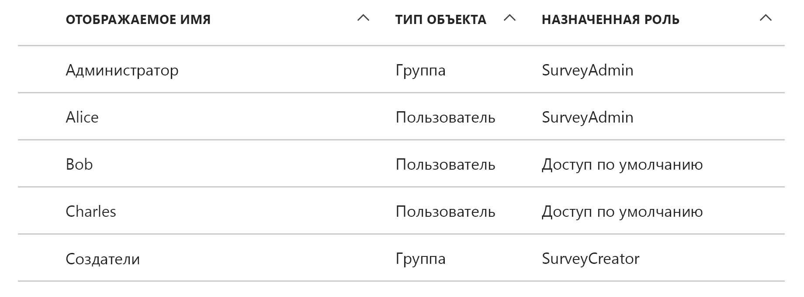
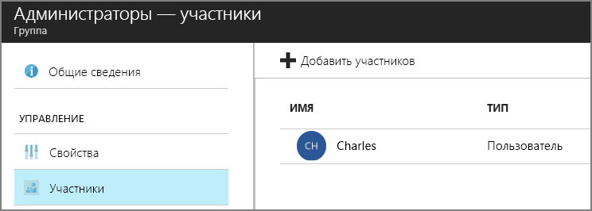

# <a name="application-roles"></a><span data-ttu-id="a9e6d-103">Роли приложений</span><span class="sxs-lookup"><span data-stu-id="a9e6d-103">Application roles</span></span>

<span data-ttu-id="a9e6d-104">[ Пример кода][sample application]</span><span class="sxs-lookup"><span data-stu-id="a9e6d-104">[ Sample code][sample application]</span></span>

<span data-ttu-id="a9e6d-105">Роли приложения используются для назначения разрешений пользователям.</span><span class="sxs-lookup"><span data-stu-id="a9e6d-105">Application roles are used to assign permissions to users.</span></span> <span data-ttu-id="a9e6d-106">Например, приложение [Tailspin Surveys][tailspin] определяет следующие роли:</span><span class="sxs-lookup"><span data-stu-id="a9e6d-106">For example, the [Tailspin Surveys][tailspin] application defines the following roles:</span></span>

* <span data-ttu-id="a9e6d-107">Администратор.</span><span class="sxs-lookup"><span data-stu-id="a9e6d-107">Administrator.</span></span> <span data-ttu-id="a9e6d-108">Может выполнять все операции CRUD в любом опросе, принадлежащем этому клиенту.</span><span class="sxs-lookup"><span data-stu-id="a9e6d-108">Can perform all CRUD operations on any survey that belongs to that tenant.</span></span>
* <span data-ttu-id="a9e6d-109">Создатель.</span><span class="sxs-lookup"><span data-stu-id="a9e6d-109">Creator.</span></span> <span data-ttu-id="a9e6d-110">Может создавать опросы.</span><span class="sxs-lookup"><span data-stu-id="a9e6d-110">Can create new surveys.</span></span>
* <span data-ttu-id="a9e6d-111">Читатель.</span><span class="sxs-lookup"><span data-stu-id="a9e6d-111">Reader.</span></span> <span data-ttu-id="a9e6d-112">Может читать все опросы, принадлежащие этому клиенту.</span><span class="sxs-lookup"><span data-stu-id="a9e6d-112">Can read any surveys that belong to that tenant.</span></span>

<span data-ttu-id="a9e6d-113">В конечном счете роли преобразуются в разрешения во время [авторизации].</span><span class="sxs-lookup"><span data-stu-id="a9e6d-113">You can see that roles ultimately get translated into permissions, during [authorization].</span></span> <span data-ttu-id="a9e6d-114">Однако сначала нужно ответить на первый вопрос, касающийся назначения ролей и управления ими.</span><span class="sxs-lookup"><span data-stu-id="a9e6d-114">But the first question is how to assign and manage roles.</span></span> <span data-ttu-id="a9e6d-115">Мы определили три основных варианта:</span><span class="sxs-lookup"><span data-stu-id="a9e6d-115">We identified three main options:</span></span>

* [<span data-ttu-id="a9e6d-116">роли приложения Azure AD</span><span class="sxs-lookup"><span data-stu-id="a9e6d-116">Azure AD App Roles</span></span>](#roles-using-azure-ad-app-roles)
* [<span data-ttu-id="a9e6d-117">группы безопасности Azure AD</span><span class="sxs-lookup"><span data-stu-id="a9e6d-117">Azure AD security groups</span></span>](#roles-using-azure-ad-security-groups)
* <span data-ttu-id="a9e6d-118">[диспетчер ролей приложения](#roles-using-an-application-role-manager).</span><span class="sxs-lookup"><span data-stu-id="a9e6d-118">[Application role manager](#roles-using-an-application-role-manager).</span></span>

## <a name="roles-using-azure-ad-app-roles"></a><span data-ttu-id="a9e6d-119">Роли, использующие роли приложения Azure AD</span><span class="sxs-lookup"><span data-stu-id="a9e6d-119">Roles using Azure AD App Roles</span></span>

<span data-ttu-id="a9e6d-120">Это подход, который использовался в приложении Tailspin Surveys.</span><span class="sxs-lookup"><span data-stu-id="a9e6d-120">This is the approach that we used in the Tailspin Surveys app.</span></span>

<span data-ttu-id="a9e6d-121">Здесь поставщик SaaS определяет роли приложения, добавляя их в манифест приложения.</span><span class="sxs-lookup"><span data-stu-id="a9e6d-121">In this approach, The SaaS provider defines the application roles by adding them to the application manifest.</span></span> <span data-ttu-id="a9e6d-122">После регистрации клиента администратор каталога AD клиента назначает роли пользователям.</span><span class="sxs-lookup"><span data-stu-id="a9e6d-122">After a customer signs up, an admin for the customer's AD directory assigns users to the roles.</span></span> <span data-ttu-id="a9e6d-123">Когда пользователь входит в систему, назначенные роли отправляются в виде утверждений.</span><span class="sxs-lookup"><span data-stu-id="a9e6d-123">When a user signs in, the user's assigned roles are sent as claims.</span></span>

> [!NOTE]
> <span data-ttu-id="a9e6d-124">Если у клиента установлена служба Azure AD Premium, администратор может назначить роль группе безопасности, и участники группы будут наследовать роль приложения.</span><span class="sxs-lookup"><span data-stu-id="a9e6d-124">If the customer has Azure AD Premium, the admin can assign a security group to a role, and members of the group will inherit the app role.</span></span> <span data-ttu-id="a9e6d-125">Это удобный способ управления ролями, поскольку владельцу группы не нужно быть администратором AD.</span><span class="sxs-lookup"><span data-stu-id="a9e6d-125">This is a convenient way to manage roles, because the group owner doesn't need to be an AD admin.</span></span>

<span data-ttu-id="a9e6d-126">Преимущества этого подхода:</span><span class="sxs-lookup"><span data-stu-id="a9e6d-126">Advantages of this approach:</span></span>

* <span data-ttu-id="a9e6d-127">Простая модель программирования.</span><span class="sxs-lookup"><span data-stu-id="a9e6d-127">Simple programming model.</span></span>
* <span data-ttu-id="a9e6d-128">Роли соответствуют конкретному приложению.</span><span class="sxs-lookup"><span data-stu-id="a9e6d-128">Roles are specific to the application.</span></span> <span data-ttu-id="a9e6d-129">Утверждения ролей для одного приложения не отправляются в другое приложение.</span><span class="sxs-lookup"><span data-stu-id="a9e6d-129">The role claims for one application are not sent to another application.</span></span>
* <span data-ttu-id="a9e6d-130">Если клиент удаляет приложение из своего клиента AD, роли также удаляются.</span><span class="sxs-lookup"><span data-stu-id="a9e6d-130">If the customer removes the application from their AD tenant, the roles go away.</span></span>
* <span data-ttu-id="a9e6d-131">Приложению не требуются дополнительные разрешения Active Directory, кроме разрешения на чтение профиля пользователя.</span><span class="sxs-lookup"><span data-stu-id="a9e6d-131">The application doesn't need any extra Active Directory permissions, other than reading the user's profile.</span></span>

<span data-ttu-id="a9e6d-132">Недостатки:</span><span class="sxs-lookup"><span data-stu-id="a9e6d-132">Drawbacks:</span></span>

* <span data-ttu-id="a9e6d-133">Клиенты, не имеющие Azure AD Premium, не могут назначать роли группам безопасности.</span><span class="sxs-lookup"><span data-stu-id="a9e6d-133">Customers without Azure AD Premium cannot assign security groups to roles.</span></span> <span data-ttu-id="a9e6d-134">Для этих клиентов все назначения пользователей должен выполнять администратор AD.</span><span class="sxs-lookup"><span data-stu-id="a9e6d-134">For these customers, all user assignments must be done by an AD administrator.</span></span>
* <span data-ttu-id="a9e6d-135">Если вы используете отдельную серверную часть веб-API, назначения ролей для веб-приложения не применяются к веб-API.</span><span class="sxs-lookup"><span data-stu-id="a9e6d-135">If you have a backend web API, which is separate from the web app, then role assignments for the web app don't apply to the web API.</span></span> <span data-ttu-id="a9e6d-136">Более подробно этот вопрос рассматривается в статье об [обеспечении безопасности серверного веб-API].</span><span class="sxs-lookup"><span data-stu-id="a9e6d-136">For more discussion of this point, see [Securing a backend web API].</span></span>

### <a name="implementation"></a><span data-ttu-id="a9e6d-137">Реализация</span><span class="sxs-lookup"><span data-stu-id="a9e6d-137">Implementation</span></span>

<span data-ttu-id="a9e6d-138">**Определение ролей.**</span><span class="sxs-lookup"><span data-stu-id="a9e6d-138">**Define the roles.**</span></span> <span data-ttu-id="a9e6d-139">Поставщик SaaS объявляет роли приложения в [манифесте приложения].</span><span class="sxs-lookup"><span data-stu-id="a9e6d-139">The SaaS provider declares the app roles in the [application manifest].</span></span> <span data-ttu-id="a9e6d-140">Например, вот запись манифеста для приложения Surveys:</span><span class="sxs-lookup"><span data-stu-id="a9e6d-140">For example, here is the manifest entry for the Surveys app:</span></span>

```json
"appRoles": [
  {
    "allowedMemberTypes": [
      "User"
    ],
    "description": "Creators can create Surveys",
    "displayName": "SurveyCreator",
    "id": "1b4f816e-5eaf-48b9-8613-7923830595ad",
    "isEnabled": true,
    "value": "SurveyCreator"
  },
  {
    "allowedMemberTypes": [
      "User"
    ],
    "description": "Administrators can manage the Surveys in their tenant",
    "displayName": "SurveyAdmin",
    "id": "c20e145e-5459-4a6c-a074-b942bbd4cfe1",
    "isEnabled": true,
    "value": "SurveyAdmin"
  }
],
```

<span data-ttu-id="a9e6d-141">Свойство `value` отображается в утверждении роли.</span><span class="sxs-lookup"><span data-stu-id="a9e6d-141">The `value`  property appears in the role claim.</span></span> <span data-ttu-id="a9e6d-142">Свойство `id` является уникальным идентификатором для определенной роли.</span><span class="sxs-lookup"><span data-stu-id="a9e6d-142">The `id` property is the unique identifier for the defined role.</span></span> <span data-ttu-id="a9e6d-143">Всегда создает новое значение GUID для `id`.</span><span class="sxs-lookup"><span data-stu-id="a9e6d-143">Always generate a new GUID value for `id`.</span></span>

<span data-ttu-id="a9e6d-144">**Назначение пользователей**.</span><span class="sxs-lookup"><span data-stu-id="a9e6d-144">**Assign users**.</span></span> <span data-ttu-id="a9e6d-145">Во время регистрации нового клиента приложение регистрируется в клиенте AD.</span><span class="sxs-lookup"><span data-stu-id="a9e6d-145">When a new customer signs up, the application is registered in the customer's AD tenant.</span></span> <span data-ttu-id="a9e6d-146">На этом этапе администратор AD этого клиента может назначить роли пользователям.</span><span class="sxs-lookup"><span data-stu-id="a9e6d-146">At this point, an AD admin for that tenant can assign users to roles.</span></span>

> [!NOTE]
> <span data-ttu-id="a9e6d-147">Как отмечалось ранее, клиенты с Azure AD Premium также могут назначать роли группам безопасности.</span><span class="sxs-lookup"><span data-stu-id="a9e6d-147">As noted earlier, customers with Azure AD Premium can also assign security groups to roles.</span></span>

<span data-ttu-id="a9e6d-148">На приведенном ниже снимке экрана с портала Azure представлены пользователи и группы в приложении Survey.</span><span class="sxs-lookup"><span data-stu-id="a9e6d-148">The following screenshot from the Azure portal shows users and groups for the Survey application.</span></span> <span data-ttu-id="a9e6d-149">Группы администраторов и создателей присвоены ролям SurveyAdmin и SurveyCreator соответственно.</span><span class="sxs-lookup"><span data-stu-id="a9e6d-149">Admin and Creator are groups, assigned to SurveyAdmin and SurveyCreator roles respectively.</span></span> <span data-ttu-id="a9e6d-150">Пользователю Алиса напрямую присвоена роль SurveyAdmin.</span><span class="sxs-lookup"><span data-stu-id="a9e6d-150">Alice is a user who was assigned directly to the SurveyAdmin role.</span></span> <span data-ttu-id="a9e6d-151">Пользователям Боб и Чарльз роли напрямую не присвоены.</span><span class="sxs-lookup"><span data-stu-id="a9e6d-151">Bob and Charles are users that have not been directly assigned to a role.</span></span>



<span data-ttu-id="a9e6d-153">Как вы видите на приведенном ниже снимке экрана, Чарльз входит в группу администраторов и наследует от нее роль SurveyAdmin.</span><span class="sxs-lookup"><span data-stu-id="a9e6d-153">As shown in the following screenshot, Charles is part of the Admin group, so he inherits the SurveyAdmin role.</span></span> <span data-ttu-id="a9e6d-154">Что касается пользователя Боб, ему пока не присвоена роль.</span><span class="sxs-lookup"><span data-stu-id="a9e6d-154">In the case of Bob, he has not been assigned a role yet.</span></span>



> [!NOTE]
> <span data-ttu-id="a9e6d-156">Есть и другой вариант. Приложение может назначать роли программным способом с помощью API Graph Azure AD.</span><span class="sxs-lookup"><span data-stu-id="a9e6d-156">An alternative approach is for the application to assign roles programmatically, using the Azure AD Graph API.</span></span> <span data-ttu-id="a9e6d-157">Однако для этого приложение должно получить разрешения на запись в каталог AD клиента.</span><span class="sxs-lookup"><span data-stu-id="a9e6d-157">However, this requires the application to obtain write permissions for the customer's AD directory.</span></span> <span data-ttu-id="a9e6d-158">Приложения с такими разрешениями могут вызвать большие проблемы, ведь клиент доверяет приложению поддерживать порядок в каталоге.</span><span class="sxs-lookup"><span data-stu-id="a9e6d-158">An application with those permissions could do a lot of mischief &mdash; the customer is trusting the app not to mess up their directory.</span></span> <span data-ttu-id="a9e6d-159">Возможно, многие клиенты не захотят предоставлять этот уровень доступа.</span><span class="sxs-lookup"><span data-stu-id="a9e6d-159">Many customers might be unwilling to grant this level of access.</span></span>

<span data-ttu-id="a9e6d-160">**Получение утверждения ролей**.</span><span class="sxs-lookup"><span data-stu-id="a9e6d-160">**Get role claims**.</span></span> <span data-ttu-id="a9e6d-161">При входе пользователя в систему приложение получает назначенные роли пользователя в утверждении с типом `http://schemas.microsoft.com/ws/2008/06/identity/claims/role`.</span><span class="sxs-lookup"><span data-stu-id="a9e6d-161">When a user signs in, the application receives the user's assigned role(s) in a claim with type `http://schemas.microsoft.com/ws/2008/06/identity/claims/role`.</span></span>

<span data-ttu-id="a9e6d-162">Пользователь может иметь несколько ролей или вообще не иметь ролей.</span><span class="sxs-lookup"><span data-stu-id="a9e6d-162">A user can have multiple roles, or no role.</span></span> <span data-ttu-id="a9e6d-163">Создавая код авторизации, не следует предполагать, что у пользователя есть только одно утверждение роли.</span><span class="sxs-lookup"><span data-stu-id="a9e6d-163">In your authorization code, don't assume the user has exactly one role claim.</span></span> <span data-ttu-id="a9e6d-164">Наоборот, напишите код, который проверяет наличие значения определенного утверждения, как показано ниже.</span><span class="sxs-lookup"><span data-stu-id="a9e6d-164">Instead, write code that checks whether a particular claim value is present:</span></span>

```csharp
if (context.User.HasClaim(ClaimTypes.Role, "Admin")) { ... }
```

## <a name="roles-using-azure-ad-security-groups"></a><span data-ttu-id="a9e6d-165">Роли, использующие группы безопасности Azure AD</span><span class="sxs-lookup"><span data-stu-id="a9e6d-165">Roles using Azure AD security groups</span></span>

<span data-ttu-id="a9e6d-166">В этом случае роли представлены в виде групп безопасности AD.</span><span class="sxs-lookup"><span data-stu-id="a9e6d-166">In this approach, roles are represented as AD security groups.</span></span> <span data-ttu-id="a9e6d-167">Приложение назначает разрешения пользователям на основе их членства в группах безопасности.</span><span class="sxs-lookup"><span data-stu-id="a9e6d-167">The application assigns permissions to users based on their security group memberships.</span></span>

<span data-ttu-id="a9e6d-168">Преимущества:</span><span class="sxs-lookup"><span data-stu-id="a9e6d-168">Advantages:</span></span>

* <span data-ttu-id="a9e6d-169">этот подход позволяет клиентам, у которых не установлена служба Azure AD Premium, использовать группы безопасности для управления назначениями ролей.</span><span class="sxs-lookup"><span data-stu-id="a9e6d-169">For customers who do not have Azure AD Premium, this approach enables the customer to use security groups to manage role assignments.</span></span>

<span data-ttu-id="a9e6d-170">Недостатки:</span><span class="sxs-lookup"><span data-stu-id="a9e6d-170">Disadvantages:</span></span>

* <span data-ttu-id="a9e6d-171">сложность.</span><span class="sxs-lookup"><span data-stu-id="a9e6d-171">Complexity.</span></span> <span data-ttu-id="a9e6d-172">Поскольку каждый клиент отправляет разные утверждения групп, приложение должно отслеживать соответствие групп безопасности ролям приложения для каждого клиента.</span><span class="sxs-lookup"><span data-stu-id="a9e6d-172">Because every tenant sends different group claims, the app must keep track of which security groups correspond to which application roles, for each tenant.</span></span>
* <span data-ttu-id="a9e6d-173">Если клиент удаляет приложение из своего клиента AD, группы безопасности остаются в каталоге AD.</span><span class="sxs-lookup"><span data-stu-id="a9e6d-173">If the customer removes the application from their AD tenant, the security groups are left in their AD directory.</span></span>

<!-- markdownlint-disable MD024 -->

### <a name="implementation"></a><span data-ttu-id="a9e6d-174">Реализация</span><span class="sxs-lookup"><span data-stu-id="a9e6d-174">Implementation</span></span>

<!-- markdownlint-enable MD024 -->

<span data-ttu-id="a9e6d-175">В манифесте приложения задайте свойству `groupMembershipClaims` значение "SecurityGroup".</span><span class="sxs-lookup"><span data-stu-id="a9e6d-175">In the application manifest, set the `groupMembershipClaims` property to "SecurityGroup".</span></span> <span data-ttu-id="a9e6d-176">Это необходимо для получения утверждений членства в группах из Azure AD.</span><span class="sxs-lookup"><span data-stu-id="a9e6d-176">This is needed to get group membership claims from AAD.</span></span>

```json
{
   // ...
   "groupMembershipClaims": "SecurityGroup",
}
```

<span data-ttu-id="a9e6d-177">При регистрации нового клиента приложение указывает на необходимость создания групп безопасности для ролей, требуемых для приложения.</span><span class="sxs-lookup"><span data-stu-id="a9e6d-177">When a new customer signs up, the application instructs the customer to create security groups for the roles needed by the application.</span></span> <span data-ttu-id="a9e6d-178">Затем клиент должен ввести идентификаторы объектов групп в приложение.</span><span class="sxs-lookup"><span data-stu-id="a9e6d-178">The customer then needs to enter the group object IDs into the application.</span></span> <span data-ttu-id="a9e6d-179">Приложение хранит их в таблице, которая сопоставляет идентификаторы групп с ролями приложения для каждого клиента.</span><span class="sxs-lookup"><span data-stu-id="a9e6d-179">The application stores these in a table that maps group IDs to application roles, per tenant.</span></span>

> [!NOTE]
> <span data-ttu-id="a9e6d-180">Кроме того, приложение может создавать группы программным способом с помощью API Graph Azure AD.</span><span class="sxs-lookup"><span data-stu-id="a9e6d-180">Alternatively, the application could create the groups programmatically, using the Azure AD Graph API.</span></span>  <span data-ttu-id="a9e6d-181">В этом случае вероятность появления ошибок значительно уменьшается.</span><span class="sxs-lookup"><span data-stu-id="a9e6d-181">This would be less error prone.</span></span> <span data-ttu-id="a9e6d-182">Однако для этого приложение должно получить для всех групп разрешения на чтение и запись в каталог AD клиента.</span><span class="sxs-lookup"><span data-stu-id="a9e6d-182">However, it requires the application to obtain "read and write all groups" permissions for the customer's AD directory.</span></span> <span data-ttu-id="a9e6d-183">Возможно, многие клиенты не захотят предоставлять этот уровень доступа.</span><span class="sxs-lookup"><span data-stu-id="a9e6d-183">Many customers might be unwilling to grant this level of access.</span></span>

<span data-ttu-id="a9e6d-184">При входе пользователя:</span><span class="sxs-lookup"><span data-stu-id="a9e6d-184">When a user signs in:</span></span>

1. <span data-ttu-id="a9e6d-185">Приложение получает группы пользователя в виде утверждений.</span><span class="sxs-lookup"><span data-stu-id="a9e6d-185">The application receives the user's groups as claims.</span></span> <span data-ttu-id="a9e6d-186">Значением каждого утверждения является идентификатор объекта группы.</span><span class="sxs-lookup"><span data-stu-id="a9e6d-186">The value of each claim is the object ID of a group.</span></span>
2. <span data-ttu-id="a9e6d-187">Azure AD ограничивает количество групп, отправляемых в маркере.</span><span class="sxs-lookup"><span data-stu-id="a9e6d-187">Azure AD limits the number of groups sent in the token.</span></span> <span data-ttu-id="a9e6d-188">Если число групп превышает этот предел, Azure AD отправляет специальное утверждение об "избытке".</span><span class="sxs-lookup"><span data-stu-id="a9e6d-188">If the number of groups exceeds this limit, Azure AD sends a special "overage" claim.</span></span> <span data-ttu-id="a9e6d-189">При наличии этого утверждения приложение обращается к API Graph Azure AD, чтобы получить сведения обо всех группах, к которым принадлежит пользователь.</span><span class="sxs-lookup"><span data-stu-id="a9e6d-189">If that claim is present, the application must query the Azure AD Graph API to get all of the groups to which that user belongs.</span></span> <span data-ttu-id="a9e6d-190">Дополнительные сведения см. в разделе [Authorization in Cloud Applications using AD Groups] (Авторизация в облачных приложениях с использованием групп AD) статьи "Groups claim overage" (Утверждение об избытке для групп).</span><span class="sxs-lookup"><span data-stu-id="a9e6d-190">For details, see [Authorization in Cloud Applications using AD Groups], under the section titled "Groups claim overage".</span></span>
3. <span data-ttu-id="a9e6d-191">Приложение начинает поиск идентификаторов объектов в своей базе данных, чтобы найти соответствующие роли приложения для назначения пользователю.</span><span class="sxs-lookup"><span data-stu-id="a9e6d-191">The application looks up the object IDs in its own database, to find the corresponding application roles to assign to the user.</span></span>
4. <span data-ttu-id="a9e6d-192">Приложение добавляет участнику-пользователю значение настраиваемого утверждения, выражающее роль приложения.</span><span class="sxs-lookup"><span data-stu-id="a9e6d-192">The application adds a custom claim value to the user principal that expresses the application role.</span></span> <span data-ttu-id="a9e6d-193">Например: `survey_role` = "SurveyAdmin".</span><span class="sxs-lookup"><span data-stu-id="a9e6d-193">For example: `survey_role` = "SurveyAdmin".</span></span>

<span data-ttu-id="a9e6d-194">Политики авторизации должны использовать настраиваемое утверждение роли, а не утверждение группы.</span><span class="sxs-lookup"><span data-stu-id="a9e6d-194">Authorization policies should use the custom role claim, not the group claim.</span></span>

## <a name="roles-using-an-application-role-manager"></a><span data-ttu-id="a9e6d-195">Роли, использующие диспетчер ролей приложения</span><span class="sxs-lookup"><span data-stu-id="a9e6d-195">Roles using an application role manager</span></span>

<span data-ttu-id="a9e6d-196">При использовании этого подхода роли приложения не хранятся в Azure AD.</span><span class="sxs-lookup"><span data-stu-id="a9e6d-196">With this approach, application roles are not stored in Azure AD at all.</span></span> <span data-ttu-id="a9e6d-197">Вместо этого приложение сохраняет назначения ролей для каждого пользователя в своей собственной базе данных, например, используя класс **RoleManager** из удостоверений ASP.NET.</span><span class="sxs-lookup"><span data-stu-id="a9e6d-197">Instead, the application stores the role assignments for each user in its own DB &mdash; for example, using the **RoleManager** class in ASP.NET Identity.</span></span>

<span data-ttu-id="a9e6d-198">Преимущества:</span><span class="sxs-lookup"><span data-stu-id="a9e6d-198">Advantages:</span></span>

* <span data-ttu-id="a9e6d-199">приложение полностью контролирует назначение ролей и пользователей.</span><span class="sxs-lookup"><span data-stu-id="a9e6d-199">The app has full control over the roles and user assignments.</span></span>

<span data-ttu-id="a9e6d-200">Недостатки:</span><span class="sxs-lookup"><span data-stu-id="a9e6d-200">Drawbacks:</span></span>

* <span data-ttu-id="a9e6d-201">более сложный и трудный в обслуживании подход;</span><span class="sxs-lookup"><span data-stu-id="a9e6d-201">More complex, harder to maintain.</span></span>
* <span data-ttu-id="a9e6d-202">группы безопасности AD нельзя использовать для управления назначениями ролей;</span><span class="sxs-lookup"><span data-stu-id="a9e6d-202">Cannot use AD security groups to manage role assignments.</span></span>
* <span data-ttu-id="a9e6d-203">хранит сведения о пользователе в базе данных приложения, где по мере добавления или удаления пользователей может нарушиться синхронизация с каталогом AD клиента.</span><span class="sxs-lookup"><span data-stu-id="a9e6d-203">Stores user information in the application database, where it can get out of sync with the tenant's AD directory, as users are added or removed.</span></span>

<span data-ttu-id="a9e6d-204">[**Далее**][авторизации]</span><span class="sxs-lookup"><span data-stu-id="a9e6d-204">[**Next**][authorization]</span></span>

<!-- links -->

[tailspin]: tailspin.md
[авторизации]: authorize.md
[authorization]: authorize.md
[обеспечении безопасности серверного веб-API]: web-api.md
[Securing a backend web API]: web-api.md
[манифесте приложения]: /azure/active-directory/active-directory-application-manifest/
[application manifest]: /azure/active-directory/active-directory-application-manifest/
[sample application]: https://github.com/mspnp/multitenant-saas-guidance
