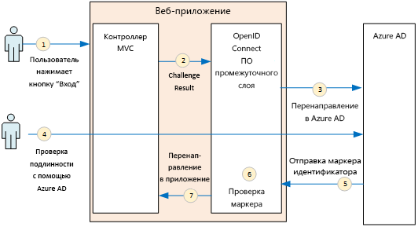
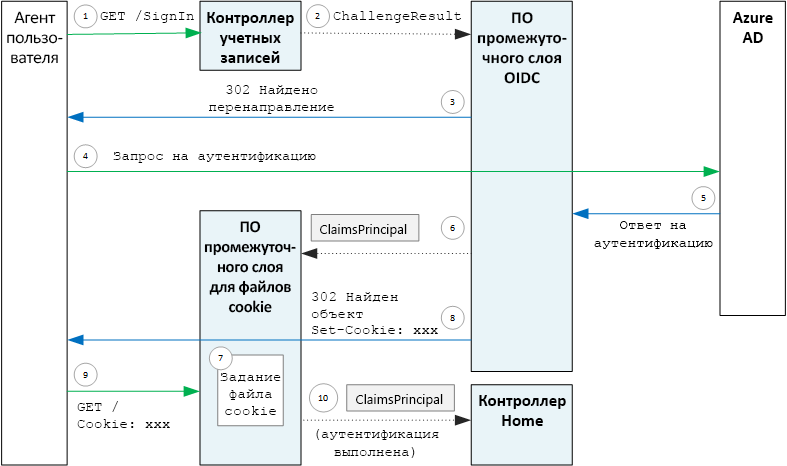

# <a name="authenticate-using-azure-ad-and-openid-connect"></a>Аутентификация с помощью Azure AD и OpenID Connect

[ Пример кода][sample application]

В приложении Surveys используется протокол OpenID Connect (OIDC) для аутентификации пользователей через Azure Active Directory (Azure AD). В приложении Surveys используется ASP.NET Core со встроенным ПО промежуточного слоя для поддержки OIDC. На схеме ниже в общих чертах представлен процесс входа пользователя в систему.



1. В приложении пользователь нажимает кнопку "Вход". Это действие обрабатывается контроллером MVC.
2. Контроллер MVC возвращает действие **ChallengeResult** .
3. ПО промежуточного слоя перехватывает **ChallengeResult** и создает ответ 302, который перенаправляет пользователя на страницу входа в Azure AD.
4. Для пользователя выполняется проверка подлинности с помощью Azure AD.
5. Azure AD отправляет маркер идентификатора в приложение.
6. ПО промежуточного слоя проверяет маркер идентификатора. Теперь пользователь прошел проверку подлинности внутри приложения.
7. ПО промежуточного слоя перенаправляет пользователя назад в приложение.

## <a name="register-the-app-with-azure-ad"></a>Регистрация приложения в Azure AD

Чтобы активировать OpenID Connect, поставщик SaaS регистрирует приложение в собственном клиенте Azure AD.

Чтобы зарегистрировать приложение, выполните инструкции в разделе [Добавление приложения](/azure/active-directory/active-directory-integrating-applications/#adding-an-application) статьи [Интеграция приложений с Azure Active Directory](/azure/active-directory/active-directory-integrating-applications/).

В статье [Run the Surveys application](./run-the-app.md) (Запуск приложения Surveys) описаны конкретные шаги для приложения Surveys. Обратите внимание на следующее.

- Для мультитенантного приложения следует явным образом настроить параметр мультитенантности. Это позволит другим организациям обращаться к приложению.

- URL-адрес ответа — это URL-адрес, по которому Azure AD будет отправлять ответы OAuth 2.0. Если вы используете ASP.NET Core, он должен совпадать с адресом, который вы настроили в ПО промежуточного слоя для аутентификации (см. следующий раздел).

## <a name="configure-the-auth-middleware"></a>Настройка ПО промежуточного слоя для аутентификации

В этом разделе описана настройка ПО промежуточного слоя в ASP.NET Core для мультитенантной аутентификации через OpenID Connect.

В [классе запуска](/aspnet/core/fundamentals/startup) добавьте ПО промежуточного слоя для OpenID Connect:

```csharp
app.UseOpenIdConnectAuthentication(new OpenIdConnectOptions {
    ClientId = configOptions.AzureAd.ClientId,
    ClientSecret = configOptions.AzureAd.ClientSecret, // for code flow
    Authority = Constants.AuthEndpointPrefix,
    ResponseType = OpenIdConnectResponseType.CodeIdToken,
    PostLogoutRedirectUri = configOptions.AzureAd.PostLogoutRedirectUri,
    SignInScheme = CookieAuthenticationDefaults.AuthenticationScheme,
    TokenValidationParameters = new TokenValidationParameters { ValidateIssuer = false },
    Events = new SurveyAuthenticationEvents(configOptions.AzureAd, loggerFactory),
});
```

Обратите внимание, что некоторые параметры извлекаются из конфигурации времени выполнения. Ниже представлено описание параметров ПО промежуточного слоя.

- **ClientId**. Идентификатор клиента приложения, который был получен при регистрации приложения в Azure AD.
- **Authority**. Для мультитенантного приложения установите значение `https://login.microsoftonline.com/common/`. Это URL-адрес общей конечной точки Azure AD, которая позволяет выполнить вход пользователям любого клиента Azure AD. Дополнительные сведения об этой общей конечной точке см. в [этой записи блога](https://www.cloudidentity.com/blog/2014/08/26/the-common-endpoint-walks-like-a-tenant-talks-like-a-tenant-but-is-not-a-tenant/).
- В разделе **TokenValidationParameters** установите для параметра **ValidateIssuer** значение false. Это означает, что приложение будет отвечать за проверку значения издателя в маркере идентификатора. (ПО промежуточного слоя в любом случае будет проверять сам маркер.) Дополнительные сведения см. в разделе [о проверке издателя](claims.md#issuer-validation).
- **PostLogoutRedirectUri**. Укажите URL-адрес для перенаправления пользователей после выхода. Он должен перенаправлять пользователей к странице, которая поддерживает анонимные запросы (обычно это страница приветствия).
- **SignInScheme**. Задайте для этого параметра значение `CookieAuthenticationDefaults.AuthenticationScheme`. Этот параметр означает, что после проверки подлинности пользователя его утверждения локально сохраняются в файле cookie. Благодаря этому файлу cookie пользователь остается в системе во время сеанса браузера.
- **Events.** Обратные вызовы событий, которые описаны в разделе о [событиях проверки подлинности](#authentication-events).

Также добавьте в конвейер ПО промежуточного слоя проверки подлинности для файлов cookie. Это ПО промежуточного слоя записывает утверждения пользователей в файл cookie и считывает этот файл при следующей загрузке страницы.

```csharp
app.UseCookieAuthentication(new CookieAuthenticationOptions {
    AutomaticAuthenticate = true,
    AutomaticChallenge = true,
    AccessDeniedPath = "/Home/Forbidden",
    CookieSecure = CookieSecurePolicy.Always,

    // The default setting for cookie expiration is 14 days. SlidingExpiration is set to true by default
    ExpireTimeSpan = TimeSpan.FromHours(1),
    SlidingExpiration = true
});
```

## <a name="initiate-the-authentication-flow"></a>Инициирование потока аутентификации

Чтобы запустить поток проверки подлинности в ASP.NET MVC, контроллер должен вернуть действие **ChallengeResult** :

```csharp
[AllowAnonymous]
public IActionResult SignIn()
{
    return new ChallengeResult(
        OpenIdConnectDefaults.AuthenticationScheme,
        new AuthenticationProperties
        {
            IsPersistent = true,
            RedirectUri = Url.Action("SignInCallback", "Account")
        });
}
```

После этого ПО промежуточного слоя возвращает ответ 302 (найдено), который выполняет перенаправление к конечной точке проверки подлинности.

## <a name="user-login-sessions"></a>Сеансы входа пользователей

Как упоминалось выше, при первом входе пользователя в систему ПО промежуточного слоя проверки подлинности для файлов cookie записывает в файл cookie утверждения пользователя. После этого HTTP-запросы проходят проверку подлинности с помощью считывания файла cookie.

По умолчанию ПО промежуточного слоя сохраняет [файл cookie сеанса][session-cookie], который будет удален, когда пользователь закроет браузер. При следующем посещении сайта потребуется снова выполнить вход. Но если вы установите значение true для параметра **IsPersistent** в разделе **ChallengeResult**, ПО промежуточного слоя сохранит постоянный файл cookie. В таком случае пользователь остается в системе даже после закрытия браузера. Вы можете настроить срок действия файла cookie, как описано в статье об [управлении параметрами файла cookie][cookie-options]. Постоянные файлы cookie удобнее для пользователя, но их не следует применять в приложениях, для работы с которыми пользователь должен каждый раз выполнять вход (например, в приложениях для банковских операций).

## <a name="about-the-openid-connect-middleware"></a>ПО промежуточного слоя OpenID Connect

ПО промежуточного слоя OpenID Connect в ASP.NET скрывает большую часть данных протокола. Этот раздел содержит определенные сведения о реализации, которые помогут понять, что такое поток протокола.

Для начала рассмотрим поток проверки подлинности с точки зрения ASP.NET (не учитывая сведения потока протокола OIDC между приложением и Azure AD). Этот процесс показан на схеме ниже.



Здесь представлено два контроллера MVC. Контроллер Account обрабатывает запросы на вход, а контроллер Home обслуживает домашнюю страницу.

Ниже представлен процесс проверки подлинности.

1. Пользователь нажимает кнопку "Вход", и браузер отправляет запрос GET. Например, `GET /Account/SignIn/`.
2. Контроллер Account возвращает значение `ChallengeResult`.
3. ПО промежуточного слоя OIDC возвращает ответ HTTP 302, выполняя перенаправление в Azure AD.
4. Браузер отправляет запрос на проверку подлинности в Azure AD.
5. Пользователь выполняет вход в Azure AD, и Azure AD отправляет обратно ответ после проверки подлинности.
6. ПО промежуточного слоя OIDC создает субъект утверждений и передает его в ПО промежуточного слоя проверки подлинности для файлов cookie.
7. ПО промежуточного слоя для файлов cookie сериализует субъект утверждений и задает файл cookie.
8. ПО промежуточного слоя OIDC выполняет перенаправление по URL-адресу обратного вызова приложения.
9. Браузер следует перенаправлению и отправляет в запросе файл cookie.
10. ПО промежуточного слоя десериализует файл cookie до субъекта утверждений и задает для `HttpContext.User` значение, равное субъекту утверждений. Запрос перенаправляется в контроллер MVC.

### <a name="authentication-ticket"></a>Билет проверки подлинности

Если проверка подлинности прошла успешно, ПО промежуточного слоя OIDC создает билет проверки подлинности с субъектом, который содержит утверждения пользователя. Вы можете получить доступ к этому билету через событие **AuthenticationValidated** или **TicketReceived**.

> [!NOTE]
> Пока не завершится выполнение всего процесса аутентификации, в `HttpContext.User` хранятся данные анонимного субъекта, а **не** авторизованного пользователя. Коллекция утверждений анонимного субъекта пуста. После завершения проверки подлинности и перенаправления приложения ПО промежуточного слоя для файлов cookie выполняет десериализацию файла cookie проверки подлинности и задает для `HttpContext.User` значение субъекта утверждений, который представляет пользователя, прошедшего проверку подлинности.

### <a name="authentication-events"></a>События проверки подлинности

В процессе проверки подлинности ПО промежуточного слоя OpenID Connect создает последовательность событий:

- **RedirectToIdentityProvider.** Вызывается непосредственно перед тем, как ПО промежуточного слоя выполнит перенаправление в конечную точку проверки подлинности. Это событие можно использовать для изменения URL-адреса перенаправления (например, чтобы добавить параметры запроса). С примером можно ознакомиться в разделе [Adding the admin consent prompt](signup.md#adding-the-admin-consent-prompt) (Добавление запроса на согласие администратора).
- **AuthorizationCodeReceived**. Вызывается с кодом авторизации.
- **TokenResponseReceived**. Вызывается после того, как ПО промежуточного слоя получит маркер доступа от IdP, но до начала его проверки. Применяется только к потоку кода авторизации.
- **TokenValidated.** Вызывается после того, как ПО промежуточного слоя проверит маркер идентификатора. На этом этапе приложение уже имеет набор проверенных утверждений о пользователе. Это событие можно использовать для дополнительных процедур проверки или преобразования таких утверждений. См. статью о [работе с утверждениями](claims.md).
- **UserInformationReceived**. Вызывается, если ПО промежуточного слоя получает профиль пользователя из конечной точки сведений о пользователе. Применяется только к потоку кода авторизации и только если в параметрах ПО промежуточного слоя установлено значение `GetClaimsFromUserInfoEndpoint = true` .
- **TicketReceived**. Вызывается при завершении проверки подлинности. Это последнее событие, при условии что проверка подлинности завершается успешно. После обработки этого события пользователь входит в приложение.
- **AuthenticationFailed**. Вызывается, если пользователь не проходит проверку подлинности. Это событие используется для обработки ошибок аутентификации, например для перенаправления на страницу ошибки.

Чтобы предоставить функции обратного вызова для этих событий, настройте параметр **События** в ПО промежуточного слоя. Объявить обработчики событий можно двумя способами: встроенное объявление с лямбда-выражениями или объявление в классе, производном от **OpenIdConnectEvents**. Если при обратных вызовах событий выполняются существенные фрагменты логики, рекомендуем использовать второй подход, чтобы код не загромождал класс запуска. Мы применили этот подход в нашей эталонной реализации.

### <a name="openid-connect-endpoints"></a>Конечные точки OpenID Connect

Azure AD поддерживает функцию [обнаружения OpenID Connect](https://openid.net/specs/openid-connect-discovery-1_0.html), при использовании которой поставщик удостоверений (IDP) возвращает документ метаданных в формате JSON через [известную конечную точку](https://openid.net/specs/openid-connect-discovery-1_0.html#ProviderConfig). Документ метаданных содержит указанные ниже сведения.

- URL-адрес конечной точки авторизации. Это расположение, в которое приложение выполняет перенаправление для проверки подлинности пользователя.
- URL-адрес конечной точки "конец сеанса", где приложение переходит к выполнению выхода пользователя из системы.
- URL-адрес получения ключей подписывания, которые клиент использует для проверки маркеров OIDC, полученных от поставщика удостоверений.

По умолчанию ПО промежуточного слоя OIDC имеет сведения о том, как получить эти метаданные. Задайте параметр **Центр** в ПО промежуточного слоя, и оно сформирует URL-адрес для метаданных. (URL-адрес метаданных можно переопределить, задав параметр **MetadataAddress** .)

### <a name="openid-connect-flows"></a>Потоки OpenID Connect

По умолчанию ПО промежуточного слоя OIDC использует гибридный поток с режимом ответа на отправку формы.

- *Гибридный поток* означает, что клиент может получить маркер идентификатора и код авторизации в одном процессе обмена данными с сервером авторизации.
- *Режим ответа на отправку формы* означает, что сервер авторизации использует HTTP-запрос POST для отправки маркера идентификатора и кода авторизации для приложения. Значения представлены в закодированном формате URL-адреса (тип содержимого = application/x-www-form-urlencoded).

Когда ПО промежуточного слоя OIDC выполняет перенаправление в конечную точку авторизации, URL-адрес перенаправления включает все требующиеся для OIDC параметры строки запроса. Для гибридных потоков:

- client_id. Это значение устанавливается для параметра **ClientId** .
- scope = "openid profile" — это означает, что выполняется запрос OIDC и нам следует использовать профиль пользователя.
- response_type  = "code id_token". Определяет гибридный поток.
- response_mode = "form_post". Определяет ответ на отправку формы.

Чтобы указать другой поток, в параметрах задайте свойство **ResponseType**. Например: 

```csharp
app.UseOpenIdConnectAuthentication(options =>
{
    options.ResponseType = "code"; // Authorization code flow

    // Other options
}
```

[**Далее**][claims]

[claims]: claims.md
[cookie-options]: /aspnet/core/security/authentication/cookie#controlling-cookie-options
[session-cookie]: https://en.wikipedia.org/wiki/HTTP_cookie#Session_cookie
[sample application]: https://github.com/mspnp/multitenant-saas-guidance
