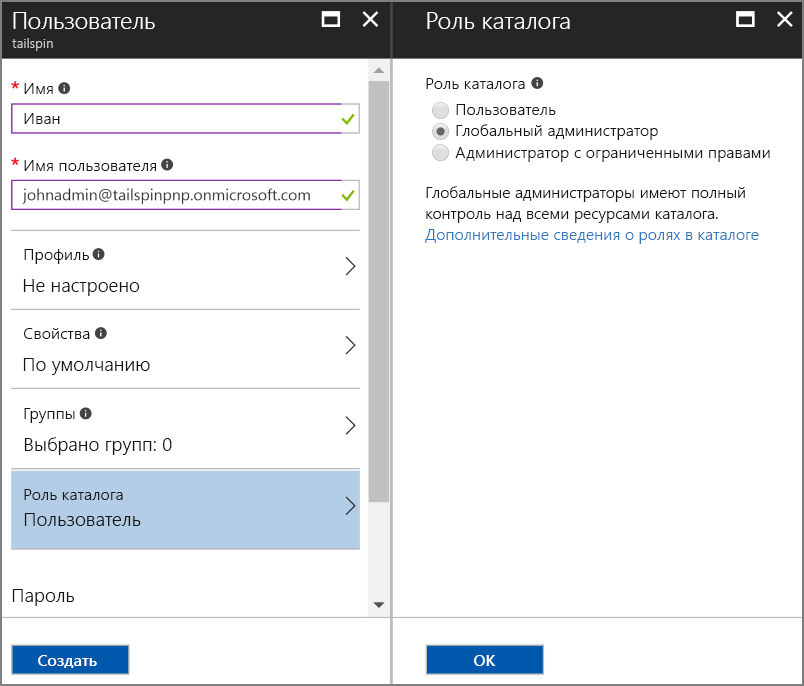
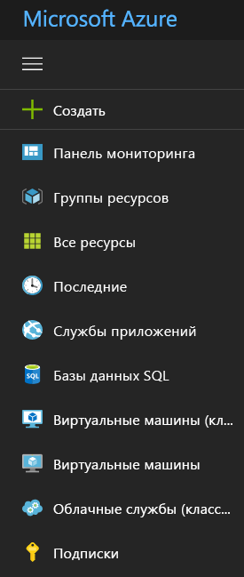

# <a name="use-azure-key-vault-to-protect-application-secrets"></a>Использование Azure Key Vault для защиты секретов приложений

[ Пример кода][sample application]

Довольно часто используются параметры приложения, которые являются конфиденциальными и должны быть защищены, например:

* строки подключения к базе данных;
* Пароли
* Криптографические ключи

Из соображений безопасности не следует размещать эти секреты в системе управления версиями. Вероятность утечки будет слишком высокой, даже если вы используете частный репозиторий исходного кода. И вопрос не только в защите секретов от общего доступа. В больших проектах может потребоваться ограничить доступ к производственным секретам, предоставив его только определенным разработчикам и операторам. (Для сред тестирования и разработки используются разные параметры.)

Более безопасный вариант — хранить эти секреты в [Azure Key Vault][KeyVault]. Хранилище ключей является облачной службой для управления криптографическими ключами и другими секретными данными. В этой статье описано, как использовать хранилище ключей для хранения параметров конфигурации приложения.

В приложении [Tailspin Surveys][Surveys] секретами являются следующие параметры:

* строка подключения к базе данных;
* строка подключения к Redis;
* секрет клиента для веб-приложения.

Приложение Surveys загружает параметры конфигурации из следующих расположений:

* файл appsettings.json;
* [хранилище секретов пользователя][user-secrets] (только в среде разработки; для тестирования);
* среда размещения (параметры веб-приложений Azure);
* Key Vault (если служба подключена).

В этом списке хранилища перечислены в порядке увеличения приоритета, то есть параметры из Key Vault используются всегда.

> [!NOTE]
> По умолчанию поставщик конфигурации хранилища ключей отключен. Он не требуется для локального запуска приложения. Его можно будет активировать в рабочей среде.

При запуске приложение считывает параметры каждого зарегистрированного поставщика конфигураций и использует их для заполнения строго типизированного объекта параметров. Дополнительные сведения см. в статье об [использовании параметров и объектов конфигурации][options].

## <a name="setting-up-key-vault-in-the-surveys-app"></a>Настройка хранилища ключей в приложении Surveys
Предварительные требования:

* Установите [командлеты Azure Resource Manager][azure-rm-cmdlets].
* Настройте приложение Surveys, как описано в статье [Run the Surveys application][readme] (Запуск приложения Surveys).

Основные действия:

1. Настройте в клиенте учетную запись пользователя с правами администратора.
2. Настройте сертификат клиента.
3. Создать хранилище ключей.
4. Добавьте параметры конфигурации в хранилище ключей.
5. Раскомментируйте код, который активирует хранилище ключей.
6. Обновите секреты пользователя приложения.

### <a name="set-up-an-admin-user"></a>Настройка учетной записи пользователя с правами администратора
> [!NOTE]
> Для создания хранилища ключей используется учетная запись, с помощью которой можно управлять подпиской Azure. Кроме того, любое приложение, которому вы предоставляете права на чтение данных из хранилища ключей, должно быть зарегистрировано в том же клиенте, что и эта учетная запись.
> 
> 

На этом этапе следует удостовериться, что вы имеете возможность создать хранилище ключей, находясь в системе в качестве пользователя, который выполнил вход из клиента с зарегистрированным приложением Surveys.

Создайте учетную запись пользователя с правами администратора в клиенте Azure AD, в котором зарегистрировано приложение Surveys.

1. Войдите на [портал Azure][azure-portal].
2. Выберите клиент Azure AD, в котором зарегистрировано приложение.
3. Последовательно щелкните **More service** (Дополнительные службы) > **БЕЗОПАСНОСТЬ И ИДЕНТИФИКАЦИЯ** > **Azure Active Directory** > **Пользователи и группы** > **All users** (Все пользователи).
4. Щелкните команду **Новый пользователь** в верхней части портала.
5. Заполните все поля и назначьте пользователю роль **глобального администратора** для каталога.
6. Щелкните **Создать**.



Теперь назначьте этого пользователя владельцем подписки.

1. В главном меню выберите **Подписки**.

    

2. Выберите подписку, доступ к которой нужно предоставить этому администратору.
3. В колонке подписки выберите **Управление доступом (IAM)**.
4. Щелкните **Добавить**.
4. В разделе **Роль**выберите **Владелец**.
5. Укажите адрес электронной почты пользователя, для которого хотите добавить роль "Владелец".
6. Выберите нужного пользователя и щелкните **Сохранить**.

### <a name="set-up-a-client-certificate"></a>Настройка сертификата клиента
1. Запустите скрипт PowerShell [/Scripts/Setup-KeyVault.ps1][Setup-KeyVault] следующим образом:
   
    ```
    .\Setup-KeyVault.ps1 -Subject <<subject>>
    ```
    Для параметра `Subject` введите любое имя, например "surveysapp". Сценарий создаст самозаверяющий сертификат и сохранит его в хранилище сертификатов "Текущий пользователь/Личные". Выходные данные этого сценария представлены фрагментом JSON. Скопируйте это значение.

2. На [портале Azure][azure-portal] перейдите к каталогу, где зарегистрировано приложение Surveys, выбрав свою учетную запись в правом верхнем углу портала.

3. Выберите **Azure Active Directory** > **Регистрация приложений** > Surveys.

4.  Щелкните **Манифест** и выберите **Изменить**.

5.  Вставьте выходные данные сценария в свойство `keyCredentials` . Это должно выглядеть следующим образом:
        
    ```json
    "keyCredentials": [
        {
        "type": "AsymmetricX509Cert",
        "usage": "Verify",
        "keyId": "29d4f7db-0539-455e-b708-....",
        "customKeyIdentifier": "ZEPpP/+KJe2fVDBNaPNOTDoJMac=",
        "value": "MIIDAjCCAeqgAwIBAgIQFxeRiU59eL.....
        }
    ],
    ```          

6. Щелкните **Сохранить**.  

7. Повторите шаги 3–6 и добавьте этот же фрагмент JSON в манифест приложения веб-API (Surveys.WebAPI).

8. Откройте окно PowerShell и выполните следующую команду, чтобы получить отпечаток сертификата:
   
    ```
    certutil -store -user my [subject]
    ```
    
    Для `[subject]` укажите значение, которое вы использовали для Subject в скрипте PowerShell. Отпечаток указан в разделе Cert Hash(sha1). Скопируйте это значение. Отпечаток будет использоваться позднее.

### <a name="create-a-key-vault"></a>Создайте хранилище ключей.
1. Запустите скрипт PowerShell [/Scripts/Setup-KeyVault.ps1][Setup-KeyVault] следующим образом:
   
    ```
    .\Setup-KeyVault.ps1 -KeyVaultName <<key vault name>> -ResourceGroupName <<resource group name>> -Location <<location>>
    ```
   
    При появлении запроса на ввод учетных данных войдите в систему с учетной записью пользователя Azure AD, созданной ранее. Сценарий создаст новую группу ресурсов с новым хранилищем ключей. 
   
2. Повторно запустите SetupKeyVault.ps следующим образом:
   
    ```
    .\Setup-KeyVault.ps1 -KeyVaultName <<key vault name>> -ApplicationIds @("<<Surveys app id>>", "<<Surveys.WebAPI app ID>>")
    ```
   
    Установите следующие значения параметров:
   
       * key vault name — имя, присвоенное хранилищу ключей на предыдущем этапе;
       * Surveys app ID — идентификатор веб-приложения Surveys;
       * Surveys.WebApi app ID — идентификатор приложения Surveys.WebAPI.
         
    Пример:
     
    ```
     .\Setup-KeyVault.ps1 -KeyVaultName tailspinkv -ApplicationIds @("f84df9d1-91cc-4603-b662-302db51f1031", "8871a4c2-2a23-4650-8b46-0625ff3928a6")
    ```
    
    Этот скрипт разрешает веб-приложению и веб-API получать секреты из хранилища ключей. Дополнительные сведения см. в статье [Приступая к работе с хранилищем ключей Azure](/azure/key-vault/key-vault-get-started/).

### <a name="add-configuration-settings-to-your-key-vault"></a>Добавьте параметры конфигурации в хранилище ключей.
1. Запустите SetupKeyVault.ps следующим образом:
   
    ```
    .\Setup-KeyVault.ps1 -KeyVaultName <<key vault name> -KeyName Redis--Configuration -KeyValue "<<Redis DNS name>>.redis.cache.windows.net,password=<<Redis access key>>,ssl=true" 
    ```
    где 
   
   * key vault name — имя, присвоенное хранилищу ключей на предыдущем этапе;
   * Redis DNS name — DNS-имя экземпляра кэша Redis;
   * Redis access key — ключ доступа для экземпляра кэша Redis.
     
2. На этом этапе рекомендуется проверить, успешно ли сохранены секреты в хранилище ключей. Выполните следующую команду PowerShell:
   
    ```
    Get-AzureKeyVaultSecret <<key vault name>> Redis--Configuration | Select-Object *
    ```

3. Повторно запустите SetupKeyVault.ps, чтобы добавить строку подключения к базе данных:
   
    ```
    .\Setup-KeyVault.ps1 -KeyVaultName <<key vault name> -KeyName Data--SurveysConnectionString -KeyValue <<DB connection string>> -ConfigName "Data:SurveysConnectionString"
    ```
   
    где `<<DB connection string>>` — значение строки подключения к базе данных.
   
    Для тестирования с локальной базой данных скопируйте строку подключения из файла Tailspin.Surveys.Web/appsettings.json. При этом обязательно замените две обратные косые черты ("\\\\") одной обратной косой чертой. Двойная обратная косая черта является escape-символом в JSON-файле.
   
    Пример:
   
    ```
    .\Setup-KeyVault.ps1 -KeyVaultName mykeyvault -KeyName Data--SurveysConnectionString -KeyValue "Server=(localdb)\MSSQLLocalDB;Database=Tailspin.SurveysDB;Trusted_Connection=True;MultipleActiveResultSets=true" 
    ```

### <a name="uncomment-the-code-that-enables-key-vault"></a>Раскомментирование кода, который активирует хранилище ключей
1. Откройте решение Tailspin.Surveys.
2. В файле Tailspin.Surveys.Web/Startup.cs найдите следующий блок кода и раскомментируйте его:
   
    ```csharp
    //var config = builder.Build();
    //builder.AddAzureKeyVault(
    //    $"https://{config["KeyVault:Name"]}.vault.azure.net/",
    //    config["AzureAd:ClientId"],
    //    config["AzureAd:ClientSecret"]);
    ```
3. В файле Tailspin.Surveys.Web/Startup.cs найдите блок кода, который регистрирует `ICredentialService`. Раскомментируйте строку, в которой используется `CertificateCredentialService`, и закомментируйте строку, в которой используется `ClientCredentialService`:
   
    ```csharp
    // Uncomment this:
    services.AddSingleton<ICredentialService, CertificateCredentialService>();
    // Comment out this:
    //services.AddSingleton<ICredentialService, ClientCredentialService>();
    ```
   
    Благодаря этому изменению веб-приложение сможет использовать [утверждение клиента][client-assertion] для получения маркера доступа OAuth. Утверждение клиента устраняет необходимость в секрете клиента OAuth. Либо же секрет клиента можно сохранить в хранилище ключей. Однако и хранилище ключей, и утверждение клиента используют сертификат клиента, поэтому при активации хранилища ключей рекомендуется также включить утверждение клиента.

### <a name="update-the-user-secrets"></a>Обновление секретов пользователя
В обозревателе решений щелкните правой кнопкой мыши проект Tailspin.Surveys.Web и выберите пункт **Управление секретами пользователей**. В файле secrets.json удалите существующий код JSON и вставьте следующий:

    ```
    {
      "AzureAd": {
        "ClientId": "[Surveys web app client ID]",
        "ClientSecret": "[Surveys web app client secret]",
        "PostLogoutRedirectUri": "https://localhost:44300/",
        "WebApiResourceId": "[App ID URI of your Surveys.WebAPI application]",
        "Asymmetric": {
          "CertificateThumbprint": "[certificate thumbprint. Example: 105b2ff3bc842c53582661716db1b7cdc6b43ec9]",
          "StoreName": "My",
          "StoreLocation": "CurrentUser",
          "ValidationRequired": "false"
        }
      },
      "KeyVault": {
        "Name": "[key vault name]"
      }
    }
    ```

Замените записи в [квадратных скобках] надлежащими значениями.

* `AzureAd:ClientId`: идентификатор клиента приложения Surveys.
* `AzureAd:ClientSecret`: ключ, созданный при регистрации приложения Surveys в Azure AD.
* `AzureAd:WebApiResourceId`: код URI идентификатора приложения, указанный при создании приложения Surveys.WebAPI в Azure AD.
* `Asymmetric:CertificateThumbprint`: отпечаток сертификата, полученный ранее при создании сертификата клиента.
* `KeyVault:Name`: имя хранилища ключей.

> [!NOTE]
> `Asymmetric:ValidationRequired` имеет значение False, так как созданный ранее сертификат не подписан корневым центром сертификации. В рабочей среде используйте сертификат, подписанный центром сертификации, и измените значение `ValidationRequired` на True.
> 
> 

Сохраните обновленный файл secrets.json.

Затем в обозревателе решений щелкните правой кнопкой мыши проект Tailspin.Surveys.WebApi и выберите пункт **Управление секретами пользователей**. Удалите существующий код JSON и вставьте следующий:

```
{
  "AzureAd": {
    "ClientId": "[Surveys.WebAPI client ID]",
    "WebApiResourceId": "https://tailspin5.onmicrosoft.com/surveys.webapi",
    "Asymmetric": {
      "CertificateThumbprint": "[certificate thumbprint]",
      "StoreName": "My",
      "StoreLocation": "CurrentUser",
      "ValidationRequired": "false"
    }
  },
  "KeyVault": {
    "Name": "[key vault name]"
  }
}
```

Замените записи в [квадратных скобках] и сохраните файл secrets.json.

> [!NOTE]
> В веб-API обязательно должен использоваться идентификатор клиента для приложения Surveys.WebAPI, а не для приложения Surveys.
> 
> 

[**Далее**][adfs]

<!-- Links -->
[adfs]: ./adfs.md
[authorize-app]: /azure/key-vault/key-vault-get-started//#authorize
[azure-portal]: https://portal.azure.com
[azure-rm-cmdlets]: https://msdn.microsoft.com/library/mt125356.aspx
[client-assertion]: client-assertion.md
[configuration]: /aspnet/core/fundamentals/configuration
[KeyVault]: https://azure.microsoft.com/services/key-vault/
[key-tags]: https://msdn.microsoft.com/library/azure/dn903623.aspx#BKMK_Keytags
[Microsoft.Azure.KeyVault]: https://www.nuget.org/packages/Microsoft.Azure.KeyVault/
[options]: /aspnet/core/fundamentals/configuration#using-options-and-configuration-objects
[readme]: ./run-the-app.md
[Setup-KeyVault]: https://github.com/mspnp/multitenant-saas-guidance/blob/master/scripts/Setup-KeyVault.ps1
[Surveys]: tailspin.md
[user-secrets]: http://go.microsoft.com/fwlink/?LinkID=532709
[sample application]: https://github.com/mspnp/multitenant-saas-guidance
