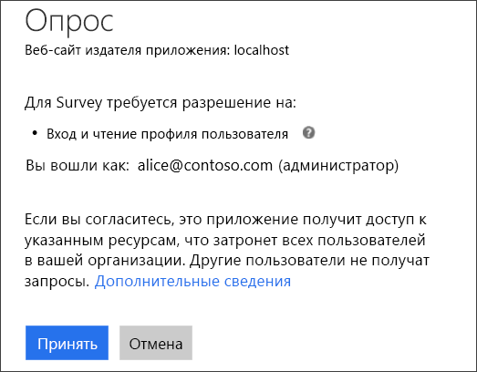
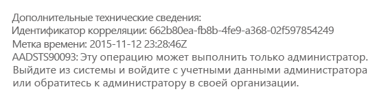
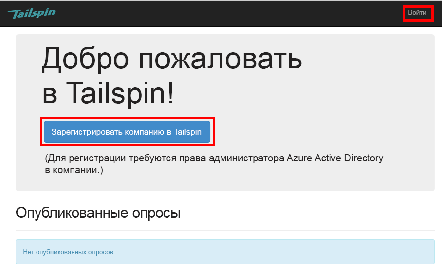
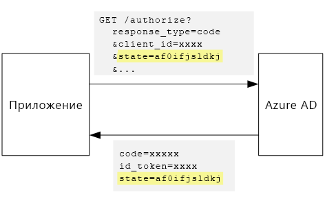

# <a name="tenant-sign-up-and-onboarding"></a><span data-ttu-id="c384b-103">Регистрация и адаптации клиента</span><span class="sxs-lookup"><span data-stu-id="c384b-103">Tenant sign-up and onboarding</span></span>

<span data-ttu-id="c384b-104">[ Пример кода][sample application]</span><span class="sxs-lookup"><span data-stu-id="c384b-104">[ Sample code][sample application]</span></span>

<span data-ttu-id="c384b-105">В этой статье описывается, как реализовать процесс *регистрации* в мультитенантном приложении, чтобы клиент смог зарегистрировать свою организацию для работы с приложением.</span><span class="sxs-lookup"><span data-stu-id="c384b-105">This article describes how to implement a *sign-up* process in a multi-tenant application, which allows a customer to sign up their organization for your application.</span></span>
<span data-ttu-id="c384b-106">Существует несколько причин для реализации процесса регистрации:</span><span class="sxs-lookup"><span data-stu-id="c384b-106">There are several reasons to implement a sign-up process:</span></span>

* <span data-ttu-id="c384b-107">Предоставление администраторам AD возможности давать согласие на использование приложения во всей организации клиента.</span><span class="sxs-lookup"><span data-stu-id="c384b-107">Allow an AD admin to consent for the customer's entire organization to use the application.</span></span>
* <span data-ttu-id="c384b-108">Сбор данных об оплате кредитной картой или других сведений о клиенте.</span><span class="sxs-lookup"><span data-stu-id="c384b-108">Collect credit card payment or other customer information.</span></span>
* <span data-ttu-id="c384b-109">Выполнение однократной настройки каждого клиента, необходимой приложению.</span><span class="sxs-lookup"><span data-stu-id="c384b-109">Perform any one-time per-tenant setup needed by your application.</span></span>

## <a name="admin-consent-and-azure-ad-permissions"></a><span data-ttu-id="c384b-110">Согласие администратора и разрешения Azure AD</span><span class="sxs-lookup"><span data-stu-id="c384b-110">Admin consent and Azure AD permissions</span></span>
<span data-ttu-id="c384b-111">Чтобы проверять подлинность в Azure AD, приложению требуется доступ к каталогу пользователя.</span><span class="sxs-lookup"><span data-stu-id="c384b-111">In order to authenticate with Azure AD, an application needs access to the user's directory.</span></span> <span data-ttu-id="c384b-112">Как минимум, приложению требуется разрешение на чтение профиля пользователя.</span><span class="sxs-lookup"><span data-stu-id="c384b-112">At a minimum, the application needs permission to read the user's profile.</span></span> <span data-ttu-id="c384b-113">При первом входе пользователя в Azure AD будет отображена страница согласия со списком запрашиваемых разрешений.</span><span class="sxs-lookup"><span data-stu-id="c384b-113">The first time that a user signs in, Azure AD shows a consent page that lists the permissions being requested.</span></span> <span data-ttu-id="c384b-114">Нажав кнопку **Принять**, пользователь предоставляет разрешение приложению.</span><span class="sxs-lookup"><span data-stu-id="c384b-114">By clicking **Accept**, the user grants permission to the application.</span></span>

<span data-ttu-id="c384b-115">По умолчанию согласие предоставляется на уровне пользователя.</span><span class="sxs-lookup"><span data-stu-id="c384b-115">By default, consent is granted on a per-user basis.</span></span> <span data-ttu-id="c384b-116">Страницу согласия видит каждый пользователь, выполняющий вход.</span><span class="sxs-lookup"><span data-stu-id="c384b-116">Every user who signs in sees the consent page.</span></span> <span data-ttu-id="c384b-117">Однако Azure AD также поддерживает *согласие администратора*, позволяющее администраторам AD давать согласие на использование приложения в рамках всей организации.</span><span class="sxs-lookup"><span data-stu-id="c384b-117">However, Azure AD also supports  *admin consent*, which allows an AD administrator to consent for an entire organization.</span></span>

<span data-ttu-id="c384b-118">Когда используется поток согласия администратора, на странице согласия отображается сообщение о том, что администратор AD предоставляет разрешение от имени всего клиента.</span><span class="sxs-lookup"><span data-stu-id="c384b-118">When the admin consent flow is used, the consent page states that the AD admin is granting permission on behalf of the entire tenant:</span></span>



<span data-ttu-id="c384b-120">После того как администратор нажмет кнопку **Принять**, другие пользователи в рамках того же клиента смогут выполнять вход, а Azure AD будет пропускать экран согласия.</span><span class="sxs-lookup"><span data-stu-id="c384b-120">After the admin clicks **Accept**, other users within the same tenant can sign in, and Azure AD will skip the consent screen.</span></span>

<span data-ttu-id="c384b-121">Предоставлять согласие администратора может только администратор AD, поскольку он дает разрешение от имени всей организации.</span><span class="sxs-lookup"><span data-stu-id="c384b-121">Only an AD administrator can give admin consent, because it grants permission on behalf of the entire organization.</span></span> <span data-ttu-id="c384b-122">Если проверку подлинности в потоке согласия пытается пройти пользователь без прав администратора, в Azure AD выводится сообщение об ошибке.</span><span class="sxs-lookup"><span data-stu-id="c384b-122">If a non-administrator tries to authenticate with the admin consent flow, Azure AD displays an error:</span></span>



<span data-ttu-id="c384b-124">Если приложению позднее потребуются дополнительные разрешения, клиенту будет нужно повторно зарегистрироваться и согласиться с обновленными разрешениями.</span><span class="sxs-lookup"><span data-stu-id="c384b-124">If the application requires additional permissions at a later point, the customer will need to sign up again and consent to the updated permissions.</span></span>  

## <a name="implementing-tenant-sign-up"></a><span data-ttu-id="c384b-125">Реализация регистрации клиента</span><span class="sxs-lookup"><span data-stu-id="c384b-125">Implementing tenant sign-up</span></span>
<span data-ttu-id="c384b-126">Мы определили несколько требований для регистрации в приложении [Tailspin Surveys][Tailspin]:</span><span class="sxs-lookup"><span data-stu-id="c384b-126">For the [Tailspin Surveys][Tailspin] application,  we defined several requirements for the sign-up process:</span></span>

* <span data-ttu-id="c384b-127">Клиент должен пройти регистрацию до того, как пользователи смогут выполнять вход.</span><span class="sxs-lookup"><span data-stu-id="c384b-127">A tenant must sign up before users can sign in.</span></span>
* <span data-ttu-id="c384b-128">В процессе регистрации используется поток согласия администратора.</span><span class="sxs-lookup"><span data-stu-id="c384b-128">Sign-up uses the admin consent flow.</span></span>
* <span data-ttu-id="c384b-129">При регистрации клиент пользователя добавляется в базу данных приложения.</span><span class="sxs-lookup"><span data-stu-id="c384b-129">Sign-up adds the user's tenant to the application database.</span></span>
* <span data-ttu-id="c384b-130">После регистрации клиента в приложении отображается страница адаптации.</span><span class="sxs-lookup"><span data-stu-id="c384b-130">After a tenant signs up, the application shows an onboarding page.</span></span>

<span data-ttu-id="c384b-131">В этом разделе мы рассмотрим реализацию процесса регистрации.</span><span class="sxs-lookup"><span data-stu-id="c384b-131">In this section, we'll walk through our implementation of the sign-up process.</span></span>
<span data-ttu-id="c384b-132">Важно понимать, что понятия "регистрация" и "вход" формируют концепцию приложения.</span><span class="sxs-lookup"><span data-stu-id="c384b-132">It's important to understand that "sign up" versus "sign in" is an application concept.</span></span> <span data-ttu-id="c384b-133">Во время потока проверки подлинности службе Azure AD изначально неизвестно, что пользователь находится в процессе регистрации.</span><span class="sxs-lookup"><span data-stu-id="c384b-133">During the authentication flow, Azure AD does not inherently know whether the user is in process of signing up.</span></span> <span data-ttu-id="c384b-134">Отслеживанием контекста занимается приложение.</span><span class="sxs-lookup"><span data-stu-id="c384b-134">It's up to the application to keep track of the context.</span></span>

<span data-ttu-id="c384b-135">Когда анонимный пользователь открывает страницу приложения Surveys, он видит две кнопки — одну для входа и одну для регистрации организации (регистрация).</span><span class="sxs-lookup"><span data-stu-id="c384b-135">When an anonymous user visits the Surveys application, the user is shown two buttons, one to sign in, and one to "enroll your company" (sign up).</span></span>



<span data-ttu-id="c384b-137">Эти кнопки позволяют вызывать действия в классе `AccountController`.</span><span class="sxs-lookup"><span data-stu-id="c384b-137">These buttons invoke actions in the `AccountController` class.</span></span>

<span data-ttu-id="c384b-138">Действие `SignIn` возвращает **ChallegeResult**, в результате чего ПО промежуточного слоя OpenID Connect выполняет перенаправление в конечную точку проверки подлинности.</span><span class="sxs-lookup"><span data-stu-id="c384b-138">The `SignIn` action returns a **ChallegeResult**, which causes the OpenID Connect middleware to redirect to the authentication endpoint.</span></span> <span data-ttu-id="c384b-139">Это заданный по умолчанию способ запуска проверки подлинности в ASP.NET Core.</span><span class="sxs-lookup"><span data-stu-id="c384b-139">This is the default way to trigger authentication in ASP.NET Core.</span></span>  

```csharp
[AllowAnonymous]
public IActionResult SignIn()
{
    return new ChallengeResult(
        OpenIdConnectDefaults.AuthenticationScheme,
        new AuthenticationProperties
        {
            IsPersistent = true,
            RedirectUri = Url.Action("SignInCallback", "Account")
        });
}
```

<span data-ttu-id="c384b-140">Теперь сравните действие `SignUp` :</span><span class="sxs-lookup"><span data-stu-id="c384b-140">Now compare the `SignUp` action:</span></span>

```csharp
[AllowAnonymous]
public IActionResult SignUp()
{
    var state = new Dictionary<string, string> { { "signup", "true" }};
    return new ChallengeResult(
        OpenIdConnectDefaults.AuthenticationScheme,
        new AuthenticationProperties(state)
        {
            RedirectUri = Url.Action(nameof(SignUpCallback), "Account")
        });
}
```

<span data-ttu-id="c384b-141">Как и `SignIn`, действие `SignUp` также возвращает `ChallengeResult`.</span><span class="sxs-lookup"><span data-stu-id="c384b-141">Like `SignIn`, the `SignUp` action also returns a `ChallengeResult`.</span></span> <span data-ttu-id="c384b-142">Но на этот раз мы добавляем в `AuthenticationProperties` in the `ChallengeResult`фрагмент сведений о состоянии:</span><span class="sxs-lookup"><span data-stu-id="c384b-142">But this time, we add a piece of state information to the `AuthenticationProperties` in the `ChallengeResult`:</span></span>

* <span data-ttu-id="c384b-143">signup: логический флаг, указывающий, что пользователь начал процесс регистрации.</span><span class="sxs-lookup"><span data-stu-id="c384b-143">signup: A Boolean flag, indicating that the user has started the sign-up process.</span></span>

<span data-ttu-id="c384b-144">Сведения о состоянии в `AuthenticationProperties` добавляются в параметр [state] OpenID Connect для круговых обходов во время потока проверки подлинности.</span><span class="sxs-lookup"><span data-stu-id="c384b-144">The state information in `AuthenticationProperties` gets added to the OpenID Connect [state] parameter, which round trips during the authentication flow.</span></span>



<span data-ttu-id="c384b-146">После того как пользователь пройдет проверку подлинности в Azure AD и будет перенаправлен обратно в приложение, в билете проверки подлинности будет указано состояние.</span><span class="sxs-lookup"><span data-stu-id="c384b-146">After the user authenticates in Azure AD and gets redirected back to the application, the authentication ticket contains the state.</span></span> <span data-ttu-id="c384b-147">Мы используем этот факт, чтобы гарантировать, что значение "signup" сохраняется во всем потоке проверки подлинности.</span><span class="sxs-lookup"><span data-stu-id="c384b-147">We are using this fact to make sure the "signup" value persists across the entire authentication flow.</span></span>

## <a name="adding-the-admin-consent-prompt"></a><span data-ttu-id="c384b-148">Добавление запроса на согласие администратора</span><span class="sxs-lookup"><span data-stu-id="c384b-148">Adding the admin consent prompt</span></span>
<span data-ttu-id="c384b-149">В Azure AD поток согласия администратора запускается путем добавления параметра "prompt" в строку запроса в запросе на проверку подлинности.</span><span class="sxs-lookup"><span data-stu-id="c384b-149">In Azure AD, the admin consent flow is triggered by adding a "prompt" parameter to the query string in the authentication request:</span></span>

```
/authorize?prompt=admin_consent&...
```

<span data-ttu-id="c384b-150">Приложение Surveys добавляет запрос во время события `RedirectToAuthenticationEndpoint` .</span><span class="sxs-lookup"><span data-stu-id="c384b-150">The Surveys application adds the prompt during the `RedirectToAuthenticationEndpoint` event.</span></span> <span data-ttu-id="c384b-151">Это событие вызывается сразу перед тем, как ПО промежуточного слоя выполнит перенаправление в конечную точку проверки подлинности.</span><span class="sxs-lookup"><span data-stu-id="c384b-151">This event is called right before the middleware redirects to the authentication endpoint.</span></span>

```csharp
public override Task RedirectToAuthenticationEndpoint(RedirectContext context)
{
    if (context.IsSigningUp())
    {
        context.ProtocolMessage.Prompt = "admin_consent";
    }

    _logger.RedirectToIdentityProvider();
    return Task.FromResult(0);
}
```

<span data-ttu-id="c384b-152">При задании` ProtocolMessage.Prompt` ПО промежуточного слоя добавляет параметр "prompt" в запрос на проверку подлинности.</span><span class="sxs-lookup"><span data-stu-id="c384b-152">Setting` ProtocolMessage.Prompt` tells the middleware to add the "prompt" parameter to the authentication request.</span></span>

<span data-ttu-id="c384b-153">Обратите внимание, что запрос необходим только во время регистрации.</span><span class="sxs-lookup"><span data-stu-id="c384b-153">Note that the prompt is only needed during sign-up.</span></span> <span data-ttu-id="c384b-154">Он не требуется для обычного входа.</span><span class="sxs-lookup"><span data-stu-id="c384b-154">Regular sign-in should not include it.</span></span> <span data-ttu-id="c384b-155">Чтобы различить их, проверим наличие значения `signup` в состоянии проверки подлинности.</span><span class="sxs-lookup"><span data-stu-id="c384b-155">To distinguish between them, we check for the `signup` value in the authentication state.</span></span> <span data-ttu-id="c384b-156">Для проверки этого условия используется следующий метод расширения:</span><span class="sxs-lookup"><span data-stu-id="c384b-156">The following extension method checks for this condition:</span></span>

```csharp
internal static bool IsSigningUp(this BaseControlContext context)
{
    Guard.ArgumentNotNull(context, nameof(context));

    string signupValue;
    // Check the HTTP context and convert to string
    if ((context.Ticket == null) ||
        (!context.Ticket.Properties.Items.TryGetValue("signup", out signupValue)))
    {
        return false;
    }

    // We have found the value, so see if it's valid
    bool isSigningUp;
    if (!bool.TryParse(signupValue, out isSigningUp))
    {
        // The value for signup is not a valid boolean, throw                
        throw new InvalidOperationException($"'{signupValue}' is an invalid boolean value");
    }

    return isSigningUp;
}
```

## <a name="registering-a-tenant"></a><span data-ttu-id="c384b-157">Регистрация клиента</span><span class="sxs-lookup"><span data-stu-id="c384b-157">Registering a Tenant</span></span>
<span data-ttu-id="c384b-158">Приложение Surveys хранит сведения о каждом клиенте и пользователе в базе данных приложения.</span><span class="sxs-lookup"><span data-stu-id="c384b-158">The Surveys application stores some information about each tenant and user in the application database.</span></span>


<span data-ttu-id="c384b-160">В таблице Tenant IssuerValue является значением утверждения издателя для клиента.</span><span class="sxs-lookup"><span data-stu-id="c384b-160">In the Tenant table, IssuerValue is the value of the issuer claim for the tenant.</span></span> <span data-ttu-id="c384b-161">Для Azure AD это `https://sts.windows.net/<tentantID>` с уникальным значением для каждого клиента.</span><span class="sxs-lookup"><span data-stu-id="c384b-161">For Azure AD, this is `https://sts.windows.net/<tentantID>` and gives a unique value per tenant.</span></span>

<span data-ttu-id="c384b-162">При регистрации нового клиента приложение Surveys вносит запись клиента в базу данных.</span><span class="sxs-lookup"><span data-stu-id="c384b-162">When a new tenant signs up, the Surveys application writes a tenant record to the database.</span></span> <span data-ttu-id="c384b-163">Это происходит внутри события `AuthenticationValidated` .</span><span class="sxs-lookup"><span data-stu-id="c384b-163">This happens inside the `AuthenticationValidated` event.</span></span> <span data-ttu-id="c384b-164">(Не выполняйте это действие до события, так как маркер идентификатора пока не прошел проверку и значениям утверждения доверять нельзя.) См.</span><span class="sxs-lookup"><span data-stu-id="c384b-164">(Don't do it before this event, because the ID token won't be validated yet, so you can't trust the claim values.</span></span> <span data-ttu-id="c384b-165">статью [Проверка подлинности].</span><span class="sxs-lookup"><span data-stu-id="c384b-165">See [Authentication].</span></span>

<span data-ttu-id="c384b-166">Ниже приведен соответствующий код из приложения Surveys:</span><span class="sxs-lookup"><span data-stu-id="c384b-166">Here is the relevant code from the Surveys application:</span></span>

```csharp
public override async Task TokenValidated(TokenValidatedContext context)
{
    var principal = context.AuthenticationTicket.Principal;
    var userId = principal.GetObjectIdentifierValue();
    var tenantManager = context.HttpContext.RequestServices.GetService<TenantManager>();
    var userManager = context.HttpContext.RequestServices.GetService<UserManager>();
    var issuerValue = principal.GetIssuerValue();
    _logger.AuthenticationValidated(userId, issuerValue);

    // Normalize the claims first.
    NormalizeClaims(principal);
    var tenant = await tenantManager.FindByIssuerValueAsync(issuerValue)
        .ConfigureAwait(false);

    if (context.IsSigningUp())
    {
        if (tenant == null)
        {
            tenant = await SignUpTenantAsync(context, tenantManager)
                .ConfigureAwait(false);
        }

        // In this case, we need to go ahead and set up the user signing us up.
        await CreateOrUpdateUserAsync(context.Ticket, userManager, tenant)
            .ConfigureAwait(false);
    }
    else
    {
        if (tenant == null)
        {
            _logger.UnregisteredUserSignInAttempted(userId, issuerValue);
            throw new SecurityTokenValidationException($"Tenant {issuerValue} is not registered");
        }

        await CreateOrUpdateUserAsync(context.Ticket, userManager, tenant)
            .ConfigureAwait(false);
    }
}
```

<span data-ttu-id="c384b-167">Этот код делает следующее:</span><span class="sxs-lookup"><span data-stu-id="c384b-167">This code does the following:</span></span>

1. <span data-ttu-id="c384b-168">Проверяет наличие значения издателя клиента в базе данных.</span><span class="sxs-lookup"><span data-stu-id="c384b-168">Check if the tenant's issuer value is already in the database.</span></span> <span data-ttu-id="c384b-169">Если клиент не зарегистрирован, `FindByIssuerValueAsync` возвращает значение NULL.</span><span class="sxs-lookup"><span data-stu-id="c384b-169">If the tenant has not signed up, `FindByIssuerValueAsync` returns null.</span></span>
2. <span data-ttu-id="c384b-170">Если пользователь проходит регистрацию:</span><span class="sxs-lookup"><span data-stu-id="c384b-170">If the user is signing up:</span></span>
   1. <span data-ttu-id="c384b-171">Добавляет клиента в базу данных (`SignUpTenantAsync`).</span><span class="sxs-lookup"><span data-stu-id="c384b-171">Add the tenant to the database (`SignUpTenantAsync`).</span></span>
   2. <span data-ttu-id="c384b-172">Добавляет прошедшего проверку подлинности пользователя в базу данных (`CreateOrUpdateUserAsync`).</span><span class="sxs-lookup"><span data-stu-id="c384b-172">Add the authenticated user to the database (`CreateOrUpdateUserAsync`).</span></span>
3. <span data-ttu-id="c384b-173">В противном случае выполняется обычный поток входа:</span><span class="sxs-lookup"><span data-stu-id="c384b-173">Otherwise complete the normal sign-in flow:</span></span>
   1. <span data-ttu-id="c384b-174">Если издатель клиента не найден в базе данных, это значит, что клиент не зарегистрирован, и заказчику нужно зарегистрироваться.</span><span class="sxs-lookup"><span data-stu-id="c384b-174">If the tenant's issuer was not found in the database, it means the tenant is not registered, and the customer needs to sign up.</span></span> <span data-ttu-id="c384b-175">В этом случае создает исключение для сбоя проверки подлинности.</span><span class="sxs-lookup"><span data-stu-id="c384b-175">In that case, throw an exception to cause the authentication to fail.</span></span>
   2. <span data-ttu-id="c384b-176">В противном случае создает запись в базе данных для этого пользователя, если ее еще нет (`CreateOrUpdateUserAsync`).</span><span class="sxs-lookup"><span data-stu-id="c384b-176">Otherwise, create a database record for this user, if there isn't one already (`CreateOrUpdateUserAsync`).</span></span>

<span data-ttu-id="c384b-177">Далее приведен метод `SignUpTenantAsync`, добавляющий клиент в базу данных.</span><span class="sxs-lookup"><span data-stu-id="c384b-177">Here is the `SignUpTenantAsync` method that adds the tenant to the database.</span></span>

```csharp
private async Task<Tenant> SignUpTenantAsync(BaseControlContext context, TenantManager tenantManager)
{
    Guard.ArgumentNotNull(context, nameof(context));
    Guard.ArgumentNotNull(tenantManager, nameof(tenantManager));

    var principal = context.Ticket.Principal;
    var issuerValue = principal.GetIssuerValue();
    var tenant = new Tenant
    {
        IssuerValue = issuerValue,
        Created = DateTimeOffset.UtcNow
    };

    try
    {
        await tenantManager.CreateAsync(tenant)
            .ConfigureAwait(false);
    }
    catch(Exception ex)
    {
        _logger.SignUpTenantFailed(principal.GetObjectIdentifierValue(), issuerValue, ex);
        throw;
    }

    return tenant;
}
```

<span data-ttu-id="c384b-178">Далее приведено краткое описание всего потока регистрации в приложении Surveys:</span><span class="sxs-lookup"><span data-stu-id="c384b-178">Here is a summary of the entire sign-up flow in the Surveys application:</span></span>

1. <span data-ttu-id="c384b-179">Пользователь нажимает кнопку **Регистрация** .</span><span class="sxs-lookup"><span data-stu-id="c384b-179">The user clicks the **Sign Up** button.</span></span>
2. <span data-ttu-id="c384b-180">Действие `AccountController.SignUp` возвращает ChallengeResult.</span><span class="sxs-lookup"><span data-stu-id="c384b-180">The `AccountController.SignUp` action returns a challege result.</span></span>  <span data-ttu-id="c384b-181">Состояние проверки подлинности содержит значение "signup".</span><span class="sxs-lookup"><span data-stu-id="c384b-181">The authentication state includes "signup" value.</span></span>
3. <span data-ttu-id="c384b-182">Добавьте строки `admin_consent` в событие `RedirectToAuthenticationEndpoint`.</span><span class="sxs-lookup"><span data-stu-id="c384b-182">In the `RedirectToAuthenticationEndpoint` event, add the `admin_consent` prompt.</span></span>
4. <span data-ttu-id="c384b-183">ПО промежуточного слоя OpenID Connect осуществляет перенаправление в Azure AD, и пользователь проходит проверку подлинности.</span><span class="sxs-lookup"><span data-stu-id="c384b-183">The OpenID Connect middleware redirects to Azure AD and the user authenticates.</span></span>
5. <span data-ttu-id="c384b-184">В событии `AuthenticationValidated` выполняется поиск состояния "signup".</span><span class="sxs-lookup"><span data-stu-id="c384b-184">In the `AuthenticationValidated` event, look for the "signup" state.</span></span>
6. <span data-ttu-id="c384b-185">Клиент добавляется в базу данных.</span><span class="sxs-lookup"><span data-stu-id="c384b-185">Add the tenant to the database.</span></span>

<span data-ttu-id="c384b-186">[**Далее**][app roles]</span><span class="sxs-lookup"><span data-stu-id="c384b-186">[**Next**][app roles]</span></span>

<!-- Links -->
[app roles]: app-roles.md
[Tailspin]: tailspin.md

[state]: http://openid.net/specs/openid-connect-core-1_0.html#AuthRequest
[Проверка подлинности]: authenticate.md
[Authentication]: authenticate.md
[sample application]: https://github.com/mspnp/multitenant-saas-guidance
