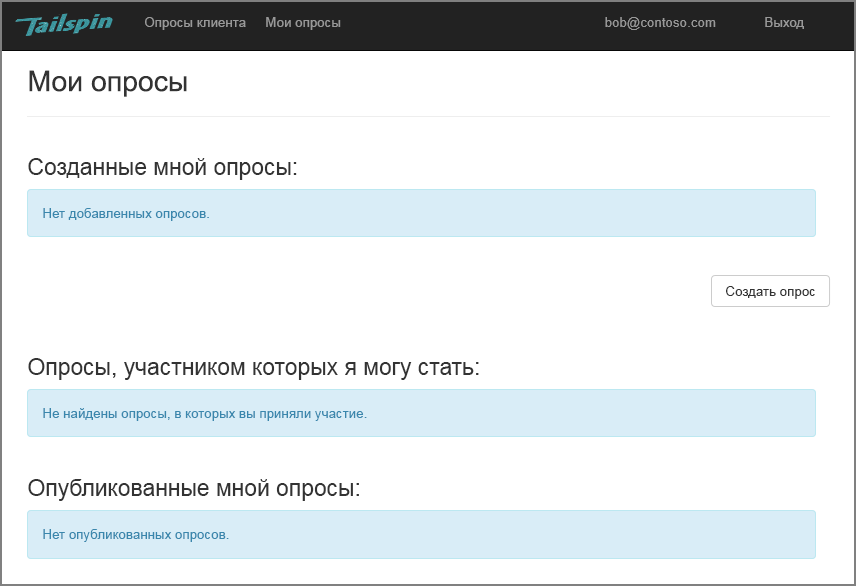
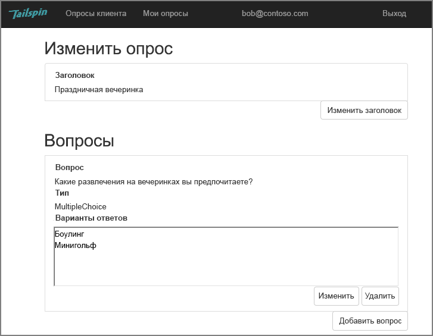
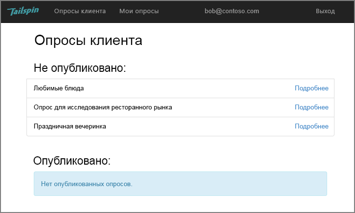
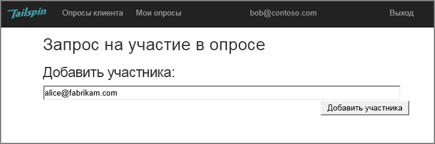
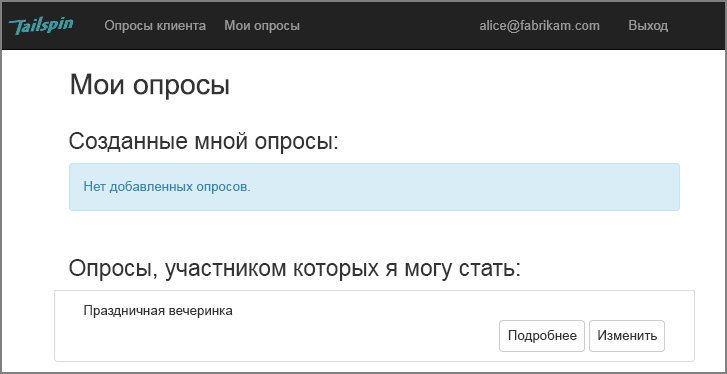
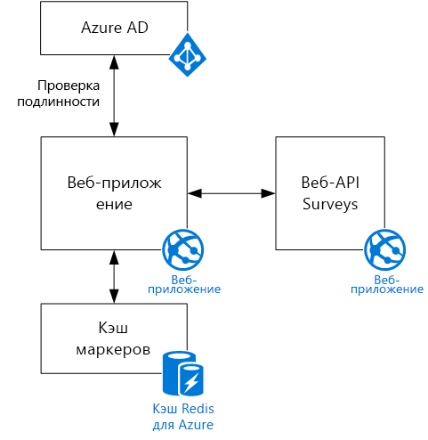

# Сценарий TailspinThe Tailspin scenario

[ Пример кода][sample application][ Sample code][sample application]

Tailspin — это вымышленная компания, которая разрабатывает приложение SaaS с именем Surveys.Tailspin is a fictitious company that is developing a SaaS application named Surveys. Это приложение позволяет организациям создавать и публиковать интерактивные опросы.This application enables organizations to create and publish online surveys.

* Организация может зарегистрироваться для использования приложения.An organization can sign up for the application.
* После регистрации пользователи могут входить в приложение с помощью учетных данных организации.After the organization is signed up, users can sign into the application with their organizational credentials.
* Они могут создавать, изменять и публиковать опросы.Users can create, edit, and publish surveys.

> [!NOTE]
> Чтобы приступить к работе с приложением, см. статью [Запуск приложения Surveys].To get started with the application, see [Run the Surveys application].
> 
> 

## Пользователи могут создавать, изменять и просматривать опросыUsers can create, edit, and view surveys
Пользователь, прошедший проверку подлинности, может просматривать все опросы, которые он создал или для которых ему предоставлены права участника, а также создавать новые опросы.An authenticated user can view all the surveys that he or she has created or has contributor rights to, and create new surveys. Обратите внимание, что пользователь выполнил вход с помощью своего удостоверения организации — `bob@contoso.com`.Notice that the user is signed in with his organizational identity, `bob@contoso.com`.

На этом снимке экрана показана страница редактирования опроса:This screenshot shows the Edit Survey page:

Пользователи также могут просматривать любые опросы, созданные другими пользователями, в рамках одного клиента.Users can also view any surveys created by other users within the same tenant.

## Владельцы опросов могут приглашать участниковSurvey owners can invite contributors
Когда пользователь создает опрос, он может приглашать других пользователей в качестве участников опроса.When a user creates a survey, he or she can invite other people to be contributors on the survey. Участники могут изменять опрос, но не могут удалять или публиковать его.Contributors can edit the survey, but cannot delete or publish it.  

Пользователь может добавлять участников из других клиентов, что позволяет совместно использовать ресурсы между клиентами.A user can add contributors from other tenants, which enables cross-tenant sharing of resources. На этом снимке экрана Боб (`bob@contoso.com`) добавляет в свой опрос Элис (`alice@fabrikam.com`) в качестве участника.In this screenshot, Bob (`bob@contoso.com`) is adding Alice (`alice@fabrikam.com`) as a contributor to a survey that Bob created.

При входе в систему Элис видит опрос в разделе "Опросы, участником которых я могу стать".When Alice logs in, she sees the survey listed under "Surveys I can contribute to".

Обратите внимание, что Элис входит в собственный клиент не как гость клиента Contoso.Note that Alice signs into her own tenant, not as a guest of the Contoso tenant. У Элис есть разрешения участника только для этого опроса &mdash; она не может просматривать другие опросы в клиенте Contoso.Alice has contributor permissions only for that survey &mdash; she cannot view other surveys from the Contoso tenant.

## АрхитектураArchitecture
Приложение Surveys состоит из веб-интерфейса и серверной части веб-API.The Surveys application consists of a web front end and a web API backend. Оба компонента реализованы с помощью [ASP.NET Core].Both are implemented using [ASP.NET Core].

Для проверки подлинности веб-приложение использует Azure Active Directory (Azure AD).The web application uses Azure Active Directory (Azure AD) to authenticate users. Веб-приложение также вызывает Azure AD для получения маркеров доступа OAuth 2 для веб-API.The web application also calls Azure AD to get OAuth 2 access tokens for the Web API. Маркеры доступа кэшируются в кэше Redis для Azure.Access tokens are cached in Azure Redis Cache. Кэш позволяет нескольким экземплярам совместно использовать один кэш маркеров (например, в ферме серверов).The cache enables multiple instances to share the same token cache (e.g., in a server farm).

[**Далее**][authentication][**Next**][authentication]

<!-- Links -->

[authentication]: authenticate.md

[Запуск приложения Surveys]: ./run-the-app.md
[Run the Surveys application]: ./run-the-app.md
[ASP.NET Core]: /aspnet/core
[sample application]: https://github.com/mspnp/multitenant-saas-guidance
