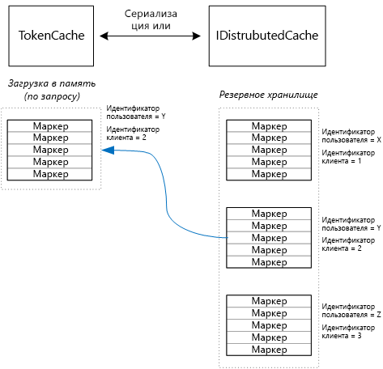

# <a name="cache-access-tokens"></a>Кэширование маркеров доступа

[ Пример кода][sample application]

Получение маркера доступа OAuth является относительно ресурсоемким процессом, поскольку для этого требуется отправить HTTP-запрос в конечную точку маркера. Поэтому рекомендуется по возможности кэшировать маркеры. [Библиотека аутентификации Azure AD] [ ADAL] (ADAL) автоматически кэширует маркеры, полученные из Azure AD, в том числе маркеры обновления.

ADAL обеспечивает реализацию кэша маркеров по умолчанию. Однако этот кэш маркеров предназначен для собственных клиентских приложений и **не** подходит для веб-приложений по следующим причинам:

* это статический экземпляр, который не является потокобезопасным;
* он не масштабируется для большого количества пользователей, так как маркеры всех пользователей попадают в один словарь;
* он не может быть общим для веб-серверов в ферме.

Вместо этого вам нужно реализовать собственный кэш маркеров, производный от класса ADAL `TokenCache`. Этот кэш должен соответствовать серверной среде и обеспечивать нужный уровень изоляции между маркерами разных пользователей.

Класс `TokenCache` хранит словарь маркеров, индексированных по издателю, ресурсу, пользователю и идентификатору клиента. Настраиваемый кэш маркеров должен записывать этот словарь в резервное хранилище, например кэш Redis.

В приложении Tailspin кэш маркеров реализуется классом `DistributedTokenCache` . Эта реализация использует абстракцию [IDistributedCache][distributed-cache] из ASP.NET Core. Таким образом, резервным хранилищем может быть любая реализация `IDistributedCache` .

* По умолчанию в приложении Surveys используется кэш Redis.
* Для веб-сервера с одним экземпляром можно использовать [кэш в памяти][in-memory-cache] ASP.NET Core. (Этот вариант также подходит для локального запуска приложения во время разработки.)

`DistributedTokenCache` хранит данные кэша как пары "ключ-значение" в резервном хранилище. Ключом является идентификатор пользователя и идентификатор клиента, поэтому в резервном хранилище имеются отдельные данные кэша для каждого уникального сочетания пользователя и клиента.



Резервное хранилище секционируется по пользователям. Для каждого HTTP-запроса маркеры, относящиеся к конкретному пользователю, считываются из резервного хранилища и сохраняются в словаре `TokenCache`. Если в качестве резервного хранилища используется Redis, все экземпляры каждого сервера в ферме используют для чтения и записи один и тот же кэш, что позволяет масштабировать систему на большое количество пользователей.

## <a name="encrypting-cached-tokens"></a>Шифрование кэшированных маркеров

Маркеры считаются конфиденциальными данными, поскольку они предоставляют доступ к ресурсам пользователя. Кроме того, в отличие от пароля пользователя, их нельзя хранить в виде хэша. Поэтому крайне важно защитить их от компрометации. Кэш на основе Redis защищен паролем, но любой обладатель пароля может получить все кэшированные маркеры доступа. По этой причине `DistributedTokenCache` шифрует все данные, которые он записывает в резервное хранилище. Шифрование выполняется с помощью API-интерфейсов [защиты данных][data-protection], которые предоставляет ASP.NET Core.

> [!NOTE]
> Если приложение развернуто на веб-сайтах Azure, ключи шифрования сохраняются в сетевое хранилище и синхронизируются на всех компьютерах. См. статью об [управлении ключами и времени существования ключей][key-management]. По умолчанию ключи не шифруются при использовании в службе веб-сайтов Azure, но вы можете [включить шифрование с использованием сертификата X.509][x509-cert-encryption].

## <a name="distributedtokencache-implementation"></a>Реализация DistributedTokenCache

Класс `DistributedTokenCache` является производным от класса ADAL [TokenCache][tokencache-class].

В конструкторе класс `DistributedTokenCache` создает ключ для текущего пользователя и загружает кэш из резервного хранилища.

```csharp
public DistributedTokenCache(
    ClaimsPrincipal claimsPrincipal,
    IDistributedCache distributedCache,
    ILoggerFactory loggerFactory,
    IDataProtectionProvider dataProtectionProvider)
    : base()
{
    _claimsPrincipal = claimsPrincipal;
    _cacheKey = BuildCacheKey(_claimsPrincipal);
    _distributedCache = distributedCache;
    _logger = loggerFactory.CreateLogger<DistributedTokenCache>();
    _protector = dataProtectionProvider.CreateProtector(typeof(DistributedTokenCache).FullName);
    AfterAccess = AfterAccessNotification;
    LoadFromCache();
}
```

Ключ создается путем объединения идентификатора пользователя и идентификатора клиента. Оба идентификатора берутся из утверждений в `ClaimsPrincipal`пользователя.

```csharp
private static string BuildCacheKey(ClaimsPrincipal claimsPrincipal)
{
    string clientId = claimsPrincipal.FindFirstValue("aud", true);
    return string.Format(
        "UserId:{0}::ClientId:{1}",
        claimsPrincipal.GetObjectIdentifierValue(),
        clientId);
}
```

Чтобы загрузить данные кэша, прочтите сериализованный BLOB-объект из резервного хранилища и вызовите метод `TokenCache.Deserialize` для преобразования BLOB-объекта в данные кэша.

```csharp
private void LoadFromCache()
{
    byte[] cacheData = _distributedCache.Get(_cacheKey);
    if (cacheData != null)
    {
        this.Deserialize(_protector.Unprotect(cacheData));
    }
}
```

При каждом доступе ADAL к кэшу возникает событие `AfterAccess` . Если данные кэша изменились, свойство `HasStateChanged` получает значение "true". В этом случае обновите резервное хранилище в соответствии с изменениями, а затем задайте свойству `HasStateChanged` значение "false".

```csharp
public void AfterAccessNotification(TokenCacheNotificationArgs args)
{
    if (this.HasStateChanged)
    {
        try
        {
            if (this.Count > 0)
            {
                _distributedCache.Set(_cacheKey, _protector.Protect(this.Serialize()));
            }
            else
            {
                // There are no tokens for this user/client, so remove the item from the cache.
                _distributedCache.Remove(_cacheKey);
            }
            this.HasStateChanged = false;
        }
        catch (Exception exp)
        {
            _logger.WriteToCacheFailed(exp);
            throw;
        }
    }
}
```

TokenCache отправляет два следующих события:

* `BeforeWrite`. Вызывается непосредственно перед тем, как ADAL выполнит запись в кэш. Его можно использовать для реализации стратегии параллелизма.
* `BeforeAccess`. Вызывается непосредственно перед тем, как ADAL выполнит чтение из кэша. В этом случае можно перезагрузить кэш, чтобы получить его последнюю версию.

Мы решили не обрабатывать эти два события.

* В случае параллелизма приоритет имеет последняя запись. Это нормально, поскольку маркеры хранятся независимо для каждого пользователя и клиента, поэтому конфликт может произойти только в случае, если один пользователь открыл два сеанса входа одновременно.
* Для операции чтения кэш будет загружаться при каждом запросе. Запросы являются кратковременными. Если в это время кэш будет изменен, следующий запрос получит новое значение.

[**Далее**][client-assertion]

<!-- links -->
[ADAL]: https://msdn.microsoft.com/library/azure/jj573266.aspx
[client-assertion]: ./client-assertion.md
[data-protection]: /aspnet/core/security/data-protection/
[distributed-cache]: /aspnet/core/performance/caching/distributed
[key-management]: /aspnet/core/security/data-protection/configuration/default-settings
[in-memory-cache]: /aspnet/core/performance/caching/memory
[tokencache-class]: https://msdn.microsoft.com/library/azure/microsoft.identitymodel.clients.activedirectory.tokencache.aspx
[x509-cert-encryption]: /aspnet/core/security/data-protection/implementation/key-encryption-at-rest#x509-certificate
[sample application]: https://github.com/mspnp/multitenant-saas-guidance
