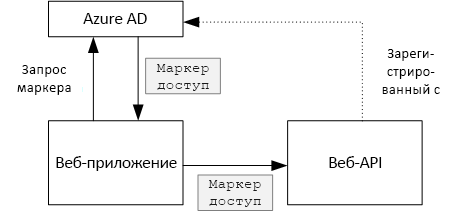
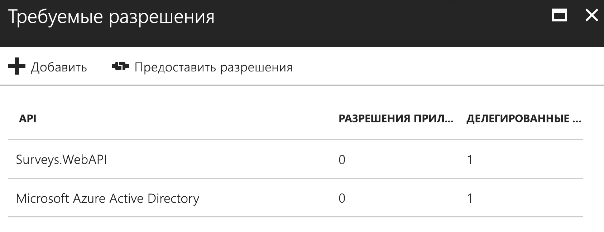

# <a name="secure-a-backend-web-api"></a>Защита серверного веб-API

[ Пример кода][sample application]

Приложение [Tailspin Surveys] использует серверный веб-API для управления операциями CRUD в опросах. Например, когда пользователь щелкает "Мои опросы", веб-приложение отправляет HTTP-запрос в веб-API.

```
GET /users/{userId}/surveys
```

Веб-API возвращает объект JSON.

```
{
  "Published":[],
  "Own":[
    {"Id":1,"Title":"Survey 1"},
    {"Id":3,"Title":"Survey 3"},
    ],
  "Contribute": [{"Id":8,"Title":"My survey"}]
}
```

Веб-интерфейс API не допускает выполнение анонимных запросов, поэтому веб-приложение должно пройти проверку подлинности с помощью токенов носителя OAuth 2.

> [!NOTE]
> Это сценарий взаимодействия между серверами. Приложение не осуществляет AJAX-вызовы API из клиента браузера.
> 
> 

Доступны два основных подхода:

* Удостоверение делегированного пользователя. Веб-приложение выполняет проверку подлинности с помощью удостоверения пользователя.
* Удостоверение приложения. Веб-приложение выполняет проверку подлинности с помощью идентификатора клиента, используя поток учетных данных клиента OAuth2.

Приложение Tailspin реализует удостоверение делегированного пользователя. Их основные различия приведены ниже.

**Удостоверение делегированного пользователя**

* Токен носителя, отправляемый в веб-API, содержит удостоверение пользователя.
* Веб-API принимает решения об авторизации на основе удостоверения пользователя.
* Веб-приложение должно обрабатывать ошибки 403 ("Запрещено") из веб-API, если пользователь не авторизован для выполнения действия.
* Как правило, веб-приложение все еще принимает некоторые решения относительно авторизации, затрагивающие пользовательский интерфейс (например отображение или скрытие элементов пользовательского интерфейса).
* Веб-API может использоваться ненадежными клиентами, такими как приложение JavaScript или классическое клиентское приложение.

**Удостоверение приложения**

* Веб-API не получает сведения о пользователе.
* Веб-API не выполняет авторизацию на основе удостоверения пользователя. Все решения об авторизации принимает веб-приложение.  
* Веб-API нельзя использовать в ненадежном клиенте (в приложении JavaScript или собственном клиентском приложении).
* Этот подход проще реализовать, так как в веб-API отсутствует логика авторизации.

Независимо от подхода веб-приложение должно получить маркер доступа, представляющий учетные данные, необходимые для вызова веб-API.

* В случае с удостоверением делегированного пользователя маркер должен поступать от поставщика удостоверений, который выдает маркер от имени пользователя.
* Приложение может использовать в качестве учетных данных маркеры, получаемые от IDP, или разместить собственный сервер маркеров. Но нет необходимости писать сервер маркеров с нуля, можно применить уже проверенные платформы, например [IdentityServer4]. Если аутентификация выполняется через Azure AD, настоятельно рекомендуем получать маркер доступа из Azure AD, даже если вы реализуете собственный поток учетных данных.

В оставшейся части этой статьи предполагается, что приложение проходит проверку подлинности в Azure AD.



## <a name="register-the-web-api-in-azure-ad"></a>Регистрация веб-API в Azure AD
Чтобы получить токен носителя для веб-API из Azure AD, необходимо выполнять ряд настроек в Azure AD.

1. Зарегистрируйте веб-API в Azure AD.

2. Укажите идентификатор клиента для веб-приложения в свойстве `knownClientApplications` манифеста приложения веб-API. См. раздел об [обновлении манифестов приложения].

3. Предоставьте веб-приложению разрешение вызывать веб-API. На портале управления Azure можно задать два типа разрешений: "Разрешения приложения" для удостоверения приложения (поток учетных данных клиента) или "Делегированные разрешения" для удостоверения делегированного пользователя.
   
   

## <a name="getting-an-access-token"></a>Получение маркера доступа
Перед вызовом веб-API веб-приложение получает маркер доступа из Azure AD. В приложении .NET используйте [Библиотеку аутентификации Azure AD (ADAL) для .NET][ADAL].

В потоке кода авторизации OAuth 2 приложение обменивается кодом авторизации для маркера доступа. Для получения маркера доступа приведенный ниже код использует ADAL. Этот код вызывается во время события `AuthorizationCodeReceived` .

```csharp
// The OpenID Connect middleware sends this event when it gets the authorization code.   
public override async Task AuthorizationCodeReceived(AuthorizationCodeReceivedContext context)
{
    string authorizationCode = context.ProtocolMessage.Code;
    string authority = "https://login.microsoftonline.com/" + tenantID
    string resourceID = "https://tailspin.onmicrosoft.com/surveys.webapi" // App ID URI
    ClientCredential credential = new ClientCredential(clientId, clientSecret);

    AuthenticationContext authContext = new AuthenticationContext(authority, tokenCache);
    AuthenticationResult authResult = await authContext.AcquireTokenByAuthorizationCodeAsync(
        authorizationCode, new Uri(redirectUri), credential, resourceID);

    // If successful, the token is in authResult.AccessToken
}
```

Ниже указаны различные необходимые параметры.

* `authority`. Вычисляется по идентификатору клиента для пользователя, выполнившего вход. Идентификатор клиента поставщика службы SaaS не используется.  
* `authorizationCode`. Код проверки подлинности, полученный от поставщика удостоверений.
* `clientId`. Идентификатор клиента веб-приложения.
* `clientSecret`. Секрет клиента веб-приложения.
* `redirectUri`. URI перенаправления, заданный для OpenID. Здесь поставщик удостоверений выполняет обратный вызов маркера.
* `resourceID`. URI идентификатора приложения для веб-API, который был создан при регистрации веб-API в Azure AD.
* `tokenCache`. Объект, который кэширует маркеры доступа. См. статью о [кэшировании маркеров].

Если `AcquireTokenByAuthorizationCodeAsync` завершается успешно, ADAL кэширует маркер. Чтобы получить маркер из кэша позднее, вызовите AcquireTokenSilentAsync:

```csharp
AuthenticationContext authContext = new AuthenticationContext(authority, tokenCache);
var result = await authContext.AcquireTokenSilentAsync(resourceID, credential, new UserIdentifier(userId, UserIdentifierType.UniqueId));
```

где `userId` обозначает идентификатор объекта пользователя, который указан в утверждении`http://schemas.microsoft.com/identity/claims/objectidentifier`.

## <a name="using-the-access-token-to-call-the-web-api"></a>Использование маркера доступа для вызова веб-API
Получив маркер, отправьте его в веб-API в заголовке авторизации HTTP-запроса.

```
Authorization: Bearer xxxxxxxxxx
```

Приведенный далее метод расширения из приложения Surveys задает заголовок авторизации в HTTP-запросе с помощью класса **HttpClient** .

```csharp
public static async Task<HttpResponseMessage> SendRequestWithBearerTokenAsync(this HttpClient httpClient, HttpMethod method, string path, object requestBody, string accessToken, CancellationToken ct)
{
    var request = new HttpRequestMessage(method, path);
    if (requestBody != null)
    {
        var json = JsonConvert.SerializeObject(requestBody, Formatting.None);
        var content = new StringContent(json, Encoding.UTF8, "application/json");
        request.Content = content;
    }

    request.Headers.Authorization = new AuthenticationHeaderValue("Bearer", accessToken);
    request.Headers.Accept.Add(new MediaTypeWithQualityHeaderValue("application/json"));

    var response = await httpClient.SendAsync(request, ct);
    return response;
}
```

## <a name="authenticating-in-the-web-api"></a>Проверка подлинности в веб-API
Веб-API должен проверить подлинность токена носителя. В ASP.NET Core вы можете использовать пакет [Microsoft.AspNet.Authentication.JwtBearer][JwtBearer]. Этот пакет содержит ПО промежуточного слоя, который позволяет приложению получать токены носителя OpenID Connect.

Зарегистрируйте ПО промежуточного слоя в классе `Startup` веб-API.

```csharp
public void Configure(IApplicationBuilder app, IHostingEnvironment env, ApplicationDbContext dbContext, ILoggerFactory loggerFactory)
{
    // ...

    app.UseJwtBearerAuthentication(new JwtBearerOptions {
        Audience = configOptions.AzureAd.WebApiResourceId,
        Authority = Constants.AuthEndpointPrefix,
        TokenValidationParameters = new TokenValidationParameters {
            ValidateIssuer = false
        },
        Events= new SurveysJwtBearerEvents(loggerFactory.CreateLogger<SurveysJwtBearerEvents>())
    });
    
    // ...
}
```

* **Audience**. Задайте в качестве значения URL-адрес идентификатора приложения для веб-API, который был создан при регистрации веб-API в Azure AD.
* **Authority**. Для мультитенантного приложения установите значение `https://login.microsoftonline.com/common/`.
* **TokenValidationParameters**. Для мультитенантного приложения установите значение false для параметра **ValidateIssuer**. Это означает, что приложение будет самостоятельно проверять издателя.
* Класс **Events** наследуется от **JwtBearerEvents**.

### <a name="issuer-validation"></a>Проверка издателя
Издатель маркера проверяется в событии **JwtBearerEvents.TokenValidated**. Издатель отправляется в утверждении "iss".

В приложении Surveys веб-API не обрабатывает [Регистрация клиента]. Таким образом, он только проверяет, находится ли издатель в базе данных приложения. Если издатель отсутствует, создается исключение, которое приводит к ошибке проверки подлинности.

```csharp
public override async Task TokenValidated(TokenValidatedContext context)
{
    var principal = context.Ticket.Principal;
    var tenantManager = context.HttpContext.RequestServices.GetService<TenantManager>();
    var userManager = context.HttpContext.RequestServices.GetService<UserManager>();
    var issuerValue = principal.GetIssuerValue();
    var tenant = await tenantManager.FindByIssuerValueAsync(issuerValue);

    if (tenant == null)
    {
        // The caller was not from a trusted issuer. Throw to block the authentication flow.
        throw new SecurityTokenValidationException();
    }

    var identity = principal.Identities.First();

    // Add new claim for survey_userid
    var registeredUser = await userManager.FindByObjectIdentifier(principal.GetObjectIdentifierValue());
    identity.AddClaim(new Claim(SurveyClaimTypes.SurveyUserIdClaimType, registeredUser.Id.ToString()));
    identity.AddClaim(new Claim(SurveyClaimTypes.SurveyTenantIdClaimType, registeredUser.TenantId.ToString()));

    // Add new claim for Email
    var email = principal.FindFirst(ClaimTypes.Upn)?.Value;
    if (!string.IsNullOrWhiteSpace(email))
    {
        identity.AddClaim(new Claim(ClaimTypes.Email, email));
    }
}
```

Как показано в этом примере, вы можете изменять утверждения с помощью события **TokenValidated**. Как вы помните, эти утверждения поступают из Azure AD. Если веб-приложение изменяет полученные утверждения, эти изменения не влияют на маркер носителя, который передается в веб-API. Дополнительные сведения см. в разделе о [преобразовании утверждений][claims-transformation].

## <a name="authorization"></a>Авторизация
Общие сведения об авторизации см. в статье об [авторизации на основе ролей и ресурсов][Authorization]. 

ПО промежуточного слоя JwtBearer обрабатывает ответы на запросы авторизации. Например, вы можете разрешить действие контроллера только для прошедших аутентификацию пользователей, изменив атрибут **[Authorize]** и указав схему проверки подлинности **JwtBearerDefaults.AuthenticationScheme**:

```csharp
[Authorize(ActiveAuthenticationSchemes = JwtBearerDefaults.AuthenticationScheme)]
```

Возвращает код состояния 401, если пользователь не прошел проверку подлинности.

Чтобы ограничить действие контроллера политикой авторизации, укажите имя политики в атрибуте **[Authorize]**:

```csharp
[Authorize(Policy = PolicyNames.RequireSurveyCreator)]
```

Возвращает код состояния 401, если пользователь не прошел проверку подлинности, и 403, если пользователь прошел проверку подлинности, но не авторизован. Зарегистрируйте политику при запуске:

```csharp
public void ConfigureServices(IServiceCollection services)
{
    services.AddAuthorization(options =>
    {
        options.AddPolicy(PolicyNames.RequireSurveyCreator,
            policy =>
            {
                policy.AddRequirements(new SurveyCreatorRequirement());
                policy.RequireAuthenticatedUser(); // Adds DenyAnonymousAuthorizationRequirement 
                policy.AddAuthenticationSchemes(JwtBearerDefaults.AuthenticationScheme);
            });
        options.AddPolicy(PolicyNames.RequireSurveyAdmin,
            policy =>
            {
                policy.AddRequirements(new SurveyAdminRequirement());
                policy.RequireAuthenticatedUser(); // Adds DenyAnonymousAuthorizationRequirement 
                policy.AddAuthenticationSchemes(JwtBearerDefaults.AuthenticationScheme);
            });
    });
    
    // ...
}
```

[**Далее**][token cache]

<!-- links -->
[ADAL]: https://msdn.microsoft.com/library/azure/jj573266.aspx
[JwtBearer]: https://www.nuget.org/packages/Microsoft.AspNet.Authentication.JwtBearer

[Tailspin Surveys]: tailspin.md
[IdentityServer4]: https://github.com/IdentityServer/IdentityServer4
[обновлении манифестов приложения]: ./run-the-app.md#update-the-application-manifests
[кэшировании маркеров]: token-cache.md
[Регистрация клиента]: signup.md
[claims-transformation]: claims.md#claims-transformations
[Authorization]: authorize.md
[sample application]: https://github.com/mspnp/multitenant-saas-guidance
[token cache]: token-cache.md
