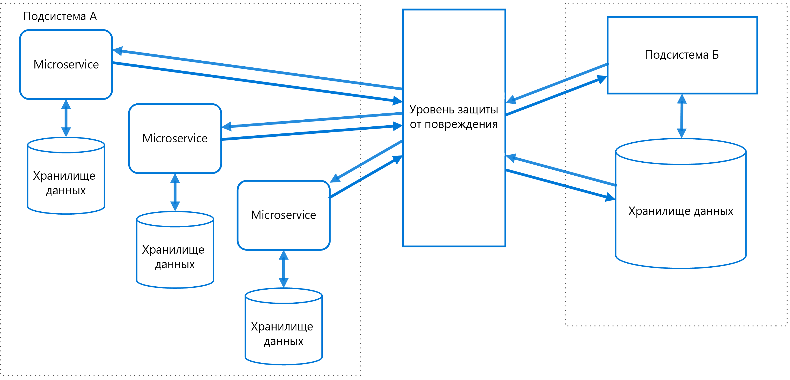

# Шаблон уровня защиты от повреждения

Между разными подсистемами с разной семантикой можно реализовать уровень оболочки или адаптера. Этот уровень будет преобразовывать запросы от одной подсистемы к другой. Используйте этот шаблон, чтобы гарантировать, что схема приложения не ограничена зависимостями во внешних подсистемах. Впервые этот шаблон описал Эрик Эванс (Eric Evans) в книге *Предметно-ориентированное проектирование*.

## Контекст и проблема

Большинство приложений используют другие системы для некоторых данных или функций. Например, при миграции приложения прежних версий в новую систему по-прежнему могут потребоваться устаревшие ресурсы. Новые компоненты должны вызвать устаревшую систему. В частности, это относится к постепенным миграциям, где различные компоненты более крупных приложений со временем перемещаются в современные системы.

В устаревших системах часто появляются проблемы с качеством, такие как сложные схемы данных или устаревшие API. Компоненты и технологии, используемые в устаревших системах, могут существенно отличаться от новых систем. Для взаимодействия с устаревшей системой новому приложению может потребоваться поддержка устаревшей инфраструктуры, протоколов, моделей данных, API-интерфейсов или других компонентов, которые в противном случае вы не поместили бы в новое приложение.

Для обеспечения доступа между новыми и устаревшими системами в новой системе может потребоваться принудительно использовать по крайней мере некоторые API-интерфейсы или другую семантику устаревших систем. Если в устаревших компонентах возникают проблемы с качеством, их поддержка может быть нецелесообразна в хорошо спроектированном современном приложении.

Аналогичные проблемы могут возникнуть в любой внешней системе, которую не контролирует ваша команда разработчиков, а не только в устаревших системах.

## Решение

Изолируйте разные подсистемы, поместив между ними уровень защиты от повреждений. Этот уровень преобразует обмен данными между двумя системами, за счет чего одна система не изменяется, а в другой сохраняется структура и технологический подход.

На приведенной выше схеме показано приложение с двумя подсистемами. Подсистема A вызывает подсистему B через уровень защиты от повреждений. При обмене данными между подсистемой A и уровнем защиты от повреждений всегда используется модель данных и архитектура подсистемы A. Вызовы из уровня защиты от повреждений к подсистеме B соответствуют модели данных и методам этой подсистемы. Уровень защиты от повреждения содержит всю логику, необходимую для преобразования между двумя системами. Его можно реализовать как компонент в приложении или как независимую службу.

## Проблемы и рекомендации

- Уровень защиты от повреждения может привести к задержкам в вызовах между системами.
- Уровень защиты от повреждения добавляет дополнительную службу, требующую управления и поддержки.
- Определите способ масштабирования уровня защиты от повреждения.
- Определите количество уровней защиты от повреждения. Вам может потребоваться разделить функциональные возможности на несколько служб, использующих различные технологии и языки. Или же у вас могут быть другие причины для разделения уровня защиты от повреждения.
- Подумайте об управлении уровнем защиты от повреждения в контексте своих приложений и служб, а также о том, как он будет интегрироваться с процессами наблюдения, выпуска и конфигурации.
- Убедитесь в том, что транзакции и целостность данных сохраняются и их можно отслеживать.
- Определите объем задач для уровня защиты от повреждений: обработка всех данных, передаваемых между разными подсистемами, или только подмножества функций.
- Если уровень защиты от повреждений входит в стратегию переноса приложений, определите, будет ли он постоянным или его использование будет прекращено после переноса всех устаревших функциональных возможностей.

## Когда следует использовать этот шаблон

Используйте этот шаблон в следующих случаях:

- Планируется миграция в несколько этапов, но необходима поддержка интеграции между новыми и устаревшими системами.
- Семантика разных подсистем различна, но по-прежнему требуется их взаимодействие.

Этот шаблон неприменим в случае несущественных семантических различий между новыми и устаревшими системами.

## Связанные руководства

- [Шаблон подавления](./strangler.md)
