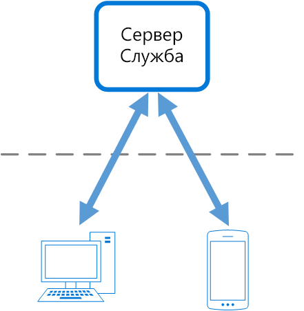
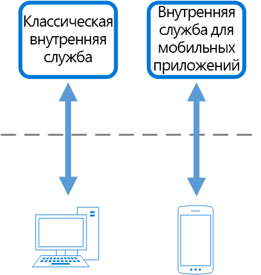

# Схема отдельных серверных частей для каждого интерфейса

Создайте отдельные серверные службы, которые будут использоваться конкретными внешними приложениями или интерфейсами. Эта схема полезна в тех случаях, когда нужно избежать настройки одной серверной службы под несколько интерфейсов. Этот шаблон впервые описал Сэм Ньюмен (Sam Newman).

## Контекст и проблема

Предположим, что изначально создавалось приложение с классическим веб-интерфейсом. Как обычно, параллельно разрабатывается серверная служба, которая предоставляет возможности, необходимые именно этому пользовательскому интерфейсу. По мере роста числа пользователей создается мобильное приложение, которое должно взаимодействовать с той же серверной службой. Теперь серверная служба становится универсальной и обслуживает потребности сразу двух интерфейсов: классического для настольных компьютеров и нового для мобильных устройств.

Но при этом возможности мобильных устройств существенно отличаются от возможностей браузеров на компьютерах. У них другие размеры экранов, производительность и ограничения по отображению информации. Это означает, что отличаются и требования к серверной службе для мобильного приложения и веб-интерфейса. 

Такие отличия приводят к тому, что требования к серверной части становятся противоречивыми. Разработчику приходится часто и существенно изменять систему, чтобы поддерживать актуальность серверной службы как для веб-интерфейса, так и для мобильного приложения. При этом над интерфейсами часто работают разные команды разработчиков, и в результате серверная части становится узким местом в процессе разработки. Противоречивые требования к обновлениям и необходимость поддерживать работоспособность обоих интерфейсов вынуждают тратить слишком много усилий на этот единый ресурс.

 

По мере увеличения трудоемкости разработки серверной службы иногда создается даже отдельная группа разработчиков для обслуживания этой серверной службы и управления ею. Все эти факторы приводят к разрыву связей между разработчиками интерфейсной и серверной частей и полностью переносят на разработчиков серверной службы ответственность за выполнение несогласованных требований разработчиков интерфейсов. Но если разработчики одного из интерфейсов требуют внести изменения в серверную часть, эти изменения необходимо согласовать с другими командами разработки интерфейса, прежде чем реализовать их в серверной службе. 

## Решение

Создайте отдельную серверную часть для каждого пользовательского интерфейса. Теперь поведение и производительность каждой серверной части можно привести в соответствие требованиям интерфейса среды, при этом эти изменения не повлияют на взаимодействие с другими интерфейсами.

 

Поскольку каждая серверная часть работает только с одним интерфейсом, ее можно оптимизировать для этого интерфейса. В результате она станет менее крупной и менее громоздкой, а скорее всего и более быстрой, чем универсальная серверная часть, в которой пересекаются требования для всех интерфейсов. Каждая команда разработчиков интерфейса получает возможность автономно управлять требованиями к своей серверной части, и не зависит от проблем, связанных с разработкой единой серверной части. Это дает гибкость в выборе языков, последовательности выпусков, приоритетах рабочих нагрузок и интеграции функций для серверной части.

Дополнительные сведения см. в статье [Pattern: Backends For Frontends](http://samnewman.io/patterns/architectural/bff/) (Схема отдельных серверных частей для каждого интерфейса).

## Проблемы и рекомендации

- Оцените, сколько потребуется серверных служб.
- Если несколько разных интерфейсов (например, разные мобильные клиенты) будут создавать одинаковые запросы, оцените наиболее подходящий для них вариант: отдельная серверная часть для каждого интерфейса или единая серверная часть.
- Реализация этой схемы чаще всего приводит к дублированию кода в службах.
- Серверная служба, ориентированная на конкретный интерфейс, должна содержать только логику и поведение, имеющие отношение к этому клиенту. Общую бизнес-логику и другие глобальные компоненты следует реализовать в другой части приложения.
- Подумайте о том, как эта схема повлияет на распределение обязанностей в команде разработчиков.
- Оцените, сколько времени потребуется для ее реализации. Не приведет ли создание новой серверной службы к появлению технического долга, пока вы продолжаете поддерживать существующую универсальную серверную часть?

## Когда следует использовать этот шаблон

Используйте этот шаблон в следующих случаях:

- если поддержка единой или универсальной серверной службы приводит к существенным издержкам на разработку;
- если вы хотите оптимизировать серверную часть под требования конкретных интерфейсов;
- если в универсальную серверную часть вносятся изменения для поддержки нескольких интерфейсов;
- если другой язык разработки лучше подходит для поддержки дополнительного пользовательского интерфейса.

Эту схему не стоит применять в следующих случаях:

- если интерфейсы создают одинаковые или очень похожие запросы к серверной части;
- если существует только один интерфейс для взаимодействия с серверной частью.

## Связанные руководства

- [Схема агрегирования на шлюзе](./gateway-aggregation.md)
- [Схема разгрузки шлюза](./gateway-offloading.md)
- [Схема маршрутизации шлюза](./gateway-routing.md)

