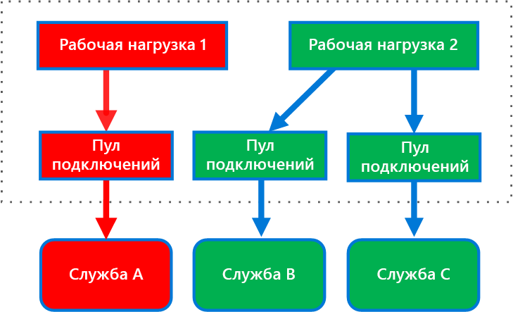

# <a name="bulkhead-pattern"></a>Шаблон отсеков

Изоляция элементов приложения в пулах, чтобы в случае сбоя одного элемента остальные продолжали функционировать.

В названии шаблона упоминаются *отсеки*, так в его основе лежит идея разделения внутреннего пространства корабля. Если корпус корабля будет поврежден, вода заполнит только один поврежденный отсек, и корабль останется на плаву.

## <a name="context-and-problem"></a>Контекст и проблема

Облачные приложения могут содержать несколько служб, у каждой из которых есть один или несколько потребителей. Избыточная нагрузка на службу или сбой повлияют на всех потребителей этой службы.

Кроме того, потребители могут отправлять запросы к нескольким службам одновременно, а каждый запрос использует некоторые ресурсы. Когда пользователь отправляет запрос к неправильно настроенной или неисправной службе, выделенные для этого запроса ресурсы могут не освободиться своевременно. При этом запросы продолжают поступать, что может привести к полному исчерпанию ресурсов. Например, будут исчерпаны возможности пула клиентских подключений. Теперь проблема затрагивает уже и запросы потребителей к другим службам. В конечном итоге потребители не смогут отправлять запросы ко всем службам, а не только к проблемной.

Эта же проблема нехватки ресурсов влияет и на службы с несколькими потребителями. Большое количество запросов от одного клиента может исчерпать все доступные службе ресурсы. Тогда другие пользователи не смогут использовать службу, что приводит к каскадному сбою.

## <a name="solution"></a>Решение

Разделите экземпляры службы на несколько групп в соответствии с характером нагрузки от пользователей и требованиями доступности. Такой подход позволяет изолировать сбои, сохраняя работоспособность служб хотя бы для некоторых пользователей даже во время сбоя.

Аналогично можно разделить ресурсы для потребителя, чтобы вызовы к одной службе не влияли на доступность ресурсов для вызова других служб. Например, если потребитель должен обращаться к нескольким службам, ему можно выделить отдельный пул подключений для каждой службы. Теперь, если одна из служб работает плохо, это повлияет только на пул подключений, назначенный для этой службы, что позволяет потребителю продолжать использовать другие службы.

Такая схема предоставляет следующие преимущества:

- Изоляция потребителей и служб от каскадных сбоев. Проблема, затрагивающая потребителя или службу, будет изолирована в одном конкретном отсеке, а не обрушит все решение полностью.
- Вы сможете сохранить некоторую функциональность даже в случае сбоя службы. Другие службы и функции приложения продолжат работать.
- Вы сможете развертывать для приложений службы с разным качеством обслуживания. Например, пул высокоприоритетных потребителей будет использовать службы с высоким приоритетом.

На следующей схеме показаны отсеки, созданные для пулов подключений, которые обращаются к отдельным службам. При сбое или проблемах в службе A пул подключений к ней изолируется, и такой сбой влияет только на те рабочие нагрузки, которые используют пул потоков этой службы A. Рабочие нагрузки, использующие службы B и C, не затрагиваются и могут продолжать работу без перебоев.



На следующей схеме показано несколько клиентов, которые вызывают одну службу. Каждому клиенту назначен отдельный экземпляр этой службы. Здесь клиент 1 создал слишком много запросов и перегрузил свой экземпляр. Так как каждый экземпляр службы изолирован от других, остальные клиенты спокойно продолжают работать с этой службой.


## <a name="issues-and-considerations"></a>Проблемы и рекомендации

- Проектируйте отсеки с учетом коммерческих и технических требований приложения.
- Выбирая технологию разделения служб или потребителей, учитывайте доступный уровень изоляции и влияние этой технологии на стоимость решения, производительность и управляемость.
- Рассмотрите возможность объединить шаблон отсеков с шаблонами автоматического отключения и (или) регулирования, чтобы создать более сложный механизм обработки сбоев.
- Для распределения потребителей между отсеками попробуйте применить процессы, пулы потоков и семафоры. Некоторые проекты, например [Netflix Hystrix][hystrix] и [Polly][polly] предлагают клиентские платформы для разделения отсеков.
- Для распределения служб между отсеками попробуйте применить отдельные виртуальные машины, контейнеры или процессы. Контейнеры — это компромиссное решение, обеспечивающее изоляцию ресурсов и низкие издержки.
- Службы, которые взаимодействуют с помощью асинхронных сообщений, можно разделить с помощью разных наборов очередей. Можно выделить для каждой очереди свой набор экземпляров, которые обрабатывают сообщения из нее, или определить специальный алгоритм для выборки и распределения сообщений в одной группе экземпляров.
- Определите уровень детализации для отсеков. Например, если вы хотите распределить клиенты между несколькими секциями, можно создать по одной секции для каждого клиента или поместить в одну секцию несколько клиентов.
- Отслеживайте производительность и соглашение об уровне обслуживания отдельно для каждой секции.

## <a name="when-to-use-this-pattern"></a>Когда следует использовать этот шаблон

Используйте этот шаблон в следующих случаях:

- Для изоляции ресурсов, используемых набором серверных служб, особенно если приложение способно поддерживать некоторый уровень функциональности даже при неработоспобности одной из этих служб.
- Для изоляции критически важных потребителей от стандартных потребителей.
- Для защиты приложения от каскадных сбоев.

Эту схему не стоит применять в следующих случаях:

- Если для проекта нельзя неэффективно использовать ресурсы.
- Если дополнительная сложность ничем не оправдана.

## <a name="example"></a>Пример

В следующем файле конфигурации Kubernetes создается изолированный контейнер для выполнения одной службы с отдельными ограничениями и ресурсами ЦП и памяти.

```yml
apiVersion: v1
kind: Pod
metadata:
  name: drone-management
spec:
  containers:
  - name: drone-management-container
    image: drone-service
    resources:
      requests:
        memory: "64Mi"
        cpu: "250m"
      limits:
        memory: "128Mi"
        cpu: "1"
```

## <a name="related-guidance"></a>Связанные руководства

- [Проектирование устойчивых приложений для Azure](../resiliency/index.md)
- [Шаблон автоматического выключения](./circuit-breaker.md)
- [Шаблон повторов](./retry.md)
- [Шаблон регулирования](./throttling.md)

<!-- links -->

[hystrix]: https://github.com/Netflix/Hystrix
[polly]: https://github.com/App-vNext/Polly
