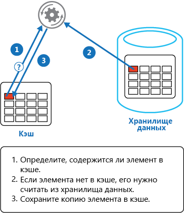

# <a name="cache-aside-pattern"></a><span data-ttu-id="73d48-104">Шаблон "Кэш на стороне"</span><span class="sxs-lookup"><span data-stu-id="73d48-104">Cache-Aside pattern</span></span>

[!INCLUDE [header](../_includes/header.md)]

<span data-ttu-id="73d48-105">Загрузите данные по запросу из хранилища данных в кэш.</span><span class="sxs-lookup"><span data-stu-id="73d48-105">Load data on demand into a cache from a data store.</span></span> <span data-ttu-id="73d48-106">Этот шаблон может повысить производительность, а также помочь поддерживать согласованность между данными, хранящимися в кэше и в хранилище данных.</span><span class="sxs-lookup"><span data-stu-id="73d48-106">This can improve performance and also helps to maintain consistency between data held in the cache and data in the underlying data store.</span></span>

## <a name="context-and-problem"></a><span data-ttu-id="73d48-107">Контекст и проблема</span><span class="sxs-lookup"><span data-stu-id="73d48-107">Context and problem</span></span>

<span data-ttu-id="73d48-108">Приложения используют кеш для улучшения повторного доступа к информации, содержащейся в хранилище данных.</span><span class="sxs-lookup"><span data-stu-id="73d48-108">Applications use a cache to improve repeated access to information held in a data store.</span></span> <span data-ttu-id="73d48-109">Тем не менее нецелесообразно ожидать, что кэшированные данные всегда будут полностью согласованы с данными в хранилище данных.</span><span class="sxs-lookup"><span data-stu-id="73d48-109">However, it's impractical to expect that cached data will always be completely consistent with the data in the data store.</span></span> <span data-ttu-id="73d48-110">Приложения должны реализовать стратегию, которая позволяет убедиться, что данные в кэше максимально актуальны, а также определить и обработать ситуации, возникающие, когда данные в кэше устарели.</span><span class="sxs-lookup"><span data-stu-id="73d48-110">Applications should implement a strategy that helps to ensure that the data in the cache is as up-to-date as possible, but can also detect and handle situations that arise when the data in the cache has become stale.</span></span>

## <a name="solution"></a><span data-ttu-id="73d48-111">Решение</span><span class="sxs-lookup"><span data-stu-id="73d48-111">Solution</span></span>

<span data-ttu-id="73d48-112">Многие коммерческие системы кэширования предоставляют операции сквозного чтения, сквозной записи или записи с задержкой.</span><span class="sxs-lookup"><span data-stu-id="73d48-112">Many commercial caching systems provide read-through and write-through/write-behind operations.</span></span> <span data-ttu-id="73d48-113">В этих системах приложение получает данные, ссылаясь на кэш.</span><span class="sxs-lookup"><span data-stu-id="73d48-113">In these systems, an application retrieves data by referencing the cache.</span></span> <span data-ttu-id="73d48-114">Если данные находятся не в кэше, они извлекаются из хранилища данных и добавляются в кэш.</span><span class="sxs-lookup"><span data-stu-id="73d48-114">If the data isn't in the cache, it's retrieved from the data store and added to the cache.</span></span> <span data-ttu-id="73d48-115">Все изменения данных, хранящиеся в кэше, также автоматически записываются обратно в хранилище данных.</span><span class="sxs-lookup"><span data-stu-id="73d48-115">Any modifications to data held in the cache are automatically written back to the data store as well.</span></span>

<span data-ttu-id="73d48-116">Если в кэше не предоставляется эта функция, это нужно сделать в приложениях, которые используют кэш для хранения данных.</span><span class="sxs-lookup"><span data-stu-id="73d48-116">For caches that don't provide this functionality, it's the responsibility of the applications that use the cache to maintain the data.</span></span>

<span data-ttu-id="73d48-117">Приложение может эмулировать функциональные возможности сквозного чтения кэширования путем реализации стратегии "кэш на стороне".</span><span class="sxs-lookup"><span data-stu-id="73d48-117">An application can emulate the functionality of read-through caching by implementing the cache-aside strategy.</span></span> <span data-ttu-id="73d48-118">Эта стратегия загружает данные в кэш по запросу.</span><span class="sxs-lookup"><span data-stu-id="73d48-118">This strategy loads data into the cache on demand.</span></span> <span data-ttu-id="73d48-119">На рисунке показано использование шаблона "кэш на стороне" для хранения данных в кэше.</span><span class="sxs-lookup"><span data-stu-id="73d48-119">The figure illustrates using the Cache-Aside pattern to store data in the cache.</span></span>




<span data-ttu-id="73d48-121">Если приложение обновляет сведения, оно может следовать стратегии сквозной записи путем внесения изменений в хранилище данных и объявления соответствующего элемента в кеше недопустимым.</span><span class="sxs-lookup"><span data-stu-id="73d48-121">If an application updates information, it can follow the write-through strategy by making the modification to the data store, and by invalidating the corresponding item in the cache.</span></span>

<span data-ttu-id="73d48-122">Если далее требуется элемент, который использует стратегию "кэш на стороне", это приведет к извлечению обновленных данных из хранилища данных и добавления их обратно в кэш.</span><span class="sxs-lookup"><span data-stu-id="73d48-122">When the item is next required, using the cache-aside strategy will cause the updated data to be retrieved from the data store and added back into the cache.</span></span>

## <a name="issues-and-considerations"></a><span data-ttu-id="73d48-123">Проблемы и рекомендации</span><span class="sxs-lookup"><span data-stu-id="73d48-123">Issues and considerations</span></span>

<span data-ttu-id="73d48-124">При принятии решения о реализации этого шаблона необходимо учитывать следующие моменты.</span><span class="sxs-lookup"><span data-stu-id="73d48-124">Consider the following points when deciding how to implement this pattern:</span></span> 

<span data-ttu-id="73d48-125">**Время существования кэшированных данных**.</span><span class="sxs-lookup"><span data-stu-id="73d48-125">**Lifetime of cached data**.</span></span> <span data-ttu-id="73d48-126">Многие кэши реализуют политику срока действия, которая объявляет данные недействительными и удаляет их из кэша, если они недоступны в течение определенного времени.</span><span class="sxs-lookup"><span data-stu-id="73d48-126">Many caches implement an expiration policy that invalidates data and removes it from the cache if it's not accessed for a specified period.</span></span> <span data-ttu-id="73d48-127">Чтобы стратегия "кэш на стороне" была эффективной, убедитесь, что политика срока действия соответствует шаблону доступа к приложениям, использующим данные.</span><span class="sxs-lookup"><span data-stu-id="73d48-127">For cache-aside to be effective, ensure that the expiration policy matches the pattern of access for applications that use the data.</span></span> <span data-ttu-id="73d48-128">Не устанавливайте слишком короткий срок, так как это может привести к тому, что приложения будут получать данные из хранилища данных и добавлять их в кэш постоянно.</span><span class="sxs-lookup"><span data-stu-id="73d48-128">Don't make the expiration period too short because this can cause applications to continually retrieve data from the data store and add it to the cache.</span></span> <span data-ttu-id="73d48-129">Однако не устанавливайте и слишком длительный срок,чтобы кэшированные данные не устарели.</span><span class="sxs-lookup"><span data-stu-id="73d48-129">Similarly, don't make the expiration period so long that the cached data is likely to become stale.</span></span> <span data-ttu-id="73d48-130">Помните, что кэширование является наиболее эффективным для относительно статических или часто читаемых данных.</span><span class="sxs-lookup"><span data-stu-id="73d48-130">Remember that caching is most effective for relatively static data, or data that is read frequently.</span></span>

<span data-ttu-id="73d48-131">**Исключение данных**.</span><span class="sxs-lookup"><span data-stu-id="73d48-131">**Evicting data**.</span></span> <span data-ttu-id="73d48-132">Большинство кэшей имеют ограниченный размер в сравнении с исходным хранилищем данных. При необходимости они будут исключать данные.</span><span class="sxs-lookup"><span data-stu-id="73d48-132">Most caches have a limited size compared to the data store where the data originates, and they'll evict data if necessary.</span></span> <span data-ttu-id="73d48-133">Большинство кэшей применяют политику "наиболее давно использовавшийся" для выбора исключаемых элементов, но ее можно изменить.</span><span class="sxs-lookup"><span data-stu-id="73d48-133">Most caches adopt a least-recently-used policy for selecting items to evict, but this might be customizable.</span></span> <span data-ttu-id="73d48-134">Чтобы убедиться, что кэш является экономичным, настройте свойства глобального срока действия и другие свойства кэша, а также свойство срока действия каждого кэшированного элемента.</span><span class="sxs-lookup"><span data-stu-id="73d48-134">Configure the global expiration property and other properties of the cache, and the expiration property of each cached item, to ensure that the cache is cost effective.</span></span> <span data-ttu-id="73d48-135">Не всегда целесообразно применять политику глобального исключения для каждого элемента кэша.</span><span class="sxs-lookup"><span data-stu-id="73d48-135">It isn't always appropriate to apply a global eviction policy to every item in the cache.</span></span> <span data-ttu-id="73d48-136">Например, если извлечение кэшированного элемента из хранилища данных является затратным процессом, будет разумно хранить этот элемент в кеше за счет более часто используемых, но менее затратных элементов.</span><span class="sxs-lookup"><span data-stu-id="73d48-136">For example, if a cached item is very expensive to retrieve from the data store, it can be beneficial to keep this item in the cache at the expense of more frequently accessed but less costly items.</span></span>

<span data-ttu-id="73d48-137">**Подготовка кэша**.</span><span class="sxs-lookup"><span data-stu-id="73d48-137">**Priming the cache**.</span></span> <span data-ttu-id="73d48-138">Многие решения предварительно заполняют кэш данными, которые могут потребоваться приложению в процессе обработки запуска.</span><span class="sxs-lookup"><span data-stu-id="73d48-138">Many solutions prepopulate the cache with the data that an application is likely to need as part of the startup processing.</span></span> <span data-ttu-id="73d48-139">Шаблон "Кэш на стороне" по-прежнему можно использовать, если срок действия некоторых из этих данных истекает или данные исключаются.</span><span class="sxs-lookup"><span data-stu-id="73d48-139">The Cache-Aside pattern can still be useful if some of this data expires or is evicted.</span></span>

<span data-ttu-id="73d48-140">**Согласованность**.</span><span class="sxs-lookup"><span data-stu-id="73d48-140">**Consistency**.</span></span> <span data-ttu-id="73d48-141">Реализация шаблона "Кэш на стороне" не гарантирует согласованность между хранилищем данных и кэшем.</span><span class="sxs-lookup"><span data-stu-id="73d48-141">Implementing the Cache-Aside pattern doesn't guarantee consistency between the data store and the cache.</span></span> <span data-ttu-id="73d48-142">Элемент в хранилище данных можно изменить в любое время, используя внешний процесс, и эти изменения могут не отражаться в кэше до следующей загрузки элемента.</span><span class="sxs-lookup"><span data-stu-id="73d48-142">An item in the data store can be changed at any time by an external process, and this change might not be reflected in the cache until the next time the item is loaded.</span></span> <span data-ttu-id="73d48-143">В системе, реплицирующей данные в хранилищах данных, эта проблема может стать серьезной, если синхронизация выполняется часто.</span><span class="sxs-lookup"><span data-stu-id="73d48-143">In a system that replicates data across data stores, this problem can become serious if synchronization occurs frequently.</span></span>

<span data-ttu-id="73d48-144">**Локальное (выполняющееся в памяти) кэширование**.</span><span class="sxs-lookup"><span data-stu-id="73d48-144">**Local (in-memory) caching**.</span></span> <span data-ttu-id="73d48-145">Кэш может быть локальным для экземпляра приложения и хранящимся в памяти.</span><span class="sxs-lookup"><span data-stu-id="73d48-145">A cache could be local to an application instance and stored in-memory.</span></span> <span data-ttu-id="73d48-146">Кэш на стороне можно использовать в этой среде, если приложение многократно получает доступ к одним и тем же данным.</span><span class="sxs-lookup"><span data-stu-id="73d48-146">Cache-aside can be useful in this environment if an application repeatedly accesses the same data.</span></span> <span data-ttu-id="73d48-147">Тем не менее локальный кэш является закрытым, и поэтому разные экземпляры приложения могут иметь копию одних и тех же кэшированных данных.</span><span class="sxs-lookup"><span data-stu-id="73d48-147">However, a local cache is private and so different application instances could each have a copy of the same cached data.</span></span> <span data-ttu-id="73d48-148">Эти данные могут быстро стать несогласованными между кэшами, из-за чего может возникнуть необходимость завершения срока хранения данных, которые находятся в частном кэше, и обновлять их чаще.</span><span class="sxs-lookup"><span data-stu-id="73d48-148">This data could quickly become inconsistent between caches, so it might be necessary to expire data held in a private cache and refresh it more frequently.</span></span> <span data-ttu-id="73d48-149">В таких случаях рекомендуется изучить использование механизма общего или распределенного кэширования.</span><span class="sxs-lookup"><span data-stu-id="73d48-149">In these scenarios, consider investigating the use of a shared or a distributed caching mechanism.</span></span>

## <a name="when-to-use-this-pattern"></a><span data-ttu-id="73d48-150">Когда следует использовать этот шаблон</span><span class="sxs-lookup"><span data-stu-id="73d48-150">When to use this pattern</span></span>

<span data-ttu-id="73d48-151">Используйте этот шаблон в следующих случаях:</span><span class="sxs-lookup"><span data-stu-id="73d48-151">Use this pattern when:</span></span>

- <span data-ttu-id="73d48-152">В кэше не предоставляются собственные операции сквозного чтения и записи.</span><span class="sxs-lookup"><span data-stu-id="73d48-152">A cache doesn't provide native read-through and write-through operations.</span></span>
- <span data-ttu-id="73d48-153">Запрос ресурса невозможно спрогнозировать.</span><span class="sxs-lookup"><span data-stu-id="73d48-153">Resource demand is unpredictable.</span></span> <span data-ttu-id="73d48-154">Этот шаблон позволяет приложениям загружать данные по запросу.</span><span class="sxs-lookup"><span data-stu-id="73d48-154">This pattern enables applications to load data on demand.</span></span> <span data-ttu-id="73d48-155">Он не делает предположений о том, какие данные потребуются приложению.</span><span class="sxs-lookup"><span data-stu-id="73d48-155">It makes no assumptions about which data an application will require in advance.</span></span>

<span data-ttu-id="73d48-156">Этот шаблон будет неприменим в следующих случаях:</span><span class="sxs-lookup"><span data-stu-id="73d48-156">This pattern might not be suitable:</span></span>

- <span data-ttu-id="73d48-157">Если кэшированный набор данных является статическим.</span><span class="sxs-lookup"><span data-stu-id="73d48-157">When the cached data set is static.</span></span> <span data-ttu-id="73d48-158">Если данные будут соответствовать свободному месту в кэше, заполняя кэш данными во время запуска и применяя политику, которая предотвращает истечение срока действия данных.</span><span class="sxs-lookup"><span data-stu-id="73d48-158">If the data will fit into the available cache space, prime the cache with the data on startup and apply a policy that prevents the data from expiring.</span></span>
- <span data-ttu-id="73d48-159">Для кэширования данных о состоянии сеанса в веб-приложении, размещенном на веб-ферме.</span><span class="sxs-lookup"><span data-stu-id="73d48-159">For caching session state information in a web application hosted in a web farm.</span></span> <span data-ttu-id="73d48-160">В этой среде следует избегать зависимостей, основанных на сходстве между клиентом и сервером.</span><span class="sxs-lookup"><span data-stu-id="73d48-160">In this environment, you should avoid introducing dependencies based on client-server affinity.</span></span>

## <a name="example"></a><span data-ttu-id="73d48-161">Пример</span><span class="sxs-lookup"><span data-stu-id="73d48-161">Example</span></span>

<span data-ttu-id="73d48-162">В Microsoft Azure можно использовать кэш Redis для Azure, чтобы создавать распределенный кэш, который может использоваться несколькими экземплярами приложения одновременно.</span><span class="sxs-lookup"><span data-stu-id="73d48-162">In Microsoft Azure you can use Azure Redis Cache to create a distributed cache that can be shared by multiple instances of an application.</span></span> 

<span data-ttu-id="73d48-163">Чтобы подключиться к экземпляру кэша Redis для Azure, вызовите статический метод `Connect` и передайте строку подключения.</span><span class="sxs-lookup"><span data-stu-id="73d48-163">To connect to an Azure Redis Cache instance, call the static `Connect` method and pass in the connection string.</span></span> <span data-ttu-id="73d48-164">Этот метод возвращает `ConnectionMultiplexer`, представляющий подключение.</span><span class="sxs-lookup"><span data-stu-id="73d48-164">The method returns a `ConnectionMultiplexer` that represents the connection.</span></span> <span data-ttu-id="73d48-165">Один из способов совместного использования экземпляра `ConnectionMultiplexer` в приложении предполагает наличие статического свойства, которое возвращает подключенный экземпляр (как в приведенном ниже примере).</span><span class="sxs-lookup"><span data-stu-id="73d48-165">One approach to sharing a `ConnectionMultiplexer` instance in your application is to have a static property that returns a connected instance, similar to the following example.</span></span> <span data-ttu-id="73d48-166">Этот подход помогает потокобезопасно инициализировать только отдельный подключенный экземпляр.</span><span class="sxs-lookup"><span data-stu-id="73d48-166">This approach provides a thread-safe way to initialize only a single connected instance.</span></span>

```csharp
private static ConnectionMultiplexer Connection;

// Redis Connection string info
private static Lazy<ConnectionMultiplexer> lazyConnection = new Lazy<ConnectionMultiplexer>(() =>
{
    string cacheConnection = ConfigurationManager.AppSettings["CacheConnection"].ToString();
    return ConnectionMultiplexer.Connect(cacheConnection);
});

public static ConnectionMultiplexer Connection => lazyConnection.Value;
```

<span data-ttu-id="73d48-167">В методе `GetMyEntityAsync` в следующем примере кода показана реализация шаблона "кэш на стороне", основанного на кэш Redis для Azure.</span><span class="sxs-lookup"><span data-stu-id="73d48-167">The `GetMyEntityAsync` method in the following code example shows an implementation of the Cache-Aside pattern based on Azure Redis Cache.</span></span> <span data-ttu-id="73d48-168">Этот метод извлекает объект из кэша, используя подход сквозного чтения.</span><span class="sxs-lookup"><span data-stu-id="73d48-168">This method retrieves an object from the cache using the read-through approach.</span></span>

<span data-ttu-id="73d48-169">Объект определяется с помощью целочисленного идентификатора в качестве ключа.</span><span class="sxs-lookup"><span data-stu-id="73d48-169">An object is identified by using an integer ID as the key.</span></span> <span data-ttu-id="73d48-170">Метод `GetMyEntityAsync` пытается извлечь из кэша элемент с этим ключом.</span><span class="sxs-lookup"><span data-stu-id="73d48-170">The `GetMyEntityAsync` method tries to retrieve an item with this key from the cache.</span></span> <span data-ttu-id="73d48-171">Если найден соответствующий элемент, он возвращается.</span><span class="sxs-lookup"><span data-stu-id="73d48-171">If a matching item is found, it's returned.</span></span> <span data-ttu-id="73d48-172">Если в кэше нет соответствия, метод `GetMyEntityAsync` извлекает объект из хранилища данных, добавляет его в кэш, а затем возвращает его.</span><span class="sxs-lookup"><span data-stu-id="73d48-172">If there's no match in the cache, the `GetMyEntityAsync` method retrieves the object from a data store, adds it to the cache, and then returns it.</span></span> <span data-ttu-id="73d48-173">Код, который фактически считывает данные из хранилища данных, не отображается, так как он зависит от хранилища данных.</span><span class="sxs-lookup"><span data-stu-id="73d48-173">The code that actually reads the data from the data store is not shown here, because it depends on the data store.</span></span> <span data-ttu-id="73d48-174">Обратите внимание, что для кэшированного элемента установлен срок действия, чтобы он не стал устаревшим, если обновлен в другом месте.</span><span class="sxs-lookup"><span data-stu-id="73d48-174">Note that the cached item is configured to expire to prevent it from becoming stale if it's updated elsewhere.</span></span>


```csharp
// Set five minute expiration as a default
private const double DefaultExpirationTimeInMinutes = 5.0;

public async Task<MyEntity> GetMyEntityAsync(int id)
{
  // Define a unique key for this method and its parameters.
  var key = $"MyEntity:{id}";
  var cache = Connection.GetDatabase();
  
  // Try to get the entity from the cache.
  var json = await cache.StringGetAsync(key).ConfigureAwait(false);
  var value = string.IsNullOrWhiteSpace(json) 
                ? default(MyEntity) 
                : JsonConvert.DeserializeObject<MyEntity>(json);
  
  if (value == null) // Cache miss
  {
    // If there's a cache miss, get the entity from the original store and cache it.
    // Code has been omitted because it's data store dependent.  
    value = ...;

    // Avoid caching a null value.
    if (value != null)
    {
      // Put the item in the cache with a custom expiration time that 
      // depends on how critical it is to have stale data.
      await cache.StringSetAsync(key, JsonConvert.SerializeObject(value)).ConfigureAwait(false);
      await cache.KeyExpireAsync(key, TimeSpan.FromMinutes(DefaultExpirationTimeInMinutes)).ConfigureAwait(false);
    }
  }

  return value;
}
```

>  <span data-ttu-id="73d48-175">В этих примерах для получения доступа к хранилищу и сведений из кэша используется API-интерфейс кэша Redis для Azure.</span><span class="sxs-lookup"><span data-stu-id="73d48-175">The examples use the Azure Redis Cache API to access the store and retrieve information from the cache.</span></span> <span data-ttu-id="73d48-176">Дополнительные сведения см. в статьях [Как использовать кэш Redis для Azure](https://docs.microsoft.com/azure/redis-cache/cache-dotnet-how-to-use-azure-redis-cache) и [Как создать веб-приложение с использованием кэша Redis](https://docs.microsoft.com/azure/redis-cache/cache-web-app-howto)</span><span class="sxs-lookup"><span data-stu-id="73d48-176">For more information, see [Using Microsoft Azure Redis Cache](https://docs.microsoft.com/azure/redis-cache/cache-dotnet-how-to-use-azure-redis-cache) and [How to create a Web App with Redis Cache](https://docs.microsoft.com/azure/redis-cache/cache-web-app-howto)</span></span>

<span data-ttu-id="73d48-177">В методе `UpdateEntityAsync`, показанном ниже, демонстрируется, как сделать объект недействительным в кэше при изменении значения приложением.</span><span class="sxs-lookup"><span data-stu-id="73d48-177">The `UpdateEntityAsync` method shown below demonstrates how to invalidate an object in the cache when the value is changed by the application.</span></span> <span data-ttu-id="73d48-178">Этот код обновляет хранилище исходных данных, а затем удаляет кэшированный элемент из кэша.</span><span class="sxs-lookup"><span data-stu-id="73d48-178">The code updates the original data store and then removes the cached item from the cache.</span></span>

```csharp
public async Task UpdateEntityAsync(MyEntity entity)
{
    // Update the object in the original data store.
    await this.store.UpdateEntityAsync(entity).ConfigureAwait(false); 

    // Invalidate the current cache object.
    var cache = Connection.GetDatabase();
    var id = entity.Id;
    var key = $"MyEntity:{id}"; // The key for the cached object.
    await cache.KeyDeleteAsync(key).ConfigureAwait(false); // Delete this key from the cache.
}
```

> [!NOTE]
> <span data-ttu-id="73d48-179">Порядок шагов важен.</span><span class="sxs-lookup"><span data-stu-id="73d48-179">The order of the steps is important.</span></span> <span data-ttu-id="73d48-180">Обновите хранилище данных, *прежде чем* удалять элемент из кэша.</span><span class="sxs-lookup"><span data-stu-id="73d48-180">Update the data store *before* removing the item from the cache.</span></span> <span data-ttu-id="73d48-181">Если сначала удалить кэшированный элемент, есть небольшой промежуток времени, когда клиент может извлечь элемент до обновления хранилища данных.</span><span class="sxs-lookup"><span data-stu-id="73d48-181">If you remove the cached item first, there is a small window of time when a client might fetch the item before the data store is updated.</span></span> <span data-ttu-id="73d48-182">Это приведет к созданию промахов кэша (так как элемент был удален из кэша), вызывая более раннюю версию элемента, извлекаемого из хранилища данных и добавленного обратно в кэш.</span><span class="sxs-lookup"><span data-stu-id="73d48-182">That will result in a cache miss (because the item was removed from the cache), causing the earlier version of the item to be fetched from the data store and added back into the cache.</span></span> <span data-ttu-id="73d48-183">Это приведет к появлению устаревших данных кэша.</span><span class="sxs-lookup"><span data-stu-id="73d48-183">The result will be stale cache data.</span></span>


## <a name="related-guidance"></a><span data-ttu-id="73d48-184">Связанное руководство</span><span class="sxs-lookup"><span data-stu-id="73d48-184">Related guidance</span></span> 

<span data-ttu-id="73d48-185">К реализации этого шаблона могут относиться следующие сведения:</span><span class="sxs-lookup"><span data-stu-id="73d48-185">The following information may be relevant when implementing this pattern:</span></span>

- <span data-ttu-id="73d48-186">[Caching](https://docs.microsoft.com/azure/architecture/best-practices/caching) (Кэширование).</span><span class="sxs-lookup"><span data-stu-id="73d48-186">[Caching Guidance](https://docs.microsoft.com/azure/architecture/best-practices/caching).</span></span> <span data-ttu-id="73d48-187">Здесь предоставлены дополнительные сведения о том, как можно кэшировать данные в облачном решении, а также показаны проблемы, которые следует учитывать при реализации кэширования.</span><span class="sxs-lookup"><span data-stu-id="73d48-187">Provides additional information on how you can cache data in a cloud solution, and the issues that you should consider when you implement a cache.</span></span>

- <span data-ttu-id="73d48-188">[Data Consistency Primer](https://msdn.microsoft.com/library/dn589800.aspx) (Руководство по обеспечению согласованности данных).</span><span class="sxs-lookup"><span data-stu-id="73d48-188">[Data Consistency Primer](https://msdn.microsoft.com/library/dn589800.aspx).</span></span> <span data-ttu-id="73d48-189">Облачные приложения обычно используют данные, которые распределены по хранилищам данных.</span><span class="sxs-lookup"><span data-stu-id="73d48-189">Cloud applications typically use data that's spread across data stores.</span></span> <span data-ttu-id="73d48-190">Управление и поддержание согласованности данных в этой среде — это важнейший аспект системы, в частности проблемы параллелизма и доступности, которые могут возникнуть.</span><span class="sxs-lookup"><span data-stu-id="73d48-190">Managing and maintaining data consistency in this environment is a critical aspect of the system, particularly the concurrency and availability issues that can arise.</span></span> <span data-ttu-id="73d48-191">В этом руководстве описаны проблемы согласованности в распределенных данных и способы реализации окончательной согласованности в приложении для обеспечения доступности данных.</span><span class="sxs-lookup"><span data-stu-id="73d48-191">This primer describes issues about consistency across distributed data, and summarizes how an application can implement eventual consistency to maintain the availability of data.</span></span>
