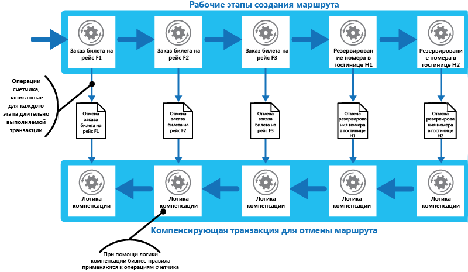

# Шаблон компенсирующих транзакцийCompensating Transaction pattern

[!INCLUDE [header](../_includes/header.md)]

Вы можете отменить работу, выполненную рядом шагов, которые вместе образуют операцию по итоговому согласованию, если один или несколько шагов завершаются сбоем.Undo the work performed by a series of steps, which together define an eventually consistent operation, if one or more of the steps fail. Операции, которые следуют за моделью итоговой согласованности, обычно встречаются в облачных приложениях, которые реализуют сложные бизнес-процессы и рабочие процессы.Operations that follow the eventual consistency model are commonly found in cloud-hosted applications that implement complex business processes and workflows.

## Контекст и проблемаContext and problem

Приложения, работающие в облаке, часто изменяют данные.Applications running in the cloud frequently modify data. Эти данные могут быть распределены между различными источниками данных, которые содержатся в разных географических регионах.This data might be spread across various data sources held in different geographic locations. Чтобы избежать конфликтов и повысить производительность в распределенной среде, приложение не должно пытаться обеспечить надежную согласованность транзакций.To avoid contention and improve performance in a distributed environment, an application shouldn't try to provide strong transactional consistency. Вместо этого приложение должно реализовать итоговую согласованность.Rather, the application should implement eventual consistency. В этой модели обычная бизнес-операция состоит из ряда отдельных этапов.In this model, a typical business operation consists of a series of separate steps. Хотя эти шаги выполняются, общее состояние системы может быть несогласованным, но когда операция завершится и все шаги будут выполнены, система должна снова стать согласованной.While these steps are being performed, the overall view of the system state might be inconsistent, but when the operation has completed and all of the steps have been executed the system should become consistent again.

> [Руководство по согласованности данных](https://msdn.microsoft.com/library/dn589800.aspx) предоставляет сведения о том, почему распределенные транзакции не масштабируются надлежащим образом, а также о принципах модели итоговой согласованности.The [Data Consistency Primer](https://msdn.microsoft.com/library/dn589800.aspx) provides information about why distributed transactions don't scale well, and the principles of the eventual consistency model.

Сложность модели итоговой согласованности заключается в обработке неудачного шага.A challenge in the eventual consistency model is how to handle a step that has failed. В этом случае может потребоваться отменить всю работу, выполненную с помощью операций предыдущих шагов.In this case it might be necessary to undo all of the work completed by the previous steps in the operation. Однако данные нельзя просто откатить, так как другие параллельно запущенные экземпляры приложения могли изменить данные.However, the data can't simply be rolled back because other concurrent instances of the application might have changed it. Даже в тех случаях, когда данные не были изменены параллельно запущенным экземпляром, отмена шага может заключаться не просто в восстановлении исходного состояния.Even in cases where the data hasn't been changed by a concurrent instance, undoing a step might not simply be a matter of restoring the original state. Возможно, потребуется применять различные правила бизнес-процессов (см. веб-сайт путешествий, описанный в разделе "Пример").It might be necessary to apply various business-specific rules (see the travel website described in the Example section).

Если операция, которая реализует конечную согласованность, охватывает несколько разнородных хранилищ данных, отмена шагов в операции требует поочередного посещения каждого хранилища.If an operation that implements eventual consistency spans several heterogeneous data stores, undoing the steps in the operation will require visiting each data store in turn. Работа, выполняемая в каждом хранилище данных, должна быть отменена, чтобы система не оставалась несогласованной.The work performed in every data store must be undone reliably to prevent the system from remaining inconsistent.

Не все данные, затронутые операцией, которая реализует итоговую согласованность, могут храниться в базе данных.Not all data affected by an operation that implements eventual consistency might be held in a database. В среде сервис-ориентированной архитектуры (SOA) операция может вызвать действие в службе и вызвать изменение состояния, хранящегося в этой службе.In a service oriented architecture (SOA) environment an operation could invoke an action in a service, and cause a change in the state held by that service. Чтобы отменить операцию, это изменение состояния также должно быть отменено.To undo the operation, this state change must also be undone. Это может включать повторный вызов службы и выполнение другого действия, которое отменяет результаты первого.This can involve invoking the service again and performing another action that reverses the effects of the first.

## РешениеSolution

Решение заключается в реализации компенсирующей транзакции.The solution is to implement a compensating transaction. Шаги в компенсирующей транзакции должны отменять действие шагов в исходной операции.The steps in a compensating transaction must undo the effects of the steps in the original operation. Компенсирующая транзакция может оказаться неспособной просто заменить текущее состояние на состояние, в котором находилась система в начале операции, потому что при этом подходе изменения, сделанные другими параллельно запущенными экземплярами приложения, могут перезаписаться.A compensating transaction might not be able to simply replace the current state with the state the system was in at the start of the operation because this approach could overwrite changes made by other concurrent instances of an application. Вместо этого необходим интеллектуальный процесс, который учитывает любую работу, выполняемую параллельно запущенными экземплярами.Instead, it must be an intelligent process that takes into account any work done by concurrent instances. Этот процесс обычно будет предназначен для конкретного приложения, определяемый характером выполняемой исходной операцией.This process will usually be application specific, driven by the nature of the work performed by the original operation.

Общим подходом является использование рабочего процесса для реализации операции по итоговому согласованию, требующей компенсации.A common approach is to use a workflow to implement an eventually consistent operation that requires compensation. По мере выполнения исходной операции система записывает информацию о каждом шаге и о том, как можно откатить работу, выполненную на этом шаге.As the original operation proceeds, the system records information about each step and how the work performed by that step can be undone. Если в ​​любой момент операция завершается ошибкой, рабочий процесс поэтапно откатывается назад, выполняя работу, которая отменяет каждый шаг.If the operation fails at any point, the workflow rewinds back through the steps it's completed and performs the work that reverses each step. Обратите внимание, что компенсирующая транзакция не обязательно должна отменять работу в точно обратном порядке по отношению к исходной операции, и, возможно, некоторые из шагов отмены можно будет выполнить параллельно.Note that a compensating transaction might not have to undo the work in the exact reverse order of the original operation, and it might be possible to perform some of the undo steps in parallel.

> Этот подход аналогичен стратегии Саг, которая рассматривается в [блоге Клеменса Вастерса (Clemens Vasters)](https://vasters.com/clemensv/2012/09/01/Sagas.aspx).This approach is similar to the Sagas strategy discussed in [Clemens Vasters’ blog](https://vasters.com/clemensv/2012/09/01/Sagas.aspx).

Компенсирующая транзакция также является операцией по итоговому согласованию, и она также может закончиться сбоем.A compensating transaction is also an eventually consistent operation and it could also fail. Система должна иметь возможность возобновить компенсирующую транзакцию в точке сбоя и продолжить работу.The system should be able to resume the compensating transaction at the point of failure and continue. Возможно, потребуется повторить неудавшийся шаг, поэтому шаги в компенсирующей транзакции должны быть определены как идемпотентые команды.It might be necessary to repeat a step that's failed, so the steps in a compensating transaction should be defined as idempotent commands. Дополнительные сведения см. в статье, посвященной [шаблонам идемпотентности](https://blog.jonathanoliver.com/idempotency-patterns/) в блоге Джонатана Оливера (Jonathan Oliver).For more information, see [Idempotency Patterns](https://blog.jonathanoliver.com/idempotency-patterns/) on Jonathan Oliver’s blog.

В некоторых случаях может оказаться невозможным восстановление с шага, который закончился сбоем, кроме как вручную.In some cases it might not be possible to recover from a step that has failed except through manual intervention. В этих ситуациях система должна создать оповещение и предоставить как можно больше информации о причине сбоя.In these situations the system should raise an alert and provide as much information as possible about the reason for the failure.

## Проблемы и рекомендацииIssues and considerations

При принятии решения о реализации этого шаблона необходимо учитывать следующие моменты.Consider the following points when deciding how to implement this pattern:

Возможно, будет сложно определить, произошел ли сбой в операции, которая реализует итоговую согласованность.It might not be easy to determine when a step in an operation that implements eventual consistency has failed. Шаг может завершиться сбоем не сразу, но вместо этого может быть заблокирован.A step might not fail immediately, but instead could block. Возможно, потребуется реализовать какой-то механизм тайм-аута.It might be necessary to implement some form of time-out mechanism.

Логика компенсации сложно поддается обобщению.-Compensation logic isn't easily generalized. Компенсирующая транзакция зависит от приложения.A compensating transaction is application specific. Она зависит от приложения, которое имеет достаточно сведений, чтобы отменить эффекты каждого шага в неудавшейся операции.It relies on the application having sufficient information to be able to undo the effects of each step in a failed operation.

Вы должны определить шаги в компенсирующей транзакции как идемпотентные команды.You should define the steps in a compensating transaction as idempotent commands. Это позволяет повторять шаги, если сама компенсирующая транзакция заканчивается сбоем.This enables the steps to be repeated if the compensating transaction itself fails.

Инфраструктура, которая обрабатывает шаги в исходной операции и компенсирующую транзакцию, должна быть устойчивой.The infrastructure that handles the steps in the original operation, and the compensating transaction, must be resilient. Она не должна терять сведения, необходимые для компенсации неудачного шага, и должна надежно контролировать ход логики компенсации.It must not lose the information required to compensate for a failing step, and it must be able to reliably monitor the progress of the compensation logic.

Компенсирующая транзакция не обязательно возвращает данные в системе в состояние, в котором они находились в начале первоначальной операции.A compensating transaction doesn't necessarily return the data in the system to the state it was in at the start of the original operation. Вместо этого она компенсирует работу, выполненную с помощью шагов, которые успешно завершились до того, как операция завершилась сбоем.Instead, it compensates for the work performed by the steps that completed successfully before the operation failed.

Порядок шагов в компенсирующей транзакции необязательно должен быть полностью противоположным шагам в исходной операции.The order of the steps in the compensating transaction doesn't necessarily have to be the exact opposite of the steps in the original operation. Например, одно хранилище данных может быть более чувствительно к несогласованностям, чем другое, и поэтому сначала следует выполнить шаги в компенсирующей транзакции, которые отменят изменения в этом хранилище.For example, one data store might be more sensitive to inconsistencies than another, and so the steps in the compensating transaction that undo the changes to this store should occur first.

Размещение кратковременной блокировки на основе тайм-аута в каждом ресурсе, который требуется для завершения операции, и получение этих ресурсов заблаговременно может помочь повысить вероятность успеха всей процедуры.Placing a short-term timeout-based lock on each resource that's required to complete an operation, and obtaining these resources in advance, can help increase the likelihood that the overall activity will succeed. Работу следует выполнять только после получения всех ресурсов.The work should be performed only after all the resources have been acquired. Необходимо завершить все действия до истечения срока действия блокировки.All actions must be finalized before the locks expire.

Рекомендуется использовать более щадящую логику повторных попыток, чтобы свести к минимуму сбои, запускающие компенсирующие транзакции.Consider using retry logic that is more forgiving than usual to minimize failures that trigger a compensating transaction. Если какой-либо шаг в операции, которая реализует итоговую согласованность, сработает, попробуйте обработать сбой в качестве временного исключения и повторите шаг.If a step in an operation that implements eventual consistency fails, try handling the failure as a transient exception and repeat the step. Остановите операцию и инициируйте компенсирующую транзакцию, если шаг прерывается многократно или безвозвратно.Only stop the operation and initiate a compensating transaction if a step fails repeatedly or irrecoverably.

> Многие проблемы реализации компенсирующей транзакции аналогичны проблемам реализации итоговой согласованности.Many of the challenges of implementing a compensating transaction are the same as those with implementing eventual consistency. Дополнительные сведения о реализации итоговой согласованности см. в [руководстве по согласованности данных](https://msdn.microsoft.com/library/dn589800.aspx).See the section Considerations for Implementing Eventual Consistency in the [Data Consistency Primer](https://msdn.microsoft.com/library/dn589800.aspx) for more information.

## Когда следует использовать этот шаблонWhen to use this pattern

Используйте этот шаблон только для операций, которые необходимо отменить в случае сбоя.Use this pattern only for operations that must be undone if they fail. По возможности создавайте решения с учетом возникновения сложностей, требующих компенсирующих транзакций.If possible, design solutions to avoid the complexity of requiring compensating transactions.

## ПримерExample

Веб-сайт путешествий позволяет клиентам бронировать маршруты.A travel website lets customers book itineraries. Один маршрут может включать в себя ряд перелетов и отелей.A single itinerary might comprise a series of flights and hotels. Клиент, путешествующий из Сиэтла в Лондон, а затем в Париж, может выполнить следующие шаги при создании маршрута:A customer traveling from Seattle to London and then on to Paris could perform the following steps when creating an itinerary:

1. Забронировать место в рейсе F1 из Сиэтла в Лондон.Book a seat on flight F1 from Seattle to London.
2. Забронировать место в рейсе F2 из Лондона в Париж.Book a seat on flight F2 from London to Paris.
3. Забронировать место в рейсе F3 из Парижа в Сиэтл.Book a seat on flight F3 from Paris to Seattle.
4. Забронировать номер в отеле H1 в Лондоне.Reserve a room at hotel H1 in London.
5. Забронировать номер в отеле H2 в Париже.Reserve a room at hotel H2 in Paris.

Эти шаги представляют собой операцию по итоговому согласованию, хотя каждый шаг является отдельным действием.These steps constitute an eventually consistent operation, although each step is a separate action. Поэтому вместе с выполнением этих шагов система должна также записывать операции счетчика, необходимые для отмены каждого шага, если клиент решает отменить маршрут.Therefore, as well as performing these steps, the system must also record the counter operations necessary to undo each step in case the customer decides to cancel the itinerary. Затем шаги, необходимые для выполнения операций счетчика, могут выполняться в виде компенсирующих транзакций.The steps necessary to perform the counter operations can then run as a compensating transaction.

Обратите внимание, что шаги в компенсирующей транзакции не обязательно должны быть противоположными исходным шагам, а логика на каждом этапе компенсирующей транзакции должна учитывать любые бизнес-правила.Notice that the steps in the compensating transaction might not be the exact opposite of the original steps, and the logic in each step in the compensating transaction must take into account any business-specific rules. Например, отмена бронирования места в рейсе может не обеспечивать клиенту полного возмещения затрат.For example, unbooking a seat on a flight might not entitle the customer to a complete refund of any money paid. На рисунке показано создание компенсирующей транзакции для отмены продолжительной транзакции, чтобы забронировать маршрут путешествия.The figure illustrates generating a compensating transaction to undo a long-running transaction to book a travel itinerary.

> Возможно, что шаги в компенсирующей транзакции будут выполняться параллельно, в зависимости от того, как вы разработали компенсирующую логику для каждого шага.It might be possible for the steps in the compensating transaction to be performed in parallel, depending on how you've designed the compensating logic for each step.

Во многих бизнес-решениях сбой одного шага не всегда требует отката системы с помощью компенсирующей транзакции.In many business solutions, failure of a single step doesn't always necessitate rolling the system back by using a compensating transaction. Например, если &mdash;после бронирования рейсов F1, F2 и F3 в сценарии веб-сайта путешествия&mdash; клиент не может зарезервировать номер в отеле H1, желательно предложить клиенту номер в другом отеле в том же городе вместо отмены рейсов.For example, if&mdash;after having booked flights F1, F2, and F3 in the travel website scenario&mdash;the customer is unable to reserve a room at hotel H1, it's preferable to offer the customer a room at a different hotel in the same city rather than canceling the flights. Клиент всегда сможет отменить бронирование (в этом случае выполняется компенсирующая транзакция и отменяются бронирования на рейсы F1, F2 и F3), но это решение должно приниматься клиентом, а не системой.The customer can still decide to cancel (in which case the compensating transaction runs and undoes the bookings made on flights F1, F2, and F3), but this decision should be made by the customer rather than by the system.

## Связанные шаблоны и рекомендацииRelated patterns and guidance

При реализации этого шаблона следует принять во внимание следующие шаблоны и рекомендации.The following patterns and guidance might also be relevant when implementing this pattern:

- [Data Consistency Primer](https://msdn.microsoft.com/library/dn589800.aspx) (Руководство по обеспечению согласованности данных).[Data Consistency Primer](https://msdn.microsoft.com/library/dn589800.aspx). Шаблон компенсирующей транзакции часто используется для отмены операций, реализующих модель итоговой согласованности.The Compensating Transaction pattern is often used to undo operations that implement the eventual consistency model. Это руководство содержит сведения о преимуществах и недостатках итоговой согласованности.This primer provides information on the benefits and tradeoffs of eventual consistency.

- [Scheduler-Agent-Supervisor Pattern](scheduler-agent-supervisor.md) (Шаблон "планировщик, агент, контролер").[Scheduler-Agent-Supervisor Pattern](scheduler-agent-supervisor.md). Описывает, как внедрять отказоустойчивые системы, которые выполняют бизнес-операции с использованием распределенных служб и ресурсов.Describes how to implement resilient systems that perform business operations that use distributed services and resources. Иногда может потребоваться отменить работу, выполняемую операцией, с помощью компенсирующей транзакции.Sometimes, it might be necessary to undo the work performed by an operation by using a compensating transaction.

- [Шаблон повторов](./retry.md).[Retry Pattern](./retry.md). Компенсирующие транзакции могут быть дорогостоящими, и можно свести к минимуму их использование путем реализации эффективной политики повтора неудачных операций, следуя шаблону повторов.Compensating transactions can be expensive to perform, and it might be possible to minimize their use by implementing an effective policy of retrying failing operations by following the Retry pattern.
