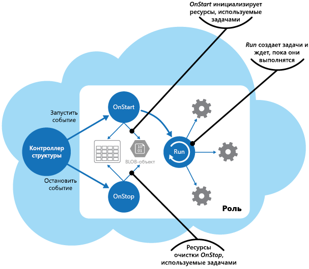

# <a name="compute-resource-consolidation-pattern"></a><span data-ttu-id="06a3e-104">Шаблон консолидации вычислительных ресурсов</span><span class="sxs-lookup"><span data-stu-id="06a3e-104">Compute Resource Consolidation pattern</span></span>

[!INCLUDE [header](../_includes/header.md)]

<span data-ttu-id="06a3e-105">Вы можете объединить несколько задач и операций в единый вычислительный блок.</span><span class="sxs-lookup"><span data-stu-id="06a3e-105">Consolidate multiple tasks or operations into a single computational unit.</span></span> <span data-ttu-id="06a3e-106">Это повысит эффективность использования вычислительных ресурсов и сократит расходы на выполнение вычислительной обработки в облачных приложениях и управление ею.</span><span class="sxs-lookup"><span data-stu-id="06a3e-106">This can increase compute resource utilization, and reduce the costs and management overhead associated with performing compute processing in cloud-hosted applications.</span></span>

## <a name="context-and-problem"></a><span data-ttu-id="06a3e-107">Контекст и проблема</span><span class="sxs-lookup"><span data-stu-id="06a3e-107">Context and problem</span></span>

<span data-ttu-id="06a3e-108">В облачных приложениях часто реализованы сразу несколько разных операций.</span><span class="sxs-lookup"><span data-stu-id="06a3e-108">A cloud application often implements a variety of operations.</span></span> <span data-ttu-id="06a3e-109">В некоторых решениях следует с самого начала применить принцип разделения функций, выделяя разные операции в отдельные вычислительные блоки для раздельного хранения и развертывания (например, в виде отдельных веб-приложений службы приложений, на отдельных виртуальных машинах или в отдельных ролях облачной службы).</span><span class="sxs-lookup"><span data-stu-id="06a3e-109">In some solutions it makes sense to follow the design principle of separation of concerns initially, and divide these operations into separate computational units that are hosted and deployed individually (for example, as separate App Service web apps, separate Virtual Machines, or separate Cloud Service roles).</span></span> <span data-ttu-id="06a3e-110">Такая стратегия упрощает логическую структуру решения, но развертывание большого числа вычислительных блоков повышает затраты на размещение среды для приложения и усложняет управление системой.</span><span class="sxs-lookup"><span data-stu-id="06a3e-110">However, although this strategy can help simplify the logical design of the solution, deploying a large number of computational units as part of the same application can increase runtime hosting costs and make management of the system more complex.</span></span>

<span data-ttu-id="06a3e-111">На приведенном выше рисунке представлен упрощенный пример структуры облачного решения с несколькими вычислительными блоками.</span><span class="sxs-lookup"><span data-stu-id="06a3e-111">As an example, the figure shows the simplified structure of a cloud-hosted solution that is implemented using more than one computational unit.</span></span> <span data-ttu-id="06a3e-112">Каждый вычислительный блок выполняется в собственной виртуальной среде.</span><span class="sxs-lookup"><span data-stu-id="06a3e-112">Each computational unit runs in its own virtual environment.</span></span> <span data-ttu-id="06a3e-113">Каждая функция реализована как отдельная задача (обозначены буквами от A до E), которая выполняется в своем вычислительном блоке.</span><span class="sxs-lookup"><span data-stu-id="06a3e-113">Each function has been implemented as a separate task (labeled Task A through Task E) running in its own computational unit.</span></span>


<span data-ttu-id="06a3e-115">Для каждого вычислительного блока используются оплачиваемые ресурсы, даже в периоды простоя или низкой нагрузки.</span><span class="sxs-lookup"><span data-stu-id="06a3e-115">Each computational unit consumes chargeable resources, even when it's idle or lightly used.</span></span> <span data-ttu-id="06a3e-116">Это означает, что такое решение может оказаться не самым экономичным.</span><span class="sxs-lookup"><span data-stu-id="06a3e-116">Therefore, this isn't always the most cost-effective solution.</span></span>

<span data-ttu-id="06a3e-117">В Azure эта проблема касается ролей облачной службы и службы приложений, а также виртуальных машин.</span><span class="sxs-lookup"><span data-stu-id="06a3e-117">In Azure, this concern applies to roles in a Cloud Service, App Services, and Virtual Machines.</span></span> <span data-ttu-id="06a3e-118">Эти элементы выполняются в виртуальной среде.</span><span class="sxs-lookup"><span data-stu-id="06a3e-118">These items run in their own virtual environment.</span></span> <span data-ttu-id="06a3e-119">Эффективность использования ресурсов будет невысока, если в рамках одного решения выполняется большая коллекция отдельных ролей, веб-сайтов и (или) виртуальных машин, которые отвечают за четко разделенные операции, но вынуждены взаимодействовать и обмениваться информацией.</span><span class="sxs-lookup"><span data-stu-id="06a3e-119">Running a collection of separate roles, websites, or virtual machines that are designed to perform a set of well-defined operations, but that need to communicate and cooperate as part of a single solution, can be an inefficient use of resources.</span></span>

## <a name="solution"></a><span data-ttu-id="06a3e-120">Решение</span><span class="sxs-lookup"><span data-stu-id="06a3e-120">Solution</span></span>

<span data-ttu-id="06a3e-121">Чтобы снизить затраты, повысить эффективность использования ресурсов и скорость обмена данными, а также упростить управление, вы можете объединять группы задач и операций в вычислительные блоки.</span><span class="sxs-lookup"><span data-stu-id="06a3e-121">To help reduce costs, increase utilization, improve communication speed, and reduce management it's possible to consolidate multiple tasks or operations into a single computational unit.</span></span>

<span data-ttu-id="06a3e-122">Задачи можно группировать по разным критериям в зависимости от возможностей, предоставляемых средой, и их стоимости.</span><span class="sxs-lookup"><span data-stu-id="06a3e-122">Tasks can be grouped according to criteria based on the features provided by the environment and the costs associated with these features.</span></span> <span data-ttu-id="06a3e-123">Часто объединяются задачи со схожими профилями по масштабируемости, периодам существования и требованиям к обработке.</span><span class="sxs-lookup"><span data-stu-id="06a3e-123">A common approach is to look for tasks that have a similar profile concerning their scalability, lifetime, and processing requirements.</span></span> <span data-ttu-id="06a3e-124">Такое группирование позволяет масштабировать задачи как единый блок.</span><span class="sxs-lookup"><span data-stu-id="06a3e-124">Grouping these together allows them to scale as a unit.</span></span> <span data-ttu-id="06a3e-125">Гибкость многих облачных сред дает возможность легко запускать и останавливать экземпляры вычислительных блоков в соответствии с текущей нагрузкой.</span><span class="sxs-lookup"><span data-stu-id="06a3e-125">The elasticity provided by many cloud environments enables additional instances of a computational unit to be started and stopped according to the workload.</span></span> <span data-ttu-id="06a3e-126">Например, Azure поддерживает автомасштабирование для виртуальных машин, ролей облачной службы и службы приложений.</span><span class="sxs-lookup"><span data-stu-id="06a3e-126">For example, Azure provides autoscaling that you can apply to roles in a Cloud Service, App Services, and Virtual Machines.</span></span> <span data-ttu-id="06a3e-127">Дополнительные сведения см. в [руководстве по автомасштабированию](https://msdn.microsoft.com/library/dn589774.aspx).</span><span class="sxs-lookup"><span data-stu-id="06a3e-127">For more information, see [Autoscaling Guidance](https://msdn.microsoft.com/library/dn589774.aspx).</span></span>

<span data-ttu-id="06a3e-128">Масштабируемость позволяет определить, какие операции не следует группировать. В качестве примера давайте рассмотрим следующие две задачи.</span><span class="sxs-lookup"><span data-stu-id="06a3e-128">As a counter example to show how scalability can be used to determine which operations shouldn't be grouped together, consider the following two tasks:</span></span>

- <span data-ttu-id="06a3e-129">В задаче 1 выполняется опрос очереди, чтобы определить сообщения, которые поступают редко и не требуют срочной обработки.</span><span class="sxs-lookup"><span data-stu-id="06a3e-129">Task 1 polls for infrequent, time-insensitive messages sent to a queue.</span></span>
- <span data-ttu-id="06a3e-130">В задаче 2 обрабатываются большие объемы внезапно возникающего сетевого трафика.</span><span class="sxs-lookup"><span data-stu-id="06a3e-130">Task 2 handles high-volume bursts of network traffic.</span></span>

<span data-ttu-id="06a3e-131">Вторая задача требует эластичности, то есть возможности запускать и останавливать большое число экземпляров вычислительных блоков.</span><span class="sxs-lookup"><span data-stu-id="06a3e-131">The second task requires elasticity that can involve starting and stopping a large number of instances of the computational unit.</span></span> <span data-ttu-id="06a3e-132">Если применить такой же принцип масштабирования к первой задаче, мы просто получим большое число одинаковых задач ожидания для редко поступающих сообщений в одной и той же очереди. Это очевидно бесполезная трата ресурсов.</span><span class="sxs-lookup"><span data-stu-id="06a3e-132">Applying the same scaling to the first task would simply result in more tasks listening for infrequent messages on the same queue, and is a waste of resources.</span></span>

<span data-ttu-id="06a3e-133">В многих облачных средах можно найти ресурсы, которые следует поместить в один вычислительный блок, со схожими требованиями к числу ядер ЦП, памяти, дисковому пространству и т. д.</span><span class="sxs-lookup"><span data-stu-id="06a3e-133">In many cloud environments it's possible to specify the resources available to a computational unit in terms of the number of CPU cores, memory, disk space, and so on.</span></span> <span data-ttu-id="06a3e-134">Как правило, стоимость растет в прямой зависимости от объема ресурсов.</span><span class="sxs-lookup"><span data-stu-id="06a3e-134">Generally, the more resources specified, the greater the cost.</span></span> <span data-ttu-id="06a3e-135">Чтобы сократить затраты, важно максимально загрузить дорогостоящие вычислительные блоки и не допускать для них продолжительного простоя.</span><span class="sxs-lookup"><span data-stu-id="06a3e-135">To save money, it's important to maximize the work an expensive computational unit performs, and not let it become inactive for an extended period.</span></span>

<span data-ttu-id="06a3e-136">Если у вас есть задачи, для которых требуется значительная мощность процессора на короткие периоды времени, попробуйте объединить их в отдельный вычислительный блок, который предоставит необходимую мощность.</span><span class="sxs-lookup"><span data-stu-id="06a3e-136">If there are tasks that require a great deal of CPU power in short bursts, consider consolidating these into a single computational unit that provides the necessary power.</span></span> <span data-ttu-id="06a3e-137">Но в такой ситуации важно еще и защитить дорогостоящие ресурсы от проблем, связанных с состоянием состязания при чрезмерной нагрузке на них.</span><span class="sxs-lookup"><span data-stu-id="06a3e-137">However, it's important to balance this need to keep expensive resources busy against the contention that could occur if they are over stressed.</span></span> <span data-ttu-id="06a3e-138">Например, не следует располагать в одном вычислительном блоке задачи, для которых длительно используется значительная вычислительная мощность.</span><span class="sxs-lookup"><span data-stu-id="06a3e-138">Long-running, compute-intensive tasks shouldn't share the same computational unit, for example.</span></span>

## <a name="issues-and-considerations"></a><span data-ttu-id="06a3e-139">Проблемы и рекомендации</span><span class="sxs-lookup"><span data-stu-id="06a3e-139">Issues and considerations</span></span>

<span data-ttu-id="06a3e-140">Реализуя этот шаблон, учитывайте указанные ниже факторы.</span><span class="sxs-lookup"><span data-stu-id="06a3e-140">Consider the following points when implementing this pattern:</span></span>

<span data-ttu-id="06a3e-141">**Масштабируемость и эластичность.**</span><span class="sxs-lookup"><span data-stu-id="06a3e-141">**Scalability and elasticity**.</span></span> <span data-ttu-id="06a3e-142">Многие облачные решения поддерживают масштабируемость и эластичность на уровне вычислительного блока, запуская и останавливая его дополнительные экземпляры.</span><span class="sxs-lookup"><span data-stu-id="06a3e-142">Many cloud solutions implement scalability and elasticity at the level of the computational unit by starting and stopping instances of units.</span></span> <span data-ttu-id="06a3e-143">Старайтесь не группировать в одном вычислительном блоке задачи с противоречивыми требованиями к масштабируемости.</span><span class="sxs-lookup"><span data-stu-id="06a3e-143">Avoid grouping tasks that have conflicting scalability requirements in the same computational unit.</span></span>

<span data-ttu-id="06a3e-144">**Время существования.**</span><span class="sxs-lookup"><span data-stu-id="06a3e-144">**Lifetime**.</span></span> <span data-ttu-id="06a3e-145">В облачной инфраструктуре периодически удаляются виртуальные среды, в которых размещены вычислительные блоки.</span><span class="sxs-lookup"><span data-stu-id="06a3e-145">The cloud infrastructure periodically recycles the virtual environment that hosts a computational unit.</span></span> <span data-ttu-id="06a3e-146">Если в одном вычислительном блоке выполняется сразу несколько длительных задач, укажите дополнительные настройки для защиты этого блока от удаления до завершения всех задач.</span><span class="sxs-lookup"><span data-stu-id="06a3e-146">When there are many long-running tasks inside a computational unit, it might be necessary to configure the unit to prevent it from being recycled until these tasks have finished.</span></span> <span data-ttu-id="06a3e-147">Еще один вариант решения такой проблемы: используйте принцип контрольных точек, который позволит правильно завершать выполнение задач и возобновлять его с того же момента, когда вычислительный блок будет перезапущен.</span><span class="sxs-lookup"><span data-stu-id="06a3e-147">Alternatively, design the tasks by using a check-pointing approach that enables them to stop cleanly, and continue at the point they were interrupted when the computational unit is restarted.</span></span>

<span data-ttu-id="06a3e-148">**Частота изменений.**</span><span class="sxs-lookup"><span data-stu-id="06a3e-148">**Release cadence**.</span></span> <span data-ttu-id="06a3e-149">Если у вас часто меняется способ реализации или конфигурация задач, для обновления кода и (или) изменения настроек вам придется часто останавливать и перезапускать соответствующий вычислительный блок.</span><span class="sxs-lookup"><span data-stu-id="06a3e-149">If the implementation or configuration of a task changes frequently, it might be necessary to stop the computational unit hosting the updated code, reconfigure and redeploy the unit, and then restart it.</span></span> <span data-ttu-id="06a3e-150">Это означает, что остановка, развертывание и повторный запуск коснутся и всех других задач в том же вычислительном блоке.</span><span class="sxs-lookup"><span data-stu-id="06a3e-150">This process will also require that all other tasks within the same computational unit are stopped, redeployed, and restarted.</span></span>

<span data-ttu-id="06a3e-151">**Безопасность**.</span><span class="sxs-lookup"><span data-stu-id="06a3e-151">**Security**.</span></span> <span data-ttu-id="06a3e-152">Задачи в одном вычислительном блоке могут иметь одинаковый контекст безопасности и обращаться к одним и тем же ресурсам.</span><span class="sxs-lookup"><span data-stu-id="06a3e-152">Tasks in the same computational unit might share the same security context and be able to access the same resources.</span></span> <span data-ttu-id="06a3e-153">Требуется высокий уровень доверия между задачами и уверенность в том, что ни одна из них не будет препятствовать другим или негативно на них влиять.</span><span class="sxs-lookup"><span data-stu-id="06a3e-153">There must be a high degree of trust between the tasks, and confidence that one task isn't going to corrupt or adversely affect another.</span></span> <span data-ttu-id="06a3e-154">Кроме того, увеличение числа задач в вычислительном блоке повышает его уязвимость для атак.</span><span class="sxs-lookup"><span data-stu-id="06a3e-154">Additionally, increasing the number of tasks running in a computational unit increases the attack surface of the unit.</span></span> <span data-ttu-id="06a3e-155">Каждая из задач в блоке будет иметь тот же уровень безопасности, что и задача с самой высокой степенью уязвимости.</span><span class="sxs-lookup"><span data-stu-id="06a3e-155">Each task is only as secure as the one with the most vulnerabilities.</span></span>

<span data-ttu-id="06a3e-156">**Отказоустойчивость.**</span><span class="sxs-lookup"><span data-stu-id="06a3e-156">**Fault tolerance**.</span></span> <span data-ttu-id="06a3e-157">Если любая задача в вычислительном блоке завершится сбоем или в ее рамках будут выполнены некорректные действия, это может повлиять на другие задачи в том же вычислительном блоке.</span><span class="sxs-lookup"><span data-stu-id="06a3e-157">If one task in a computational unit fails or behaves abnormally, it can affect the other tasks running within the same unit.</span></span> <span data-ttu-id="06a3e-158">Например, если одна из задач не запускается корректным образом, нарушается вся логика запуска в этом вычислительном блоке. Это может помешать запуску остальных задач в блоке.</span><span class="sxs-lookup"><span data-stu-id="06a3e-158">For example, if one task fails to start correctly it can cause the entire startup logic for the computational unit to fail, and prevent other tasks in the same unit from running.</span></span>

<span data-ttu-id="06a3e-159">**Состязание.**</span><span class="sxs-lookup"><span data-stu-id="06a3e-159">**Contention**.</span></span> <span data-ttu-id="06a3e-160">Избегайте ситуаций состязания за ресурсы между задачами в одном вычислительном блоке.</span><span class="sxs-lookup"><span data-stu-id="06a3e-160">Avoid introducing contention between tasks that compete for resources in the same computational unit.</span></span> <span data-ttu-id="06a3e-161">Очень желательно, чтобы в одном вычислительном блоке размещались задачи с разными характеристики по использованию ресурсов.</span><span class="sxs-lookup"><span data-stu-id="06a3e-161">Ideally, tasks that share the same computational unit should exhibit different resource utilization characteristics.</span></span> <span data-ttu-id="06a3e-162">Например, не стоит группировать в один вычислительный блок две задачи с высокой вычислительной нагрузкой или потреблением памяти.</span><span class="sxs-lookup"><span data-stu-id="06a3e-162">For example, two compute-intensive tasks should probably not reside in the same computational unit, and neither should two tasks that consume large amounts of memory.</span></span> <span data-ttu-id="06a3e-163">Но неплохим вариантом станет объединение задачи с большим объемом вычислений и задачи, требующей большого объема памяти.</span><span class="sxs-lookup"><span data-stu-id="06a3e-163">However, mixing a compute intensive task with a task that requires a large amount of memory is a workable combination.</span></span>

> [!NOTE]
>  <span data-ttu-id="06a3e-164">Объединение вычислительных ресурсов следует применять только к системам, которые уже значительное время действуют в рабочей среде. Это важно для того, чтобы операторы и разработчики накопили достаточно статистических данных мониторинга для достоверной _тепловой карты_, в которой описано потребление разных ресурсов каждой задачей.</span><span class="sxs-lookup"><span data-stu-id="06a3e-164">Consider consolidating compute resources only for a system that's been in production for a period of time so that operators and developers can monitor the system and create a _heat map_ that identifies how each task utilizes differing resources.</span></span> <span data-ttu-id="06a3e-165">Такая карта позволит определить, какие задачи целесообразно размещать в общих вычислительных ресурсах.</span><span class="sxs-lookup"><span data-stu-id="06a3e-165">This map can be used to determine which tasks are good candidates for sharing compute resources.</span></span>

<span data-ttu-id="06a3e-166">**Сложность.**</span><span class="sxs-lookup"><span data-stu-id="06a3e-166">**Complexity**.</span></span> <span data-ttu-id="06a3e-167">Объединение нескольких задач в один вычислительный блок усложняет код этого блока, что может затруднить тестирование, отладку и поддержку.</span><span class="sxs-lookup"><span data-stu-id="06a3e-167">Combining multiple tasks into a single computational unit adds complexity to the code in the unit, possibly making it more difficult to test, debug, and maintain.</span></span>

<span data-ttu-id="06a3e-168">**Стабильная логическая архитектура.**</span><span class="sxs-lookup"><span data-stu-id="06a3e-168">**Stable logical architecture**.</span></span> <span data-ttu-id="06a3e-169">Проектируйте и создавайте код каждой задачи так, чтобы его не нужно было изменять даже при изменениях физической среды, в которой выполняется задача.</span><span class="sxs-lookup"><span data-stu-id="06a3e-169">Design and implement the code in each task so that it shouldn't need to change, even if the physical environment the task runs in does change.</span></span>

<span data-ttu-id="06a3e-170">**Другие стратегии.**</span><span class="sxs-lookup"><span data-stu-id="06a3e-170">**Other strategies**.</span></span> <span data-ttu-id="06a3e-171">Группирование вычислительных ресурсов — лишь один из многих способов снижения затрат, связанных с параллельным выполнением большого числа задач.</span><span class="sxs-lookup"><span data-stu-id="06a3e-171">Consolidating compute resources is only one way to help reduce costs associated with running multiple tasks concurrently.</span></span> <span data-ttu-id="06a3e-172">Чтобы этот подход сохранил эффективность, его нужно тщательно планировать и постоянно контролировать.</span><span class="sxs-lookup"><span data-stu-id="06a3e-172">It requires careful planning and monitoring to ensure that it remains an effective approach.</span></span> <span data-ttu-id="06a3e-173">Возможно, другие стратегии будут более эффективными, учитывая характер ваших задач и местонахождение пользователей.</span><span class="sxs-lookup"><span data-stu-id="06a3e-173">Other strategies might be more appropriate, depending on the nature of the work and where the users these tasks are running are located.</span></span> <span data-ttu-id="06a3e-174">Например, оптимальным решением может оказаться функциональная декомпозиция рабочей нагрузки (как описано в [руководстве по секционированию вычислений](https://msdn.microsoft.com/library/dn589773.aspx)).</span><span class="sxs-lookup"><span data-stu-id="06a3e-174">For example, functional decomposition of the workload (as described by the [Compute Partitioning Guidance](https://msdn.microsoft.com/library/dn589773.aspx)) might be a better option.</span></span>

## <a name="when-to-use-this-pattern"></a><span data-ttu-id="06a3e-175">Когда следует использовать этот шаблон</span><span class="sxs-lookup"><span data-stu-id="06a3e-175">When to use this pattern</span></span>

<span data-ttu-id="06a3e-176">Этот шаблон применим для задач, которые недостаточно экономичны при выполнении в отдельном вычислительном блоке.</span><span class="sxs-lookup"><span data-stu-id="06a3e-176">Use this pattern for tasks that are not cost effective if they run in their own computational units.</span></span> <span data-ttu-id="06a3e-177">Если задача значительное время находится в состоянии простоя, отдельный вычислительный блок для такой задачи будет дорогостоящим решением.</span><span class="sxs-lookup"><span data-stu-id="06a3e-177">If a task spends much of its time idle, running this task in a dedicated unit can be expensive.</span></span>

<span data-ttu-id="06a3e-178">Этот шаблон не слишком подходит для задач, в рамках которых выполняются операции с критически важным уровнем отказоустойчивости или обрабатываются крайне важные и конфиденциальные данные, то есть для задач, требующих особого контекста безопасности.</span><span class="sxs-lookup"><span data-stu-id="06a3e-178">This pattern might not be suitable for tasks that perform critical fault-tolerant operations, or tasks that process highly sensitive or private data and require their own security context.</span></span> <span data-ttu-id="06a3e-179">Такие задачи следует выполнять в собственной изолированной среде, помещенной в отдельный вычислительный блок.</span><span class="sxs-lookup"><span data-stu-id="06a3e-179">These tasks should run in their own isolated environment, in a separate computational unit.</span></span>

## <a name="example"></a><span data-ttu-id="06a3e-180">Пример</span><span class="sxs-lookup"><span data-stu-id="06a3e-180">Example</span></span>

<span data-ttu-id="06a3e-181">Создавая облачную службу в Azure, вы можете объединить в одну роль вычислительные процессы нескольких задач.</span><span class="sxs-lookup"><span data-stu-id="06a3e-181">When building a cloud service on Azure, it’s possible to consolidate the processing performed by multiple tasks into a single role.</span></span> <span data-ttu-id="06a3e-182">Обычно для этого используется рабочая роль с задачами фоновой или асинхронной обработки.</span><span class="sxs-lookup"><span data-stu-id="06a3e-182">Typically this is a worker role that performs background or asynchronous processing tasks.</span></span>

> <span data-ttu-id="06a3e-183">В некоторых случаях задачи асинхронной или фоновой обработки можно включить в веб-роль.</span><span class="sxs-lookup"><span data-stu-id="06a3e-183">In some cases it's possible to include background or asynchronous processing tasks in the web role.</span></span> <span data-ttu-id="06a3e-184">Это позволит сократить затраты и упростить развертывание, но негативно повлияет на масштабируемость и скорость реагирования общедоступного веб-интерфейса, который реализован в этой веб-роли.</span><span class="sxs-lookup"><span data-stu-id="06a3e-184">This technique helps to reduce costs and simplify deployment, although it can impact the scalability and responsiveness of the public-facing interface provided by the web role.</span></span> <span data-ttu-id="06a3e-185">В статье [об объединении нескольких рабочих ролей Azure в одну веб-роль Azure](http://www.31a2ba2a-b718-11dc-8314-0800200c9a66.com/2012/02/combining-multiple-azure-worker-roles.html) подробно объясняется, как поместить в веб-роль несколько задач фоновой или асинхронной обработки.</span><span class="sxs-lookup"><span data-stu-id="06a3e-185">The article [Combining Multiple Azure Worker Roles into an Azure Web Role](http://www.31a2ba2a-b718-11dc-8314-0800200c9a66.com/2012/02/combining-multiple-azure-worker-roles.html) contains a detailed description of implementing background or asynchronous processing tasks in a web role.</span></span>

<span data-ttu-id="06a3e-186">Используемая роль отвечает за запуск и остановку задач.</span><span class="sxs-lookup"><span data-stu-id="06a3e-186">The role is responsible for starting and stopping the tasks.</span></span> <span data-ttu-id="06a3e-187">Когда контроллер структуры Azure загружает такую роль, он вызывает для нее событие `Start`.</span><span class="sxs-lookup"><span data-stu-id="06a3e-187">When the Azure fabric controller loads a role, it raises the `Start` event for the role.</span></span> <span data-ttu-id="06a3e-188">Вы можете переопределить метод `OnStart` в классе `WebRole` или `WorkerRole`, чтобы обработать это событие, например инициализировать данные и другие ресурсы для задач в этом методе.</span><span class="sxs-lookup"><span data-stu-id="06a3e-188">You can override the `OnStart` method of the `WebRole` or `WorkerRole` class to handle this event, perhaps to initialize the data and other resources the tasks in this method depend on.</span></span>

<span data-ttu-id="06a3e-189">После выполнения метода `OnStart` роль будет готова отвечать на запросы.</span><span class="sxs-lookup"><span data-stu-id="06a3e-189">When the `OnStart` method completes, the role can start responding to requests.</span></span> <span data-ttu-id="06a3e-190">Дополнительные сведения и рекомендации по использованию методов роли `OnStart` и `Run` вы найдете в разделе [Процессы запуска приложения](https://msdn.microsoft.com/library/ff803371.aspx#sec16) из руководства по шаблонам и методикам [переноса приложений в облако](https://msdn.microsoft.com/library/ff728592.aspx).</span><span class="sxs-lookup"><span data-stu-id="06a3e-190">You can find more information and guidance about using the `OnStart` and `Run` methods in a role in the [Application Startup Processes](https://msdn.microsoft.com/library/ff803371.aspx#sec16) section in the patterns & practices guide [Moving Applications to the Cloud](https://msdn.microsoft.com/library/ff728592.aspx).</span></span>

> <span data-ttu-id="06a3e-191">Старайтесь применять в методе `OnStart` максимально компактный код.</span><span class="sxs-lookup"><span data-stu-id="06a3e-191">Keep the code in the `OnStart` method as concise as possible.</span></span> <span data-ttu-id="06a3e-192">В Azure не применяются ограничения на время, необходимое для выполнения этого метода. Но пока он не завершится, роль не будет реагировать на сетевые запросы.</span><span class="sxs-lookup"><span data-stu-id="06a3e-192">Azure doesn't impose any limit on the time taken for this method to complete, but the role won't be able to start responding to network requests sent to it until this method completes.</span></span>

<span data-ttu-id="06a3e-193">Когда завершается метод `OnStart`, в роли выполняется метод `Run`.</span><span class="sxs-lookup"><span data-stu-id="06a3e-193">When the `OnStart` method has finished, the role executes the `Run` method.</span></span> <span data-ttu-id="06a3e-194">Только в этот момент контроллер структуры начинает передачу запросов к роли.</span><span class="sxs-lookup"><span data-stu-id="06a3e-194">At this point, the fabric controller can start sending requests to the role.</span></span>

<span data-ttu-id="06a3e-195">Весь код, при помощи которого фактически создаются задачи, следует помещать в метод `Run`.</span><span class="sxs-lookup"><span data-stu-id="06a3e-195">Place the code that actually creates the tasks in the `Run` method.</span></span> <span data-ttu-id="06a3e-196">Обратите внимание, что метод `Run` определяет время существования экземпляра роли.</span><span class="sxs-lookup"><span data-stu-id="06a3e-196">Note that the `Run` method defines the lifetime of the role instance.</span></span> <span data-ttu-id="06a3e-197">Когда завершается выполнение этого метода, контроллер структуры завершает работу всей роли.</span><span class="sxs-lookup"><span data-stu-id="06a3e-197">When this method completes, the fabric controller will arrange for the role to be shut down.</span></span>

<span data-ttu-id="06a3e-198">При отключении или удалении роли контроллер структуры останавливает прием запросов от подсистемы балансировки нагрузки и вызывает событие `Stop`.</span><span class="sxs-lookup"><span data-stu-id="06a3e-198">When a role shuts down or is recycled, the fabric controller prevents any more incoming requests being received from the load balancer and raises the `Stop` event.</span></span> <span data-ttu-id="06a3e-199">Чтобы перехватить это событие, переопределите метод роли `OnStop` и выполните в нем все необходимые очистки перед завершением работы роли.</span><span class="sxs-lookup"><span data-stu-id="06a3e-199">You can capture this event by overriding the `OnStop` method of the role and perform any tidying up required before the role terminates.</span></span>

> <span data-ttu-id="06a3e-200">Действия, которые выполняются в методе `OnStop`, должны завершиться не более чем через пять минут (или 30 секунд, если вы используете эмулятор Azure на локальном компьютере).</span><span class="sxs-lookup"><span data-stu-id="06a3e-200">Any actions performed in the `OnStop` method must be completed within five minutes (or 30 seconds if you are using the Azure emulator on a local computer).</span></span> <span data-ttu-id="06a3e-201">Иначе контроллер структуры Azure определяет, что выполнение роли остановлено, и принудительно завершает ее работу.</span><span class="sxs-lookup"><span data-stu-id="06a3e-201">Otherwise the Azure fabric controller assumes that the role has stalled and will force it to stop.</span></span>

<span data-ttu-id="06a3e-202">Задачи запускаются при помощи метода `Run`, который ожидает их завершения.</span><span class="sxs-lookup"><span data-stu-id="06a3e-202">The tasks are started by the `Run` method that waits for the tasks to complete.</span></span> <span data-ttu-id="06a3e-203">В этих задачах реализуется бизнес-логика облачной службы. Кроме того, они отвечают на сообщения, переданные через подсистему балансировки нагрузки Azure.</span><span class="sxs-lookup"><span data-stu-id="06a3e-203">The tasks implement the business logic of the cloud service, and can respond to messages posted to the role through the Azure load balancer.</span></span> <span data-ttu-id="06a3e-204">На этой схеме представлен жизненный цикл задач и ресурсов в роли облачной службы Azure.</span><span class="sxs-lookup"><span data-stu-id="06a3e-204">The figure shows the lifecycle of tasks and resources in a role in an Azure cloud service.</span></span>




<span data-ttu-id="06a3e-206">Файл _WorkerRole.cs_ из проекта _ComputeResourceConsolidation.Worker_ содержит пример реализации этого шаблона в облачной службе Azure.</span><span class="sxs-lookup"><span data-stu-id="06a3e-206">The _WorkerRole.cs_ file in the _ComputeResourceConsolidation.Worker_ project shows an example of how you might implement this pattern in an Azure cloud service.</span></span>

> <span data-ttu-id="06a3e-207">Проект _ComputeResourceConsolidation.Worker_ является частью решения _ComputeResourceConsolidation_, которое можно скачать из репозитория [GitHub](https://github.com/mspnp/cloud-design-patterns/tree/master/compute-resource-consolidation).</span><span class="sxs-lookup"><span data-stu-id="06a3e-207">The _ComputeResourceConsolidation.Worker_ project is part of the _ComputeResourceConsolidation_ solution available for download from [GitHub](https://github.com/mspnp/cloud-design-patterns/tree/master/compute-resource-consolidation).</span></span>

<span data-ttu-id="06a3e-208">Методы `MyWorkerTask1` и `MyWorkerTask2` демонстрируют, как выполнять разные задачи в одной рабочей роли.</span><span class="sxs-lookup"><span data-stu-id="06a3e-208">The `MyWorkerTask1` and the `MyWorkerTask2` methods illustrate how to perform different tasks within the same worker role.</span></span> <span data-ttu-id="06a3e-209">При помощи приведенного ниже кода выполняется задача `MyWorkerTask1`.</span><span class="sxs-lookup"><span data-stu-id="06a3e-209">The following code shows `MyWorkerTask1`.</span></span> <span data-ttu-id="06a3e-210">В рамках этой простой задачи в течение 30 секунд не выполняются никакие действия, а затем выводится сообщение трассировки.</span><span class="sxs-lookup"><span data-stu-id="06a3e-210">This is a simple task that sleeps for 30 seconds and then outputs a trace message.</span></span> <span data-ttu-id="06a3e-211">Этот процесс повторяется, пока задача не будет отменена.</span><span class="sxs-lookup"><span data-stu-id="06a3e-211">It repeats this process until the task is canceled.</span></span> <span data-ttu-id="06a3e-212">Для `MyWorkerTask2` используется аналогичный код.</span><span class="sxs-lookup"><span data-stu-id="06a3e-212">The code in `MyWorkerTask2` is similar.</span></span>

```csharp
// A sample worker role task.
private static async Task MyWorkerTask1(CancellationToken ct)
{
  // Fixed interval to wake up and check for work and/or do work.
  var interval = TimeSpan.FromSeconds(30);

  try
  {
    while (!ct.IsCancellationRequested)
    {
      // Wake up and do some background processing if not canceled.
      // TASK PROCESSING CODE HERE
      Trace.TraceInformation("Doing Worker Task 1 Work");

      // Go back to sleep for a period of time unless asked to cancel.
      // Task.Delay will throw an OperationCanceledException when canceled.
      await Task.Delay(interval, ct);
    }
  }
  catch (OperationCanceledException)
  {
    // Expect this exception to be thrown in normal circumstances or check
    // the cancellation token. If the role instances are shutting down, a
    // cancellation request will be signaled.
    Trace.TraceInformation("Stopping service, cancellation requested");

    // Rethrow the exception.
    throw;
  }
}
```

> <span data-ttu-id="06a3e-213">Этот пример кода содержит стандартную реализацию фонового процесса.</span><span class="sxs-lookup"><span data-stu-id="06a3e-213">The sample code shows a common implementation of a background process.</span></span> <span data-ttu-id="06a3e-214">Вы можете использовать эту структуру в реальных приложениях, разместив собственную логику обработки в теле цикла, который ожидает запроса на отмену.</span><span class="sxs-lookup"><span data-stu-id="06a3e-214">In a real world application you can follow this same structure, except that you should place your own processing logic in the body of the loop that waits for the cancellation request.</span></span>

<span data-ttu-id="06a3e-215">Сначала в роли инициализируются используемые ресурсы, а затем применяется метод `Run` для параллельного запуска двух задач, как показано в этом примере.</span><span class="sxs-lookup"><span data-stu-id="06a3e-215">After the worker role has initialized the resources it uses, the `Run` method starts the two tasks concurrently, as shown here.</span></span>

```csharp
/// <summary>
/// The cancellation token source use to cooperatively cancel running tasks
/// </summary>
private readonly CancellationTokenSource cts = new CancellationTokenSource();

/// <summary>
/// List of running tasks on the role instance
/// </summary>
private readonly List<Task> tasks = new List<Task>();

// RoleEntry Run() is called after OnStart().
// Returning from Run() will cause a role instance to recycle.
public override void Run()
{
  // Start worker tasks and add to the task list
  tasks.Add(MyWorkerTask1(cts.Token));
  tasks.Add(MyWorkerTask2(cts.Token));

  foreach (var worker in this.workerTasks)
  {
      this.tasks.Add(worker);
  }

  Trace.TraceInformation("Worker host tasks started");
  // The assumption is that all tasks should remain running and not return,
  // similar to role entry Run() behavior.
  try
  {
    Task.WaitAll(tasks.ToArray());
  }
  catch (AggregateException ex)
  {
    Trace.TraceError(ex.Message);

    // If any of the inner exceptions in the aggregate exception
    // are not cancellation exceptions then re-throw the exception.
    ex.Handle(innerEx => (innerEx is OperationCanceledException));
  }

  // If there wasn't a cancellation request, stop all tasks and return from Run()
  // An alternative to canceling and returning when a task exits would be to
  // restart the task.
  if (!cts.IsCancellationRequested)
  {
    Trace.TraceInformation("Task returned without cancellation request");
    Stop(TimeSpan.FromMinutes(5));
  }
}
...
```

<span data-ttu-id="06a3e-216">Здесь метод `Run` ожидает завершения задачи.</span><span class="sxs-lookup"><span data-stu-id="06a3e-216">In this example, the `Run` method waits for tasks to be completed.</span></span> <span data-ttu-id="06a3e-217">Если задача отменяется, метод `Run` определяет, что роль должна завершить работу. Он ожидает отмены остальных задач. Затем работа завершается (если период ожидания достигает пяти минут, завершение работы выполняется принудительно).</span><span class="sxs-lookup"><span data-stu-id="06a3e-217">If a task is canceled, the `Run` method assumes that the role is being shut down and waits for the remaining tasks to be canceled before finishing (it waits for a maximum of five minutes before terminating).</span></span> <span data-ttu-id="06a3e-218">Если задача завершается ожидаемым исключением, метод `Run` отменяет эту задачу.</span><span class="sxs-lookup"><span data-stu-id="06a3e-218">If a task fails due to an expected exception, the `Run` method cancels the task.</span></span>

> <span data-ttu-id="06a3e-219">Вы можете реализовать в методе `Run` расширенные стратегии мониторинга и обработки исключений, например повторно запускать завершившиеся сбоем задачи или предоставить код для остановки и запуска отдельных задач.</span><span class="sxs-lookup"><span data-stu-id="06a3e-219">You could implement more comprehensive monitoring and exception handling strategies in the `Run` method such as restarting tasks that have failed, or including code that enables the role to stop and start individual tasks.</span></span>

<span data-ttu-id="06a3e-220">Метод `Stop` из следующего примера кода вызывается, когда контроллер структуры завершает работу экземпляра роли (из метода `OnStop`).</span><span class="sxs-lookup"><span data-stu-id="06a3e-220">The `Stop` method shown in the following code is called when the fabric controller shuts down the role instance (it's invoked from the `OnStop` method).</span></span> <span data-ttu-id="06a3e-221">Этот код позволяет корректно завершить все задачи, отправляя им запросы на отмену.</span><span class="sxs-lookup"><span data-stu-id="06a3e-221">The code stops each task gracefully by canceling it.</span></span> <span data-ttu-id="06a3e-222">Если выполнение любой из задач потребует более пяти минут, механизм отмены обработки из метода `Stop` прекращает ожидание и работа роли принудительно завершается.</span><span class="sxs-lookup"><span data-stu-id="06a3e-222">If any task takes more than five minutes to complete, the cancellation processing in the `Stop` method ceases waiting and the role is terminated.</span></span>

```csharp
// Stop running tasks and wait for tasks to complete before returning
// unless the timeout expires.
private void Stop(TimeSpan timeout)
{
  Trace.TraceInformation("Stop called. Canceling tasks.");
  // Cancel running tasks.
  cts.Cancel();

  Trace.TraceInformation("Waiting for canceled tasks to finish and return");

  // Wait for all the tasks to complete before returning. Note that the
  // emulator currently allows 30 seconds and Azure allows five
  // minutes for processing to complete.
  try
  {
    Task.WaitAll(tasks.ToArray(), timeout);
  }
  catch (AggregateException ex)
  {
    Trace.TraceError(ex.Message);

    // If any of the inner exceptions in the aggregate exception
    // are not cancellation exceptions then rethrow the exception.
    ex.Handle(innerEx => (innerEx is OperationCanceledException));
  }
}
```

## <a name="related-patterns-and-guidance"></a><span data-ttu-id="06a3e-223">Связанные шаблоны и рекомендации</span><span class="sxs-lookup"><span data-stu-id="06a3e-223">Related patterns and guidance</span></span>

<span data-ttu-id="06a3e-224">При реализации этого шаблона следует принять во внимание следующие шаблоны и рекомендации.</span><span class="sxs-lookup"><span data-stu-id="06a3e-224">The following patterns and guidance might also be relevant when implementing this pattern:</span></span>

- <span data-ttu-id="06a3e-225">[Руководство по автоматическому масштабированию](https://msdn.microsoft.com/library/dn589774.aspx).</span><span class="sxs-lookup"><span data-stu-id="06a3e-225">[Autoscaling Guidance](https://msdn.microsoft.com/library/dn589774.aspx).</span></span> <span data-ttu-id="06a3e-226">Автомасштабирование позволяет запускать и останавливать экземпляры службы, в которой размещаются вычислительные ресурсы, в зависимости от ожидаемой потребности в обработке.</span><span class="sxs-lookup"><span data-stu-id="06a3e-226">Autoscaling can be used to start and stop instances of service hosting computational resources, depending on the anticipated demand for processing.</span></span>

- <span data-ttu-id="06a3e-227">[Compute Partitioning Guidance](https://msdn.microsoft.com/library/dn589773.aspx) (Рекомендации по секционированию вычислений).</span><span class="sxs-lookup"><span data-stu-id="06a3e-227">[Compute Partitioning Guidance](https://msdn.microsoft.com/library/dn589773.aspx).</span></span> <span data-ttu-id="06a3e-228">В этом руководстве описан метод выделения служб и компонентов в облачной службе, который позволяет снизить эксплуатационные расходы при сохранении всех важных характеристик службы: масштабируемости, производительности, доступности и безопасности.</span><span class="sxs-lookup"><span data-stu-id="06a3e-228">Describes how to allocate the services and components in a cloud service in a way that helps to minimize running costs while maintaining the scalability, performance, availability, and security of the service.</span></span>

- <span data-ttu-id="06a3e-229">Этот шаблон содержит доступный для скачивания [пример приложения](https://github.com/mspnp/cloud-design-patterns/tree/master/compute-resource-consolidation).</span><span class="sxs-lookup"><span data-stu-id="06a3e-229">This pattern includes a downloadable [sample application](https://github.com/mspnp/cloud-design-patterns/tree/master/compute-resource-consolidation).</span></span>
