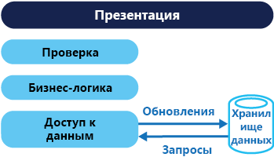
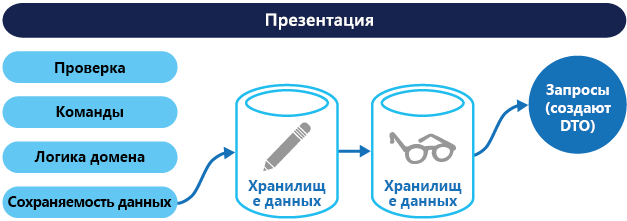

# <a name="command-and-query-responsibility-segregation-cqrs-pattern"></a>Шаблон CQRS

[!INCLUDE [header](../_includes/header.md)]

Вы можете разделить интерфейсы для операций считывания и записи данных. Так вы повысите производительность, масштабируемость и безопасность. Также это упростит процессы, связанные с развитием системы, благодаря дополнительной гибкости, и позволит избежать конфликтов слияния на уровне домена, вызываемых командами обновления.

## <a name="context-and-problem"></a>Контекст и проблема

В привычных системах управления данными обновление данных (команды) и получение данных (запросы) выполняются с одним набором сущностей в едином хранилище. Эти сущности могут быть представлены набором строк в одной или нескольких таблицах в реляционной базе данных, например SQL Server.

Обычно в таких системах все операции создания, чтения, обновления и удаления (CRUD) применяются к одному и тому же представлению этой сущности. Например, объект передачи данных (DTO), представляющий клиента, извлекается из хранилища данных на уровне доступа к данным (DAL) и отображается на экране. Пользователь обновляет несколько полей в DTO (возможно, с использованием привязки данных), и DAL помещает этот DTO обратно в хранилище данных. Один и тот же объект DTO используется для операций чтения и записи. На этой схеме представлена стандартная архитектура CRUD.



Традиционные схемы реализации CRUD хорошо работают, только когда к операциям с данными применяется ограниченная бизнес-логика. Механизмы шаблонов, реализованные в средствах разработки, позволяют быстро создать код для доступа к данным, дорабатывая его по мере необходимости.

Но такой подход имеет и некоторые недостатки.

- Часто он приводит к несоответствию между представлениями данных для чтения и записи. Например, в объектах могут существовать дополнительные столбцы или свойства, которые важно правильно обновлять, даже когда они не участвуют в операции.

- Так же он может привести к конфликту блокировки, если несколько субъектов одновременно работают с одним набором данных в хранилище для совместной работы. Кроме того, могут возникать конфликты обновления, если выполняются одновременные обновления с оптимистической блокировкой. Эти риски постоянно увеличиваются с ростом сложности системы и нагрузки на нее. Кроме того, традиционный подход может негативно влиять на производительность из-за высокой нагрузки на уровень доступа к данным в хранилище данных и высокой сложности запросов для получения данных.

- Управление безопасностью и разрешениями — сложные процедуры, так как каждая сущность может выполнять операции чтения и записи, а следовательно есть риск предоставить данные в неправильном контексте.

## <a name="solution"></a>Решение

Шаблон CQRS разделяет операции считывания данных (запросы) и операции обновления данных (команды), используя разные интерфейсы. Это означает, что для запросов и обновлений также используются разные модели данных. Так вы можете изолировать эти модели, как показано на следующей схеме, хотя это и не обязательно.


В отличие от единой модели в системах на базе CRUD, здесь применяются разные модели данных для запросов и обновлений, что упрощает проектирование и реализацию систем CQRS. Единственный недостаток этого подхода по сравнению с CRUD заключается в том, что для CQRS невозможно автоматически создать код с помощью встроенного механизма шаблонов.

Модель запросов для чтения данных и модель обновления для записи данных могут обращаться к одному физическому хранилищу, например используя представления SQL или оперативно создавая проекции. Но чаще эти данные разносятся в разные физические хранилища, как показано на следующем рисунке, что повышает производительность, масштабируемость и безопасность.



В качестве хранилища для чтения можно использовать реплику хранилища для записи с доступом на чтение. Более того, это могут быть хранилища с совершенно разными структурами данных. Создав несколько реплик хранилища для чтения, вы сможете значительно увеличить производительность обработки запросов и скорость отклика пользовательского интерфейса приложения. Это особенно удобно в распределенных сценариях, где реплики с доступом на чтение можно разместить рядом с экземплярами приложения. Некоторые системы баз данных (например, SQL Server) предоставляют дополнительные возможности для повышения доступности, например реплики для отработки отказа.

Разделение хранилищ для чтения и записи позволяет правильно масштабировать каждое из них в соответствии с нагрузкой. Традиционно нагрузка на хранилища для чтения намного выше, чем на хранилища для записи.

Если модель запросов или чтения содержит денормализованные данные (см. описание [шаблона материализованного представления](./materialized-view.md)), максимальной производительности чтения можно добиться при считывании в приложении данных для каждого представления или при запросе данных в системе.

## <a name="issues-and-considerations"></a>Проблемы и рекомендации

При принятии решения о реализации этого шаблона необходимо учитывать следующие моменты.

- Разнеся данные для чтения и записи в разные физические хранилища, вы сможете повысить производительность и безопасность системы, но усложните ее с точки зрения обеспечения устойчивости и итоговой согласованности. Хранилище для модели чтения необходимо обновлять с учетом изменений в хранилище для модели записи. Иногда сложно обнаружить, что запрос пользователя основан на устаревших данных, и в такой ситуации операцию выполнить невозможно.

    > Концепция итоговой согласованности описана в [руководстве по согласованности данных](https://msdn.microsoft.com/library/dn589800.aspx).

- Попробуйте применить подход CQRS в ограниченных разделах системы, где эффект от него будет заметным.

- Чтобы обеспечить итоговую согласованность, традиционно шаблон CQRS дополняется шаблоном источников событий. В такой архитектуре модель записи данных сохраняет поток событий, несущий информацию о каждой команде, в хранилище постоянного пополнения. Затем на основе этих событий обновляются материализованные представления в модели для чтения. Дополнительные сведения см. в разделе о [применении источников событий совместно с CQRS](/azure/architecture/patterns/cqrs#event-sourcing-and-cqrs).

## <a name="when-to-use-this-pattern"></a>Когда следует использовать этот шаблон

Используйте этот шаблон в следующих ситуациях:

- В предметных областях с режимом совместной работы, где с одними и теми же данными одновременно выполняется множество операций. CQRS позволяет определить команды с высокой степенью детализации, чтобы минимизировать риск конфликтов слияния на уровне предметной области (при этом команды должны устранять все возникающие конфликты) даже при обновлении данных одного типа.

- В пользовательских интерфейсах на основе задач, где пользователи выполняют сложный процесс в виде последовательности шагов или применяется сложная модель предметной области. Также он будет полезен для команд, которые уже знакомы с методами разработки на основе предметной области (DDD). Модель записи содержит полный стек обработки команд и реализует бизнес-логику, проверку входных данных и проверку бизнес-требований, чтобы гарантировать постоянную и полную согласованность модели записи по всем агрегатам (так называются кластеры связанных объектов, рассматриваемые как единый блок при изменении данных). Модель чтения не использует бизнес-логику или проверку данных, а просто возвращает DTO для модели представления. Для моделей чтения и записи реализована итоговая согласованность.

- В сценариях, где производительность чтения и записи данных нужно настраивать отдельно, особенно при очень высоком соотношении операций чтения и записи и необходимости горизонтального масштабирования. Например, во многих системах число операций чтения во много раз превышает число операций записи. Чтобы учесть такую разницу, вы можете масштабировать модель чтения, сохраняя небольшое число экземпляров для модели записи. Ограничение числа экземпляров модели записи помогает снизить риск конфликтов слияния.

- В сценариях, где отдельная команда разработчиков работает над сложной моделью предметной области в рамках модели записи, позволяя другой команде направить усилия на модель чтения и пользовательские интерфейсы.

- Если ожидается, что система будет со временем развиваться с разделением моделей, или в ней будут часто меняться бизнес-правила.

- При интеграции с другими системами, особенно с применением модели источников событий, что позволит при временном сбое одной из подсистем сохранить доступность остальных.

Этот шаблон не следует использовать в следующих сценариях:

- Если предметная область или бизнес-правила достаточно просты.

- Если подход CRUD удовлетворяет всем требованиям к пользовательскому интерфейсу и операциям доступа к данным.

- Для всех операций в пределах системы. В некоторых компонентах сценария управления данными подход CQRS может быть полезным, но существенно усложнит систему без достаточных для того оснований.

## <a name="event-sourcing-and-cqrs"></a>Использование источников событий совместно с CQRS

Шаблон CQRS часто используется в сочетании с шаблоном источников событий. Системы на основе CQRS используют разные модели данных для чтения и записи, каждая из которых оптимизируется для выполнения соответствующих задач, а данные могут размещаться в разных физических хранилищах. Используемая вместе с [шаблоном источников событий](./event-sourcing.md), модель записи сохраняет данные о событиях и является официальным источником данных. Модель чтения в системах на базе CQRS обычно предоставляет материализованные представления данных, часто с высоким уровнем денормализации. Эти представления создаются с учетом конкретных интерфейсов приложения и требований к отображению, что позволяет максимизировать производительность интерфейсов и запросов.

Если в качестве хранилища для записи используется поток событий, а не данные на определенный момент времени, можно избежать конфликтов при обновлении агрегатов, максимально повысить производительность и масштабируемость. Также эти события позволят в асинхронном режиме создавать материализованные представления данных для заполнения хранилища для чтения.

Так как официальным источником информации являются хранилища событий, в случае изменения системы или модели чтения можно просто удалить все материализованные представления и заново воспроизвести предыдущие события, чтобы создать новое представление текущего состояния. Материализованные представления по сути выполняют роль устойчивого кэша данных с доступом только на чтение.

Если вы используете шаблоны CQRS и источников событий, учитывайте следующее:

- Как в любой системе с разделением хранилищ для записи и чтения, здесь возможна только итоговая согласованность. Между созданием события и обновлением данных в хранилище всегда будет некоторая задержка.

- Этот шаблон повышает сложность системы, так как в нем нужно создать код для запуска и обработки событий, а также постоянно собирать или обновлять все представления и объекты, необходимые для обработки запросов в модели чтения. Сложность совместного применения шаблонов источников событий и CQRS затруднит реализацию системы и потребует нового подхода к разработке системы. Но зато источники событий упрощают моделирование предметной области, а также позволяют легко изменять представления и создавать новые, сохраняя все изменения в данных.

- Может потребоваться значительное время и большой объем ресурсов для создания материализованных представлений, которые используются в модели чтения или в проекциях, так как этот процесс включает воспроизведение и обработку всех событий для конкретных сущностей или коллекций сущностей. Это особенно важно при обработке данных за длительные периоды времени, ведь нужно полностью проверить все связанные события. Чтобы решить эту проблему, можно создавать моментальные снимки данных через определенные промежутки времени, например сохранять общее число определенных действий за определенный период или текущие состояния сущностей.

## <a name="example"></a>Пример

Следующий фрагмент кода взят из реализации подхода CQRS, в рамках которой применены разные определения для моделей чтения и записи. Интерфейсы модели не налагают ограничения на функции хранилищ данных, и их можно изменять или конфигурировать независимо друг от друга, так как эти интерфейсы разделены.

В следующем коде представлено определение модели чтения.

```csharp
// Query interface
namespace ReadModel
{
  public interface ProductsDao
  {
    ProductDisplay FindById(int productId);
    ICollection<ProductDisplay> FindByName(string name);
    ICollection<ProductInventory> FindOutOfStockProducts();
    ICollection<ProductDisplay> FindRelatedProducts(int productId);
  }

  public class ProductDisplay
  {
    public int Id { get; set; }
    public string Name { get; set; }
    public string Description { get; set; }
    public decimal UnitPrice { get; set; }
    public bool IsOutOfStock { get; set; }
    public double UserRating { get; set; }
  }

  public class ProductInventory
  {
    public int Id { get; set; }
    public string Name { get; set; }
    public int CurrentStock { get; set; }
  }
}
```

Эта система позволяет пользователям оценивать товары. Для этого в коде приложения реализована команда `RateProduct`, как показано ниже.

```csharp
public interface ICommand
{
  Guid Id { get; }
}

public class RateProduct : ICommand
{
  public RateProduct()
  {
    this.Id = Guid.NewGuid();
  }
  public Guid Id { get; set; }
  public int ProductId { get; set; }
  public int Rating { get; set; }
  public int UserId {get; set; }
}
```

Система использует класс `ProductsCommandHandler` для обработки команд, отправляемых приложением. Обычно клиенты отправляют команды в предметную область через систему обмена сообщениями, например очередь. Обработчик команд принимает эти команды и вызывает методы интерфейса предметной области. Для каждой команды выбирается такая степень детализации, которая позволяет снизить риск конфликта запросов. В следующем коде представлена упрощенная реализация класса `ProductsCommandHandler`.

```csharp
public class ProductsCommandHandler :
    ICommandHandler<AddNewProduct>,
    ICommandHandler<RateProduct>,
    ICommandHandler<AddToInventory>,
    ICommandHandler<ConfirmItemShipped>,
    ICommandHandler<UpdateStockFromInventoryRecount>
{
  private readonly IRepository<Product> repository;

  public ProductsCommandHandler (IRepository<Product> repository)
  {
    this.repository = repository;
  }

  void Handle (AddNewProduct command)
  {
    ...
  }

  void Handle (RateProduct command)
  {
    var product = repository.Find(command.ProductId);
    if (product != null)
    {
      product.RateProduct(command.UserId, command.Rating);
      repository.Save(product);
    }
  }

  void Handle (AddToInventory command)
  {
    ...
  }

  void Handle (ConfirmItemsShipped command)
  {
    ...
  }

  void Handle (UpdateStockFromInventoryRecount command)
  {
    ...
  }
}
```

В следующем коде реализован интерфейс `IProductsDomain` для модели записи.

```csharp
public interface IProductsDomain
{
  void AddNewProduct(int id, string name, string description, decimal price);
  void RateProduct(int userId, int rating);
  void AddToInventory(int productId, int quantity);
  void ConfirmItemsShipped(int productId, int quantity);
  void UpdateStockFromInventoryRecount(int productId, int updatedQuantity);
}
```

Обратите внимание, что в интерфейс `IProductsDomain` включены методы, имеющие значение в конкретной предметной области. В среде CRUD такие методы обычно имеют универсальные имена, например `Save` или `Update`, и принимают DTO в качестве единственного аргумента. Подход CQRS можно адаптировать под потребности конкретных бизнес-процессов и систем управления запасами, которые используются в организации.

## <a name="related-patterns-and-guidance"></a>Связанные шаблоны и рекомендации

При реализации этого шаблона будут полезны следующие шаблоны и рекомендации:

- Сравнение CQRS с другими стилями архитектуры см. в статьях [Стили архитектуры](/azure/architecture/guide/architecture-styles/) и [Стиль архитектуры CQRS](/azure/architecture/guide/architecture-styles/cqrs).

- [Data Consistency Primer](https://msdn.microsoft.com/library/dn589800.aspx) (Руководство по обеспечению согласованности данных). Описание проблем, часто возникающих из-за режима итоговой согласованности, который поддерживается в шаблоне между хранилищами для чтения и записи, и способов решения этих проблем.

- [Data Partitioning Guidance](https://msdn.microsoft.com/library/dn589795.aspx) (Руководство по секционированию данных). Описание процедуры разделения используемых в шаблоне CQRS хранилищ данных для чтения и записи на секции, управление которыми и доступ к которым выполняются раздельно. Это позволяет улучшить масштабируемость, уменьшить число конфликтов и оптимизировать производительность.

- [Шаблон источников событий](./event-sourcing.md). Описание применения источников событий совместно с шаблоном CQRS для упрощения задач в сложных предметных областях при одновременном повышении производительности, масштабируемости и скорости реагирования. Кроме того, рассмотрено предоставление поддержки согласованности для транзакционных данных с сохранением полного аудиторского следа и истории, которые позволяют выполнять компенсацию действий.

- [Materialized View Pattern](./materialized-view.md) (Шаблон материализованного представления). Модель чтения в реализации CQRS может содержать или самостоятельно создавать материализованные представления данных из модели записи.

- Руководство по шаблонам и методикам для модели CQRS представлено [здесь](https://aka.ms/cqrs). В частности, в руководстве по [шаблону разделения ответственности команды и запроса](https://msdn.microsoft.com/library/jj591573.aspx) описан этот шаблон и сценарии его применения, а в [ Lessons Learned](https://msdn.microsoft.com/library/jj591568.aspx) (Эпилог и обсуждение полученного опыта) поможет вам понять некоторые проблемы, возникающие при использовании этого шаблона.

- В записи в блоге Мартина Фоулера (Martin Fowler) о [CQRS](https://martinfowler.com/bliki/CQRS.html) представлен обзор этого шаблона, а также ссылки на полезные ресурсы.
