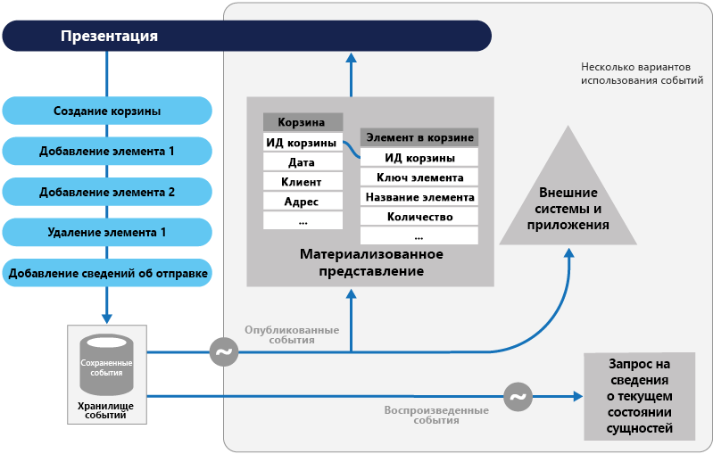
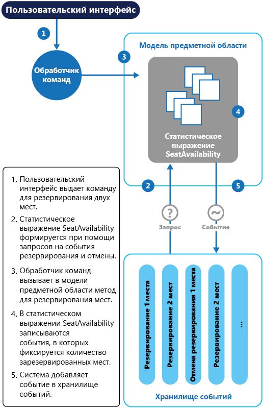

# Шаблон источников событийEvent Sourcing pattern

[!INCLUDE [header](../_includes/header.md)]

Вместо сохранения текущего состояния данных в домене используйте инкрементируемое хранилище для записи полных серий действий с этими данными.Instead of storing just the current state of the data in a domain, use an append-only store to record the full series of actions taken on that data.
Хранилище действует как система записи, и его можно использовать для материализации объектов домена.The store acts as the system of record and can be used to materialize the domain objects. Это позволяет упростить задачи в сложных доменах, устраняя необходимость синхронизации модели данных и домена для бизнеса при одновременном повышении производительности, масштабируемости и скорости реагирования.This can simplify tasks in complex domains, by avoiding the need to synchronize the data model and the business domain, while improving performance, scalability, and responsiveness. Кроме того, обеспечивается совместимость транзакционных данных и сохранение всех журналов аудита и истории, с помощью которых можно использовать компенсирующие действия.It can also provide consistency for transactional data, and maintain full audit trails and history that can enable compensating actions.

## Контекст и проблемаContext and problem

Большинство приложений работают с данными, и типичный подход, используемый в приложении, — поддержка текущего состояния данных за счет обновления по мере работы с ними.Most applications work with data, and the typical approach is for the application to maintain the current state of the data by updating it as users work with it. Например, в традиционной модели создания, чтения, обновления и удаления (CRUD) типичная обработка данных представляет собой считывание данных из хранилища, внесение в них определенных изменений и обновление их текущего состояния с помощью новых значений (часто с помощью транзакций блокирования данных).For example, in the traditional create, read, update, and delete (CRUD) model a typical data process is to read data from the store, make some modifications to it, and update the current state of the data with the new values&mdash;often by using transactions that lock the data.

Для такого подхода CRUD предусмотрены некоторые ограничения:The CRUD approach has some limitations:

- Системы CRUD выполняют операции обновления непосредственно в хранилище данных, которые могут замедлять производительность и скорость реагирования и ограничивать масштабируемость — все это из-за требуемой дополнительной нагрузки.CRUD systems perform update operations directly against a data store, which can slow down performance and responsiveness, and limit scalability, due to the processing overhead it requires.

- В домене для совместной работы с большим количеством параллельных подключений пользователей более вероятны возникновения конфликтов обновления данных, так как операции обновления выполняются для отдельного элемента данных.In a collaborative domain with many concurrent users, data update conflicts are more likely because the update operations take place on a single item of data.

- Если отсутствует дополнительный механизм аудита, записывающий подробности каждой операции в отдельный журнал, история не сохраняется.Unless there's an additional auditing mechanism that records the details of each operation in a separate log, history is lost.

> Чтобы лучше понять ограничения, связанные с архитектурой CRUD, ознакомьтесь с [этой](https://blogs.msdn.microsoft.com/maarten_mullender/2004/07/23/crud-only-when-you-can-afford-it-revisited/) записью блога.For a deeper understanding of the limits of the CRUD approach see [CRUD, Only When You Can Afford It](https://blogs.msdn.microsoft.com/maarten_mullender/2004/07/23/crud-only-when-you-can-afford-it-revisited/).

## РешениеSolution

Шаблон источника событий определяет подход к обработке операций с данными на основе последовательности событий, каждое из которых записывается в инкрементируемое хранилище.The Event Sourcing pattern defines an approach to handling operations on data that's driven by a sequence of events, each of which is recorded in an append-only store. Код приложения отправляет ряд событий, которые принудительно описывают каждое действие с данными в хранилище событий, где они сохраняются.Application code sends a series of events that imperatively describe each action that has occurred on the data to the event store, where they're persisted. Каждое событие обозначает некоторый набор изменений в данных (например, `AddedItemToOrder`).Each event represents a set of changes to the data (such as `AddedItemToOrder`).

События сохраняются в хранилище событий, которое выступает в качестве системы записи (заслуживающий доверие источник данных) текущего состояния данных.The events are persisted in an event store that acts as the system of record (the authoritative data source) about the current state of the data. Хранилище событий обычно публикует эти события для оповещения потребителей и при необходимости предоставления им возможности обрабатывать эти события.The event store typically publishes these events so that consumers can be notified and can handle them if needed. Потребители могут, например, запустить задачи, применяющие операции в событиях к другим системам, или выполнить любое другое связанное действие, необходимое для завершения операции.Consumers could, for example, initiate tasks that apply the operations in the events to other systems, or perform any other associated action that's required to complete the operation. Обратите внимание, что код приложения, создающий события, никак не связан с системами, подписанными на эти события.Notice that the application code that generates the events is decoupled from the systems that subscribe to the events.

Стандартное использование событий, опубликованных хранилищем событий, включает поддержку материализованных представлений сущностей по мере их изменения в приложении с помощью действий, а также интеграцию с внешними системами.Typical uses of the events published by the event store are to maintain materialized views of entities as actions in the application change them, and for integration with external systems. Например, система может поддерживать материализованное представление всех заказов клиента, используемых для заполнения частей пользовательского интерфейса.For example, a system can maintain a materialized view of all customer orders that's used to populate parts of the UI. По мере добавления новых заказов, добавления или удаления позиций в заказе или добавления сведений о доставке в приложении события, описывающие эти изменения, можно обрабатывать, а также использовать для обновления [материализованного представления](./materialized-view.md).As the application adds new orders, adds or removes items on the order, and adds shipping information, the events that describe these changes can be handled and used to update the [materialized view](./materialized-view.md).

Кроме того, приложения могут в любой момент считать историю событий и использовать ее для материализации текущего состояния сущности за счет воспроизведения и использования всех событий, которые относятся к этой сущности.In addition, at any point it's possible for applications to read the history of events, and use it to materialize the current state of an entity by playing back and consuming all the events related to that entity. Это можно сделать по запросу для материализации объекта домена при обработке запроса или в запланированной задаче для сохранения состояния сущности в виде материализованного представления для поддержки уровня представления.This can occur on demand to materialize a domain object when handling a request, or through a scheduled task so that the state of the entity can be stored as a materialized view to support the presentation layer.

На схеме ниже представлен обзор шаблона, включая некоторые варианты использования потока событий, например создание материализованного представления, интеграцию событий с внешними приложениями и системами, а также воспроизведение событий для создания проекций текущего состояния определенных сущностей.The figure shows an overview of the pattern, including some of the options for using the event stream such as creating a materialized view, integrating events with external applications and systems, and replaying events to create projections of the current state of specific entities.

Шаблон источника событий предоставляет следующие преимущества.The Event Sourcing pattern provides the following advantages:

- События являются неизменяемыми, и их можно сохранить с помощью инкрементируемой операции.Events are immutable and can be stored using an append-only operation. Вы можете не завершать работу источника, с помощью которого было активировано событие (пользовательский интерфейс, рабочий процесс или любой другой процесс), а задачи, обрабатывающие события, могут выполняться в фоновом режиме.The user interface, workflow, or process that initiated an event can continue, and tasks that handle the events can run in the background. Таким образом, с учетом отсутствия конкурирующих процессов во время обработки транзакций может значительно улучшиться производительность и масштабируемость приложений, особенно для уровня презентации или интерфейса пользователя.This, combined with the fact that there's no contention during the processing of transactions, can vastly improve performance and scalability for applications, especially for the presentation level or user interface.

- События представляют собой простые объекты, которые описывают некоторые выполненные действия, а также связанные данные, необходимые для описания действия, представленного событием.Events are simple objects that describe some action that occurred, together with any associated data required to describe the action represented by the event. События не имеют прямого отношения к обновлению хранилища данных.Events don't directly update a data store. Они просто записываются для обработки в соответствующее время.They're simply recorded for handling at the appropriate time. Это позволяет упростить управление и реализацию.This can simplify implementation and management.

- События представляют определенную ценность для специалиста по работе с доменами, а [объектно-реляционная несогласованность](https://en.wikipedia.org/wiki/Object-relational_impedance_mismatch) может усложнить понимание сложных таблиц базы данных.Events typically have meaning for a domain expert, whereas [object-relational impedance mismatch](https://en.wikipedia.org/wiki/Object-relational_impedance_mismatch) can make complex database tables hard to understand. Таблицы представляют собой искусственные конструкции, отображающие текущее состояние системы, а не произошедшие события.Tables are artificial constructs that represent the current state of the system, not the events that occurred.

- Источник событий может помочь предотвратить возникновение конфликтов, вызванных параллельными обновлениями, так как исключает необходимость непосредственного обновления объектов в хранилище данных.Event sourcing can help prevent concurrent updates from causing conflicts because it avoids the requirement to directly update objects in the data store. Однако модель домена по-прежнему должна быть разработана для собственной защиты от запросов, которые могут вызвать несогласованное состояние.However, the domain model must still be designed to protect itself from requests that might result in an inconsistent state.

- Инкрементируемое хранилище событий предоставляет журнал аудита, который можно использовать для мониторинга событий, произошедших в хранилище данных, повторного создания текущего состояния в виде материализованного представления или проекций путем воспроизведения событий в любое время, а также упрощения тестирования и отладки системы.The append-only storage of events provides an audit trail that can be used to monitor actions taken against a data store, regenerate the current state as materialized views or projections by replaying the events at any time, and assist in testing and debugging the system. Кроме того, необходимость использовать компенсирующие события для отмены изменений предоставляет журнал изменений, которые были отменены, чего можно было бы избежать, если бы модель просто сохранила текущее состояние.In addition, the requirement to use compensating events to cancel changes provides a history of changes that were reversed, which wouldn't be the case if the model simply stored the current state. Список событий можно также использовать для анализа производительности приложения и выявления тенденций поведения пользователя или получения других полезных бизнес-сведений.The list of events can also be used to analyze application performance and detect user behavior trends, or to obtain other useful business information.

- Хранилище событий вызывает события, а задачи выполняют операции в ответ на эти события.The event store raises events, and tasks perform operations in response to those events. Это разделение задач и событий обеспечивает гибкость и расширяемость.This decoupling of the tasks from the events provides flexibility and extensibility. Задачи "знают" о типе и данных события, но не об операции, вызвавшей это событие.Tasks know about the type of event and the event data, but not about the operation that triggered the event. Кроме того, каждое событие могут обрабатывать несколько задач.In addition, multiple tasks can handle each event. Это обеспечивает простую интеграцию с другими службами и системами, которые только прослушивают новые события, вызванные хранилищем событий.This enables easy integration with other services and systems that only listen for new events raised by the event store. Однако события источника событий зачастую являются низкоуровневыми, из-за чего может потребоваться создание определенных событий интеграции.However, the event sourcing events tend to be very low level, and it might be necessary to generate specific integration events instead.

> Источник событий часто сочетается с шаблоном CQRS за счет выполнения задач управления данными в ответ на события, а также материализации представления из хранимых событий.Event sourcing is commonly combined with the CQRS pattern by performing the data management tasks in response to the events, and by materializing views from the stored events.

## Проблемы и рекомендацииIssues and considerations

При принятии решения о реализации этого шаблона необходимо учитывать следующие моменты.Consider the following points when deciding how to implement this pattern:

Система будет согласованной в конечном счете только при создании материализованных представлений или проекций данных путем воспроизведения событий.The system will only be eventually consistent when creating materialized views or generating projections of data by replaying events. Между добавлением событий приложения в хранилище событий (в результате обработки запроса), публикацией событий и обработкой событий потребителями есть некоторая задержка.There's some delay between an application adding events to the event store as the result of handling a request, the events being published, and consumers of the events handling them. В течение этого периода в хранилище событий могли попасть новые события, описывающие дальнейшие изменения сущностей.During this period, new events that describe further changes to entities might have arrived at the event store.

> [!NOTE]
> Дополнительные сведения о реализации итоговой согласованности см. в [руководстве по согласованности данных](https://msdn.microsoft.com/library/dn589800.aspx).See the [Data Consistency Primer](https://msdn.microsoft.com/library/dn589800.aspx) for information about eventual consistency.

Хранилище событий представляет собой постоянный источник данных и таким образом исключает необходимость обновления данных событий.The event store is the permanent source of information, and so the event data should never be updated. Единственный способ обновить сущность для отмены изменения — добавить компенсирующее событие в хранилище событий.The only way to update an entity to undo a change is to add a compensating event to the event store. Если необходимо изменить формат (а не данные) сохраненных событий (возможно, во время миграции), может возникнуть сложность при объединении имеющихся событий в хранилище с новой версией.If the format (rather than the data) of the persisted events needs to change, perhaps during a migration, it can be difficult to combine existing events in the store with the new version. Может потребоваться выполнить итерацию всех событий, внеся изменения для соответствия событий новому формату, или добавить новые события, использующие новый формат.It might be necessary to iterate through all the events making changes so they're compliant with the new format, or add new events that use the new format. Рассмотрите возможность использования штампа версии в каждой версии схемы события для поддержки прежнего и нового форматов событий.Consider using a version stamp on each version of the event schema to maintain both the old and the new event formats.

Многопоточные приложения и несколько экземпляров приложений могут сохранять события в хранилище событий.Multi-threaded applications and multiple instances of applications might be storing events in the event store. Согласованность событий в хранилище событий крайне важна, так как представляет собой порядок событий, влияющих на определенную сущность (порядок событий, который вызывает изменения в отношении сущности, влияет на ее текущее состояние).The consistency of events in the event store is vital, as is the order of events that affect a specific entity (the order that changes occur to an entity affects its current state). Добавление метки времени для каждого события может помочь избежать проблем.Adding a timestamp to every event can help to avoid issues. Другой распространенной практикой является добавление заметок для каждого события, вызванного запросом с добавочным идентификатором.Another common practice is to annotate each event resulting from a request with an incremental identifier. Если два действия пытаются добавить события для одной сущности одновременно, хранилище событий может отклонить событие, которое соответствует идентификатору имеющейся сущности и идентификатору события.If two actions attempt to add events for the same entity at the same time, the event store can reject an event that matches an existing entity identifier and event identifier.

Для считывания событий с целью получения сведений отсутствует стандартный подход или имеющиеся механизмы, например SQL-запросы.There's no standard approach, or existing mechanisms such as SQL queries, for reading the events to obtain information. Единственные данные, которые можно извлечь, — это поток событий, использующий идентификатор события в качестве условия.The only data that can be extracted is a stream of events using an event identifier as the criteria. Идентификатор события обычно сопоставляется с отдельными сущностями.The event ID typically maps to individual entities. Текущее состояние сущности можно определить только путем воспроизведения всех событий, связанных с ней в отношении исходного состояния этой сущности.The current state of an entity can be determined only by replaying all of the events that relate to it against the original state of that entity.

Продолжительность каждого потока события влияет на управление системой и ее обновление.The length of each event stream affects managing and updating the system. Если потоки объемные, можно создать моментальные снимки через определенные интервалы, например указанное количество событий.If the streams are large, consider creating snapshots at specific intervals such as a specified number of events. Текущее состояние сущности можно получить из моментального снимка и за счет воспроизведения любого события, произошедшего после этой точки во времени.The current state of the entity can be obtained from the snapshot and by replaying any events that occurred after that point in time. Дополнительные сведения о создании моментальных снимков данных см. на страницах, посвященных [моментальному снимку](https://martinfowler.com/eaaDev/Snapshot.html) и [репликации моментального снимка](https://msdn.microsoft.com/library/ff650012.aspx).For more information about creating snapshots of data, see [Snapshot on Martin Fowler’s Enterprise Application Architecture website](https://martinfowler.com/eaaDev/Snapshot.html) and [Master-Subordinate Snapshot Replication](https://msdn.microsoft.com/library/ff650012.aspx).

Несмотря на то что источник событий снижает вероятность конфликта из-за обновления данных, приложение все равно должно устранить несоответствия, возникшие в результате итоговой согласованности и недостатка транзакций.Even though event sourcing minimizes the chance of conflicting updates to the data, the application must still be able to deal with inconsistencies that result from eventual consistency and the lack of transactions. Например, событие, указывающее на сокращение складских запасов, может поступить в хранилище данных во время размещения заказа для этой позиции, вызывая необходимость согласования двух операций: с помощью уведомления клиента или создания обратного заказа.For example, an event that indicates a reduction in stock inventory might arrive in the data store while an order for that item is being placed, resulting in a requirement to reconcile the two operations either by advising the customer or creating a back order.

Возможна как минимум одна публикация события, поэтому потребители событий должны быть идемпотентными.Event publication might be “at least once,” and so consumers of the events must be idempotent. Они не должны повторно применять обновление, описанное в событии, если событие обрабатывается несколько раз.They must not reapply the update described in an event if the event is handled more than once. Например, если несколько экземпляров потребителя поддерживают статистическую обработку свойства сущности, например общее количество размещенных заказов, только для одного экземпляра успешно завершится добавление статистического выражения при возникновении события размещения заказа.For example, if multiple instances of a consumer maintain an aggregate an entity's property, such as the total number of orders placed, only one must succeed in incrementing the aggregate when an order placed event occurs. Это не основная характеристика источника событий, а обычное решение реализации.While this isn't a key characteristic of event sourcing, it's the usual implementation decision.

## Когда следует использовать этот шаблонWhen to use this pattern

Используйте этот шаблон в следующих сценариях:Use this pattern in the following scenarios:

- Когда в данные необходимо записать намерение, цель или причину.When you want to capture intent, purpose, or reason in the data. Например, изменения в сущности клиента можно записать как ряд определенных типов событий, таких как _Возвращение к исходному_, _Закрытая учетная запись_ или _Недействительные_.For example, changes to a customer entity can be captured as a series of specific event types such as _Moved home_, _Closed account_, or _Deceased_.

- Когда крайне важно свести к минимуму или полностью избежать конфликта операций обновления данных.When it's vital to minimize or completely avoid the occurrence of conflicting updates to data.

- Если требуется записать происходящие события и иметь возможность воспроизвести их для восстановления состояния системы, отката изменений или сохранения истории и журнала аудита.When you want to record events that occur, and be able to replay them to restore the state of a system, roll back changes, or keep a history and audit log. Например, если задача включает несколько шагов, необходимых для восстановления обновлений и последующего воспроизведения некоторых действий для восстановления согласованного состояния данных.For example, when a task involves multiple steps you might need to execute actions to revert updates and then replay some steps to bring the data back into a consistent state.

- Когда использование событий представляет собой стандартную возможность операции приложения и требует некоторой дополнительной разработки или усилий в отношении реализации.When using events is a natural feature of the operation of the application, and requires little additional development or implementation effort.

- Если нужно разбить процесс ввода или обновления данных из задач, необходимых для применения этих действий.When you need to decouple the process of inputting or updating data from the tasks required to apply these actions. Это может быть в целях улучшения производительности пользовательского интерфейса или распределения событий в другие прослушиватели, выполняющие определенные действия при возникновении событий.This might be to improve UI performance, or to distribute events to other listeners that take action when the events occur. Например, интеграция платежной системы с веб-сайтом о расходах требуется для того, чтобы события, вызванные с помощью хранилища событий в ответ на обновления данных, реализованные для веб-сайта, использовались как веб-сайтом, так и платежной системой.For example, integrating a payroll system with an expense submission website so that events raised by the event store in response to data updates made in the website are consumed by both the website and the payroll system.

- Если необходима гибкость для изменения формата материализованных моделей и данных сущности при изменении требований или &mdash;использовании в сочетании с CQRS&mdash;, необходимо адаптировать модель чтения или представления с данными.When you want flexibility to be able to change the format of materialized models and entity data if requirements change, or&mdash;when used in conjunction with CQRS&mdash;you need to adapt a read model or the views that expose the data.

- Если используется в сочетании с CQRS, итоговая согласованность допустима при обновлении модели чтения или допустимо влияние на производительность при восстановленных сущностях и данных из потока события.When used in conjunction with CQRS, and eventual consistency is acceptable while a read model is updated, or the performance impact of rehydrating entities and data from an event stream is acceptable.

Этот шаблон неприменим в следующих случаях:This pattern might not be useful in the following situations:

- Для небольших или простых доменов, систем, которым не достает бизнес-логики или она и вовсе отсутствует, систем, не имеющих отношения к домену, которые обычно хорошо взаимодействуют со стандартными механизмами управления данных CRUD.Small or simple domains, systems that have little or no business logic, or nondomain systems that naturally work well with traditional CRUD data management mechanisms.

- Систем, где для представления данных требуются согласованность и обновления в режиме реального времени.Systems where consistency and real-time updates to the views of the data are required.

- Систем, где для действий отката и воспроизведения не требуются определенные функции, история и журналы аудита.Systems where audit trails, history, and capabilities to roll back and replay actions are not required.

- Систем, где имеется незначительный конфликт обновлений в базовых данных.Systems where there's only a very low occurrence of conflicting updates to the underlying data. Например, это системы, которые преимущественно добавляют данные, а не обновляют их.For example, systems that predominantly add data rather than updating it.

## ПримерExample

Система управления конференцией должна отслеживать количество завершенных резервирований для конференц-связи, чтобы проверить наличие доступных мест при попытке потенциального участника зарезервировать место.A conference management system needs to track the number of completed bookings for a conference so that it can check whether there are seats still available when a potential attendee tries to make a booking. Имеется по крайней мере два способа хранения общего числа заявок на бронирование для конференции в системе:The system could store the total number of bookings for a conference in at least two ways:

- Она может хранить сведения об общем количестве зарезервированных мест в качестве отдельной сущности в базе данных, содержащей данные о резервировании.The system could store the information about the total number of bookings as a separate entity in a database that holds booking information. После резервирования мест или отмены резервирования система может соответствующим образом регулировать это количество.As bookings are made or canceled, the system could increment or decrement this number as appropriate. Этот подход прост в теории, но может привести к проблемам с масштабируемостью, если большое количество участников попытается зарезервировать места за короткий период времени.This approach is simple in theory, but can cause scalability issues if a large number of attendees are attempting to book seats during a short period of time. Например, в последний день или перед непосредственным завершением периода резервирования.For example, in the last day or so prior to the booking period closing.

- Система может хранить сведения о резервировании и отменах по мере выполнения событий в хранилище событий.The system could store information about bookings and cancellations as events held in an event store. Затем путем воспроизведения этих событий она может рассчитать количество доступных мест.It could then calculate the number of seats available by replaying these events. Из-за неизменяемости событий этот подход может оказаться более масштабируемым.This approach can be more scalable due to the immutability of events. Системе необходимо только считывать данные из хранилища событий или добавлять их в это хранилище.The system only needs to be able to read data from the event store, or append data to the event store. Сведения события о резервировании и отменах никогда не изменяются.Event information about bookings and cancellations is never modified.

На схеме ниже показано, как с помощью источника событий можно реализовать подсистему резервирования мест системы управления конференцией.The following diagram illustrates how the seat reservation subsystem of the conference management system might be implemented using event sourcing.

Последовательность действий для резервирования двух мест выглядит следующим образом:The sequence of actions for reserving two seats is as follows:

1. Пользовательский интерфейс выдает команду для резервирования мест для двух участников.The user interface issues a command to reserve seats for two attendees. Команда обрабатывается отдельным обработчиком команд.The command is handled by a separate command handler. Часть логики, отделенная от пользовательского интерфейса и отвечающая за обработку запросов, записывается в виде команд.A piece of logic that is decoupled from the user interface and is responsible for handling requests posted as commands.

2. Статистическое выражение, содержащее сведения о всех местах резервирования для конференции, создается с помощью запроса событий, описывающих операции резервирования и отмены.An aggregate containing information about all reservations for the conference is constructed by querying the events that describe bookings and cancellations. Это статистическое выражение называется `SeatAvailability` и содержится в модели домена, предоставляющей методы для запроса и изменения данных в статистической обработке.This aggregate is called `SeatAvailability`, and is contained within a domain model that exposes methods for querying and modifying the data in the aggregate.

    > Некоторые способы оптимизации, которые можно рассмотреть, включают использование моментальных снимков (таким образом, вам не нужно выполнять запрос и воспроизводить полный список событий для получения текущего состояния статистической обработки), а также сохранение кэшированной копии статистической обработки в памяти.Some optimizations to consider are using snapshots (so that you don’t need to query and replay the full list of events to obtain the current state of the aggregate), and maintaining a cached copy of the aggregate in memory.

3. Для выполнения резервирования обработчик команд вызывает метод, предоставляемый моделью домена.The command handler invokes a method exposed by the domain model to make the reservations.

4. Статистическая функция `SeatAvailability` записывает событие, содержащее количество зарезервированных мест.The `SeatAvailability` aggregate records an event containing the number of seats that were reserved. При очередном применении событий статистической функцией все зарезервированные места будут использоваться для вычисления оставшихся мест.The next time the aggregate applies events, all the reservations will be used to compute how many seats remain.

5. Система добавляет новое событие в список событий в хранилище событий.The system appends the new event to the list of events in the event store.

Если пользователь отменяет резервирование, в системе выполняется аналогичный процесс, за исключением того, что обработчик команд выдает команду, которая создает событие отмены места и добавляет это событие в хранилище событий.If a user cancels a seat, the system follows a similar process except the command handler issues a command that generates a seat cancellation event and appends it to the event store.

Кроме предоставления дополнительных областей масштабируемости с помощью хранилища событий вы также получаете полный журнал или журнал аудита резервирования и отмены для конференции.As well as providing more scope for scalability, using an event store also provides a complete history, or audit trail, of the bookings and cancellations for a conference. События в хранилище событий представляют собой точные записи.The events in the event store are the accurate record. Сохранять статистические функции любым другим способом не нужно, так как система способна легко воспроизводить события и восстанавливать состояние до любой точки во времени.There is no need to persist aggregates in any other way because the system can easily replay the events and restore the state to any point in time.

> Дополнительные сведения об этом примере можно найти в руководстве, посвященном [обзору источника событий](https://msdn.microsoft.com/library/jj591559.aspx).You can find more information about this example in [Introducing Event Sourcing](https://msdn.microsoft.com/library/jj591559.aspx).

## Связанные шаблоны и рекомендацииRelated patterns and guidance

При реализации этого шаблона следует принять во внимание следующие шаблоны и рекомендации.The following patterns and guidance might also be relevant when implementing this pattern:

- [Шаблон выделения ответственности команды и запроса (CQRS)](./cqrs.md).[Command and Query Responsibility Segregation (CQRS) pattern](./cqrs.md). В хранилище записи, предоставляющее постоянный источник информации для реализации CQRS, часто используется реализация шаблона источника событий.The write store that provides the permanent source of information for a CQRS implementation is often based on an implementation of the Event Sourcing pattern. В этом шаблоне описывается, как отделить операции, считывающие данные в приложении, от операций обновления данных с помощью отдельных интерфейсов.Describes how to segregate the operations that read data in an application from the operations that update data by using separate interfaces.

- [Materialized View Pattern](./materialized-view.md) (Шаблон материализованного представления).[Materialized View pattern](./materialized-view.md). Хранилище данных, используемое в системе на основе источника событий, для создания запросов обычно не подходит.The data store used in a system based on event sourcing is typically not well suited to efficient querying. Вместо этого наиболее распространенным подходом является создание предварительно заполненных представлений данных через регулярные интервалы или при изменении данных.Instead, a common approach is to generate prepopulated views of the data at regular intervals, or when the data changes. Здесь можно рассмотреть реализацию.Shows how this can be done.

- [Шаблон компенсирующих транзакций](./compensating-transaction.md).[Compensating Transaction pattern](./compensating-transaction.md). Имеющиеся данные в хранилище источника событий не обновляются, вместо этого добавляются новые записи, которые преобразуют состояние сущностей в новые значения.The existing data in an event sourcing store is not updated, instead new entries are added that transition the state of entities to the new values. Чтобы отменить изменение, используются компенсирующие записи, так как невозможно просто отменить предыдущее изменение.To reverse a change, compensating entries are used because it isn't possible to simply reverse the previous change. Этот шаблон описывает, как отменить задачи, выполненные с помощью предыдущей операции.Describes how to undo the work that was performed by a previous operation.

- [Data Consistency Primer](https://msdn.microsoft.com/library/dn589800.aspx) (Руководство по обеспечению согласованности данных).[Data Consistency Primer](https://msdn.microsoft.com/library/dn589800.aspx). При использовании источника событий с отдельным хранилищем чтения или материализованными представлениями данные для считывания не будут сразу согласованными, они будут только согласованными в конечном счете.When using event sourcing with a separate read store or materialized views, the read data won't be immediately consistent, instead it'll be only eventually consistent. В руководстве приведена сводка проблем, возникающих при обеспечении согласованности распределенных данных.Summarizes the issues surrounding maintaining consistency over distributed data.

- [Data Partitioning Guidance](https://msdn.microsoft.com/library/dn589795.aspx) (Руководство по секционированию данных).[Data Partitioning Guidance](https://msdn.microsoft.com/library/dn589795.aspx). При использовании источника событий данные часто секционируются, чтобы улучшить масштабируемость, снизить число конфликтов и оптимизировать производительность.Data is often partitioned when using event sourcing to improve scalability, reduce contention, and optimize performance. В этом руководстве описывается, как разделить данные на дискретные секции, а также проблемы, с которыми можно столкнуться.Describes how to divide data into discrete partitions, and the issues that can arise.
