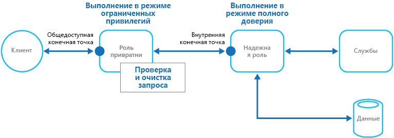

# Шаблон привратникаGatekeeper pattern

[!INCLUDE [header](../_includes/header.md)]

Защита приложений и служб с помощью выделенного экземпляра узла, который выполняет роль брокера между клиентами и приложением или службой, проверяет и очищает запросы, а также передает запросы и данные между ними.Protect applications and services by using a dedicated host instance that acts as a broker between clients and the application or service, validates and sanitizes requests, and passes requests and data between them. Такой подход обеспечивает дополнительный уровень защиты и ограничивает степень влияния атаки на систему.This can provide an additional layer of security, and limit the attack surface of the system.

## Контекст и проблемаContext and problem

Приложения предоставляют клиентам свои функции, принимая и обрабатывая запросы.Applications expose their functionality to clients by accepting and processing requests. Размещенные в облаке приложения предоставляют конечные точки, к которым подключаются клиенты и которые обычно содержат код для обработки запросов от клиентов.In cloud-hosted scenarios, applications expose endpoints clients connect to, and typically include the code to handle the requests from clients. Этот код выполняет аутентификацию и проверку, полную обработку запросов или некоторую ее часть, обращается от имени клиента к хранилищу и другим службам.This code performs authentication and validation, some or all request processing, and is likely to accesses storage and other services on behalf of the client.

Если пользователь-злоумышленник сможет скомпрометировать систему и получить доступ к среде размещения приложения, он также получит доступ ко многим механизмам защиты, включая учетные данные и ключи хранилища, а также все службы и данные, к которым обращается этот код.If a malicious user is able to compromise the system and gain access to the application’s hosting environment, the security mechanisms it uses such as credentials and storage keys, and the services and data it accesses, are exposed. Таким образом пользователь-злоумышленник получает практически неограниченный контроль над конфиденциальной информацией и другими службами.As a result, the malicious user can gain unrestrained access to sensitive information and other services.

## РешениеSolution

Чтобы минимизировать возможность доступа клиентов к конфиденциальной информации и службам приложения, изолируйте узлы или задачи, которые предоставляют открытые конечные точки, от кода обработки запросов и обращения к хранилищу.To minimize the risk of clients gaining access to sensitive information and services, decouple hosts or tasks that expose public endpoints from the code that processes requests and accesses storage. Для этого можно использовать оболочку, то есть специализированную задачу, которая взаимодействует с клиентами и передает запросы (например, через несвязанный интерфейс) узлам или задачам, которые обрабатывают эти запросы.You can achieve this by using a façade or a dedicated task that interacts with clients and then hands off the request&mdash;perhaps through a decoupled interface&mdash;to the hosts or tasks that'll handle the request. На этом рисунке представлен общий обзор этого шаблона.The figure provides a high-level overview of this pattern.

Шаблон привратника может просто защищать хранилище данных или использоваться в качестве многофункциональной оболочки для защиты всех функций приложения.The gatekeeper pattern can be used to simply protect storage, or it can be used as a more comprehensive façade to protect all of the functions of the application. Используя эту модель, важно учитывать следующее:The important factors are:

- **Контролируемая проверка.****Controlled validation.** Привратник проверяет все запросы, отклоняя те, которые не соответствуют условиям проверки.The gatekeeper validates all requests, and rejects those that don't meet validation requirements.
- **Ограничение риска и уязвимости.****Limited risk and exposure.** У привратника нет доступа к учетным данным или ключам, которые доверенный узел использует, чтобы обращаться к хранилищу и службам.The gatekeeper doesn't have access to the credentials or keys used by the trusted host to access storage and services. Скомпрометировав привратник, злоумышленник не получит доступ к учетным данным или ключам.If the gatekeeper is compromised, the attacker doesn't get access to these credentials or keys.
- **Обеспечение безопасности.****Appropriate security.** Привратник работает в режиме ограниченных прав, а остальная часть приложения — в режиме полного доверия, необходимом для обеспечения доступа к хранилищу и службам.The gatekeeper runs in a limited privilege mode, while the rest of the application runs in the full trust mode required to access storage and services. Даже в случае компрометации привратник не сможет обратиться к службам или данным приложения напрямую.If the gatekeeper is compromised, it can't directly access the application services or data.

Этот шаблон действует как брандмауэр в классической сетевой топографии.This pattern acts like a firewall in a typical network topography. Такая архитектура позволяет привратнику проверять запросы и решать, нужно ли передавать их доверенному узлу, который выполнит требуемые задачи.It allows the gatekeeper to examine requests and make a decision about whether to pass the request on to the trusted host (sometimes called the keymaster) that performs the required tasks. Обычно, если привратник принимает решение передать запрос доверенному узлу, он предварительно проверяет и очищает содержимое запроса.This decision typically requires the gatekeeper to validate and sanitize the request content before passing it on to the trusted host.

## Проблемы и рекомендацииIssues and considerations

При принятии решения о реализации этого шаблона необходимо учитывать следующие моменты.Consider the following points when deciding how to implement this pattern:

- Доверенный узел, которому привратник передает запросы, должен предоставлять только внутренние или защищенные конечные точки, которые допускают подключение только от привратника.Ensure that the trusted hosts the gatekeeper passes requests to expose only internal or protected endpoints, and connect only to the gatekeeper. У доверенных узлов не должно быть внешних конечных точек и (или) интерфейсов.The trusted hosts shouldn't expose any external endpoints or interfaces.
- Привратник должен выполняться в режиме ограниченных прав.The gatekeeper must run in a limited privilege mode. Для этого привратник и доверенный узел обычно размещают в разных службах или на разных виртуальных машин.Typically this means running the gatekeeper and the trusted host in separate hosted services or virtual machines.
- Привратник не должен выполнять обработку, связанную с работой приложения или служб, а также обращаться к данным.The gatekeeper shouldn't perform any processing related to the application or services, or access any data. Его единственная функция — проверка и очистка запросов.Its function is purely to validate and sanitize requests. Возможно, доверенный узел будет выполнять дополнительные проверки запросов, но все основные проверки следует поручить привратнику.The trusted hosts might need to perform additional validation of requests, but the core validation should be performed by the gatekeeper.
- Если возможно, используйте безопасный коммуникационный канал (HTTPS, SSL или TLS) между привратником и доверенным узлом или задачами.Use a secure communication channel (HTTPS, SSL, or TLS) between the gatekeeper and the trusted hosts or tasks where this is possible. Некоторые среды размещения не поддерживают HTTPS для внутренних конечных точек.However, some hosting environments don't support HTTPS on internal endpoints.
- Добавление еще одного слоя приложения, необходимого для реализации шаблона привратника, может несколько снизить производительность из-за необходимости в дополнительной обработке и сетевом взаимодействии.Adding the extra layer to the application to implement the gatekeeper pattern is likely to have some impact on performance due to the additional processing and network communication it requires.
- Экземпляр привратника может стать единой точкой отказа.The gatekeeper instance could be a single point of failure. Чтобы свести к минимуму влияние таких отказов, можно развернуть дополнительные экземпляры и настроить механизм автомасштабирования, чтобы обеспечить необходимую мощность и доступность.To minimize the impact of a failure, consider deploying additional instances and using an autoscaling mechanism to ensure capacity to maintain availability.

## Когда следует использовать этот шаблонWhen to use this pattern

Этот шаблон можно использовать для следующих целей:This pattern is useful for:

- в приложениях, которые обрабатывают конфиденциальные сведения, предоставляют службы, которым требуется высокий уровень защиты от атак злоумышленников, или выполняют важные операции, которые нельзя прерывать.Applications that handle sensitive information, expose services that must have a high degree of protection from malicious attacks, or perform mission-critical operations that shouldn't be disrupted.
- в распределенных приложениях, в которых проверка запроса должна быть отделена от основных задач или может выполняться централизованно, чтобы упростить обслуживание и администрирование.Distributed applications where it's necessary to perform request validation separately from the main tasks, or to centralize this validation to simplify maintenance and administration.

## ПримерExample

При облачном размещении этот шаблон можно реализовать, отделив роль или виртуальную машину привратника от доверенных ролей и служб приложения.In a cloud-hosted scenario, this pattern can be implemented by decoupling the gatekeeper role or virtual machine from the trusted roles and services in an application. Для этого добавьте внутреннюю конечную точку, очередь или хранилище в качестве промежуточного механизма взаимодействия.Do this by using an internal endpoint, a queue, or storage as an intermediate communication mechanism. На схеме представлен пример с использованием внутренней конечной точки.The figure illustrates using an internal endpoint.

## Связанные шаблоныRelated patterns

[Шаблон ключа камердинера](valet-key.md) также может использоваться при реализации шаблона привратника.The [Valet Key pattern](valet-key.md) might also be relevant when implementing the Gatekeeper pattern. При обмене данными между ролью привратника и доверенными ролями рекомендуется применять ключи или маркеры, ограничивающие права доступа к ресурсам, чтобы повысить уровень безопасности.When communicating between the Gatekeeper and trusted roles it's good practice to enhance security by using keys or tokens that limit permissions for accessing resources. Этот шаблон описывает, как использовать маркер или ключ, который предоставляет клиентам ограниченный прямой доступ к определенному ресурсу или службе.Describes how to use a token or key that provides clients with restricted direct access to a specific resource or service.
