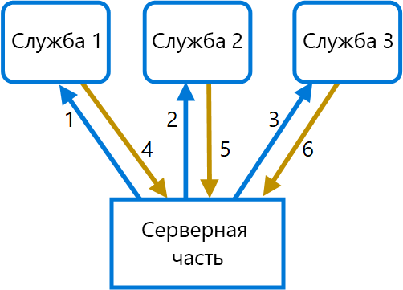
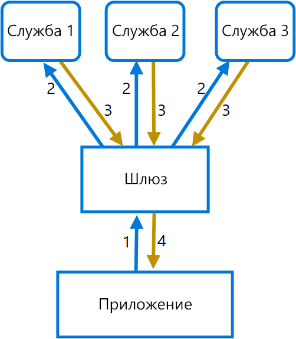

# <a name="gateway-aggregation-pattern"></a><span data-ttu-id="7b373-104">Схема агрегирования на шлюзе</span><span class="sxs-lookup"><span data-stu-id="7b373-104">Gateway Aggregation pattern</span></span>

<span data-ttu-id="7b373-105">Использование шлюза для объединения нескольких отдельных запросов в один общий.</span><span class="sxs-lookup"><span data-stu-id="7b373-105">Use a gateway to aggregate multiple individual requests into a single request.</span></span> <span data-ttu-id="7b373-106">Эта схема полезна в тех случаях, когда клиенту для выполнения операции приходится отправлять несколько вызовов к разным серверным системам.</span><span class="sxs-lookup"><span data-stu-id="7b373-106">This pattern is useful when a client must make multiple calls to different backend systems to perform an operation.</span></span>

## <a name="context-and-problem"></a><span data-ttu-id="7b373-107">Контекст и проблема</span><span class="sxs-lookup"><span data-stu-id="7b373-107">Context and problem</span></span>

<span data-ttu-id="7b373-108">Иногда для выполнения одной задачи клиент вынужден обращаться к нескольким разным серверным службам.</span><span class="sxs-lookup"><span data-stu-id="7b373-108">To perform a single task, a client may have to make multiple calls to various backend services.</span></span> <span data-ttu-id="7b373-109">Приложение, которое использует несколько служб для выполнения задачи, тратит ресурсы на каждый такой запрос.</span><span class="sxs-lookup"><span data-stu-id="7b373-109">An application that relies on many services to perform a task must expend resources on each request.</span></span> <span data-ttu-id="7b373-110">Когда в приложение добавляются новые компоненты или службы, увеличивается и количество запросов, а значит с каждым этапом растет нагрузка на ресурсы и сеть.</span><span class="sxs-lookup"><span data-stu-id="7b373-110">When any new feature or service is added to the application, additional requests are needed, further increasing resource requirements and network calls.</span></span> <span data-ttu-id="7b373-111">Большое число запросов от клиента к серверной части неблагоприятно влияет на производительность и масштабирование приложения.</span><span class="sxs-lookup"><span data-stu-id="7b373-111">This chattiness between a client and a backend can adversely impact the performance and scale of the application.</span></span>  <span data-ttu-id="7b373-112">Архитектура микрослужб дополнительно обострила такую проблему, ведь приложения, составленные из большого количества небольших служб, естественным образом используют большое количество вызовов между службами.</span><span class="sxs-lookup"><span data-stu-id="7b373-112">Microservice architectures have made this problem more common, as applications built around many smaller services naturally have a higher amount of cross-service calls.</span></span>

<span data-ttu-id="7b373-113">На следующей схеме клиент отправляет запросы к каждой службе (1, 2 и 3).</span><span class="sxs-lookup"><span data-stu-id="7b373-113">In the following diagram, the client sends requests to each service (1,2,3).</span></span> <span data-ttu-id="7b373-114">Каждая их них обрабатывает запрос и отправляет ответ обратно в приложение (4, 5 и 6).</span><span class="sxs-lookup"><span data-stu-id="7b373-114">Each service processes the request and sends the response back to the application (4,5,6).</span></span> <span data-ttu-id="7b373-115">Если используется сотовая сеть, для которой типичны большие задержки, такое обилие отдельных запросов будет неэффективно и может привести к разрыву связи или неполному выполнению запросов.</span><span class="sxs-lookup"><span data-stu-id="7b373-115">Over a cellular network with typically high latency, using individual requests in this manner is inefficient and could result in broken connectivity or incomplete requests.</span></span> <span data-ttu-id="7b373-116">А поскольку каждый запрос должен выполняться параллельно, приложение поддерживает несколько соединений, в каждом из которых отправляет, ожидает и обрабатывает данные. Это дополнительно повышает вероятность сбоя.</span><span class="sxs-lookup"><span data-stu-id="7b373-116">While each request may be done in parallel, the application must send, wait, and process data for each request, all on separate connections, increasing the chance of failure.</span></span>



## <a name="solution"></a><span data-ttu-id="7b373-118">Решение</span><span class="sxs-lookup"><span data-stu-id="7b373-118">Solution</span></span>

<span data-ttu-id="7b373-119">Используйте шлюз, чтобы сократить число вызовов между клиентом и службами.</span><span class="sxs-lookup"><span data-stu-id="7b373-119">Use a gateway to reduce chattiness between the client and the services.</span></span> <span data-ttu-id="7b373-120">Этот шлюз получает запросы от клиентов, распределяет их по серверным системам, затем объединяет результаты и отправляет их запрашивающему клиенту.</span><span class="sxs-lookup"><span data-stu-id="7b373-120">The gateway receives client requests, dispatches requests to the various backend systems, and then aggregates the results and sends them back to the requesting client.</span></span>

<span data-ttu-id="7b373-121">Такая схема позволяет сократить число запросов, которые отправляются приложением к серверным службам, и повысить производительность при работе в сетях с высокой задержкой.</span><span class="sxs-lookup"><span data-stu-id="7b373-121">This pattern can reduce the number of requests that the application makes to backend services, and improve application performance over high-latency networks.</span></span>

<span data-ttu-id="7b373-122">На следующей схеме приложение отправляет запрос к шлюзу (1).</span><span class="sxs-lookup"><span data-stu-id="7b373-122">In the following diagram, the application sends a request to the gateway (1).</span></span> <span data-ttu-id="7b373-123">Этот запрос содержит пакет дополнительных запросов.</span><span class="sxs-lookup"><span data-stu-id="7b373-123">The request contains a package of additional requests.</span></span> <span data-ttu-id="7b373-124">Шлюз разделяет и обрабатывает эти запросы, отправляя каждый из них соответствующей службе (2).</span><span class="sxs-lookup"><span data-stu-id="7b373-124">The gateway decomposes these and processes each request by sending it to the relevant service (2).</span></span> <span data-ttu-id="7b373-125">Каждая служба возвращает ответ шлюзу (3).</span><span class="sxs-lookup"><span data-stu-id="7b373-125">Each service returns a response to the gateway (3).</span></span> <span data-ttu-id="7b373-126">Шлюз собирает все ответы служб и отправляет объединенный ответ в приложение (4).</span><span class="sxs-lookup"><span data-stu-id="7b373-126">The gateway combines the responses from each service and sends the response to the application (4).</span></span> <span data-ttu-id="7b373-127">Приложение выполняет только один запрос и получает от шлюза только один ответ.</span><span class="sxs-lookup"><span data-stu-id="7b373-127">The application makes a single request and receives only a single response from the gateway.</span></span>



## <a name="issues-and-considerations"></a><span data-ttu-id="7b373-129">Проблемы и рекомендации</span><span class="sxs-lookup"><span data-stu-id="7b373-129">Issues and considerations</span></span>

- <span data-ttu-id="7b373-130">Шлюз не должен добавлять взаимозависимости между серверными службами.</span><span class="sxs-lookup"><span data-stu-id="7b373-130">The gateway should not introduce service coupling across the backend services.</span></span>
- <span data-ttu-id="7b373-131">Шлюз должен находиться рядом с серверными службами, чтобы максимально снизить задержки в сети.</span><span class="sxs-lookup"><span data-stu-id="7b373-131">The gateway should be located near the backend services to reduce latency as much as possible.</span></span>
- <span data-ttu-id="7b373-132">Служба шлюза может стать единой точкой отказа.</span><span class="sxs-lookup"><span data-stu-id="7b373-132">The gateway service may introduce a single point of failure.</span></span> <span data-ttu-id="7b373-133">Важно правильно подойти к проектированию шлюза, чтобы он соответствовал требованиям к доступности для вашего приложения.</span><span class="sxs-lookup"><span data-stu-id="7b373-133">Ensure the gateway is properly designed to meet your application's availability requirements.</span></span>
- <span data-ttu-id="7b373-134">Шлюз может стать узким местом системы.</span><span class="sxs-lookup"><span data-stu-id="7b373-134">The gateway may introduce a bottleneck.</span></span> <span data-ttu-id="7b373-135">Обеспечьте для шлюза достаточную производительность в соответствии с нагрузкой и возможность масштабирования в соответствии с ожидаемым ростом.</span><span class="sxs-lookup"><span data-stu-id="7b373-135">Ensure the gateway has adequate performance to handle load and can be scaled to meet your anticipated growth.</span></span>
- <span data-ttu-id="7b373-136">Выполните нагрузочное тестирование шлюза, чтобы исключить возможность каскадных сбоев служб.</span><span class="sxs-lookup"><span data-stu-id="7b373-136">Perform load testing against the gateway to ensure you don't introduce cascading failures for services.</span></span>
- <span data-ttu-id="7b373-137">Создайте надежную систему, используя методы [распределительных блоков][bulkhead], [автоматического выключения][circuit-breaker], [повторных попыток][retry] и ограничения времени ожидания.</span><span class="sxs-lookup"><span data-stu-id="7b373-137">Implement a resilient design, using techniques such as [bulkheads][bulkhead], [circuit breaking][circuit-breaker], [retry][retry], and timeouts.</span></span>
- <span data-ttu-id="7b373-138">Если один или несколько вызовов служб занимают слишком много времени, в некоторых ситуациях допустимо прерывать ожидание и возвращать неполный набор данных.</span><span class="sxs-lookup"><span data-stu-id="7b373-138">If one or more service calls takes too long, it may be acceptable to timeout and return a partial set of data.</span></span> <span data-ttu-id="7b373-139">Решите, как приложение должно вести себя в этом случае.</span><span class="sxs-lookup"><span data-stu-id="7b373-139">Consider how your application will handle this scenario.</span></span>
- <span data-ttu-id="7b373-140">Используйте асинхронный ввод-вывод, чтобы задержки на серверной части не снижали производительность приложения.</span><span class="sxs-lookup"><span data-stu-id="7b373-140">Use asynchronous I/O to ensure that a delay at the backend doesn't cause performance issues in the application.</span></span>
- <span data-ttu-id="7b373-141">Реализуйте распределенную трассировку с помощью идентификаторов корреляции, чтобы отслеживать каждый отдельный вызов.</span><span class="sxs-lookup"><span data-stu-id="7b373-141">Implement distributed tracing using correlation IDs to track each individual call.</span></span>
- <span data-ttu-id="7b373-142">Контролируйте метрики запросов и размеры ответов.</span><span class="sxs-lookup"><span data-stu-id="7b373-142">Monitor request metrics and response sizes.</span></span>
- <span data-ttu-id="7b373-143">Оцените, можно ли возвращать кэшированные данные в качестве резервной меры при возникновении сбоев.</span><span class="sxs-lookup"><span data-stu-id="7b373-143">Consider returning cached data as a failover strategy to handle failures.</span></span>
- <span data-ttu-id="7b373-144">Оцените, где лучше выполнять агрегирование — на шлюзе или в дополнительной службе, размещенной за шлюзом.</span><span class="sxs-lookup"><span data-stu-id="7b373-144">Instead of building aggregation into the gateway, consider placing an aggregation service behind the gateway.</span></span> <span data-ttu-id="7b373-145">Агрегирование запросов будет налагать дополнительные требования к ресурсам, отличные от требований других служб шлюза, и может повлиять на производительность шлюза по маршрутизации и разгрузке.</span><span class="sxs-lookup"><span data-stu-id="7b373-145">Request aggregation will likely have different resource requirements than other services in the gateway and may impact the gateway's routing and offloading functionality.</span></span>

## <a name="when-to-use-this-pattern"></a><span data-ttu-id="7b373-146">Когда следует использовать этот шаблон</span><span class="sxs-lookup"><span data-stu-id="7b373-146">When to use this pattern</span></span>

<span data-ttu-id="7b373-147">Используйте этот шаблон в следующих случаях:</span><span class="sxs-lookup"><span data-stu-id="7b373-147">Use this pattern when:</span></span>

- <span data-ttu-id="7b373-148">если клиент должен обмениваться данными с несколькими серверными службами для выполнения операции;</span><span class="sxs-lookup"><span data-stu-id="7b373-148">A client needs to communicate with multiple backend services to perform an operation.</span></span>
- <span data-ttu-id="7b373-149">клиент может использовать сети со значительными задержками, например сети сотовой связи;</span><span class="sxs-lookup"><span data-stu-id="7b373-149">The client may use networks with significant latency, such as cellular networks.</span></span>

<span data-ttu-id="7b373-150">Эту схему не стоит применять в следующих случаях:</span><span class="sxs-lookup"><span data-stu-id="7b373-150">This pattern may not be suitable when:</span></span>

- <span data-ttu-id="7b373-151">когда нужно уменьшить количество вызовов между клиентом и одной службой при большом количестве операций.</span><span class="sxs-lookup"><span data-stu-id="7b373-151">You want to reduce the number of calls between a client and a single service across multiple operations.</span></span> <span data-ttu-id="7b373-152">В таком случае лучше реализовать в службе поддержку пакетной обработки.</span><span class="sxs-lookup"><span data-stu-id="7b373-152">In that scenario, it may be better to add a batch operation to the service.</span></span>
- <span data-ttu-id="7b373-153">клиент или приложение расположены рядом с серверными службами, так что сетевая задержка не является важным фактором.</span><span class="sxs-lookup"><span data-stu-id="7b373-153">The client or application is located near the backend services and latency is not a significant factor.</span></span>

## <a name="example"></a><span data-ttu-id="7b373-154">Пример</span><span class="sxs-lookup"><span data-stu-id="7b373-154">Example</span></span>

<span data-ttu-id="7b373-155">В следующем примере демонстрируется создание простой службы агрегирования на шлюзе NGINX с использованием Lua.</span><span class="sxs-lookup"><span data-stu-id="7b373-155">The following example illustrates how to create a simple a gateway aggregation NGINX service using Lua.</span></span>

```lua
worker_processes  4;

events {
  worker_connections 1024;
}

http {
  server {
    listen 80;

    location = /batch {
      content_by_lua '
        ngx.req.read_body()

        -- read json body content
        local cjson = require "cjson"
        local batch = cjson.decode(ngx.req.get_body_data())["batch"]

        -- create capture_multi table
        local requests = {}
        for i, item in ipairs(batch) do
          table.insert(requests, {item.relative_url, { method = ngx.HTTP_GET}})
        end

        -- execute batch requests in parallel
        local results = {}
        local resps = { ngx.location.capture_multi(requests) }
        for i, res in ipairs(resps) do
          table.insert(results, {status = res.status, body = cjson.decode(res.body), header = res.header})
        end

        ngx.say(cjson.encode({results = results}))
      ';
    }

    location = /service1 {
      default_type application/json;
      echo '{"attr1":"val1"}';
    }

    location = /service2 {
      default_type application/json;
      echo '{"attr2":"val2"}';
    }
  }
}
```

## <a name="related-guidance"></a><span data-ttu-id="7b373-156">Связанные руководства</span><span class="sxs-lookup"><span data-stu-id="7b373-156">Related guidance</span></span>

- [<span data-ttu-id="7b373-157">Схема отдельных серверных частей для каждого интерфейса</span><span class="sxs-lookup"><span data-stu-id="7b373-157">Backends for Frontends pattern</span></span>](./backends-for-frontends.md)
- [<span data-ttu-id="7b373-158">Схема разгрузки шлюза</span><span class="sxs-lookup"><span data-stu-id="7b373-158">Gateway Offloading pattern</span></span>](./gateway-offloading.md)
- [<span data-ttu-id="7b373-159">Схема маршрутизации шлюза</span><span class="sxs-lookup"><span data-stu-id="7b373-159">Gateway Routing pattern</span></span>](./gateway-routing.md)

[bulkhead]: ./bulkhead.md
[circuit-breaker]: ./circuit-breaker.md
[retry]: ./retry.md