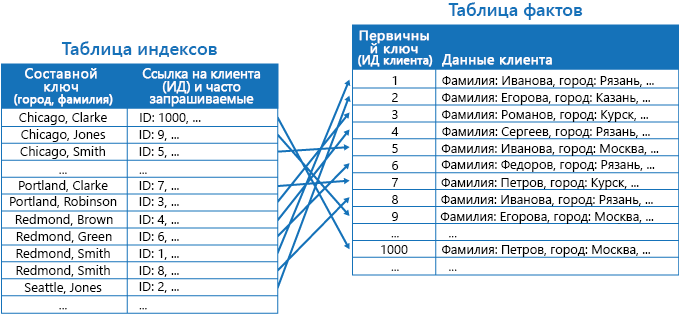

# Шаблон таблицы индексов

[!INCLUDE [header](../_includes/header.md)]

Создание в хранилище данных индексов по полям, которые часто используются в запросах. Этот шаблон может повысить производительность запросов, ускоряя поиск данных, которые нужно извлечь из хранилища.

## Контекст и проблема

В многих хранилищах данные для коллекций сущностей организованы при помощи первичного ключа. Этот ключ может использоваться в приложении для поиска и извлечения данных. На рисунке представлен пример хранилища данных со сведениями о клиентах. Первичный ключ — это идентификатор клиента. На рисунке представлены сведения о клиенте, упорядоченные по первичному ключу (идентификатору клиента).

Первичный ключ отлично подходит для запросов данных на основе его значения. Но если нужно получить данные на основе другого поля, первичный ключ не всегда можно использовать. В приведенном выше примере для поиска клиентов в приложении нельзя использовать первичный ключ (идентификатор клиента), если данные запрашиваются исключительно по ссылке на значение какого-нибудь другого атрибута, например на название города, в котором находится клиент. Для выполнения такого запроса приложению может потребоваться получить и изучить каждую запись клиента, что может занять довольно много времени.

Многие системы управления реляционными базами данных поддерживают вторичные индексы. Вторичный индекс — это отдельная структура данных, упорядоченных по одному или нескольким вторичным (дополнительным) ключевым полям. Такой индекс указывает, где хранятся данные для каждого индексированного значения. Элементы вторичного индекса обычно сортируются по значению вторичных ключей, чтобы повысить скорость поиска данных. Такие индексы, как правило, автоматически обслуживаются системой управления базами данных.

Вы можете создать любое количество вторичных индексов для поддержки различных запросов, выполняемых в приложении. Например, в таблице со сведениями о клиентах в реляционной базе данных, где идентификатор клиента является первичным ключом, стоит добавить вторичный индекс над полем города, если в приложении часто выполняется поиск клиентов по городу, в котором они находятся.

Вторичные индексы часто используются в реляционных системах, но большинство хранилищ данных NoSQL, которые используются в облачных приложениях, не предоставляют эквивалентную функцию.

## Решение

Если хранилище данных не поддерживает вторичные индексы, их можно эмулировать вручную, создав собственные таблицы индексов. В таблице индексов данные упорядочиваются по указанному ключу. Для структурирования таблицы индексов обычно используются три стратегии. Стратегию выбирают на основе требуемого числа вторичных индексов и характера запросов в приложении.

Первая стратегия — данные дублируются в каждой таблице индексов, но упорядочиваются по разным ключам (полная денормализация). На следующем рисунке представлены таблицы индексов, в которых одни и те же данные клиента упорядочены по городу и фамилии:

Эта стратегия подходит, если данные остаются относительно статическими при любом количестве запросов с помощью каждого ключа. Если данные более динамические, затраты на обслуживание каждой таблицы индексов слишком значительны и такой подход нецелесообразен. Кроме того, если объем данных очень велик, требуется значительное пространство для хранения дублируемых данных.

Вторая стратегия — создаются нормализованные таблицы индексов, которые упорядочены по разным ключам, и добавляются ссылки на исходные данные с помощью первичного ключа (вместо их дублирования), как показано на приведенном ниже рисунке. Исходные данные называются таблицей фактов.

Этот способ позволяет сэкономить место и сократить затраты на обслуживание дублируемых данных. Недостатком такого подхода является то, что приложению требуется выполнять две операции поиска данных с использованием вторичного ключа. Сначала нужно найти первичный ключ для данных в таблице индексов, а затем использовать его для поиска данных в таблице фактов.

Третья стратегия — создаются частично нормализованные таблицы индексов, упорядоченные при помощи различных ключей. В таких таблицах дублируются часто извлекаемые поля. Для доступа к редко используемым полям добавляются ссылки на таблицу фактов. На следующем рисунке показано, как часто используемые данные дублируются в каждой таблице индексов:

Эта стратегия обеспечивает баланс между двумя первыми подходами. Данные для часто выполняемых запросов можно быстро получить при помощи одной операции поиска, а занимаемое пространство и затраты на обслуживание не так значительны, как при дублировании всего набора данных.

Если в приложении часто выполняются запросы данных с несколькими значениями (например, "Найти всех клиентов из Тамбова с фамилией Лоханкин"), можно реализовать ключи для элементов в таблице индексов с объединением атрибутов города и фамилии. На приведенном ниже рисунке представлена таблица индексов на основе составных ключей. Ключи сортируются по городу, а затем — по фамилиям для записей с одинаковыми значениями города.

Таблицы индексов могут ускорить операции запросов для сегментированных данных и особенно полезны, когда ключ сегмента хэшируется. На приведенном ниже рисунке показан пример, где ключ сегмента является хэшем идентификатора клиента. В таблице индексов можно упорядочить данные по нехэшированному значению (город и фамилия) и указать хэшированный ключ как данные поиска. Это поможет предотвратить многократное вычисление хэш-ключей (ресурсоемкую операцию) в приложении, если требуется получить данные в пределах диапазона или в порядке нехэшированных ключей. Например, запрос "Найти всех клиентов, которые живут в Тамбове" можно быстро выполнить, разместив соответствующие элементы в таблице индексов, где все они хранятся в связанном блоке. Затем используйте ссылки на данные клиента с помощью ключей сегментов, которые хранятся в таблице индексов.

## Проблемы и рекомендации

При принятии решения о реализации этого шаблона необходимо учитывать следующие моменты.

- Затраты на обслуживание вторичных индексов могут оказаться достаточно велики. Необходимо иметь представление о запросах, которые используются в вашем приложении, и анализировать их. Создавайте таблицы индексов, только если планируете использовать их регулярно. Не создавайте теоретические таблицы индексов для поддержки запросов, которые не выполняются в приложении или выполняются лишь время от времени.
- Дублирование данных в таблице индексов может повлечь значительные дополнительные расходы на хранение и трудозатраты, так как при этом требуется обслуживание нескольких копий данных.
- Для реализации таблицы индексов в виде нормализованной структуры, в которой добавляется ссылка на исходные данные, приложению требуется выполнить две операции поиска данных. Сначала выполняется поиск первичного ключа в таблице индексов, а затем этот ключ используется для получения данных.
- Если система содержит несколько таблиц индексов для очень больших наборов данных, иногда трудно поддерживать согласованность между таблицами индексов и исходными данными. Можно разработать приложение на основе модели конечной согласованности. Например, для вставки, обновления или удаления данных приложение может отправить сообщение в очередь и создать отдельную задачу для выполнения операции и обслуживания таблиц индексов, которые асинхронно ссылаются на эти данные. Сведения о реализации согласованности в конечном счете см. в [руководстве по обеспечению согласованности данных](https://msdn.microsoft.com/library/dn589800.aspx).

   >  Таблицы в хранилище Microsoft Azure поддерживают обновления транзакций для изменения данных в одной секции (также называются транзакциями группы сущностей). При хранении данных для таблицы фактов и одной или нескольких таблиц индексов в одной секции вы можете использовать эту функцию, чтобы обеспечить согласованность.

- Собственно таблицы индексов также можно секционировать или сегментировать.

## Когда следует использовать этот шаблон

Этот шаблон используется для повышения производительности запросов, когда приложению часто требуется извлекать данные с помощью ключа, отличного от первичного (или ключа сегментов).

Этот шаблон может оказаться неэффективным в следующих случаях:

- Данные нестабильны. Таблица индексов может очень быстро стать неактуальной. В таком случае не стоит использовать ее, так как затраты на обслуживание таблицы могут превысить экономию от ее применения.
- Поле, выбранное в качестве вторичного ключа для таблицы индексов, недифференцировано и может иметь только небольшой набор значений (например, пол).
- Значения данных поля, выбранного в качестве вторичного ключа для таблицы индексов, очень разрознены. Например, если для 90 % записей в поле содержатся одинаковые значения, создание и обслуживание таблицы индексов для поиска данных на основе этого поля может повлечь большие затраты, чем последовательный просмотр данных. Но если запросы часто обращаются к значениями, которые содержатся в оставшихся 10 % записей, этот индекс можно использовать. Следует иметь представление о запросах, которые выполняет приложение, и об их частоте.

## Пример

Таблицы хранилища Azure обеспечивают высокомасштабируемое хранилище ключей и значений для приложений в облаке. В приложениях можно хранить и извлекать значения, указав ключ. Значения данных могут содержать несколько полей, но структура элемента данных непрозрачна для хранилища таблиц, в котором элемент данных просто обрабатывается как массив байтов.

Таблицы хранилища Azure также поддерживают сегментирование. Ключ сегментирования включает два элемента: ключ секции и ключ строки. Элементы с одним ключом секции хранятся в одной секции (сегменте) в порядке ключей строк. Хранилище таблиц оптимизировано для выполнения запросов данных в непрерывном диапазоне значений для ключа строки в секции. Если вы создаете облачные приложения, в которых данные хранятся в таблицах Azure, структурируйте данные с учетом этой функции.

Например, рассмотрим приложение со сведениями о фильмах. В приложении часто выполняются запросы на фильмы по жанру (остросюжетный фильм, документальный фильм, исторический фильм, комедия, драма и т. д). Можно создать таблицу Azure с секцией для каждого жанра, используя жанр в качестве ключа секции и указывая название фильма в качестве ключа строки, как показано на рисунке ниже:

Этот подход менее эффективен, если в приложении также нужно выполнять запросы по имени актеров. В этом случае можно создать отдельную таблицу Azure, которая будет таблицей индексов. Ключ секции — это имя актера, а ключ строки — название фильма. Данные для каждого актера будут храниться в отдельной секции. Если в фильме снимается несколько искомых актеров, его название будет содержаться в нескольких секциях.

Можно дублировать данные фильма, содержащиеся в значениях в каждой секции, используя первый подход. Он описан выше в разделе "Решение". Но есть вероятность, что каждый фильм будет реплицирован несколько раз (один раз для каждого актера). Поэтому лучше частично денормализовать данные для поддержки наиболее частых запросов (например, по именам других актеров). Также рекомендуем настроить приложение для получения всех оставшихся данных, включая ключ секции, необходимый для поиска подробной информации в секциях для жанра. Этот подход описан как третий вариант в разделе "Решение". Он представлен на рисунке ниже.

## Связанные шаблоны и рекомендации

При реализации этого шаблона следует принять во внимание следующие шаблоны и рекомендации.

- [Data Consistency Primer](https://msdn.microsoft.com/library/dn589800.aspx) (Руководство по обеспечению согласованности данных). Таблицы индексов должны обслуживаться, так как индексируемые данные могут измениться. Иногда в облаке невозможно или нерентабельно обновлять индексы в рамках той же транзакции, в которой изменяются данные. В этом случае подход конечной согласованности является более уместным. Руководство содержит сведения о проблемах, которые касаются конечной согласованности.
- [Шаблон сегментирования.](https://msdn.microsoft.com/library/dn589797.aspx) Шаблон таблицы индексов часто используется с данными, которые секционированы с применением сегментов. Шаблон сегментирования предоставляет дополнительные сведения о том, как преобразовать хранилище данных в набор сегментов.
- [Materialized View Pattern](materialized-view.md) (Шаблон материализованного представления). Вместо индексирования данных для поддержки сводных запросов, возможно, целесообразнее создать материализованное представление данных. Здесь описано, как реализовать эффективную поддержку сводных запросов, создав предварительно заполненные представления данных.
