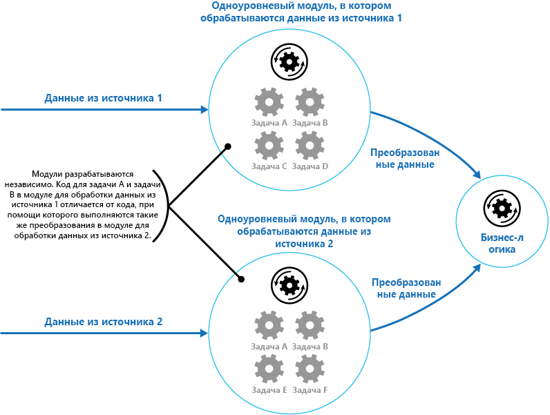
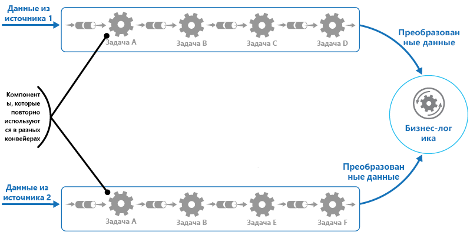

# <a name="pipes-and-filters-pattern"></a>Шаблон каналов и фильтров

[!INCLUDE [header](../_includes/header.md)]

Разбейте задачу, которая выполняет сложную обработку, на ряд отдельных элементов для повторного использования при необходимости. Так вы сможете повысить производительность, масштабируемость и возможность многократного использования, позволяя развертывать и масштабировать элементы задачи, которые выполняют обработку, независимо друг от друга.

## <a name="context-and-problem"></a>Контекст и проблема

Приложение должно выполнять различные задачи определенной сложности с информацией, которую оно обрабатывает. Для осуществления такой обработки в виде неделимого модуля применяется простой, но гибкий способ реализации такого приложения. Однако этот метод, вероятно, сократит возможности для рефакторинга кода, его оптимизации или повторного использования, если части одной и той же обработки потребуются в другом месте приложения.

На рисунке приведена схема обработки данных с помощью монолитного подхода и сопутствующие проблемы. Приложение получает и обрабатывает данные из двух источников. Данные из каждого источника обрабатываются отдельным модулем, который выполняет ряд задач для преобразования этих данных, прежде чем передавать результат в бизнес-логику приложения.



Функции некоторых задач, выполняемых неделимыми модулями, очень похожи, но модули разрабатываются отдельно. Код, который реализует задачи, тесно связан в модуле. Он незначительно или вообще не учитывает задачи масштабируемости и многократного использования.

Тем не менее, задачи обработки, выполняемые каждым модулем, или требования к развертыванию для каждой задачи, могут изменяться в соответствии с бизнес-требованиями. Некоторые задачи могут быть ресурсоемкими и более эффективными на мощном оборудовании. В то время как для других задач такие дорогостоящие ресурсы могут не требоваться. Кроме того, в будущем может предполагаться дополнительная обработка или может измениться порядок выполнения задач по обработке. Требуется такое решение, которое устранит эти проблемы и увеличит возможность многократного использования кода.

## <a name="solution"></a>Решение

Разбейте процесс обработки, требуемый для каждого потока, на ряд отдельных компонентов (или фильтров), каждый из которых выполняет определенную задачу. За счет стандартизации формата данных, которые получает и отправляет каждый компонент, эти фильтры можно объединить в конвейер. Так вы предотвратите дублирование кода и упростите удаление, замену или интеграцию дополнительных компонентов при изменении требований к обработке. На следующем рисунке показано решение, реализованное с использованием каналов и фильтров.




Время, необходимое для обработки одного запроса, зависит от скорости самого медленного фильтра в конвейере. Один или несколько фильтров могут быть сдерживающим фактором, особенно если в потоке из определенного источника данных содержится много запросов. Ключевое преимущество конвейерной структуры заключается в том, что в ней можно параллельно выполнять экземпляры медленных фильтров, позволяя распределить нагрузку и повысить пропускную способность в системе.

Составляющие конвейер фильтры могут выполняться на разных компьютерах, что позволяет масштабировать их независимо друг от друга и использовать возможности эластичности, которые предоставляются в большинстве облачных сред. Ресурсоемкие фильтры могут выполняться на оборудовании с высоким уровнем производительности, а другие, менее ресурсоемкие, могут размещаться на более дешевом стандартном оборудовании. Фильтры не должны находиться в одном центре обработки данных или географическом расположении. Это позволит каждому элементу в конвейере работать в среде, близкой к необходимым ресурсам.  На следующем рисунке показан пример конвейера для данных из источника 1.


Если входные и выходные данные фильтра структурированы в виде потока, обработка для каждого фильтра может выполняться в параллельном режиме. Первый фильтр в конвейере может начать свою работу и вернуть результаты, которые непосредственно передаются следующему фильтру в последовательности, прежде чем первый фильтр завершит свою работу.

Еще одно преимущество, предоставляемое этой моделью, — устойчивость. Если произойдет сбой фильтра или компьютер, на котором он выполняется, станет недоступен, конвейер позволит перепланировать операции, выполняемые фильтром и передать их другому экземпляру компонента. Сбой одного фильтра не обязательно приводит к сбою всего конвейера.

Альтернативный подход к реализации распределенных транзакций — использовать шаблон каналов и фильтров в сочетании с [шаблоном компенсирующих транзакций](compensating-transaction.md). Распределенные транзакции можно разделить на отдельные компенсируемые задачи, каждую из которых можно реализовать с помощью фильтра, также реализуемого с помощью шаблона компенсирующих транзакций. Фильтры в конвейере можно реализовать в виде отдельно размещенных задач, выполняемых в непосредственной близости к данным, которыми они управляют.

## <a name="issues-and-considerations"></a>Проблемы и рекомендации

При выборе схемы реализации этого шаблона следует учитывать следующие моменты:
- **Сложность**. Повышенная гибкость, которую обеспечивает этот шаблон, может также вызвать сложности, особенно если фильтры в конвейере распределяются между разными серверами.

- **Надежность.** Используйте инфраструктуру, которая гарантирует сохранность данных, передаваемых между фильтрами в конвейере.

- **Идемпотентность**. Если после получения сообщения происходит сбой фильтра в конвейере и операция переносится на другой экземпляр фильтра, часть операции может быть уже выполнена. Если эта операция обновляет некоторые аспекты глобального состояния (например, сведения, хранящиеся в базе данных), это обновление можно повторить. Такая же проблема может произойти после передачи результатов фильтра следующему фильтру в конвейере, но до того, как появится сообщение об успешном завершении работы фильтра. В этих случаях другой экземпляр фильтра может повторить эти операции, что приведет к тому, что одни и те же результаты будут переданы дважды. В результате следующие фильтры в конвейере могут дважды обработать одни и те же данные. Поэтому фильтры в конвейере должны разрабатываться идемпотентными. Дополнительные сведения см. в описании [шаблонов идемпотентности](http://blog.jonathanoliver.com/idempotency-patterns/) в блоге Джонатана Оливера (Jonathan Oliver).

- **Повторяющиеся сообщения**. Если сбой фильтра в конвейере происходит после публикации сообщения для следующего этапа конвейера, может запуститься другой экземпляр фильтра и опубликовать копию этого сообщения в конвейере. Это может привести к передаче следующему фильтру двух экземпляров одного сообщения. Чтобы избежать этого, конвейер должен обнаруживать и удалять дублирующие сообщения.

    >  Если вы реализуете конвейер с использованием очередей сообщений (например, очередей служебной шины Microsoft Azure), в инфраструктуре очередей сообщений может быть предусмотрено автоматическое обнаружение и удаление дубликатов сообщений.

- **Контекст и состояние**. В конвейере каждый фильтр по сути выполняется изолированно. Способ его вызова не должен вызывать предположения. Это означает, что каждому фильтру нужно предоставить достаточный контекст для выполнения операций. Этот контекст может содержать много информации о состоянии.

## <a name="when-to-use-this-pattern"></a>Когда следует использовать этот шаблон

Используйте этот шаблон в следующих случаях:
- Процесс обработки, требуемый приложением, можно легко разделить на ряд независимых этапов.

- У этапов обработки, которые выполняются приложением, разные требования к масштабируемости.

    >  Вы можете сгруппировать фильтры, которые должны масштабироваться в рамках одного процесса. Дополнительные сведения см. в описании [шаблона консолидации вычислительных ресурсов](compute-resource-consolidation.md).

- Требуется определенная гибкость, чтобы изменять порядок шагов обработки, выполняемых приложением, или добавлять и удалять шаги.

- Система будет работать эффективнее, если распределить шаги обработки между несколькими серверами.

- Чтобы свести к минимуму последствия сбоя на шаге при обработке данных, требуется надежное решение.

Этот шаблон может оказаться неэффективным в следующих случаях:
- Шаги обработки, выполняемые приложением, не являются независимыми или должны выполняться вместе в рамках одной транзакции.

- Объем контекста или сведений о состоянии, необходимых для выполнения шага, делают такой подход неэффективным. Вместо этого можно сохранить информацию о состоянии в базе данных. Но не используйте эту стратегию, если дополнительная нагрузка на базу данных приведет к большому количеству конфликтов.

## <a name="example"></a>Пример

Чтобы предоставить инфраструктуру, необходимую для реализации конвейера, можно использовать последовательность очередей сообщений. В начальную очередь поступают необработанные сообщения. Компонент, реализованный в виде задачи фильтра, ожидает передачи сообщения в очереди, выполняет свою операцию и затем передает преобразованное сообщение в следующую очередь в последовательности. Другая задача фильтра может ожидать передачи сообщения в этой очереди, обрабатывать их и отправлять результаты в другую очередь. И так пока в последнем сообщении в очереди не появятся полностью преобразованные данные. На следующем рисунке показана реализация конвейера с использованием очередей сообщений.


Если вы разрабатываете решение в Azure, можно использовать очереди служебной шины, чтобы создать надежный и масштабируемый механизм организации очереди. В примере класса `ServiceBusPipeFilter` на языке C# ниже показано, как можно реализовать фильтр, который получает входящие сообщения из очереди, обрабатывает их и передает результаты в другую очередь.

>  Класс `ServiceBusPipeFilter` определен в проекте PipesAndFilters.Shared, доступном на сайте [GitHub](https://github.com/mspnp/cloud-design-patterns/tree/master/pipes-and-filters).

```csharp
public class ServiceBusPipeFilter
{
  ...
  private readonly string inQueuePath;
  private readonly string outQueuePath;
  ...
  private QueueClient inQueue;
  private QueueClient outQueue;
  ...

  public ServiceBusPipeFilter(..., string inQueuePath, string outQueuePath = null)
  {
     ...
     this.inQueuePath = inQueuePath;
     this.outQueuePath = outQueuePath;
  }

  public void Start()
  {
    ...
    // Create the outbound filter queue if it doesn't exist.
    ...
    this.outQueue = QueueClient.CreateFromConnectionString(...);

    ...
    // Create the inbound and outbound queue clients.
    this.inQueue = QueueClient.CreateFromConnectionString(...);
  }

  public void OnPipeFilterMessageAsync(
    Func<BrokeredMessage, Task<BrokeredMessage>> asyncFilterTask, ...)
  {
    ...

    this.inQueue.OnMessageAsync(
      async (msg) =>
    {
      ...
      // Process the filter and send the output to the
      // next queue in the pipeline.
      var outMessage = await asyncFilterTask(msg);

      // Send the message from the filter processor
      // to the next queue in the pipeline.
      if (outQueue != null)
      {
        await outQueue.SendAsync(outMessage);
      }

      // Note: There's a chance that the same message could be sent twice
      // or that a message gets processed by an upstream or downstream
      // filter at the same time.
      // This would happen in a situation where processing of a message was
      // completed, it was sent to the next pipe/queue, and then failed
      // to complete when using the PeekLock method.
      // Idempotent message processing and concurrency should be considered
      // in a real-world implementation.
    },
    options);
  }

  public async Task Close(TimeSpan timespan)
  {
    // Pause the processing threads.
    this.pauseProcessingEvent.Reset();

    // There's no clean approach for waiting for the threads to complete
    // the processing. This example simply stops any new processing, waits
    // for the existing thread to complete, then closes the message pump
    // and finally returns.
    Thread.Sleep(timespan);

    this.inQueue.Close();
    ...
  }

  ...
}
```

Метод `Start` в классе `ServiceBusPipeFilter` позволяет подключиться к паре очередей ввода и вывода, а метод `Close` — отключиться от очереди ввода. Метод `OnPipeFilterMessageAsync` выполняет фактическую обработку сообщений, а параметр `asyncFilterTask` для этого метода указывает, какую именно обработку следует выполнить. Метод `OnPipeFilterMessageAsync` ожидает поступления сообщений в очередь ввода, выполняет код, определяемый параметром `asyncFilterTask` для каждого сообщения по мере их поступления, и передает результаты в очередь вывода. Сами очереди определяются с помощью конструктора.

В примере решения фильтры реализуются в наборе рабочих ролей. Каждую рабочую роль можно масштабировать автономно в зависимости от сложности обработки коммерческих данных или ресурсов, необходимых для обработки. Кроме того, можно параллельно выполнять несколько экземпляров каждой рабочей роли, чтобы повысить пропускную способность.

В следующем коде показана рабочая роль Azure с именем `PipeFilterARoleEntry`, определенная в проекте PipeFilterA в примере решения.

```csharp
public class PipeFilterARoleEntry : RoleEntryPoint
{
  ...
  private ServiceBusPipeFilter pipeFilterA;

  public override bool OnStart()
  {
    ...
    this.pipeFilterA = new ServiceBusPipeFilter(
      ...,
      Constants.QueueAPath,
      Constants.QueueBPath);

    this.pipeFilterA.Start();
    ...
  }

  public override void Run()
  {
    this.pipeFilterA.OnPipeFilterMessageAsync(async (msg) =>
    {
      // Clone the message and update it.
      // Properties set by the broker (Deliver count, enqueue time, ...)
      // aren't cloned and must be copied over if required.
      var newMsg = msg.Clone();

      await Task.Delay(500); // DOING WORK

      Trace.TraceInformation("Filter A processed message:{0} at {1}",
        msg.MessageId, DateTime.UtcNow);

      newMsg.Properties.Add(Constants.FilterAMessageKey, "Complete");

      return newMsg;
    });

    ...
  }

  ...
}
```

Эта роль содержит объект `ServiceBusPipeFilter`. Метод `OnStart` в роли позволяет подключиться к очередям для получения входных сообщений и передачи выходных сообщений (имена очередей определены в классе `Constants`). Метод `Run` вызывает метод `OnPipeFilterMessagesAsync` для обработки каждого полученного сообщения. (В этом примере обработка имитируется ожиданием в течение короткого периода времени.) По завершении обработки создается новое сообщение, содержащее результаты (в этом случае во входящее сообщение добавлено пользовательское свойство), и это сообщение передается в очередь вывода.

Пример кода содержит еще одну рабочую роль с именем `PipeFilterBRoleEntry` в проекте PipeFilterB. Эта роль аналогична роли `PipeFilterARoleEntry` за исключением того, что она выполняет другие операции обработки в методе `Run`. В примере решения эти две роли объединяются для создания конвейера, где очередь вывода для роли `PipeFilterARoleEntry` является очередью ввода для роли `PipeFilterBRoleEntry`.

В примере решения также предоставлены две дополнительные роли с именами `InitialSenderRoleEntry` (в проекте InitialSender) и `FinalReceiverRoleEntry` (в проекте FinalReceiver). Роль `InitialSenderRoleEntry` предоставляет начальное сообщение в конвейере. Метод `OnStart` позволяет подключиться к одной очереди, а метод `Run` передает метод в эту очередь. Эта очередь является очередью ввода, которая используется ролью `PipeFilterARoleEntry`, поэтому при передаче сообщения в нее это сообщение принимается и обрабатывается ролью `PipeFilterARoleEntry`. Затем обработанное сообщение передается через роль `PipeFilterBRoleEntry`.

Очередь ввода для роли `FinalReceiveRoleEntry` является очередью вывода для роли `PipeFilterBRoleEntry`. Метод `Run` в роли `FinalReceiveRoleEntry`, показанный ниже, получает сообщение и выполняет некоторые задачи окончательной обработки. Затем он записывает значения пользовательских свойств, добавленных фильтрами в конвейере, чтобы выполнить трассировку выходных данных.

```csharp
public class FinalReceiverRoleEntry : RoleEntryPoint
{
  ...
  // Final queue/pipe in the pipeline to process data from.
  private ServiceBusPipeFilter queueFinal;

  public override bool OnStart()
  {
    ...
    // Set up the queue.
    this.queueFinal = new ServiceBusPipeFilter(...,Constants.QueueFinalPath);
    this.queueFinal.Start();
    ...
  }

  public override void Run()
  {
    this.queueFinal.OnPipeFilterMessageAsync(
      async (msg) =>
      {
        await Task.Delay(500); // DOING WORK

        // The pipeline message was received.
        Trace.TraceInformation(
          "Pipeline Message Complete - FilterA:{0} FilterB:{1}",
          msg.Properties[Constants.FilterAMessageKey],
          msg.Properties[Constants.FilterBMessageKey]);

        return null;
      });
    ...
  }

  ...
}
```

##<a name="related-patterns-and-guidance"></a>Связанные шаблоны и рекомендации

При реализации этого шаблона следует принять во внимание следующие шаблоны и рекомендации.
- Пример, демонстрирующий этот шаблон, можно найти на сайте [GitHub](https://github.com/mspnp/cloud-design-patterns/tree/master/pipes-and-filters).
- [Шаблон конкурирующих потребителей](competing-consumers.md). Конвейер может содержать несколько экземпляров одного или нескольких фильтров. Этот метод подходит, чтобы параллельно выполнять экземпляры медленных фильтров, позволяя распределить нагрузку и повысить пропускную способность в системе. Каждый экземпляр фильтра будет конкурировать за входные данные с другими экземплярами. Два экземпляра фильтра не должны обрабатывать одни и те же данные. По ссылке выше предоставляется объяснение этого подхода.
- [Шаблон консолидации вычислительных ресурсов](compute-resource-consolidation.md). Можно сгруппировать фильтры, которые должны масштабироваться вместе в рамках одного процесса. По ссылке выше предоставляются дополнительные сведения о преимуществах и недостатках реализации этой стратегии.
- [Шаблон компенсирующих транзакций](compensating-transaction.md). Фильтр можно реализовать в виде операции с возможностью отмены или с компенсирующей операцией, которая восстанавливает предыдущее состояние в случае сбоя. По ссылке выше объясняется, как реализовать этот шаблон, чтобы обеспечить итоговую согласованность или добиться ее.
- [Шаблоны идемпотентности](http://blog.jonathanoliver.com/idempotency-patterns/) в блоге Джонатана Оливера (Jonathan Oliver).
