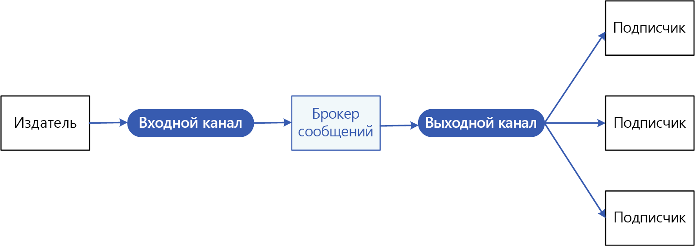
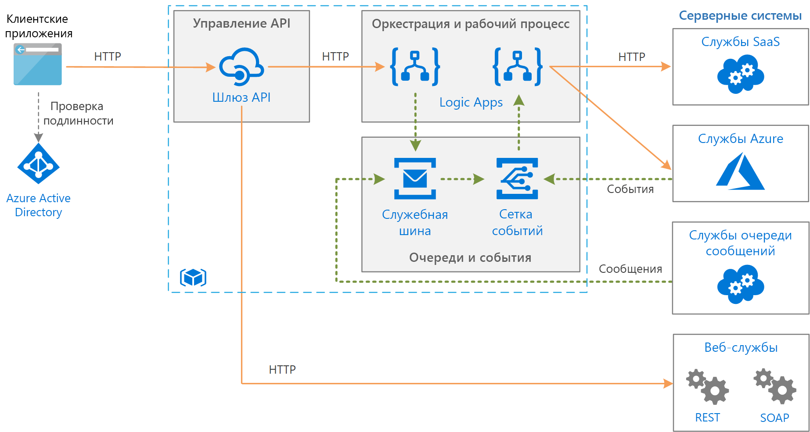

# Шаблон издателя и подписчика

Настройка в приложении возможности объявлять событие для нескольких объектов-получателей одновременно без взаимозависимости между отправителями и получателями.

**Также называется**: обмен сообщениями с публикацией и подпиской.

## Контекст и проблема

В облачных и распределенных приложениях при возникновении событий компоненты системы часто должны предоставлять сведения об этом другим компонентам.

Асинхронный обмен сообщениями — это эффективный способ отделить отправителей от объектов-получателей и избежать блокирования отправителя для ожидания ответа. Тем не менее использование выделенной очереди сообщений для каждого объекта-получателя не масштабируется эффективным образом для нескольких объектов-получателей. Кроме того, некоторые объекты-получатели могут быть заинтересованы только в подмножестве данных. Как может отправитель объявлять о событиях для всех заинтересованных объектов-получателей, не зная их удостоверений?

## Решение

Представляем систему асинхронного обмена сообщениями, которая включает в себя следующее:

- Входной канал обмена сообщениями, используемый отправителем. Отправитель упаковывает события в сообщения, используя известный формат сообщений, и отправляет их через входной канал. Отправитель в этом шаблоне также называется *издателем*.

  > [!NOTE]
  > *Сообщение* — это пакет данных. *Событие* представляет собой сообщение, которое уведомляет другие компоненты об изменении или действии, которое было выполнено.

- Один выходной канал обмена сообщениями на объект-получателя. Объекты-получатели известны как *подписчики*.

- Механизм копирования каждого сообщения из входящего канала в выходные для всех подписчиков, заинтересованных в этом сообщении. Эта операция обычно обрабатывается посредником, например брокером сообщений или шиной событий.

На следующей схеме показаны логические компоненты этого шаблона:

 
Обмен сообщениями c публикацией и подпиской имеет указанные ниже преимущества:

- Разделение подсистем, которые по-прежнему должны взаимодействовать. Подсистемами можно управлять независимо друг от друга, и сообщениями можно должным образом управлять, даже если один или несколько получателей находятся в автономном режиме.

- Увеличение масштабируемости и повышение отклика отправителя. Отправитель может быстро отправить одно сообщение во входной канал, а затем вернуться к своим основным обязанностям обработки. Инфраструктура обмена сообщениями отвечает за обеспечение доставки сообщений заинтересованным подписчикам.

- Это повышает надежность. Асинхронный обмен сообщениями помогает приложениям продолжать работать без проблем под повышенной нагрузкой и более эффективно обрабатывать временные сбои.

- Поддержка отложенной обработки или обработки по расписанию. Подписчики могут ждать нерабочего времени, чтобы получить сообщения, или же сообщения могут направляться либо обрабатываться согласно заданному расписанию.

- Обеспечение более простой интеграции между системами, использующими различные платформы, языки или протоколы связи, как и между локальными системами и приложениями, работающими в облаке.

- Обеспечение выполнения асинхронных рабочих процессов по всему предприятию.

- Улучшение возможности тестирования. Можно отслеживать каналы и проверять или регистрировать сообщения как часть общей стратегии тестирования интеграции.

- Разделение областей ответственности для ваших приложений. Каждое приложение может сосредоточиться на основных возможностях, пока инфраструктура обмена сообщениями обрабатывает все необходимое для надежного перенаправления сообщений нескольким объектам-получателям. 

## Проблемы и рекомендации

При принятии решения о реализации этого шаблона необходимо учитывать следующие моменты.

- **Существующие технологии.** Настоятельно рекомендуется использовать доступные продукты и службы для обмена сообщениями, поддерживающие модель с публикацией и подпиской, а не создавать собственные. В Azure рассмотрите возможность использования [Служебной шины](/azure/service-bus-messaging/) или [Сетки событий](/azure/event-grid/). К другим технологиях, которые могут использоваться для обмена сообщениями c публикацией и подпиской, относятся Redis, RabbitMQ и Apache Kafka.

- **Обработка подписки.** Инфраструктура обмена сообщениями должна предоставить механизмы, которые объекты-получатели могут использовать для подписки или отмены подписки на доступные каналы.

- **Безопасность.** Подключение к любому каналу сообщений должно быть ограничено политикой безопасности для предотвращения перехвата со стороны неавторизованных пользователей или приложений.

- **Подмножества сообщений.** Подписчики обычно заинтересованы только в подмножестве сообщений, распределяемых издателем. Службы обмена сообщениями часто позволяют подписчикам сузить набор получаемых сообщений следующим образом:

  - **По разделам.** Каждый раздел имеет выделенный выходной канал, и каждого объекта-получателя можно подписать на все соответствующие разделы.
  - **Путем фильтрации содержимого.** Сообщения проверяются и распределяются на основе содержимого каждого из них. Каждый подписчик может указать интересующее его содержимое.

- **Подписчики с подстановочными знаками.** Рассмотреть возможность разрешения подписчикам подписываться на несколько разделов с помощью подстановочных знаков.

- **Двусторонняя связь.** Каналы в системе с публикацией и подпиской рассматриваются как однонаправленные. Если конкретному подписчику необходимо отправить подтверждение или сообщить о состоянии издателю, рассмотрите возможность использования [шаблона "запрос — ответ"](http://www.enterpriseintegrationpatterns.com/patterns/messaging/RequestReply.html). Этот шаблон использует один канал для отправки сообщения подписчику и отдельный канал ответа для обратной связи с издателем.

- **Упорядочивание сообщений.** Порядок, в котором экземпляры объекта-получателя получают сообщения, ненадежный и не обязательно должен совпадать с порядком создания сообщений. Разработайте систему, чтобы гарантировать идемпотентную обработку сообщений. Это поможет исключить любые зависимости в порядке обработки сообщений.

- **Приоритет сообщений.** Некоторые решения могут требовать обработки сообщений в определенном порядке. [Шаблон очереди с приоритетом](priority-queue.md) предоставляет механизм, обеспечивающий доставку определенных сообщений раньше других.

- **Сообщения о сбое.** Неправильно сформированные сообщения или задачи, которым требуется доступ к недоступным ресурсам, могут вызвать сбой экземпляра службы. Система должна предотвращать возвращение в очередь таких сообщений. Поэтому записывайте и храните сведения об этих сообщениях в другом месте, чтобы их можно было анализировать при необходимости.

- **Повторяющиеся сообщения**. То же сообщение может быть отправлено более одного раза. Например, отправитель может завершить работу ошибкой после публикации сообщения. Затем новый экземпляр отправителя может запуститься и повторить сообщение. Инфраструктура обмена сообщениями должна реализовать обнаружение и удаление (также известное как удаление повторов) дубликатов сообщений на основе идентификаторов сообщений для обеспечения одноразовой доставки сообщений.

- **Срок действия сообщений.** Сообщение может иметь ограниченное время существования. Если оно не обрабатывается в течение этого периода, оно может быть недействительными и его следует отменить. Отправитель может указать срок действия как часть данных в сообщении. Получатель может проверить эту информацию, прежде чем решить, следует ли выполнять бизнес-логику, связанную с сообщением.

- **Планирование сообщений.** Сообщение может быть временно запрещено и не будет обрабатываться до определенных даты и времени. Сообщение не должно быть доступным получателю до этого времени.

## Когда следует использовать этот шаблон

Используйте этот шаблон в следующих случаях:

- Приложению требуется распространить информацию значительному числу объектов-получателей.

- Приложению требуется взаимодействовать с одним или несколькими независимо разработанными приложениями или службами, которые могут использовать различные платформы, языки программирования и протоколы связи.

- Приложение может отправить объектам-получателям сведения, не требуя от них ответов в режиме реального времени.

- Интегрируемые системы предназначены для поддержки модели итоговой согласованности для своих данных.

- Приложению требуется передавать информацию нескольким объектам-получателям, которые могут иметь другие требования к доступности или расписания бесперебойной работы, чем отправитель.

Этот шаблон может оказаться неэффективным в следующих случаях:

- Приложение имеет только несколько объектов-получателей, которым требуются сведения, значительно отличающиеся от приложения-производителя.

- Приложение требует взаимодействия с объектами-получателями почти в реальном времени.

## Пример

На следующей схеме показана архитектура корпоративной интеграции, которая использует Служебную шину для координации рабочих процессов, а Сетка событий уведомляет подсистемы о возникающих событиях. Дополнительные сведения см. в статье [Корпоративная интеграция в Azure с использованием очередей сообщений и событий](../reference-architectures/enterprise-integration/queues-events.md).

## Связанные шаблоны и рекомендации

При реализации этого шаблона следует принять во внимание следующие шаблоны и рекомендации.

- [Выбор между службами обмена сообщениями Azure](/azure/event-grid/compare-messaging-services).

- В [стиле архитектуры, управляемом событиями](../guide/architecture-styles/event-driven.md), используется обмен сообщениями с публикацией и подпиской.

- [Руководство по асинхронному обмену сообщениями](https://msdn.microsoft.com/library/dn589781.aspx). Очереди сообщений — это механизмы для асинхронного обмена данными. Если службе потребителя необходимо отправить ответ в приложение, может потребоваться реализовать некоторые варианты обмена сообщениями через ответы. Руководство по асинхронному обмену сообщениями предоставляет сведения о реализации обмена сообщениями через запрос или ответ с помощью очередей сообщения.

- [Шаблон наблюдателя](https://en.wikipedia.org/wiki/Observer_pattern). Шаблон с публикацией и подпиской основан на шаблоне наблюдателя с отделением субъектов от наблюдателей через асинхронный обмен сообщениями.

- [Шаблон брокера сообщений](https://en.wikipedia.org/wiki/Message_broker). Многие подсистемы обмена сообщениями, которые поддерживают модель с публикацией и подпиской, реализуются через брокер сообщений.
