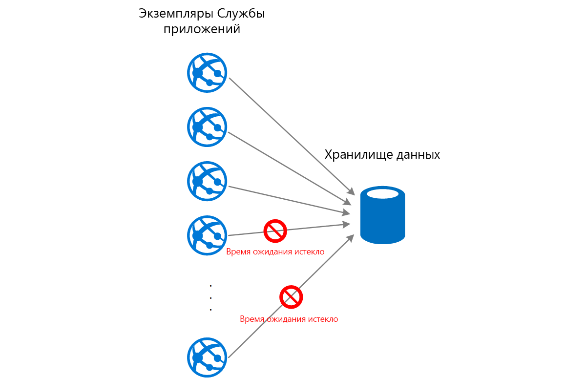
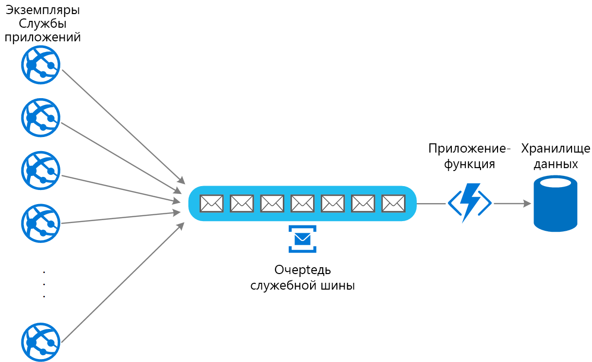

# Шаблон балансировки нагрузки на основе очередейQueue-Based Load Leveling pattern

Для сглаживания кратковременных всплесков нагрузки используйте очередь, которая служит буфером между задачей и вызываемой ею службой. В противном случае такие всплески могут привести к сбою службы или превышению времени ожидания задания. Это позволяет свести к минимуму всплески нагрузки спроса, влияющие на доступность и скорость реагирования, как для задачи, так и для службы.Use a queue that acts as a buffer between a task and a service it invokes in order to smooth intermittent heavy loads that can cause the service to fail or the task to time out. This can help to minimize the impact of peaks in demand on availability and responsiveness for both the task and the service.

## Контекст и проблемаContext and problem

Многие решения в облаке используют выполняемые задачи, которые вызывают службы.Many solutions in the cloud involve running tasks that invoke services. В этой среде, если служба подвергается кратковременным всплескам нагрузки, то могут возникать проблемы с производительностью или надежностью.In this environment, if a service is subjected to intermittent heavy loads, it can cause performance or reliability issues.

Служба может быть частью того же решения, что и задачи, которые ее используют. Или это может быть сторонняя служба, предоставляющая доступ к часто используемым ресурсам, таким как кэш или служба хранилища.A service could be part of the same solution as the tasks that use it, or it could be a third-party service providing access to frequently used resources such as a cache or a storage service. Если одна служба используется рядом задач, выполняемых одновременно, то может быть сложно предсказать число запросов к службе в любое время.If the same service is used by a number of tasks running concurrently, it can be difficult to predict the volume of requests to the service at any time.

В службе могут возникать всплески нагрузки спроса, которые приводят к ее перегрузке и неспособности своевременно отвечать на запросы.A service might experience peaks in demand that cause it to overload and be unable to respond to requests in a timely manner. Наполнение службы большим числом одновременных запросов также может приводить к сбоям в работе службы, если она не может справиться с конфликтом, вызываемым этими запросами.Flooding a service with a large number of concurrent requests can also result in the service failing if it's unable to handle the contention these requests cause.

## РешениеSolution

Выполните рефакторинг решения и создайте очередь между задачей и службой.Refactor the solution and introduce a queue between the task and the service. Задача и служба выполняются асинхронно.The task and the service run asynchronously. Задача отправляет сообщение, содержащее данные, необходимые службе для очереди.The task posts a message containing the data required by the service to a queue. Очередь работает как буфер, сохраняя сообщение, пока оно не будет извлечено службой.The queue acts as a buffer, storing the message until it's retrieved by the service. Служба извлекает сообщения из очереди и обрабатывает их.The service retrieves the messages from the queue and processes them. Запросы от ряда задач, которые могут создаваться с крайне изменчивой скоростью, можно передавать в службу с помощью той же очереди сообщений.Requests from a number of tasks, which can be generated at a highly variable rate, can be passed to the service through the same message queue. На этом рисунке показано использование очереди для балансировки нагрузки в службе.This figure shows using a queue to level the load on a service.

Очередь отделяет задачи из службы, а служба может обрабатывать сообщения в удобном для нее темпе, независимо от числа запросов от параллельных задач.The queue decouples the tasks from the service, and the service can handle the messages at its own pace regardless of the volume of requests from concurrent tasks. Кроме того, отсутствует задержка, связанная с задачей, если служба недоступна в тот момент, когда она отправляет сообщение в очередь.Additionally, there's no delay to a task if the service isn't available at the time it posts a message to the queue.

Такой подход обеспечивает следующие преимущества:This pattern provides the following benefits:

- Он помогает добиться максимальной доступности, так как задержки, возникающие в службах, не будут оказывать немедленное и прямое влияние на приложение, которое может по-прежнему отправлять сообщения в очередь, даже если служба в данный момент недоступна или не обрабатывает сообщения.It can help to maximize availability because delays arising in services won't have an immediate and direct impact on the application, which can continue to post messages to the queue even when the service isn't available or isn't currently processing messages.
- Он позволяет добиться максимальной масштабируемости, так как для удовлетворения спроса можно изменять как количество очередей, так и количество служб.It can help to maximize scalability because both the number of queues and the number of services can be varied to meet demand.
- Он помогает контролировать затраты, так как число развернутых экземпляров службы должно быть достаточным для обработки средней нагрузки, а не пиковой нагрузки.It can help to control costs because the number of service instances deployed only have to be adequate to meet average load rather than the peak load.

    >  Некоторые службы применяют регулирование количества запросов, когда спрос достигает порогового значения, за которым может произойти сбой системы.Some services implement throttling when demand reaches a threshold beyond which the system could fail. Регулирование количества запросов может сократить число доступных функциональных возможностей.Throttling can reduce the functionality available. С помощью этих служб можно реализовать балансировку нагрузки, чтобы пороговое значение не достигалось.You can implement load leveling with these services to ensure that this threshold isn't reached.

## Проблемы и рекомендацииIssues and considerations

При принятии решения о реализации этого шаблона необходимо учитывать следующие моменты.Consider the following points when deciding how to implement this pattern:

- Во избежание перегрузки целевого ресурса необходимо реализовать логику приложения, контролирующую скорость, с которой службы обрабатывают сообщения.It's necessary to implement application logic that controls the rate at which services handle messages to avoid overwhelming the target resource. Избегайте передачи пиковых нагрузок спроса в следующую стадию системы.Avoid passing spikes in demand to the next stage of the system. Протестируйте систему под нагрузкой, чтобы убедиться, что она обеспечивает необходимую балансировку, а также настройте количество очередей и экземпляров службы, которые обрабатывают сообщения, для достижения этой цели.Test the system under load to ensure that it provides the required leveling, and adjust the number of queues and the number of service instances that handle messages to achieve this.
- Очереди сообщений представляют собой механизм односторонней связи.Message queues are a one-way communication mechanism. Если задача ожидает ответа от службы, то может потребоваться реализовать механизм, который служба может использовать для отправки ответа.If a task expects a reply from a service, it might be necessary to implement a mechanism that the service can use to send a response. Дополнительные сведения см. в [руководстве по асинхронному обмену сообщениями](https://msdn.microsoft.com/library/dn589781.aspx).For more information, see the [Asynchronous Messaging Primer](https://msdn.microsoft.com/library/dn589781.aspx).
- Будьте внимательны, применяя автоматическое масштабирование к службам, которые ожидают передачи запросов в очереди.Be careful if you apply autoscaling to services that are listening for requests on the queue. Это может вызвать дополнительные конфликты для любых ресурсов, совместно используемых этими службами, и снизить эффективность использования очереди при балансировке нагрузки.This can result in increased contention for any resources that these services share and diminish the effectiveness of using the queue to level the load.

## Когда следует использовать этот шаблонWhen to use this pattern

Этот шаблон полезен для любого приложения, использующего службы, которые подвержены перегрузкам.This pattern is useful to any application that uses services that are subject to overloading.

Этот шаблон не будет полезен, если приложение ожидает ответа от службы с минимальной задержкой.This pattern isn't useful if the application expects a response from the service with minimal latency.

## ПримерExample

Веб-приложение записывает данные во внешнее хранилище данных.A web app writes data to an external data store. Если большое число экземпляров веб-приложения выполняются одновременно, хранилище данных может оказаться неспособным отвечать на запросы достаточно быстро. Это приведет к истечению времени ожидания у запросов, регулированию запросов или сбоям при их обработке.If a large number of instances of the web app run concurrently, the data store might be unable to respond to requests quickly enough, causing requests to time out, be throttled, or otherwise fail. На схеме ниже показана служба, перегруженная большим числом параллельных запросов от экземпляров приложения.The following diagram shows a data store being overwhelmed by a large number of concurrent requests from instances of an application.

Чтобы устранить эту проблему, можно использовать очередь для балансировки нагрузки между экземплярами приложения и хранилищем данных.To resolve this, you can use a queue to level the load between the application instances and the data store. Приложение Функций Azure считывает сообщения из очереди и выполняет запросы чтения и записи к хранилищу данных.An Azure Functions app reads the messages from the queue and performs the read/write requests to the data store. Логика приложения в приложении-функции может контролировать скорость, с которой это приложение передает запросы в хранилище данных, чтобы предотвратить перегрузку хранилища.The application logic in the function app can control the rate at which it passes requests to the data store, to prevent the store from being overwhelmed. (В противном случае приложение-функция просто перенесет эту проблему в серверную часть.)(Otherwise the function app will just re-introduce the same problem at the back end.)

## Связанные шаблоны и рекомендацииRelated patterns and guidance

При реализации этого шаблона следует принять во внимание следующие шаблоны и рекомендации.The following patterns and guidance might also be relevant when implementing this pattern:

- [Руководство по асинхронному обмену сообщениями](https://msdn.microsoft.com/library/dn589781.aspx).[Asynchronous Messaging Primer](https://msdn.microsoft.com/library/dn589781.aspx). Очереди сообщений по своей сути асинхронны.Message queues are inherently asynchronous. Может потребоваться изменить логику приложения в задаче, если ее адаптировали для использования очереди сообщений вместо непосредственного взаимодействия со службой.It might be necessary to redesign the application logic in a task if it's adapted from communicating directly with a service to using a message queue. Аналогичным образом может потребоваться выполнить рефакторинг службы, чтобы принимались запросы из очереди сообщений.Similarly, it might be necessary to refactor a service to accept requests from a message queue. Также можно реализовать прокси-службу, как описано в примере.Alternatively, it might be possible to implement a proxy service, as described in the example.

- [Шаблон конкурирующих потребителей](./competing-consumers.md).[Competing Consumers pattern](./competing-consumers.md). Можно запустить несколько экземпляров службы, каждый из которых будет действовать как потребитель сообщений из очереди балансировки нагрузки.It might be possible to run multiple instances of a service, each acting as a message consumer from the load-leveling queue. Этот подход можно использовать для настройки скорости, с которой сообщения принимаются и передаются в службу.You can use this approach to adjust the rate at which messages are received and passed to a service.

- [Шаблон регулирования](./throttling.md).[Throttling pattern](./throttling.md). Простой способ реализовать регулирование количества запросов с помощью службы — это использовать балансировку нагрузки на основе очередей и перенаправлять все запросы к службе через очередь сообщений.A simple way to implement throttling with a service is to use queue-based load leveling and route all requests to a service through a message queue. Служба может обрабатывать запросы со скоростью, которая гарантирует, что ресурсы, необходимые для службы, не будут исчерпаны. При этом также сокращается число конфликтов, которые могут возникнуть.The service can process requests at a rate that ensures that resources required by the service aren't exhausted, and to reduce the amount of contention that could occur.

- [Сравнение трех служб обмена сообщениями Azure: Сетка событий, Центры событий и Служебная шина](/azure/event-grid/compare-messaging-services).[Choose between Azure messaging services](/azure/event-grid/compare-messaging-services). Сведения о выборе механизма обмена сообщениями и организации очереди в приложениях Azure.Information about choosing a messaging and queuing mechanism in Azure applications.

- [Повышение масштабируемости в веб-приложении Azure](../reference-architectures/app-service-web-app/scalable-web-app.md).[Improve scalability in an Azure web application](../reference-architectures/app-service-web-app/scalable-web-app.md). Эта эталонная архитектура обеспечивает выравнивание нагрузки с использованием очередей, являющихся частью архитектуры.This reference architecture includes queue-based load leveling as part of the architecture.
