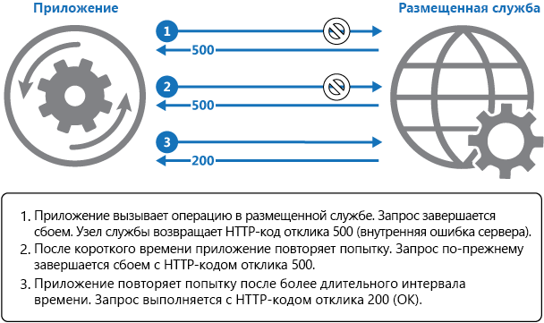

# <a name="retry-pattern"></a>Шаблон повторов

[!INCLUDE [header](../_includes/header.md)]

Позвольте приложению обрабатывать временные сбои при попытке подключения к службе или сетевому ресурсу с помощью повторных попыток выполнения операции, завершившейся сбоем, открытым образом. Таким образом приложение станет работать стабильнее.

## <a name="context-and-problem"></a>Контекст и проблема

Приложение, которое взаимодействует с элементами, запущенными в облаке, должно быть чувствительно к временным сбоям, которые могут случаться в этой среде. Сбои включают в себя кратковременную потерю сетевого подключения для компонентов и служб, временную недоступность службы или наличие времени ожидания, вызванного занятостью службы.

Эти ошибки часто устраняются без вмешательства со стороны пользователя, поэтому, если повторить действие через некоторый промежуток времени, оно с большой вероятностью будет выполнено успешно. Например, с помощью службы базы данных, которая обрабатывает большое количество одновременных запросов, можно реализовать стратегию регулирования, временно отклоняющую все последующие запросы до того момента, пока рабочая нагрузка не станет менее интенсивной. Попытка подключения приложения к базе данных может завершиться сбоем, но повторная попытка подключения через некоторое время с большой вероятностью будет выполнена успешно.

## <a name="solution"></a>Решение

В облаке временные сбои встречаются часто, поэтому приложение должно быть разработано соответствующим образом, чтобы легко и прозрачно обрабатывать эти сбои. Это сводит к минимуму воздействие сбоев на бизнес-задачи, которые выполняет приложение.

Если приложение обнаруживает сбой при попытке отправить запрос к удаленной службе, оно может обработать этот сбой с помощью стратегий ниже:

- **Отмена**. Если ошибка указывает, что сбой является не временным или при повторной попытке его обработка не будет успешной, приложение должно отменить операцию и сформировать отчет об исключении. Например, сбой аутентификации, вызванный предоставлением неверных учетных данных, не завершится успешно, независимо от количества повторных попыток.

- **Повтор**. Если определенная ошибка в отчете является нестандартной или редкой, вероятнее всего, она вызвана непредвиденными обстоятельствами, например повреждением сетевого пакета во время его передачи. В этом случае приложение может попытаться сразу же снова отправить запрос, завершившийся сбоем, так как маловероятно, что этот сбой повторится, и запрос, скорее всего, завершится успешно.

- **Повтор через некоторое время.** Если сбой вызван одной из множества распространенных проблем с подключением или занятостью, сети или службе может потребоваться короткий промежуток на устранение ошибок подключения или удаления списка невыполненных работ. По истечении необходимого времени приложение повторно выполнит запрос.

Для более распространенных временных сбоев период между повторными попытками следует выбирать с учетом максимально равномерного распределения запросов из нескольких экземпляров приложения. Это снижает вероятность перегрузки занятой службы. Если несколько экземпляров приложения постоянно перегружают службу запросами повторных попыток, этой службе потребуется больше времени на восстановление.

Если запрос по-прежнему завершается сбоем, приложение может ожидать некоторое время, а затем повторит попытку. При необходимости этот процесс может повторяться с увеличением задержки между повторными попытками, пока не будет выполнено максимальное число запросов. Задержку можно увеличить последовательно или экспоненциально, в зависимости от типа сбоя и вероятности его устранения в течение этого времени ожидания.

На схеме ниже показан вызов операции в размещенной службе по этому шаблону. Если после определенного числа попыток запрос завершается сбоем, приложение должно обработать ошибку как исключение соответствующим образом.



Приложение должно перенести все попытки доступа к удаленной службе в код, который реализует политику повторов, соответствующую одной из стратегий выше. Запросы, отправленные в разные службы, могут относиться к различным политикам. Некоторые поставщики предоставляют библиотеки, которые реализуют политики повторных попыток, где приложение может указывать максимальное число повторных попыток, время между этими попытками и другие параметры.

Приложение должно записывать в журнал подробные сведения об ошибках и невыполненных операциях. Эти сведения полезны для операторов. Если служба часто недоступна или занята, зачастую это происходит из-за того, что служба исчерпала свои ресурсы. Такие ошибки будут возникать реже, если развернуть службу. Например, если служба базы данных постоянно перегружена, полезно разделить базу данных и распределить нагрузку между несколькими серверами.

> [Microsoft Entity Framework](https://docs.microsoft.com/ef/) предоставляет инструменты для повторного выполнения операций в базе данных. Большинство служб Azure и клиентских пакетов SDK также содержат механизм повтора. Дополнительные сведения см. в статье, посвященной [конкретным рекомендациям по использованию механизма повторов](https://docs.microsoft.com/azure/architecture/best-practices/retry-service-specific).

## <a name="issues-and-considerations"></a>Проблемы и рекомендации

При выборе схемы реализации этого шаблона следует учитывать следующие моменты.

Политика повтора должна быть настроена в соответствии с бизнес-требованиями приложения и типами сбоя. Некоторые некритические операции лучше настроить так, чтобы они завершались при первой ошибке, так как выполнение нескольких повторных попыток снижает пропускную способность приложения. Например, в интерактивном веб-приложении, которое получает доступ к удаленной службе, лучше завершить сбоем несколько повторных попыток с небольшой задержкой между ними и отобразить соответствующее сообщение для пользователя (например, "Повторите попытку позже"). Для приложения пакета более подходящим вариантом является увеличение количества повторных попыток с экспоненциальным увеличением задержки между ними.

Интенсивная политика повтора с минимальной задержкой между попытками и большое число повторных попыток может еще больше снизить производительность максимально занятой службы или службы с нагрузкой, близкой к максимальной. Эта политика повтора также может повлиять на скорость реагирования приложения, если оно непрерывно пытается выполнить операцию, завершившуюся сбоем.

Если после достаточного количества повторных попыток запрос по-прежнему завершается сбоем, приложению лучше предотвратить отправку запросов к тому же ресурсу и просто сразу сформировать отчет о сбое. По истечении периода ожидания приложение может отправить еще несколько запросов, чтобы проверить, будут ли они успешны. Дополнительные сведения об этой стратегии см. в статье, посвященной [шаблону автоматического выключения](circuit-breaker.md).

Рассмотрим вопрос идемпотентности операции. Если она является идемпотентной, выполнение повторной попытки безопасно. В противном случае повторные попытки могут вызвать дополнительное количество выполнений операции с непредвиденными побочными эффектами. Например, служба может принять запрос, успешно обработать его, но отправка ответа завершается сбоем. На этом этапе логика повторных попыток может повторно отправить запрос, предполагая, что не был получен первый.

Запрос к службе может завершиться ошибкой в силу ряда причин, вызывающих различные исключения в зависимости от характера сбоя. Некоторые исключения указывают на сбой, который можно быстро устранить, в то время как другие указывают, что на устранение сбоя потребуется больше времени. Для политики повтора полезно регулировать время между попытками повтора в зависимости от типа исключения.

Рассмотрим, как повторное выполнение операции, являющейся частью транзакции, повлияет на общую согласованность транзакций. Настройте соответствующим образом политику повтора для операций транзакций, чтобы увеличить вероятность успеха и устранить необходимость обхода всех шагов выполнения транзакции.

Полностью протестируйте весь код повторных попыток для ряда условий сбоя. Код не должен значительно влиять на производительность или надежность приложения, вызывать чрезмерную нагрузку на службы или ресурсы или создавать состояния гонки или узкие места.

Реализуйте логику повторных попыток только в тех расположениях, в которых полностью предусмотрен контекст операций, которые могут завершиться сбоем. Например, если задача, которая содержит политику повтора, вызывает другую задачу, которая также содержит эту политику, этот дополнительный уровень повторных попыток может вызвать дополнительную задержку обработки. Мы рекомендуем настроить задачу более низкого уровня для завершения работы при первой ошибке и формирования отчета о причине сбоя для задачи, которая его вызвала. Эта задача более высокого уровня затем может обработать сбой на основе собственной политики.

Важно записывать в журнал все сбои подключения, которые вызывают повторные попытки, чтобы определить основные проблемы приложения, служб и ресурсов.

Проанализируйте сбои, которые вероятнее всего могут возникнуть в службе или ресурсе, чтобы понять, являются ли они продолжительными или временными, что значит, что в таком случае сбой лучше обработать как исключение. Исключение можно вывести в отчет или журнал, затем приложение может повторить попытку, вызвав другую службу (если она доступна), или продолжать работать в режиме ограниченной функциональности. Дополнительные сведения о том, как обнаружить и обработать длительные сбои, см. в статье, посвященной [шаблону автоматического выключения](circuit-breaker.md).

## <a name="when-to-use-this-pattern"></a>Когда следует использовать этот шаблон

Используйте этот шаблон в случае временных сбоев приложения, так как он взаимодействует с удаленной службой или обращается к удаленному ресурсу. Предполагается, что эти сбои будут непродолжительными, и следующая попытка повтора запроса, завершившегося ранее сбоем, будет успешна.

Этот шаблон может оказаться неэффективным в следующих случаях:

- Если предполагается длительный сбой, так как он может повлиять на скорость реагирования приложения. Приложение может пытаться повторить запрос, который, вероятнее всего, завершится сбоем, напрасно используя время и ресурсы.
- Для обработки сбоев, вызванных не временными ошибками, например внутренних исключений, вызванных ошибками в бизнес-логике приложения.
- Как альтернатива устранения проблем масштабируемости в системе. Если в приложении часто возникают сбои, связанные с занятостью, вероятнее всего, это говорит о том, что необходимо масштабировать службу или ресурс, к которому направлен запрос.

## <a name="example"></a>Пример

В этом примере на C# показана реализация шаблона повторов. Метод `OperationWithBasicRetryAsync` ниже асинхронно вызывает внешнюю службу с помощью метода `TransientOperationAsync`. Выходные данные метода `TransientOperationAsync` будут относиться к конкретной службе и исключены из примера кода.

```csharp
private int retryCount = 3;
private readonly TimeSpan delay = TimeSpan.FromSeconds(5);

public async Task OperationWithBasicRetryAsync()
{
  int currentRetry = 0;

  for (;;)
  {
    try
    {
      // Call external service.
      await TransientOperationAsync();

      // Return or break.
      break;
    }
    catch (Exception ex)
    {
      Trace.TraceError("Operation Exception");

      currentRetry++;

      // Check if the exception thrown was a transient exception
      // based on the logic in the error detection strategy.
      // Determine whether to retry the operation, as well as how
      // long to wait, based on the retry strategy.
      if (currentRetry > this.retryCount || !IsTransient(ex))
      {
        // If this isn't a transient error or we shouldn't retry, 
        // rethrow the exception.
        throw;
      }
    }

    // Wait to retry the operation.
    // Consider calculating an exponential delay here and
    // using a strategy best suited for the operation and fault.
    await Task.Delay(delay);
  }
}

// Async method that wraps a call to a remote service (details not shown).
private async Task TransientOperationAsync()
{
  ...
}
```

Инструкция, вызывающая этот метод, содержится в блоке try-catch, выполняющемся с помощью цикла for. Цикл for создается при успешном завершении вызова метода `TransientOperationAsync` без исключения. Если вызов метода `TransientOperationAsync` завершается сбоем, блок catch анализирует причину сбоя. Если предполагается временная ошибка, после небольшой задержки операция выполняется повторно в коде.

Этот цикл также отслеживает количество повторов выполнения операции. Если три попытки выполнения завершаются сбоем, предполагается длительное исключение. Если исключение не является временным или является длительным, обработчик блока catch выдает исключение. Это исключение выходит из цикла for, и его перехватывает код, вызывающий метод `OperationWithBasicRetryAsync`.

Метод `IsTransient` ниже проверяет определенный набор исключений, соответствующих среде, в которой выполняется код. Определение временного исключения будет различаться в зависимости от соответствующих ресурсов и среды, в которой выполняется операция.

```csharp
private bool IsTransient(Exception ex)
{
  // Determine if the exception is transient.
  // In some cases this is as simple as checking the exception type, in other
  // cases it might be necessary to inspect other properties of the exception.
  if (ex is OperationTransientException)
    return true;

  var webException = ex as WebException;
  if (webException != null)
  {
    // If the web exception contains one of the following status values
    // it might be transient.
    return new[] {WebExceptionStatus.ConnectionClosed,
                  WebExceptionStatus.Timeout,
                  WebExceptionStatus.RequestCanceled }.
            Contains(webException.Status);
  }

  // Additional exception checking logic goes here.
  return false;
}
```

## <a name="related-patterns-and-guidance"></a>Связанные шаблоны и рекомендации

- [Шаблон прерывателя](circuit-breaker.md). Шаблон повторов эффективен для обработки временных сбоев. Если предполагается длительный сбой, лучше реализовать шаблон автоматического выключения. Шаблон повторов можно также использовать в сочетании с автоматическим выключением для обеспечения комплексного подхода к обработке сбоев.
- [Retry guidance for specific services](https://docs.microsoft.com/azure/architecture/best-practices/retry-service-specific) (Руководство о механизме повторов для отдельных служб)
- [Connection Resiliency](https://docs.microsoft.com/ef/core/miscellaneous/connection-resiliency) (Устойчивость подключения)
