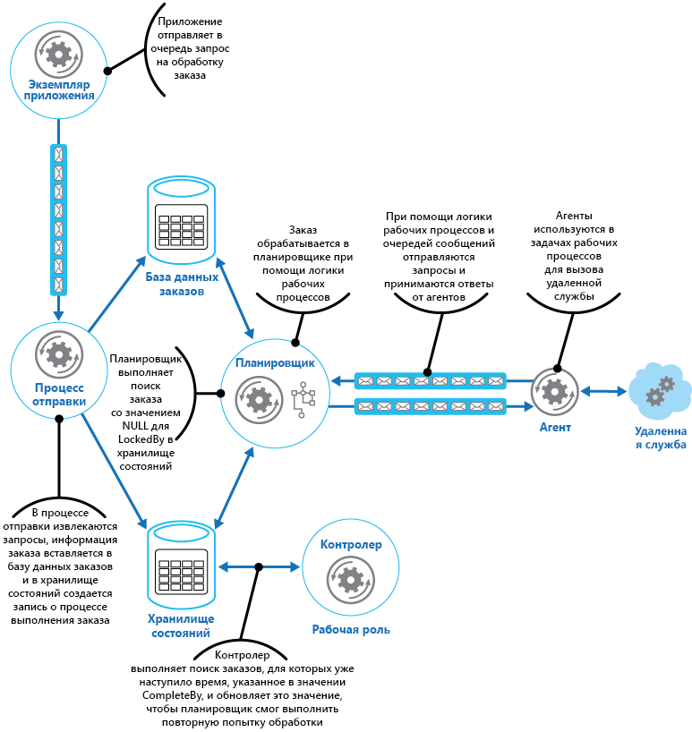

# Шаблон супервизора агента планировщикаScheduler Agent Supervisor pattern

[!INCLUDE [header](../_includes/header.md)]

Координируйте набор распределенных действий как единую операцию.Coordinate a set of distributed actions as a single operation. Если любое из действий завершится сбоем, постарайтесь обработать этот сбой, не затрагивая остальные действия. Если это невозможно, отмените всю выполненную работу. Вся операция в целом должна завершаться успешно или не выполняться совсем.If any of the actions fail, try to handle the failures transparently, or else undo the work that was performed, so the entire operation succeeds or fails as a whole. Это повысит устойчивость распределенной системы, позволяя восстановить и повторить действия, завершившиеся сбоем из-за временных исключений, длительных проблем или ошибок в процессах.This can add resiliency to a distributed system, by enabling it to recover and retry actions that fail due to transient exceptions, long-lasting faults, and process failures.

## Контекст и проблемаContext and problem

Приложение выполняет задачи, содержащие ряд шагов. Некоторые из них могут вызывать удаленные службы или обращаться к удаленным ресурсам.An application performs tasks that include a number of steps, some of which might invoke remote services or access remote resources. Отдельные шаги могут быть независимы друг от друга, но они подчиняются логике приложения, которая реализует задачу.The individual steps might be independent of each other, but they are orchestrated by the application logic that implements the task.

Везде, где это возможно, приложение должно проверить, полностью ли выполнена задача, и устранить любые возможные сбои при доступе к удаленным службам или ресурсам.Whenever possible, the application should ensure that the task runs to completion and resolve any failures that might occur when accessing remote services or resources. Сбои могут возникать по многим причинам.Failures can occur for many reasons. Это может быть нарушение работы сети, разрыв подключения, нестабильность или отсутствие ответа от удаленной службы либо временная недоступность удаленного ресурса (например, из-за превышения установленных ограничений).For example, the network might be down, communications could be interrupted, a remote service might be unresponsive or in an unstable state, or a remote resource might be temporarily inaccessible, perhaps due to resource constraints. В большинстве случаев это временные ошибки, для устранения которых можно применить [шаблон повторения][retry-pattern].In many cases the failures will be transient and can be handled by using the [Retry pattern][retry-pattern].

Если в приложении возникает постоянный сбой, который непросто устранить, оно должно иметь возможность восстановить систему до стабильного состояния и обеспечить целостность всей операции.If the application detects a more permanent fault it can't easily recover from, it must be able to restore the system to a consistent state and ensure integrity of the entire operation.

## РешениеSolution

Шаблон "планировщик, агент, контролер" определяет следующие субъекты.The Scheduler Agent Supervisor pattern defines the following actors. Эти субъекты координируют действия, выполняемые в составе общей задачи.These actors orchestrate the steps to be performed as part of the overall task.

- **Планировщик** упорядочивает действия, входящие в выполняемую задачу, и координирует их работу.The **Scheduler** arranges for the steps that make up the task to be executed and orchestrates their operation. Эти действия могут объединяться в конвейер или рабочий процесс.These steps can be combined into a pipeline or workflow. Планировщик отвечает за то, чтобы все действия в таком рабочем процессе выполнялись в правильном порядке.The Scheduler is responsible for ensuring that the steps in this workflow are performed in the right order. По мере выполнения отдельных шагов планировщик регистрирует состояние рабочего процесса, например: "шаг еще не начат", "шаг выполняется", "шаг завершен" и т. п.As each step is performed, the Scheduler records the state of the workflow, such as "step not yet started," "step running," or "step completed." Сведения о состоянии также содержат максимальное значение времени, выделенного для выполнения шага.The state information should also include an upper limit of the time allowed for the step to finish, called the complete-by time. Если на определенном шаге требуется доступ к удаленной службе или ресурсу, планировщик вызывает соответствующий агент и передает ему сведения о работе, которую следует выполнить.If a step requires access to a remote service or resource, the Scheduler invokes the appropriate Agent, passing it the details of the work to be performed. Планировщик обычно взаимодействует с агентом посредством асинхронного обмена сообщениями (запрос — ответ).The Scheduler typically communicates with an Agent using asynchronous request/response messaging. Для этого можно применить механизм очередей или любые другие технологии распределенного обмена сообщениями.This can be implemented using queues, although other distributed messaging technologies could be used instead.

    > Планировщик выполняет примерно такие же функции, как и диспетчер процессов в [шаблоне диспетчера процессов](http://www.enterpriseintegrationpatterns.com/patterns/messaging/ProcessManager.html).The Scheduler performs a similar function to the Process Manager in the [Process Manager pattern](http://www.enterpriseintegrationpatterns.com/patterns/messaging/ProcessManager.html). Фактический рабочий процесс обычно определяется и реализуется обработчиком рабочего процесса, которым управляет планировщик.The actual workflow is typically defined and implemented by a workflow engine that's controlled by the Scheduler. Такой подход позволяет отделить от планировщика бизнес-логику рабочего процесса.This approach decouples the business logic in the workflow from the Scheduler.

- **Агент** содержит логику, в которой заключен вызов удаленной службы или доступ к удаленному ресурсу, на которые ссылается шаг задачи.The **Agent** contains logic that encapsulates a call to a remote service, or access to a remote resource referenced by a step in a task. Каждый агент обычно служит оболочкой для вызова одной службы или ресурса. В нем же реализуется логика повторов и обработки ошибок (с учетом ограничений по времени ожидания, которые описаны ниже).Each Agent typically wraps calls to a single service or resource, implementing the appropriate error handling and retry logic (subject to a timeout constraint, described later). Если в рабочем процессе, который выполняется планировщиком, некоторые службы и ресурсы используются несколько раз на разных шагах, эти шаги могут ссылаться на разные агенты (это зависит от реализации шаблона).If the steps in the workflow being run by the Scheduler use several services and resources across different steps, each step might reference a different Agent (this is an implementation detail of the pattern).

- **Контролер** отслеживает состояние шагов задачи, которую выполняет планировщик.The **Supervisor** monitors the status of the steps in the task being performed by the Scheduler. Он периодически запускается (с разной частотой для разных систем) и проверяет состояние шагов, с которыми работает планировщик.It runs periodically (the frequency will be system specific), and examines the status of steps maintained by the Scheduler. Если он обнаружит, что на одном из шагов истекло время ожидания или произошел сбой, он передает соответствующему агенту указание повторить этот шаг или выполнить действия по исправлению (в том числе изменить состояние шага).If it detects any that have timed out or failed, it arranges for the appropriate Agent to recover the step or execute the appropriate remedial action (this might involve modifying the status of a step). Обратите внимание, что сами действия по восстановлению или исправлению выполняют планировщик и агенты.Note that the recovery or remedial actions are implemented by the Scheduler and Agents. Контролер должен просто передать запрос на выполнение этих действий.The Supervisor should simply request that these actions be performed.

Планировщик, агент и контролер являются логическими компонентами. Конкретная физическая реализация зависит от используемой технологии.The Scheduler, Agent, and Supervisor are logical components and their physical implementation depends on the technology being used. Например, несколько логических агентов могут быть реализованы в составе одной веб-службы.For example, several logical agents might be implemented as part of a single web service.

Планировщик сохраняет сведения о ходе выполнения задачи и состоянии каждого шага в устойчивом хранилище данных, которое называется хранилищем состояний.The Scheduler maintains information about the progress of the task and the state of each step in a durable data store, called the state store. Контролер может использовать эту информацию для обнаружения сбоев на определенных шагах.The Supervisor can use this information to help determine whether a step has failed. На рисунке показана связь между планировщиком, агентами, контролером и хранилищем состояний.The figure illustrates the relationship between the Scheduler, the Agents, the Supervisor, and the state store.

> На этой диаграмме представлена упрощенная версия шаблона.This diagram shows a simplified version of the pattern. В фактической реализации могут одновременно существовать и работать несколько экземпляров планировщика, каждый со своим подмножеством задач.In a real implementation, there might be many instances of the Scheduler running concurrently, each a subset of tasks. Аналогичным образом в системе могут одновременно работать несколько экземпляров каждого агента или даже несколько контролеров.Similarly, the system could run multiple instances of each Agent, or even multiple Supervisors. Но в этом случае контролеры должны тщательно координировать свою работу друг с другом, чтобы не пытаться одновременно восстанавливать одни и те же шаги или задачи.In this case, Supervisors must coordinate their work with each other carefully to ensure that they don’t compete to recover the same failed steps and tasks. Эту проблему можно решить, например, с помощью [шаблона выбора лидера](leader-election.md).The [Leader Election pattern](leader-election.md) provides one possible solution to this problem.

Когда приложение готово к выполнению задачи, оно отправляет планировщику запрос.When the application is ready to run a task, it submits a request to the Scheduler. Планировщик записывает в хранилище состояний исходную информацию о состоянии задачи и ее шагов (например, состояние "не запущен" для каждого шага), а затем начинает выполнять операции, определенные в рабочем процессе.The Scheduler records initial state information about the task and its steps (for example, step not yet started) in the state store and then starts performing the operations defined by the workflow. При запуске каждого шага планировщик обновляет сведения о состоянии этого шага в хранилище состояний (например, "шаг выполняется").As the Scheduler starts each step, it updates the information about the state of that step in the state store (for example, step running).

Если шаг ссылается на удаленную службу или ресурс, планировщик передает сообщения соответствующим агентам.If a step references a remote service or resource, the Scheduler sends a message to the appropriate Agent. Это сообщение содержит сведения, которые требуются агенту для перехода к службе или доступа к ресурсу, а также требуемое время выполнения для запрошенной операции.The message contains the information that the Agent needs to pass to the service or access the resource, in addition to the complete-by time for the operation. Если агент успешно завершает свою работу, он возвращает планировщику ответ.If the Agent completes its operation successfully, it returns a response to the Scheduler. В таком случае планировщик может обновить сведения о состоянии в хранилище состояний (например, "шаг завершен") и перейти к следующему шагу.The Scheduler can then update the state information in the state store (for example, step completed) and perform the next step. Этот процесс продолжается, пока не будет выполнена вся задача.This process continues until the entire task is complete.

В агенте можно реализовать любую логику повторов, которая будет уместна для выполнения его работы.An Agent can implement any retry logic that's necessary to perform its work. Но если агент не завершит свою работу в отведенное время, планировщик предположит, что операция завершилась сбоем.However, if the Agent doesn't complete its work before the complete-by period expires, the Scheduler will assume that the operation has failed. В таком случае агент должен остановить работу и не пытаться вернуть планировщику данные (даже сообщение об ошибке) или выполнить обновление в любом виде.In this case, the Agent should stop its work and not try to return anything to the Scheduler (not even an error message), or try any form of recovery. Такое ограничение связано с тем, что в случае сбоя на любом шаге или завершения времени ожидания может быть запущен другой экземпляр агента для повторного выполнения этого шага (этот процесс описан ниже).The reason for this restriction is that, after a step has timed out or failed, another instance of the Agent might be scheduled to run the failing step (this process is described later).

Если происходит сбой агента, планировщик не получает никакого ответа.If the Agent fails, the Scheduler won't receive a response. Поэтому в шаблоне не существует различий между шагом, для которого истекло время ожидания, и шагом, который действительно завершился сбоем.The pattern doesn't make a distinction between a step that has timed out and one that has genuinely failed.

Если истечет время ожидания для шага или произойдет сбой, в хранилище состояния будет содержаться запись о шаге с состоянием "выполняется" и отметкой о том, что время выполнения истекло.If a step times out or fails, the state store will contain a record that indicates that the step is running, but the complete-by time will have passed. Контролер ищет такие шаги и пытается их восстановить.The Supervisor looks for steps like this and tries to recover them. Например, контролер может увеличить значение времени выполнения, чтобы шаг мог завершиться, а затем отправить планировщику сообщение с указанием шага, для которого истекло время ожидания. В этом случае планировщик может попытаться повторно выполнить указанный шаг.One possible strategy is for the Supervisor to update the complete-by value to extend the time available to complete the step, and then send a message to the Scheduler identifying the step that has timed out. The Scheduler can then try to repeat this step. Но для этого задачи должны быть идемпотентными.However, this design requires the tasks to be idempotent.

Если шаг постоянно завершается сбоем или для него истекает время ожидания, контролеру следует прекратить повторные попытки выполнения. Для этого контролер может фиксировать количество повторных попыток для каждого шага в хранилище состояний (в дополнение к другим сведениям о состоянии).The Supervisor might need to prevent the same step from being retried if it continually fails or times out. To do this, the Supervisor could maintain a retry count for each step, along with the state information, in the state store. Когда значение счетчика превысит определенное пороговое значение, контролер может установить более продолжительный период ожидания, а затем сообщить планировщику, что этот шаг нужно выполнить снова. Возможно, благодаря дополнительному времени ошибка будет устранена.If this count exceeds a predefined threshold the Supervisor can adopt a strategy of waiting for an extended period before notifying the Scheduler that it should retry the step, in the expectation that the fault will be resolved during this period. Есть и другой вариант — контролер может передать планировщику сообщение об отмене всей задачи, то есть реализовать [шаблон компенсирующих транзакций](compensating-transaction.md).Alternatively, the Supervisor can send a message to the Scheduler to request the entire task be undone by implementing a [Compensating Transaction pattern](compensating-transaction.md). Этот подход возможен, если планировщик и агенты способны предоставить достаточные сведения для компенсации каждого шага, который уже был успешно выполнен.This approach will depend on the Scheduler and Agents providing the information necessary to implement the compensating operations for each step that completed successfully.

> Контролер не должен отслеживать, работают ли планировщик и агенты, и не должен перезапускать их в случае сбоя.It isn't the purpose of the Supervisor to monitor the Scheduler and Agents, and restart them if they fail. Этот аспект системы должен контролироваться инфраструктурой, в которой выполняются компоненты.This aspect of the system should be handled by the infrastructure these components are running in. Также контролер не должен получать информацию о фактических бизнес-операциях в выполняемых планировщиком задачах (в том числе он не должен знать, как компенсировать невыполненные задачи).Similarly, the Supervisor shouldn't have knowledge of the actual business operations that the tasks being performed by the Scheduler are running (including how to compensate should these tasks fail). Эта функция входит в логику рабочего процесса, реализованную в планировщике.This is the purpose of the workflow logic implemented by the Scheduler. Единственное, за что отвечает контролер, — это обнаружение сбоев на любом шаге и передача сообщений для повтора этого шага или для отмены всей операции, в которую входил этот шаг.The sole responsibility of the Supervisor is to determine whether a step has failed and arrange either for it to be repeated or for the entire task containing the failed step to be undone.

Если планировщик перезапускается после сбоя или происходит непредвиденное завершение рабочего процесса, планировщик должен иметь возможность определить состояние всех незавершенных задач, которые выполнялись до сбоя, и возобновить выполнение этих задач с соответствующего момента.If the Scheduler is restarted after a failure, or the workflow being performed by the Scheduler terminates unexpectedly, the Scheduler should be able to determine the status of any inflight task that it was handling when it failed, and be prepared to resume this task from that point. Подробности реализации этого процесса будут зависеть от конкретной системы.The implementation details of this process are likely to be system specific. Если восстановить выполнение задачи невозможно, может потребоваться отмена всех действий, уже выполненных в рамках этой задачи.If the task can't be recovered, it might be necessary to undo the work already performed by the task. Для этого можно реализовать [компенсирующие транзакции](compensating-transaction.md).This might also require implementing a [compensating transaction](compensating-transaction.md).

Важным преимуществом этой модели является устойчивость системы даже в случае неожиданных сбоев — как временных, так и неустранимых.The key advantage of this pattern is that the system is resilient in the event of unexpected temporary or unrecoverable failures. Можно спроектировать систему так, чтобы она самовосстанавливалась.The system can be constructed to be self healing. Например, при сбое агента или планировщика можно запускать новый экземпляр, а контролер может подготовить возобновление задачи.For example, if an Agent or the Scheduler fails, a new one can be started and the Supervisor can arrange for a task to be resumed. В случае сбоя контролера можно запускать другой экземпляр, который возьмет на себя работу с того места, в котором произошел сбой.If the Supervisor fails, another instance can be started and can take over from where the failure occurred. Если контролер настроен на периодическое выполнение, новый экземпляр можно запускать автоматически после определенного интервала.If the Supervisor is scheduled to run periodically, a new instance can be automatically started after a predefined interval. Хранилище состояний можно реплицировать, чтобы дополнительно повысить устойчивость.The state store can be replicated to reach an even greater degree of resiliency.

## Проблемы и рекомендацииIssues and considerations

При выборе схемы реализации этого шаблона следует учитывать следующие моменты.You should consider the following points when deciding how to implement this pattern:

- Этот шаблон может быть сложным в реализации и требует тщательного тестирования всех возможных режимов сбоя системы.This pattern can be difficult to implement and requires thorough testing of each possible failure mode of the system.

- Логика восстановления и повторов, реализованная в планировщике, будет сложной и зависимой от сведений о состоянии, размещенных в хранилище состояний.The recovery/retry logic implemented by the Scheduler is complex and dependent on state information held in the state store. Также может потребоваться фиксировать информацию, необходимую для выполнения компенсирующей транзакции в устойчивом хранилище данных.It might also be necessary to record the information required to implement a compensating transaction in a durable data store.

- Важно выбрать правильную частоту для запуска контролера.How often the Supervisor runs will be important. Он должен выполняться достаточно часто, чтобы сбой любого шага не вызывал длительную блокировку всего приложения, но при этом не слишком часто — во избежание дополнительных затрат.It should run often enough to prevent any failed steps from blocking an application for an extended period, but it shouldn't run so often that it becomes an overhead.

- Шаги, выполняемые агентом, можно запускать более одного раза.The steps performed by an Agent could be run more than once. Логика, которая реализует эти действия, должна быть идемпотентной.The logic that implements these steps should be idempotent.

## Когда следует использовать этот шаблонWhen to use this pattern

Используйте этот шаблон, если процесс выполняется в распределенной среде, например в облаке, и должен быть устойчивым к ошибкам связи и (или) функциональным сбоям.Use this pattern when a process that runs in a distributed environment, such as the cloud, must be resilient to communications failure and/or operational failure.

Этот шаблон не всегда подходит для задач, которые не обращаются к удаленным службам или ресурсам.This pattern might not be suitable for tasks that don't invoke remote services or access remote resources.

## ПримерExample

В Microsoft Azure развернуто веб-приложение, в котором реализована система электронной коммерции.A web application that implements an ecommerce system has been deployed on Microsoft Azure. Пользователи могут запускать это приложение для просмотра доступных товаров и размещения заказов.Users can run this application to browse the available products and to place orders. Пользовательский интерфейс работает как веб-роль, а элементы обработки заказов реализованы в приложении как набор рабочих ролей.The user interface runs as a web role, and the order processing elements of the application are implemented as a set of worker roles. Логика обработки заказов включает элементы с доступом к удаленной службе, и этот аспект системы уязвим для временных или длительных сбоев.Part of the order processing logic involves accessing a remote service, and this aspect of the system could be prone to transient or more long-lasting faults. По этой причине разработчики применяют шаблон "планировщик, агент, контролер" для реализации обработки заказов в системе.For this reason, the designers used the Scheduler Agent Supervisor pattern to implement the order processing elements of the system.

Когда клиент размещает заказ, приложение создает сообщение с описанием заказа и отправляет это сообщение в очередь.When a customer places an order, the application constructs a message that describes the order and posts this message to a queue. Отдельный процесс отправки, запущенный в рабочей роли, извлекает это сообщение, переносит данные о заказе в базу данных заказов и создает запись в хранилище состояний для обработки заказа.A separate submission process, running in a worker role, retrieves the message, inserts the order details into the orders database, and creates a record for the order process in the state store. Обратите внимание, что запись в базу данных заказов и в хранилище состояний выполняется в рамках одной операции.Note that the inserts into the orders database and the state store are performed as part of the same operation. Процесс отправки реализован так, что гарантирует одновременное успешное выполнение этих операций записи.The submission process is designed to ensure that both inserts complete together.

Запись о состоянии, которую процесс отправки создает для заказа, содержит следующие сведения:The state information that the submission process creates for the order includes:

- **OrderID**.**OrderID**. Идентификатор заказа в базе данных заказов.The ID of the order in the orders database.

- **LockedBy**.**LockedBy**. Идентификатор экземпляра рабочей роли, которая обрабатывает этот заказ.The instance ID of the worker role handling the order. Планировщик может запустить несколько экземпляров рабочей роли, но каждый заказ должен обрабатываться только одним экземпляром.There might be multiple current instances of the worker role running the Scheduler, but each order should only be handled by a single instance.

- **CompleteBy**.**CompleteBy**. Время, к которому должен быть обработан заказ.The time the order should be processed by.

- **ProcessState**.**ProcessState**. Текущее состояние задачи, обрабатывающей заказ.The current state of the task handling the order. Возможны следующие состояния.The possible states are:

    - **Pending**.**Pending**. Заказ был создан, но обработка еще не началась.The order has been created but processing hasn't yet been started.
    - **Processing**.**Processing**. Заказ обрабатывается в настоящее время.The order is currently being processed.
    - **Processed**.**Processed**. Заказ успешно обработан.The order has been processed successfully.
    - **Ошибка**.**Error**. Сбой при обработке заказа.The order processing has failed.

- **FailureCount**.**FailureCount**. Количество попыток обработки этого заказа.The number of times that processing has been tried for the order.

Поле `OrderID` в этом наборе сведений о состоянии содержит значение идентификатора нового заказа.In this state information, the `OrderID` field is copied from the order ID of the new order. Поля `LockedBy` и `CompleteBy` имеют значение `null`, поле `ProcessState` имеет значение `Pending`, а поле `FailureCount` — значение 0.The `LockedBy` and `CompleteBy` fields are set to `null`, the `ProcessState` field is set to `Pending`, and the `FailureCount` field is set to 0.

> В этом примере используется довольно простая логика обработки заказов, содержащая только один шаг, который вызывает удаленную службу.In this example, the order handling logic is relatively simple and only has a single step that invokes a remote service. В более сложных многоэтапных сценариях процесс отправки будет включать несколько шагов, и в хранилище состояний будет создаваться несколько записей — по одной для состояний каждого отдельного шага.In a more complex multistep scenario, the submission process would likely involve several steps, and so several records would be created in the state store—each one describing the state of an individual step.

Планировщик также выполняется в рабочей роли и содержит бизнес-логику для обработки заказа.The Scheduler also runs as part of a worker role and implements the business logic that handles the order. Экземпляр планировщика, выполняющего опрос относительно наличия новых заказов, проверяет записи в хранилище состояний, в которых поле `LockedBy` имеет значение NULL, а поле `ProcessState` — значение Pending.An instance of the Scheduler polling for new orders examines the state store for records where the `LockedBy` field is null and the `ProcessState` field is pending. Когда планировщик находит новый заказ, он немедленно заносит в поле `LockedBy` значение своего идентификатора экземпляра, в поле `CompleteBy` фиксирует текущее время, а в поле `ProcessState` указывает состояние Processing.When the Scheduler finds a new order, it immediately populates the `LockedBy` field with its own instance ID, sets the `CompleteBy` field to an appropriate time, and sets the `ProcessState` field to processing. Код выполняет атомарную операцию в монопольном режиме, что не позволяет двум параллельно запущенным экземплярам планировщика обрабатывать один заказ одновременно.The code is designed to be exclusive and atomic to ensure that two concurrent instances of the Scheduler can't try to handle the same order simultaneously.

После этого планировщик запускает рабочий процесс асинхронной обработки заказа, передавая ему значение поля `OrderID` из хранилища состояний.The Scheduler then runs the business workflow to process the order asynchronously, passing it the value in the `OrderID` field from the state store. Рабочий процесс, обрабатывающий заказ, извлекает сведения о заказе из базы данных заказов и выполняет свою работу.The workflow handling the order retrieves the details of the order from the orders database and performs its work. Когда шаг рабочего процесса обработки заказа должен обратиться к удаленной службе, он использует агент.When a step in the order processing workflow needs to invoke the remote service, it uses an Agent. Шаг рабочего процесса взаимодействует с агентом с помощью пары очередей сообщений служебной шины Azure, которые выполняют функции канала "запрос — ответ".The workflow step communicates with the Agent using a pair of Azure Service Bus message queues acting as a request/response channel. На рисунке показано общее представление этого решения.The figure shows a high level view of the solution.

В сообщении, которое шаг рабочего процесса отправляет агенту, описывается заказ и указывается время выполнения.The message sent to the Agent from a workflow step describes the order and includes the complete-by time. Если агент успевает получить ответ от удаленной службы до истечения времени выполнения, он передает ответное сообщение через очередь служебной шины, которую прослушивает рабочий процесс.If the Agent receives a response from the remote service before the complete-by time expires, it posts a reply message on the Service Bus queue on which the workflow is listening. Получив допустимое ответное сообщение, шаг рабочего процесса завершает обработку, а планировщик задает в поле ProcessState для этого заказа значение Processed.When the workflow step receives the valid reply message, it completes its processing and the Scheduler sets the \`ProcessState field of the order state to processed. Теперь можно считать, что обработка заказа успешно завершена.At this point, the order processing has completed successfully.

Если время выполнения истечет раньше, чем агент получит ответ от удаленной службы, агент просто прерывает ожидание ответа и прекращает обработку заказа.If the complete-by time expires before the Agent receives a response from the remote service, the Agent simply halts its processing and terminates handling the order. Аналогично, если рабочий процесс обработки заказа превысит время выполнения, он также завершается.Similarly, if the workflow handling the order exceeds the complete-by time, it also terminates. В обоих случаях для заказа в хранилище состояний сохраняется состояние Processing, но значение времени выполнения позволяет понять, что время ожидания уже истекло, и считается, что процесс завершился сбоем.In both cases, the state of the order in the state store remains set to processing, but the complete-by time indicates that the time for processing the order has passed and the process is deemed to have failed. Обратите внимание, что в случае неожиданного завершения работы агента, который обращается к удаленной службе, и (или) рабочего процесса, обрабатывающего заказ, в хранилище состояний также сохранится состояние Processing, и будет указано, что время выполнения истекло.Note that if the Agent that's accessing the remote service, or the workflow that's handling the order (or both) terminate unexpectedly, the information in the state store will again remain set to processing and eventually will have an expired complete-by value.

Если агент при попытке подключения к удаленной службе столкнется с неустранимой постоянной ошибкой, он может вернуть в рабочий процесс сообщение об ошибке.If the Agent detects an unrecoverable, nontransient fault while it's trying to contact the remote service, it can send an error response back to the workflow. Тогда планировщик сможет установить значение Error для состояния заказа и создать событие с предупреждением для оператора.The Scheduler can set the status of the order to error and raise an event that alerts an operator. Оператор может попытаться устранить причину сбоя вручную и повторить этот шаг обработки.The operator can then try to resolve the reason for the failure manually and resubmit the failed processing step.

Контролер периодически проверяет хранилище состояний на наличие заказов с истекшим сроком выполнения.The Supervisor periodically examines the state store looking for orders with an expired complete-by value. Обнаружив такую запись, контролер увеличивает для нее значение поля `FailureCount`.If the Supervisor finds a record, it increments the `FailureCount` field. Пока значение счетчика сбоев остается ниже определенного порогового значения, контролер задает для поля `LockedBy` значение NULL, вносит в поле `CompleteBy` новое время окончания срока выполнения и меняет значение поля `ProcessState` на Pending.If the failure count value is below a specified threshold value, the Supervisor resets the `LockedBy` field to null, updates the `CompleteBy` field with a new expiration time, and sets the `ProcessState` field to pending. Экземпляр планировщика подберет этот заказ и обработает его, как описано выше.An instance of the Scheduler can pick up this order and perform its processing as before. Если значение счетчика сбоев превышает заданное пороговое значение, сбой можно считать постоянным.If the failure count value exceeds a specified threshold, the reason for the failure is assumed to be nontransient. Тогда планировщик устанавливает значение Error для состояния заказа и создает событие с предупреждением для оператора.The Supervisor sets the status of the order to error and raises an event that alerts an operator.

> В этом примере контролер реализован в отдельной рабочей роли.In this example, the Supervisor is implemented in a separate worker role. Вы можете использовать разные стратегии для выполнения задачи контролера, в том числе через службу планировщика Azure (не путать с компонентом планировщика из этого шаблона).You can use a variety of strategies to arrange for the Supervisor task to be run, including using the Azure Scheduler service (not to be confused with the Scheduler component in this pattern). Дополнительные сведения о службе планировщика Azure можно найти на [странице с его описанием](https://azure.microsoft.com/services/scheduler/).For more information about the Azure Scheduler service, visit the [Scheduler](https://azure.microsoft.com/services/scheduler/) page.

Хотя это не показано в нашем примере, может потребоваться передача информации о ходе обработки и текущем состоянии заказа от планировщика к приложению, которое передало заказ.Although it isn't shown in this example, the Scheduler might need to keep the application that submitted the order informed about the progress and status of the order. Приложение и планировщик изолированы друг от друга, что позволяет исключить любые зависимости между ними.The application and the Scheduler are isolated from each other to eliminate any dependencies between them. Приложение не имеет сведений о том, какой экземпляр планировщика обрабатывает заказ, а планировщик не знает, какой экземпляр приложения разместил этот заказ.The application has no knowledge of which instance of the Scheduler is handling the order, and the Scheduler is unaware of which specific application instance posted the order.

Чтобы передавать информацию о состоянии заказа, приложение может использовать собственную очередь ответов.To allow the order status to be reported, the application could use its own private response queue. Сведения из этой очереди ответов будут включаться в запрос, отправляемый в процесс отправки, который передаст эту информацию в хранилище состояний.The details of this response queue would be included as part of the request sent to the submission process, which would include this information in the state store. Затем планировщик поместит в эту очередь сообщения, указывающие состояние заказа (запрос получен, заказ выполнен, сбой обработки заказа и т. д.).The Scheduler would then post messages to this queue indicating the status of the order (request received, order completed, order failed, and so on). В сообщениях должен быть указан идентификатор заказа, чтобы их можно было сопоставить с исходным запросом приложения.It should include the order ID in these messages so they can be correlated with the original request by the application.

## Связанные шаблоны и рекомендацииRelated patterns and guidance

При реализации этого шаблона следует принять во внимание следующие шаблоны и рекомендации.The following patterns and guidance might also be relevant when implementing this pattern:
- [Шаблон повторов][retry-pattern].[Retry pattern][retry-pattern]. Агент может использовать этот шаблон для прозрачного повторения операций доступа к удаленной службе или ресурсу, если ранее они завершались сбоем.An Agent can use this pattern to transparently retry an operation that accesses a remote service or resource that has previously failed. Используйте его, если есть основания полагать, что сбой является временным и может быть исправлен.Use when the expectation is that the cause of the failure is transient and can be corrected.
- [Шаблон прерывателя](circuit-breaker.md).[Circuit Breaker pattern](circuit-breaker.md). Агент может использовать этот шаблон для обработки ошибок при подключении к удаленной службе или ресурсу, если для их исправления требуется непредсказуемое время.An Agent can use this pattern to handle faults that take a variable amount of time to correct when connecting to a remote service or resource.
- [Шаблон компенсирующих транзакций](compensating-transaction.md).[Compensating Transaction pattern](compensating-transaction.md). Если рабочий процесс, запущенный планировщиком, не может успешно завершиться, может потребоваться отмена всех действий, уже выполненных в рамках этой задачи.If the workflow being performed by a Scheduler can't be completed successfully, it might be necessary to undo any work it's previously performed. Шаблон компенсирующих транзакций описывает, как правильно сделать это для операций, построенных на основе модели итоговой согласованности.The Compensating Transaction pattern describes how this can be achieved for operations that follow the eventual consistency model. Обычно именно такой тип согласованности используется в планировщиках, выполняющих сложные бизнес-процессы и рабочие процессы.These types of operations are commonly implemented by a Scheduler that performs complex business processes and workflows.
- [Руководство по асинхронному обмену сообщениями](https://msdn.microsoft.com/library/dn589781.aspx).[Asynchronous Messaging Primer](https://msdn.microsoft.com/library/dn589781.aspx). Обычно компоненты шаблона "планировщик, агент, контролер" выполняются отдельно друг от друга и взаимодействуют асинхронно.The components in the Scheduler Agent Supervisor pattern typically run decoupled from each other and communicate asynchronously. Здесь описываются некоторые подходы, которые можно использовать для асинхронного взаимодействия с помощью очередей сообщений.Describes some of the approaches that can be used to implement asynchronous communication based on message queues.
- [Шаблон выбора лидера](leader-election.md).[Leader Election pattern](leader-election.md). Возможно, вам потребуется согласовывать действия нескольких экземпляров контролера, чтобы предотвратить одновременные попытки восстановления одного процесса, в котором произошел сбой.It might be necessary to coordinate the actions of multiple instances of a Supervisor to prevent them from attempting to recover the same failed process. Шаблон выбора лидера описывает, как это сделать.The Leader Election pattern describes how to do this.
- Запись в блоге Клеменса Вастерса (Clemens Vasters) [Cloud Architecture: The Scheduler-Agent-Supervisor Pattern](https://blogs.msdn.microsoft.com/clemensv/2010/09/27/cloud-architecture-the-scheduler-agent-supervisor-pattern/) (Облачная архитектура: шаблон "планировщик, агент, контролер").[Cloud Architecture: The Scheduler-Agent-Supervisor Pattern](https://blogs.msdn.microsoft.com/clemensv/2010/09/27/cloud-architecture-the-scheduler-agent-supervisor-pattern/) on Clemens Vasters' blog
- [Шаблон диспетчера процессовProcess Manager pattern](http://www.enterpriseintegrationpatterns.com/patterns/messaging/ProcessManager.html)
- [Reference 6: A Saga on Sagas](https://msdn.microsoft.com/library/jj591569.aspx) (Справочник 6. Сага о сагах).[Reference 6: A Saga on Sagas](https://msdn.microsoft.com/library/jj591569.aspx). Пример, демонстрирующий использование диспетчера процессов в шаблоне CQRS (часть руководства по CQRS).An example showing how the CQRS pattern uses a process manager (part of the CQRS Journey guidance).
- [Планировщик Microsoft AzureMicrosoft Azure Scheduler](https://azure.microsoft.com/services/scheduler/)

[retry-pattern]: ./retry.md
