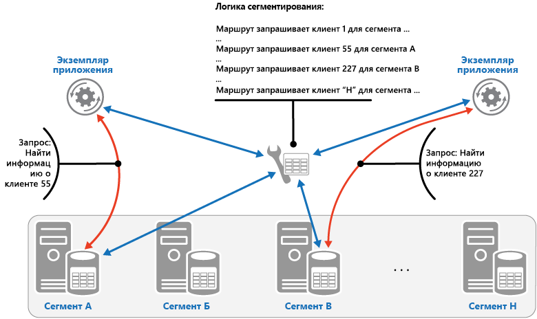
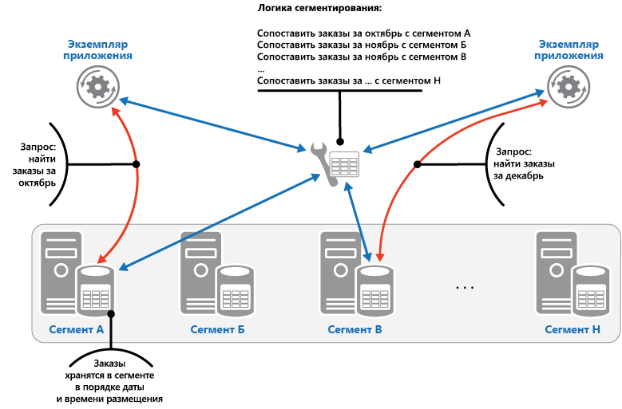

# <a name="sharding-pattern"></a><span data-ttu-id="9aaae-104">Шаблон сегментирования</span><span class="sxs-lookup"><span data-stu-id="9aaae-104">Sharding pattern</span></span>

[!INCLUDE [header](../_includes/header.md)]

<span data-ttu-id="9aaae-105">Вы можете разделить хранилище данных на несколько горизонтальных секций, которые называются сегментами.</span><span class="sxs-lookup"><span data-stu-id="9aaae-105">Divide a data store into a set of horizontal partitions or shards.</span></span> <span data-ttu-id="9aaae-106">Это повышает масштабируемость при хранении больших объемов данных и обращении к ним.</span><span class="sxs-lookup"><span data-stu-id="9aaae-106">This can improve scalability when storing and accessing large volumes of data.</span></span>

## <a name="context-and-problem"></a><span data-ttu-id="9aaae-107">Контекст и проблема</span><span class="sxs-lookup"><span data-stu-id="9aaae-107">Context and problem</span></span>

<span data-ttu-id="9aaae-108">На хранилище данных, размещенное на обособленном сервере, могут распространятся следующие ограничения.</span><span class="sxs-lookup"><span data-stu-id="9aaae-108">A data store hosted by a single server might be subject to the following limitations:</span></span>

- <span data-ttu-id="9aaae-109">**Дисковое пространство**.</span><span class="sxs-lookup"><span data-stu-id="9aaae-109">**Storage space**.</span></span> <span data-ttu-id="9aaae-110">Хранилища данных для крупных облачных приложений обычно содержат очень много информации, объем которой со временем увеличивается.</span><span class="sxs-lookup"><span data-stu-id="9aaae-110">A data store for a large-scale cloud application is expected to contain a huge volume of data that could increase significantly over time.</span></span> <span data-ttu-id="9aaae-111">Обычно объем дискового пространства на сервере ограничен. Хотя вы можете заменять существующие диски более емкими или добавлять дополнительные диски по мере накопления данных.</span><span class="sxs-lookup"><span data-stu-id="9aaae-111">A server typically provides only a finite amount of disk storage, but you can replace existing disks with larger ones, or add further disks to a machine as data volumes grow.</span></span> <span data-ttu-id="9aaae-112">Но рано или поздно система достигнет некоторого предела, сверх которого емкость хранилища на этом сервере увеличить будет невозможно.</span><span class="sxs-lookup"><span data-stu-id="9aaae-112">However, the system will eventually reach a limit where it isn't possible to easily increase the storage capacity on a given server.</span></span>

- <span data-ttu-id="9aaae-113">**Вычислительные ресурсы**.</span><span class="sxs-lookup"><span data-stu-id="9aaae-113">**Computing resources**.</span></span> <span data-ttu-id="9aaae-114">Облачные приложения должны поддерживать большое число одновременно работающих пользователей, каждый из которых выполняет запросы на получение сведений из хранилища данных.</span><span class="sxs-lookup"><span data-stu-id="9aaae-114">A cloud application is required to support a large number of concurrent users, each of which run queries that retrieve information from the data store.</span></span> <span data-ttu-id="9aaae-115">Один сервер, на котором хранятся эти данные, не всегда готов предоставить достаточную вычислительную мощность для такой загрузки. Для пользователей это приводит к увеличению времени ожидания и частым сбоям, вызванным превышением времени ожидания при операциях сохранения и извлечения данных. Иногда можно добавить память или обновить процессор, но система скоро достигнет предела, выше которого вычислительные ресурсы наращивать невозможно.</span><span class="sxs-lookup"><span data-stu-id="9aaae-115">A single server hosting the data store might not be able to provide the necessary computing power to support this load, resulting in extended response times for users and frequent failures as applications attempting to store and retrieve data time out. It might be possible to add memory or upgrade processors, but the system will reach a limit when it isn't possible to increase the compute resources any further.</span></span>

- <span data-ttu-id="9aaae-116">**Пропускная способность сети**.</span><span class="sxs-lookup"><span data-stu-id="9aaae-116">**Network bandwidth**.</span></span> <span data-ttu-id="9aaae-117">Производительность хранилища данных, запущенного на обособленном сервере, определяется еще и скоростью, с которой сервер может получать запросы и отправлять ответы.</span><span class="sxs-lookup"><span data-stu-id="9aaae-117">Ultimately, the performance of a data store running on a single server is governed by the rate the server can receive requests and send replies.</span></span> <span data-ttu-id="9aaae-118">Когда объем сетевого трафика превышает пропускную способность сети, к которой подключен сервер, завершение некоторых запросов сбоями — реальная ситуация.</span><span class="sxs-lookup"><span data-stu-id="9aaae-118">It's possible that the volume of network traffic might exceed the capacity of the network used to connect to the server, resulting in failed requests.</span></span>

- <span data-ttu-id="9aaae-119">**География**.</span><span class="sxs-lookup"><span data-stu-id="9aaae-119">**Geography**.</span></span> <span data-ttu-id="9aaae-120">Иногда нужно, чтобы создаваемые пользователями данные хранились в том же регионе, где находятся сами пользователи. Это может быть связано с законодательными ограничениями, стандартами или требованиями к производительности и допустимой задержке при доступе к данным.</span><span class="sxs-lookup"><span data-stu-id="9aaae-120">It might be necessary to store data generated by specific users in the same region as those users for legal, compliance, or performance reasons, or to reduce latency of data access.</span></span> <span data-ttu-id="9aaae-121">Если при этом пользователи распределены по разным странам и регионам, вы не сможете хранить все данные приложения в одном хранилище данных.</span><span class="sxs-lookup"><span data-stu-id="9aaae-121">If the users are dispersed across different countries or regions, it might not be possible to store the entire data for the application in a single data store.</span></span>

<span data-ttu-id="9aaae-122">Вертикальное масштабирование, например увеличение емкости дисков, вычислительной мощности, объема памяти или числа сетевых адаптеров, позволит обойти некоторые из этих ограничений, но, скорее всего, только временно.</span><span class="sxs-lookup"><span data-stu-id="9aaae-122">Scaling vertically by adding more disk capacity, processing power, memory, and network connections can postpone the effects of some of these limitations, but it's likely to only be a temporary solution.</span></span> <span data-ttu-id="9aaae-123">Коммерческое облачное приложение, поддерживающее большое число пользователей и оперирующее огромными объемами данных, должно масштабироваться практически без ограничений, поэтому вертикальное масштабирование не всегда будет наилучшим решением.</span><span class="sxs-lookup"><span data-stu-id="9aaae-123">A commercial cloud application capable of supporting large numbers of users and high volumes of data must be able to scale almost indefinitely, so vertical scaling isn't necessarily the best solution.</span></span>

## <a name="solution"></a><span data-ttu-id="9aaae-124">Решение</span><span class="sxs-lookup"><span data-stu-id="9aaae-124">Solution</span></span>

<span data-ttu-id="9aaae-125">Вы можете разделить хранилище данных на горизонтальные секции (сегменты).</span><span class="sxs-lookup"><span data-stu-id="9aaae-125">Divide the data store into horizontal partitions or shards.</span></span> <span data-ttu-id="9aaae-126">Все сегменты имеют одинаковую схему данных, но хранят разные подмножества данных.</span><span class="sxs-lookup"><span data-stu-id="9aaae-126">Each shard has the same schema, but holds its own distinct subset of the data.</span></span> <span data-ttu-id="9aaae-127">Каждый сегмент сам по себе является хранилищем данных, которое может содержать данные для нескольких сущностей разных типов. Сегменты выполняются на сервере, который используется как узел хранения.</span><span class="sxs-lookup"><span data-stu-id="9aaae-127">A shard is a data store in its own right (it can contain the data for many entities of different types), running on a server acting as a storage node.</span></span>

<span data-ttu-id="9aaae-128">Такой подход связан со следующими преимуществами:</span><span class="sxs-lookup"><span data-stu-id="9aaae-128">This pattern has the following benefits:</span></span>

- <span data-ttu-id="9aaae-129">можно масштабировать систему, добавляя новые сегменты, запущенные на дополнительных узлах хранения;</span><span class="sxs-lookup"><span data-stu-id="9aaae-129">You can scale the system out by adding further shards running on additional storage nodes.</span></span>

- <span data-ttu-id="9aaae-130">система может работать на стандартном оборудовании, не требуя специализированных и дорогих компьютеров для каждого узла хранения;</span><span class="sxs-lookup"><span data-stu-id="9aaae-130">A system can use off-the-shelf hardware rather than specialized and expensive computers for each storage node.</span></span>

- <span data-ttu-id="9aaae-131">можно минимизировать конфликты и повысить производительность, правильно распределяя рабочую нагрузку между сегментами;</span><span class="sxs-lookup"><span data-stu-id="9aaae-131">You can reduce contention and improve performance by balancing the workload across shards.</span></span>

- <span data-ttu-id="9aaae-132">сегменты, размещенные в облаке, могут физически располагаться рядом с пользователями, которые будут обращаться к данным.</span><span class="sxs-lookup"><span data-stu-id="9aaae-132">In the cloud, shards can be located physically close to the users that'll access the data.</span></span>

<span data-ttu-id="9aaae-133">Когда вы разделяете хранилище данных на сегменты, вам нужно определить, какие данные в какой сегмент будут помещены.</span><span class="sxs-lookup"><span data-stu-id="9aaae-133">When dividing a data store up into shards, decide which data should be placed in each shard.</span></span> <span data-ttu-id="9aaae-134">Сегмент обычно содержит элементы, относящиеся к определенному диапазону по одному или нескольким атрибутам.</span><span class="sxs-lookup"><span data-stu-id="9aaae-134">A shard typically contains items that fall within a specified range determined by one or more attributes of the data.</span></span> <span data-ttu-id="9aaae-135">Эти атрибуты формируют ключ сегмента (иногда его называют ключом секции).</span><span class="sxs-lookup"><span data-stu-id="9aaae-135">These attributes form the shard key (sometimes referred to as the partition key).</span></span> <span data-ttu-id="9aaae-136">Ключ сегмента должен быть статическим.</span><span class="sxs-lookup"><span data-stu-id="9aaae-136">The shard key should be static.</span></span> <span data-ttu-id="9aaae-137">Он не должен основываться на данных, которые могут измениться.</span><span class="sxs-lookup"><span data-stu-id="9aaae-137">It shouldn't be based on data that might change.</span></span>

<span data-ttu-id="9aaae-138">Сегментирование определяет физическую структуру данных.</span><span class="sxs-lookup"><span data-stu-id="9aaae-138">Sharding physically organizes the data.</span></span> <span data-ttu-id="9aaae-139">Когда приложение сохраняет или извлекает данные, логика сегментирования определяет, к какому сегменту нужно обратиться.</span><span class="sxs-lookup"><span data-stu-id="9aaae-139">When an application stores and retrieves data, the sharding logic directs the application to the appropriate shard.</span></span> <span data-ttu-id="9aaae-140">Эта логика сегментирования может быть реализована как в самом приложении, то есть в коде доступа к данным, так и в системе хранения данных, если хранилище прозрачно поддерживает сегментирование.</span><span class="sxs-lookup"><span data-stu-id="9aaae-140">This sharding logic can be implemented as part of the data access code in the application, or it could be implemented by the data storage system if it transparently supports sharding.</span></span>

<span data-ttu-id="9aaae-141">Решая вопросы физического расположения данных с использованием логики сегментирования, вы получаете возможность точно управлять распределением данных между сегментами.</span><span class="sxs-lookup"><span data-stu-id="9aaae-141">Abstracting the physical location of the data in the sharding logic provides a high level of control over which shards contain which data.</span></span> <span data-ttu-id="9aaae-142">Если потребуется, вы сможете легко переносить данные между сегментами без необходимости изменять бизнес-логику приложения впоследствии (например, если изменится баланс распределения данных по сегментам).</span><span class="sxs-lookup"><span data-stu-id="9aaae-142">It also enables data to migrate between shards without reworking the business logic of an application if the data in the shards need to be redistributed later (for example, if the shards become unbalanced).</span></span> <span data-ttu-id="9aaae-143">Единственный недостаток такой схемы — дополнительная нагрузка при доступе к данным, связанная с определением расположения каждого элемента данных при его получении.</span><span class="sxs-lookup"><span data-stu-id="9aaae-143">The tradeoff is the additional data access overhead required in determining the location of each data item as it's retrieved.</span></span>

<span data-ttu-id="9aaae-144">Чтобы оптимально сбалансировать производительность и масштабируемость, очень важно правильно разделить данные в соответствии с тем, какие запросы выполняет приложение.</span><span class="sxs-lookup"><span data-stu-id="9aaae-144">To ensure optimal performance and scalability, it's important to split the data in a way that's appropriate for the types of queries that the application performs.</span></span> <span data-ttu-id="9aaae-145">Во многих случаях схемы сегментирования не смогут точно соответствовать требованиям каждого запроса.</span><span class="sxs-lookup"><span data-stu-id="9aaae-145">In many cases, it's unlikely that the sharding scheme will exactly match the requirements of every query.</span></span> <span data-ttu-id="9aaae-146">Например, приложение в многопользовательской системе может запрашивать данные о клиенте либо по идентификатору клиента, либо по значению какого-либо атрибута данных, включая имя или расположение клиента и т. п.</span><span class="sxs-lookup"><span data-stu-id="9aaae-146">For example, in a multi-tenant system an application might need to retrieve tenant data using the tenant ID, but it might also need to look up this data based on some other attribute such as the tenant’s name or location.</span></span> <span data-ttu-id="9aaae-147">В таких ситуациях желательно использовать такую стратегию сегментирования, при которой ключ сегмента соответствует наиболее часто выполняемым запросам.</span><span class="sxs-lookup"><span data-stu-id="9aaae-147">To handle these situations, implement a sharding strategy with a shard key that supports the most commonly performed queries.</span></span>

<span data-ttu-id="9aaae-148">Если нужно регулярно получать данные, используя сочетание значений некоторых атрибутов, вы можете определить составной ключ сегмента, связав нужные атрибуты.</span><span class="sxs-lookup"><span data-stu-id="9aaae-148">If queries regularly retrieve data using a combination of attribute values, you can likely define a composite shard key by linking attributes together.</span></span> <span data-ttu-id="9aaae-149">Можно использовать и другой подход — применить шаблон [таблицы индексов](index-table.md), который позволит вам быстро находить данные по значениям атрибутов, не входящих в ключ сегмента.</span><span class="sxs-lookup"><span data-stu-id="9aaae-149">Alternatively, use a pattern such as [Index Table](index-table.md) to provide fast lookup to data based on attributes that aren't covered by the shard key.</span></span>

## <a name="sharding-strategies"></a><span data-ttu-id="9aaae-150">Стратегии сегментирования</span><span class="sxs-lookup"><span data-stu-id="9aaae-150">Sharding strategies</span></span>

<span data-ttu-id="9aaae-151">При выборе ключа сегмента и правил распределения данных по сегментам обычно используется одна из трех стратегий.</span><span class="sxs-lookup"><span data-stu-id="9aaae-151">Three strategies are commonly used when selecting the shard key and deciding how to distribute data across shards.</span></span> <span data-ttu-id="9aaae-152">Обратите внимание, что число сегментов и серверов, на которых они размещены, может не совпадать — один сервер может размещать несколько сегментов.</span><span class="sxs-lookup"><span data-stu-id="9aaae-152">Note that there doesn't have to be a one-to-one correspondence between shards and the servers that host them&mdash;a single server can host multiple shards.</span></span> <span data-ttu-id="9aaae-153">Давайте рассмотрим эти стратегии.</span><span class="sxs-lookup"><span data-stu-id="9aaae-153">The strategies are:</span></span>

<span data-ttu-id="9aaae-154">**Стратегия поиска**.</span><span class="sxs-lookup"><span data-stu-id="9aaae-154">**The Lookup strategy**.</span></span> <span data-ttu-id="9aaae-155">В этом варианте логика сегментирования использует карту сопоставления по ключу сегмента и направляет запросы в тот сегмент, который содержит нужные данные.</span><span class="sxs-lookup"><span data-stu-id="9aaae-155">In this strategy the sharding logic implements a map that routes a request for data to the shard that contains that data using the shard key.</span></span> <span data-ttu-id="9aaae-156">Например, в многопользовательском приложении все данные каждого клиента можно хранить в одном сегменте, тогда идентификатор клиента можно использовать как ключ сегментирования.</span><span class="sxs-lookup"><span data-stu-id="9aaae-156">In a multi-tenant application all the data for a tenant might be stored together in a shard using the tenant ID as the shard key.</span></span> <span data-ttu-id="9aaae-157">Данные нескольких клиентов могут храниться в одном сегменте, но данные одного клиента не могут оказаться в нескольких сегментах.</span><span class="sxs-lookup"><span data-stu-id="9aaae-157">Multiple tenants might share the same shard, but the data for a single tenant won't be spread across multiple shards.</span></span> <span data-ttu-id="9aaae-158">На рисунке показан вариант сегментирования данных по идентификаторам клиентов.</span><span class="sxs-lookup"><span data-stu-id="9aaae-158">The figure illustrates sharding tenant data based on tenant IDs.</span></span>

   


   <span data-ttu-id="9aaae-160">Для сопоставления значений ключа сегмента и физического хранилища можно использовать физические сегменты, тогда каждый ключ сегмента будет сопоставлен с физической секцией.</span><span class="sxs-lookup"><span data-stu-id="9aaae-160">The mapping between the shard key and the physical storage can be based on physical shards where each shard key maps to a physical partition.</span></span> <span data-ttu-id="9aaae-161">Есть и более гибкий способ распределения сегментов — виртуальное секционирование. В этом случае ключи сегмента сопоставляются с таким же числом виртуальных сегментов, которые в свою очередь сопоставляются с меньшим числом физических секций.</span><span class="sxs-lookup"><span data-stu-id="9aaae-161">Alternatively, a more flexible technique for rebalancing shards is virtual partitioning, where shard keys map to the same number of virtual shards, which in turn map to fewer physical partitions.</span></span> <span data-ttu-id="9aaae-162">В этом варианта приложение находит данные с использованием ключа сегмента, который ссылается на виртуальный сегмент, а система прозрачно сопоставляет виртуальные сегменты с физическими секциями.</span><span class="sxs-lookup"><span data-stu-id="9aaae-162">In this approach, an application locates data using a shard key that refers to a virtual shard, and the system transparently maps virtual shards to physical partitions.</span></span> <span data-ttu-id="9aaae-163">Такое сопоставление между виртуальными сегментами и физическими секциями можно в любой момент изменить, не прибегая к программным методам, а просто применив другой набор ключей сегмента.</span><span class="sxs-lookup"><span data-stu-id="9aaae-163">The mapping between a virtual shard and a physical partition can change without requiring the application code be modified to use a different set of shard keys.</span></span>

<span data-ttu-id="9aaae-164">**Стратегия диапазонов**.</span><span class="sxs-lookup"><span data-stu-id="9aaae-164">**The Range strategy**.</span></span> <span data-ttu-id="9aaae-165">В этом варианте связанные элементы группируются в один сегмент, а затем упорядочиваются по ключу сегмента — то есть значения ключа сегмента располагаются последовательно.</span><span class="sxs-lookup"><span data-stu-id="9aaae-165">This strategy groups related items together in the same shard, and orders them by shard key&mdash;the shard keys are sequential.</span></span> <span data-ttu-id="9aaae-166">Это полезно для приложений, которые часто получают наборы элементов из некоторого диапазона значений (запросы к данным возвращают набор элементов, для которых значения ключа сегмента попадают в заданный диапазон).</span><span class="sxs-lookup"><span data-stu-id="9aaae-166">It's useful for applications that frequently retrieve sets of items using range queries (queries that return a set of data items for a shard key that falls within a given range).</span></span> <span data-ttu-id="9aaae-167">Например если приложению нужно регулярно получать список всех заказов, размещенных в определенном месяце, эти данные можно получать быстрее, разместив заказы за каждый месяц в одном сегменте и упорядочив их по дате и времени.</span><span class="sxs-lookup"><span data-stu-id="9aaae-167">For example, if an application regularly needs to find all orders placed in a given month, this data can be retrieved more quickly if all orders for a month are stored in date and time order in the same shard.</span></span> <span data-ttu-id="9aaae-168">Если заказы окажутся в разных сегментах, их придется извлекать по отдельности, то есть выполнять большое количество точечных запросов (возвращающих один элемент данных).</span><span class="sxs-lookup"><span data-stu-id="9aaae-168">If each order was stored in a different shard, they'd have to be fetched individually by performing a large number of point queries (queries that return a single data item).</span></span> <span data-ttu-id="9aaae-169">На следующем рисунке показана схема хранения последовательных наборов (диапазонов) данных в сегменте.</span><span class="sxs-lookup"><span data-stu-id="9aaae-169">The next figure illustrates storing sequential sets (ranges) of data in shard.</span></span>

   

<span data-ttu-id="9aaae-171">В этом примере используется составной ключ сегмента, наиболее значимым элементом которого является месяц заказа, затем которым следуют день и время заказа.</span><span class="sxs-lookup"><span data-stu-id="9aaae-171">In this example, the shard key is a composite key containing the order month as the most significant element, followed by the order day and the time.</span></span> <span data-ttu-id="9aaae-172">При создании новых заказов и размещении их по сегментам данные естественным образом сортируются.</span><span class="sxs-lookup"><span data-stu-id="9aaae-172">The data for orders is naturally sorted when new orders are created and added to a shard.</span></span> <span data-ttu-id="9aaae-173">Некоторые хранилища данных поддерживают ключи сегмента, состоящие из двух элементов — ключа секции, который определяет сегмент, и ключа строки, который однозначно определяет элемент в пределах сегмента.</span><span class="sxs-lookup"><span data-stu-id="9aaae-173">Some data stores support two-part shard keys containing a partition key element that identifies the shard and a row key that uniquely identifies an item in the shard.</span></span> <span data-ttu-id="9aaae-174">Обычно данные в сегменте хранятся в порядке значений ключа строки.</span><span class="sxs-lookup"><span data-stu-id="9aaae-174">Data is usually held in row key order in the shard.</span></span> <span data-ttu-id="9aaae-175">Элементы, для которых применяются запросы по диапазонам значений и которые нужно хранить в одном сегменте, будут иметь одинаковые значения ключа секции и уникальные значения ключа строки.</span><span class="sxs-lookup"><span data-stu-id="9aaae-175">Items that are subject to range queries and need to be grouped together can use a shard key that has the same value for the partition key but a unique value for the row key.</span></span>

<span data-ttu-id="9aaae-176">**Стратегия хэширования**.</span><span class="sxs-lookup"><span data-stu-id="9aaae-176">**The Hash strategy**.</span></span> <span data-ttu-id="9aaae-177">Эта стратегия позволяет снизить вероятность возникновения высокоактивных сегментов (сегментов с непропорционально высокой нагрузкой).</span><span class="sxs-lookup"><span data-stu-id="9aaae-177">The purpose of this strategy is to reduce the chance of hotspots (shards that receive a disproportionate amount of load).</span></span> <span data-ttu-id="9aaae-178">Данные в этом варианте распределяются между сегментами так, чтобы соблюдался баланс между размером каждого сегмента и средней нагрузкой, которая приходится на этот сегмент.</span><span class="sxs-lookup"><span data-stu-id="9aaae-178">It distributes the data across the shards in a way that achieves a balance between the size of each shard and the average load that each shard will encounter.</span></span> <span data-ttu-id="9aaae-179">Логика сегментирования вычисляет, в каком сегменте хранить каждый элемент данных, по значению хэш-индекса по одному или нескольким атрибутам данных.</span><span class="sxs-lookup"><span data-stu-id="9aaae-179">The sharding logic computes the shard to store an item in based on a hash of one or more attributes of the data.</span></span> <span data-ttu-id="9aaae-180">Функция хэширования должна быть выбрана так, чтобы равномерно распространять данные между сегментами. Возможно, для этого придется добавить в формулу вычисления некоторый случайный элемент.</span><span class="sxs-lookup"><span data-stu-id="9aaae-180">The chosen hashing function should distribute data evenly across the shards, possibly by introducing some random element into the computation.</span></span> <span data-ttu-id="9aaae-181">На следующем рисунке изображено сегментирование данных по хэшу идентификаторов клиента.</span><span class="sxs-lookup"><span data-stu-id="9aaae-181">The next figure illustrates sharding tenant data based on a hash of tenant IDs.</span></span>

   

<span data-ttu-id="9aaae-183">Чтобы понять преимущества стратегии хэширования в сравнении с другими стратегиями сегментирования, рассмотрим следующий пример. Многопользовательское приложение поочередно регистрирует новых клиентов и распределяет полученные данные между сегментами в хранилище данных.</span><span class="sxs-lookup"><span data-stu-id="9aaae-183">To understand the advantage of the Hash strategy over other sharding strategies, consider how a multi-tenant application that enrolls new tenants sequentially might assign the tenants to shards in the data store.</span></span> <span data-ttu-id="9aaae-184">Если использовать стратегию диапазонов, все данные о клиентах с идентификаторами от 1 до n сохраняются в сегменте A, с идентификаторами от n+1 до m — в сегменте B и т. д.</span><span class="sxs-lookup"><span data-stu-id="9aaae-184">When using the Range strategy, the data for tenants 1 to n will all be stored in shard A, the data for tenants n+1 to m will all be stored in shard B, and so on.</span></span> <span data-ttu-id="9aaae-185">Если предположить, что наибольшую активность проявляют недавно зарегистрированные клиенты, наибольшая нагрузка по работе с данными придется на небольшое число сегментов, что создаст высокоактивный сегмент.</span><span class="sxs-lookup"><span data-stu-id="9aaae-185">If the most recently registered tenants are also the most active, most data activity will occur in a small number of shards, which could cause hotspots.</span></span> <span data-ttu-id="9aaae-186">В этой же ситуации стратегия хэширования будет распределять клиентов по сегментам на основе хэша идентификатора.</span><span class="sxs-lookup"><span data-stu-id="9aaae-186">In contrast, the Hash strategy allocates tenants to shards based on a hash of their tenant ID.</span></span> <span data-ttu-id="9aaae-187">Это означает, что клиенты с последовательными идентификаторами, скорее всего, попадут в разные сегменты, что позволит равномерно распределить нагрузку.</span><span class="sxs-lookup"><span data-stu-id="9aaae-187">This means that sequential tenants are most likely to be allocated to different shards, which will distribute the load across them.</span></span> <span data-ttu-id="9aaae-188">На рисунке выше показано такое поведение для клиентов с идентификаторами 55 и 56.</span><span class="sxs-lookup"><span data-stu-id="9aaae-188">The previous figure shows this for tenants 55 and 56.</span></span>

<span data-ttu-id="9aaae-189">Далее описаны преимущества и особенности каждой из трех основных стратегий сегментирования.</span><span class="sxs-lookup"><span data-stu-id="9aaae-189">The three sharding strategies have the following advantages and considerations:</span></span>

- <span data-ttu-id="9aaae-190">**Поиск**.</span><span class="sxs-lookup"><span data-stu-id="9aaae-190">**Lookup**.</span></span> <span data-ttu-id="9aaae-191">Обеспечивает максимальный контроль над настройкой и использованием сегментов.</span><span class="sxs-lookup"><span data-stu-id="9aaae-191">This offers more control over the way that shards are configured and used.</span></span> <span data-ttu-id="9aaae-192">Используя виртуальные сегменты, можно устранить проблемы с балансировкой данных благодаря возможности добавлять новые физические секции для распределения рабочей нагрузки.</span><span class="sxs-lookup"><span data-stu-id="9aaae-192">Using virtual shards reduces the impact when rebalancing data because new physical partitions can be added to even out the workload.</span></span> <span data-ttu-id="9aaae-193">Сопоставление виртуальных сегментов и физических секций, на которых они реализованы, можно изменять, не прибегая к программным методам, то есть не меняя код приложения, который сохраняет и извлекает данные по значению ключа сегмента.</span><span class="sxs-lookup"><span data-stu-id="9aaae-193">The mapping between a virtual shard and the physical partitions that implement the shard can be modified without affecting application code that uses a shard key to store and retrieve data.</span></span> <span data-ttu-id="9aaae-194">Поиск расположения сегмента может создавать дополнительную нагрузку.</span><span class="sxs-lookup"><span data-stu-id="9aaae-194">Looking up shard locations can impose an additional overhead.</span></span>

- <span data-ttu-id="9aaae-195">**Диапазон**.</span><span class="sxs-lookup"><span data-stu-id="9aaae-195">**Range**.</span></span> <span data-ttu-id="9aaae-196">Легко реализуется и хорошо работает с запросами по диапазонам, так как часто позволяет с помощью одной операции получить несколько элементов данных из одного сегмента.</span><span class="sxs-lookup"><span data-stu-id="9aaae-196">This is easy to implement and works well with range queries because they can often fetch multiple data items from a single shard in a single operation.</span></span> <span data-ttu-id="9aaae-197">Эта стратегия упрощает процессы управления данными.</span><span class="sxs-lookup"><span data-stu-id="9aaae-197">This strategy offers easier data management.</span></span> <span data-ttu-id="9aaae-198">Например, если включить в один сегмент пользователей из одного региона, можно запланировать обновления отдельно для каждого часового пояса на основе локальных особенностей использования нагрузки и запросов.</span><span class="sxs-lookup"><span data-stu-id="9aaae-198">For example, if users in the same region are in the same shard, updates can be scheduled in each time zone based on the local load and demand pattern.</span></span> <span data-ttu-id="9aaae-199">Но эта стратегия не позволяет обеспечить оптимальную балансировку между сегментами.</span><span class="sxs-lookup"><span data-stu-id="9aaae-199">However, this strategy doesn't provide optimal balancing between shards.</span></span> <span data-ttu-id="9aaae-200">Перераспределение данных между сегментами будет сложным и не решит проблему неравномерной нагрузки, если основная часть нагрузки создается для данных с близкими значениями ключа сегмента.</span><span class="sxs-lookup"><span data-stu-id="9aaae-200">Rebalancing shards is difficult and might not resolve the problem of uneven load if the majority of activity is for adjacent shard keys.</span></span>

- <span data-ttu-id="9aaae-201">**Хэш**.</span><span class="sxs-lookup"><span data-stu-id="9aaae-201">**Hash**.</span></span> <span data-ttu-id="9aaae-202">Позволяет распределять данные и нагрузку наиболее равномерно.</span><span class="sxs-lookup"><span data-stu-id="9aaae-202">This strategy offers a better chance of more even data and load distribution.</span></span> <span data-ttu-id="9aaae-203">Маршрутизация запросов выполняется прямо из приложения с использованием хэш-функции.</span><span class="sxs-lookup"><span data-stu-id="9aaae-203">Request routing can be accomplished directly by using the hash function.</span></span> <span data-ttu-id="9aaae-204">Нет необходимости использовать карту сопоставления.</span><span class="sxs-lookup"><span data-stu-id="9aaae-204">There's no need to maintain a map.</span></span> <span data-ttu-id="9aaae-205">Обратите внимание, что вычисление хэша может создать дополнительную нагрузку.</span><span class="sxs-lookup"><span data-stu-id="9aaae-205">Note that computing the hash might impose an additional overhead.</span></span> <span data-ttu-id="9aaae-206">Кроме того, это осложнит перераспределение нагрузки между сегментами.</span><span class="sxs-lookup"><span data-stu-id="9aaae-206">Also, rebalancing shards is difficult.</span></span>

<span data-ttu-id="9aaae-207">Чаще всего в системах сегментирования используется один из описанных выше подходов, но вам нужно учитывать бизнес-требования и сценарии использования данных для своего приложения.</span><span class="sxs-lookup"><span data-stu-id="9aaae-207">Most common sharding systems implement one of the approaches described above, but you should also consider the business requirements of your applications and their patterns of data usage.</span></span> <span data-ttu-id="9aaae-208">Для примера рассмотрим мультитенантное приложение.</span><span class="sxs-lookup"><span data-stu-id="9aaae-208">For example, in a multi-tenant application:</span></span>

- <span data-ttu-id="9aaae-209">Вы можете сегментировать данные в зависимости от рабочей нагрузки.</span><span class="sxs-lookup"><span data-stu-id="9aaae-209">You can shard data based on workload.</span></span> <span data-ttu-id="9aaae-210">Вы можете распределить данные клиентов с очень нестабильным уровнем нагрузки в отдельные сегменты.</span><span class="sxs-lookup"><span data-stu-id="9aaae-210">You could segregate the data for highly volatile tenants in separate shards.</span></span> <span data-ttu-id="9aaae-211">Это может ускорить доступ к данным для других клиентов.</span><span class="sxs-lookup"><span data-stu-id="9aaae-211">The speed of data access for other tenants might be improved as a result.</span></span>

- <span data-ttu-id="9aaae-212">Вы можете сегментировать данные по расположению клиентов.</span><span class="sxs-lookup"><span data-stu-id="9aaae-212">You can shard data based on the location of tenants.</span></span> <span data-ttu-id="9aaae-213">Это позволит выполнять резервное копирование и обслуживание данных для клиентов из определенного географического региона в такие периоды, когда нагрузка в этом регионе будет минимальной. При этом данные клиентов из других регионов, где в это время продолжается рабочий день, останутся доступными.</span><span class="sxs-lookup"><span data-stu-id="9aaae-213">You can take the data for tenants in a specific geographic region offline for backup and maintenance during off-peak hours in that region, while the data for tenants in other regions remains online and accessible during their business hours.</span></span>

- <span data-ttu-id="9aaae-214">Для особо ценных клиентов можно выделить отдельные сегменты с высокой производительностью и низкой загрузкой, а менее важные клиенты будут совместно использовать более плотно загруженные сегменты.</span><span class="sxs-lookup"><span data-stu-id="9aaae-214">High-value tenants could be assigned their own private, high performing, lightly loaded shards, whereas lower-value tenants might be expected to share more densely-packed, busy shards.</span></span>

- <span data-ttu-id="9aaae-215">Если отдельным клиентам требуется высокий уровень изоляции данных и конфиденциальности, их данные можно разместить на отдельном сервере.</span><span class="sxs-lookup"><span data-stu-id="9aaae-215">The data for tenants that need a high degree of data isolation and privacy can be stored on a completely separate server.</span></span>

## <a name="scaling-and-data-movement-operations"></a><span data-ttu-id="9aaae-216">Операции масштабирования и перемещения данных</span><span class="sxs-lookup"><span data-stu-id="9aaae-216">Scaling and data movement operations</span></span>

<span data-ttu-id="9aaae-217">Каждая стратегия сегментирования создает разные возможности и разные уровни сложности в контексте изменения масштаба, перемещения данных и поддержания состояния.</span><span class="sxs-lookup"><span data-stu-id="9aaae-217">Each of the sharding strategies implies different capabilities and levels of complexity for managing scale in, scale out, data movement, and maintaining state.</span></span>

<span data-ttu-id="9aaae-218">Стратегия поиска позволяет выполнять масштабирование и перемещение данных на уровне пользователей, и для этого не нужно отключать систему.</span><span class="sxs-lookup"><span data-stu-id="9aaae-218">The Lookup strategy permits scaling and data movement operations to be carried out at the user level, either online or offline.</span></span> <span data-ttu-id="9aaae-219">Вам достаточно временно приостановить операции пользователей или некоторую их часть (это можно сделать в периоды низкой нагрузки), затем переместить данные в другую виртуальную секцию или другой физический сегмент, изменить карту сопоставлений и объявить недействительными или обновить все кэшированные данные. После этого можно возобновить работу пользователей.</span><span class="sxs-lookup"><span data-stu-id="9aaae-219">The technique is to suspend some or all user activity (perhaps during off-peak periods), move the data to the new virtual partition or physical shard, change the mappings, invalidate or refresh any caches that hold this data, and then allow user activity to resume.</span></span> <span data-ttu-id="9aaae-220">Операции такого типа часто можно выполнять централизованно.</span><span class="sxs-lookup"><span data-stu-id="9aaae-220">Often this type of operation can be centrally managed.</span></span> <span data-ttu-id="9aaae-221">Стратегия поиска требует, чтобы состояние данных хорошо согласовывалось с кэшированием и реплицированием.</span><span class="sxs-lookup"><span data-stu-id="9aaae-221">The Lookup strategy requires state to be highly cacheable and replica friendly.</span></span>

<span data-ttu-id="9aaae-222">Стратегия диапазонов накладывает некоторые ограничения на операции масштабирования и перемещения данных. Обычно их нужно выполнять, отключив от сети хранилище данных или его часть, так как данные нужно делить и объединять во многих сегментах.</span><span class="sxs-lookup"><span data-stu-id="9aaae-222">The Range strategy imposes some limitations on scaling and data movement operations, which must typically be carried out when a part or all of the data store is offline because the data must be split and merged across the shards.</span></span> <span data-ttu-id="9aaae-223">Перемещение данных для балансирования сегментов не всегда позволит решить проблему неравномерной нагрузки, если основная часть нагрузки создается для данных с близкими значениями ключа сегмента или с идентификаторами из одного диапазона.</span><span class="sxs-lookup"><span data-stu-id="9aaae-223">Moving the data to rebalance shards might not resolve the problem of uneven load if the majority of activity is for adjacent shard keys or data identifiers that are within the same range.</span></span> <span data-ttu-id="9aaae-224">Стратегия диапазонов также может включать действия по поддержанию состояния, чтобы диапазоны можно было сопоставить с физическими секциями.</span><span class="sxs-lookup"><span data-stu-id="9aaae-224">The Range strategy might also require some state to be maintained in order to map ranges to the physical partitions.</span></span>

<span data-ttu-id="9aaae-225">Стратегия хэширования существенно осложняет операции масштабирования и перемещения данных, так как ключи секций — это хэш-индексы ключей сегментов или идентификаторов данных.</span><span class="sxs-lookup"><span data-stu-id="9aaae-225">The Hash strategy makes scaling and data movement operations more complex because the partition keys are hashes of the shard keys or data identifiers.</span></span> <span data-ttu-id="9aaae-226">Нужно определить новое расположение для каждого сегмента на основе результатов выполнения хэш-функции или изменить эту функцию для правильного сопоставления.</span><span class="sxs-lookup"><span data-stu-id="9aaae-226">The new location of each shard must be determined from the hash function, or the function modified to provide the correct mappings.</span></span> <span data-ttu-id="9aaae-227">Но зато стратегия хэширования не требует поддержания состояния.</span><span class="sxs-lookup"><span data-stu-id="9aaae-227">However, the Hash strategy doesn't require maintenance of state.</span></span>

## <a name="issues-and-considerations"></a><span data-ttu-id="9aaae-228">Проблемы и рекомендации</span><span class="sxs-lookup"><span data-stu-id="9aaae-228">Issues and considerations</span></span>

<span data-ttu-id="9aaae-229">При принятии решения о реализации этого шаблона необходимо учитывать следующие моменты.</span><span class="sxs-lookup"><span data-stu-id="9aaae-229">Consider the following points when deciding how to implement this pattern:</span></span>

- <span data-ttu-id="9aaae-230">Сегментирование можно использовать совместно с другими видами секционирования, такими как вертикальное или функциональное секционирование.</span><span class="sxs-lookup"><span data-stu-id="9aaae-230">Sharding is complementary to other forms of partitioning, such as vertical partitioning and functional partitioning.</span></span> <span data-ttu-id="9aaae-231">Например, один сегмент может содержать сущности, которые секционированы по вертикали, а функциональное секционирование можно реализовать в виде нескольких сегментов.</span><span class="sxs-lookup"><span data-stu-id="9aaae-231">For example, a single shard can contain entities that have been partitioned vertically, and a functional partition can be implemented as multiple shards.</span></span> <span data-ttu-id="9aaae-232">Дополнительные сведения о секционировании данных см. в [этом руководстве](https://msdn.microsoft.com/library/dn589795.aspx).</span><span class="sxs-lookup"><span data-stu-id="9aaae-232">For more information about partitioning, see the [Data Partitioning Guidance](https://msdn.microsoft.com/library/dn589795.aspx).</span></span>

- <span data-ttu-id="9aaae-233">Поддерживайте сбалансированное распределение нагрузки между сегментами, чтобы каждый из них обрабатывал сопоставимый объем операций ввода-вывода.</span><span class="sxs-lookup"><span data-stu-id="9aaae-233">Keep shards balanced so they all handle a similar volume of I/O.</span></span> <span data-ttu-id="9aaae-234">По мере добавления и удаления данных нужно периодически перераспределять данные между сегментами, чтобы обеспечить равномерную нагрузку и избежать появления высокоактивных сегментов.</span><span class="sxs-lookup"><span data-stu-id="9aaae-234">As data is inserted and deleted, it's necessary to periodically rebalance the shards to guarantee an even distribution and to reduce the chance of hotspots.</span></span> <span data-ttu-id="9aaae-235">Перераспределение может потребовать значительных ресурсов.</span><span class="sxs-lookup"><span data-stu-id="9aaae-235">Rebalancing can be an expensive operation.</span></span> <span data-ttu-id="9aaae-236">Чтобы снизить потребность в перераспределении, учитывайте развитие системы при проектировании. Каждый сегмент должен иметь достаточно свободного места для обработки ожидаемого объема изменений.</span><span class="sxs-lookup"><span data-stu-id="9aaae-236">To reduce the necessity of rebalancing, plan for growth by ensuring that each shard contains sufficient free space to handle the expected volume of changes.</span></span> <span data-ttu-id="9aaae-237">Также следует подготовить стратегии и планы для быстрого перераспределения данных, если это потребуется.</span><span class="sxs-lookup"><span data-stu-id="9aaae-237">You should also develop strategies and scripts you can use to quickly rebalance shards if this becomes necessary.</span></span>

- <span data-ttu-id="9aaae-238">Используйте для ключа сегментов неизменяемые данные.</span><span class="sxs-lookup"><span data-stu-id="9aaae-238">Use stable data for the shard key.</span></span> <span data-ttu-id="9aaae-239">Если для какого-либо элемента данных изменится значение ключа сегмента, возможно, его придется переместить в другой сегмент. Это увеличит объем работы при операциях обновления.</span><span class="sxs-lookup"><span data-stu-id="9aaae-239">If the shard key changes, the corresponding data item might have to move between shards, increasing the amount of work performed by update operations.</span></span> <span data-ttu-id="9aaae-240">Поэтому следует избегать сегментирования с использованием таких данных, которые могут измениться.</span><span class="sxs-lookup"><span data-stu-id="9aaae-240">For this reason, avoid basing the shard key on potentially volatile information.</span></span> <span data-ttu-id="9aaae-241">Вместо этого выберите те атрибуты, которые остаются постоянными или формируют естественный ключ.</span><span class="sxs-lookup"><span data-stu-id="9aaae-241">Instead, look for attributes that are invariant or that naturally form a key.</span></span>

- <span data-ttu-id="9aaae-242">Обеспечьте уникальность значений для ключа сегмента.</span><span class="sxs-lookup"><span data-stu-id="9aaae-242">Ensure that shard keys are unique.</span></span> <span data-ttu-id="9aaae-243">Например, в качестве ключа сегмента нежелательно использовать поля с автоприращением.</span><span class="sxs-lookup"><span data-stu-id="9aaae-243">For example, avoid using autoincrementing fields as the shard key.</span></span> <span data-ttu-id="9aaae-244">Некоторые системы не позволяют скоординировать автоприращение между несколькими сегментами, и тогда в разных сегментах могут появиться элементы данных с одинаковым значением ключа сегмента.</span><span class="sxs-lookup"><span data-stu-id="9aaae-244">Is some systems, autoincremented fields can't be coordinated across shards, possibly resulting in items in different shards having the same shard key.</span></span>

    >  <span data-ttu-id="9aaae-245">Автоприращение значений в других полях, не входящих в ключ сегмента, также может вызвать проблемы.</span><span class="sxs-lookup"><span data-stu-id="9aaae-245">Autoincremented values in other fields that are not shard keys can also cause problems.</span></span> <span data-ttu-id="9aaae-246">Например, если поля с автоприращением используются для создания уникальных идентификаторов, в разных сегментах двум элементам данных могут быть назначены одинаковые идентификаторы.</span><span class="sxs-lookup"><span data-stu-id="9aaae-246">For example, if you use autoincremented fields to generate unique IDs, then two different items located in different shards might be assigned the same ID.</span></span>

- <span data-ttu-id="9aaae-247">Не всегда будет возможность разработать такой ключ сегмента, который соответствует требованиям всех возможных запросов к данным.</span><span class="sxs-lookup"><span data-stu-id="9aaae-247">It might not be possible to design a shard key that matches the requirements of every possible query against the data.</span></span> <span data-ttu-id="9aaae-248">Выбирайте правила сегментирования так, чтобы они соответствовали самым часто выполняемым запросам, а при необходимости создайте дополнительные таблицы индексов для тех запросов, которые получают данные с использованием условий на основе других атрибутов, не входящих в ключ сегмента.</span><span class="sxs-lookup"><span data-stu-id="9aaae-248">Shard the data to support the most frequently performed queries, and if necessary create secondary index tables to support queries that retrieve data using criteria based on attributes that aren't part of the shard key.</span></span> <span data-ttu-id="9aaae-249">Дополнительные сведения см. в статье [Index Table pattern](index-table.md) (Шаблон таблицы индексов).</span><span class="sxs-lookup"><span data-stu-id="9aaae-249">For more information, see the [Index Table pattern](index-table.md).</span></span>

- <span data-ttu-id="9aaae-250">Запросы, которые обращаются только к одному сегменту, выполняются более эффективно, чем те, которые получают данные из нескольких сегментов. Поэтому не следует реализовывать системы сегментирования, вынуждающие приложения выполнять большое число запросов к данным, распределенным между несколькими сегментами.</span><span class="sxs-lookup"><span data-stu-id="9aaae-250">Queries that access only a single shard are more efficient than those that retrieve data from multiple shards, so avoid implementing a sharding system that results in applications performing large numbers of queries that join data held in different shards.</span></span> <span data-ttu-id="9aaae-251">Помните, что один сегмент может содержать данные для нескольких типов сущностей.</span><span class="sxs-lookup"><span data-stu-id="9aaae-251">Remember that a single shard can contain the data for multiple types of entities.</span></span> <span data-ttu-id="9aaae-252">Также можно попробовать денормализовать данные, чтобы хранить в одном сегменте связанные сущности, которые часто запрашиваются вместе (например, данные о клиентах и о размещенных ими заказах). Это позволит снизить число отдельных операций считывания, выполняемых приложением.</span><span class="sxs-lookup"><span data-stu-id="9aaae-252">Consider denormalizing your data to keep related entities that are commonly queried together (such as the details of customers and the orders that they have placed) in the same shard to reduce the number of separate reads that an application performs.</span></span>

    >  <span data-ttu-id="9aaae-253">Если сущность, размещенная в одном сегменте, ссылается на сущность из другого сегмента, включите ключ сегмента для второй сущности в схему данных первой сущности.</span><span class="sxs-lookup"><span data-stu-id="9aaae-253">If an entity in one shard references an entity stored in another shard, include the shard key for the second entity as part of the schema for the first entity.</span></span> <span data-ttu-id="9aaae-254">Это может повысить производительность запросов, которые обращаются к связанным данным из нескольких сегментов.</span><span class="sxs-lookup"><span data-stu-id="9aaae-254">This can help to improve the performance of queries that reference related data across shards.</span></span>

- <span data-ttu-id="9aaae-255">Если приложение должно выполнять запросы к данным из нескольких сегментов, получить такие данных можно с использованием параллельных задач.</span><span class="sxs-lookup"><span data-stu-id="9aaae-255">If an application must perform queries that retrieve data from multiple shards, it might be possible to fetch this data by using parallel tasks.</span></span> <span data-ttu-id="9aaae-256">Например, это применимо для размноженных запросов, где данные из нескольких сегментов извлекаются параллельно и затем объединяются в единый результат.</span><span class="sxs-lookup"><span data-stu-id="9aaae-256">Examples include fan-out queries, where data from multiple shards is retrieved in parallel and then aggregated into a single result.</span></span> <span data-ttu-id="9aaae-257">Но такой подход неизбежно усложняет логику доступа к данным.</span><span class="sxs-lookup"><span data-stu-id="9aaae-257">However, this approach inevitably adds some complexity to the data access logic of a solution.</span></span>

- <span data-ttu-id="9aaae-258">Для многих приложений большое число мелких сегментов может оказаться более эффективной схемой, чем небольшое число больших сегментов. Это предоставляет больше возможностей для балансировки нагрузки.</span><span class="sxs-lookup"><span data-stu-id="9aaae-258">For many applications, creating a larger number of small shards can be more efficient than having a small number of large shards because they can offer increased opportunities for load balancing.</span></span> <span data-ttu-id="9aaae-259">Это будет полезно и в том случае, если ожидается перенос сегментов из одного физического расположения в другое.</span><span class="sxs-lookup"><span data-stu-id="9aaae-259">This can also be useful if you anticipate the need to migrate shards from one physical location to another.</span></span> <span data-ttu-id="9aaae-260">Перемещение сегмента малого размера выполняется быстрее, чем перемещение большого сегмента.</span><span class="sxs-lookup"><span data-stu-id="9aaae-260">Moving a small shard is quicker than moving a large one.</span></span>

- <span data-ttu-id="9aaae-261">Убедитесь, что каждый узел сегмента имеет достаточно ресурсов для масштабируемости по таким параметрам, как объем данных и пропускная способность.</span><span class="sxs-lookup"><span data-stu-id="9aaae-261">Make sure the resources available to each shard storage node are sufficient to handle the scalability requirements in terms of data size and throughput.</span></span> <span data-ttu-id="9aaae-262">Дополнительные сведения см. в разделе с требованиями к проектированию секций для обеспечения масштабируемости в [руководстве по секционированию данных](https://msdn.microsoft.com/library/dn589795.aspx).</span><span class="sxs-lookup"><span data-stu-id="9aaae-262">For more information, see the section “Designing Partitions for Scalability” in the [Data Partitioning Guidance](https://msdn.microsoft.com/library/dn589795.aspx).</span></span>

- <span data-ttu-id="9aaae-263">Возможно, стоит реплицировать ссылочные данные во все сегменты.</span><span class="sxs-lookup"><span data-stu-id="9aaae-263">Consider replicating reference data to all shards.</span></span> <span data-ttu-id="9aaae-264">Если операции получения сегментированных данных в том же запросе обращаются к статической или медленно изменяющейся информации, добавьте эту информацию в сегмент.</span><span class="sxs-lookup"><span data-stu-id="9aaae-264">If an operation that retrieves data from a shard also references static or slow-moving data as part of the same query, add this data to the shard.</span></span> <span data-ttu-id="9aaae-265">Тогда приложение сможет быстро получать все данные по этому запросу без дополнительного обращения к отдельному хранилищу данных.</span><span class="sxs-lookup"><span data-stu-id="9aaae-265">The application can then fetch all of the data for the query easily, without having to make an additional round trip to a separate data store.</span></span>

    >  <span data-ttu-id="9aaae-266">Если изменятся ссылочные данные, хранимые в нескольких сегментах, система должна синхронизировать эти изменения между всеми сегментами.</span><span class="sxs-lookup"><span data-stu-id="9aaae-266">If reference data held in multiple shards changes, the system must synchronize these changes across all shards.</span></span> <span data-ttu-id="9aaae-267">При такой синхронизации может возникать некоторая несогласованность.</span><span class="sxs-lookup"><span data-stu-id="9aaae-267">The system can experience a degree of inconsistency while this synchronization occurs.</span></span> <span data-ttu-id="9aaae-268">В таком случае приложение следует разрабатывать так, чтобы оно смогло справиться с ней.</span><span class="sxs-lookup"><span data-stu-id="9aaae-268">If you do this, you should design your applications to be able to handle it.</span></span>

- <span data-ttu-id="9aaae-269">Целостность и согласованность ссылочных данных между сегментами поддерживать трудно, поэтому старайтесь как можно меньше использовать операции, которые влияют на данные в нескольких сегментах.</span><span class="sxs-lookup"><span data-stu-id="9aaae-269">It can be difficult to maintain referential integrity and consistency between shards, so you should minimize operations that affect data in multiple shards.</span></span> <span data-ttu-id="9aaae-270">Если приложению необходимо изменять данные в нескольких сегментах, отдельно оцените необходимость полной согласованности данных.</span><span class="sxs-lookup"><span data-stu-id="9aaae-270">If an application must modify data across shards, evaluate whether complete data consistency is actually required.</span></span> <span data-ttu-id="9aaae-271">Обычно стандартный подход в облаке заключается в реализации окончательной согласованности.</span><span class="sxs-lookup"><span data-stu-id="9aaae-271">Instead, a common approach in the cloud is to implement eventual consistency.</span></span> <span data-ttu-id="9aaae-272">Данные в каждой секции обновляются отдельно, а логика приложения отвечает как за успешное завершение обновлений, так и за обработку несоответствий, которые могут возникнуть при запросах к данным на фоне выполнения операции по согласованию.</span><span class="sxs-lookup"><span data-stu-id="9aaae-272">The data in each partition is updated separately, and the application logic must take responsibility for ensuring that the updates all complete successfully, as well as handling the inconsistencies that can arise from querying data while an eventually consistent operation is running.</span></span> <span data-ttu-id="9aaae-273">Сведения о реализации согласованности в конечном счете см. в [руководстве по обеспечению согласованности данных](https://msdn.microsoft.com/library/dn589800.aspx).</span><span class="sxs-lookup"><span data-stu-id="9aaae-273">For more information about implementing eventual consistency, see the [Data Consistency Primer](https://msdn.microsoft.com/library/dn589800.aspx).</span></span>

- <span data-ttu-id="9aaae-274">Настройка большого числа сегментов и управление ими могут представлять существенные сложности.</span><span class="sxs-lookup"><span data-stu-id="9aaae-274">Configuring and managing a large number of shards can be a challenge.</span></span> <span data-ttu-id="9aaae-275">Задачи мониторинга, резервного копирования, проверки согласованности, ведения журналов и аудита придется выполнять сразу для нескольких сегментов и серверов, возможно даже размещенных в нескольких расположениях.</span><span class="sxs-lookup"><span data-stu-id="9aaae-275">Tasks such as monitoring, backing up, checking for consistency, and logging or auditing must be accomplished on multiple shards and servers, possibly held in multiple locations.</span></span> <span data-ttu-id="9aaae-276">Эти задачи обычно можно реализовать с помощью скриптов или других решений по автоматизации, но не всегда удастся полностью устранить необходимость в дополнительных операциях по администрированию.</span><span class="sxs-lookup"><span data-stu-id="9aaae-276">These tasks are likely to be implemented using scripts or other automation solutions, but that might not completely eliminate the additional administrative requirements.</span></span>

- <span data-ttu-id="9aaae-277">Сегменты могут быть привязаны к расположению, чтобы хранящиеся в них данные находились близко к тем экземплярам приложения, которые используют эти данные.</span><span class="sxs-lookup"><span data-stu-id="9aaae-277">Shards can be geolocated so that the data that they contain is close to the instances of an application that use it.</span></span> <span data-ttu-id="9aaae-278">Такой подход может значительно повысить производительность, но он также повысит требования к операциям, выполняемым для нескольких сегментов в разных расположениях.</span><span class="sxs-lookup"><span data-stu-id="9aaae-278">This approach can considerably improve performance, but requires additional consideration for tasks that must access multiple shards in different locations.</span></span>

## <a name="when-to-use-this-pattern"></a><span data-ttu-id="9aaae-279">Когда следует использовать этот шаблон</span><span class="sxs-lookup"><span data-stu-id="9aaae-279">When to use this pattern</span></span>

<span data-ttu-id="9aaae-280">Используйте этот шаблон, если ожидаете, что требования к хранилищу данных могут превысить ресурсы, доступные для отдельного узла хранилища, или если хотите повысить производительность, избавляясь от конфликта ресурсов в хранилище данных.</span><span class="sxs-lookup"><span data-stu-id="9aaae-280">Use this pattern when a data store is likely to need to scale beyond the resources available to a single storage node, or to improve performance by reducing contention in a data store.</span></span>

>  <span data-ttu-id="9aaae-281">Основная цель сегментирования — повысить производительность и масштабируемость системы. В качестве "побочного эффекта" вы можете также повысить доступность благодаря правильному распределению данных между сегментами.</span><span class="sxs-lookup"><span data-stu-id="9aaae-281">The primary focus of sharding is to improve the performance and scalability of a system, but as a by-product it can also improve availability due to how the data is divided into separate partitions.</span></span> <span data-ttu-id="9aaae-282">Сбой в одной секции не обязательно помешает приложению получать данные из других секций, а операции по обслуживанию или восстановлению данных в одной или нескольких секциях можно будет выполнять, не отключая для приложения доступ ко всем данным.</span><span class="sxs-lookup"><span data-stu-id="9aaae-282">A failure in one partition doesn't necessarily prevent an application from accessing data held in other partitions, and an operator can perform maintenance or recovery of one or more partitions without making the entire data for an application inaccessible.</span></span> <span data-ttu-id="9aaae-283">Дополнительные сведения см. в [руководстве по секционированию данных](https://msdn.microsoft.com/library/dn589795.aspx).</span><span class="sxs-lookup"><span data-stu-id="9aaae-283">For more information, see the [Data Partitioning Guidance](https://msdn.microsoft.com/library/dn589795.aspx).</span></span>

## <a name="example"></a><span data-ttu-id="9aaae-284">Пример</span><span class="sxs-lookup"><span data-stu-id="9aaae-284">Example</span></span>

<span data-ttu-id="9aaae-285">В следующем примере на языке C# набор баз данных SQL Server используется в качестве сегментов.</span><span class="sxs-lookup"><span data-stu-id="9aaae-285">The following example in C# uses a set of SQL Server databases acting as shards.</span></span> <span data-ttu-id="9aaae-286">Каждая база данных содержит подмножество данных, используемых приложением.</span><span class="sxs-lookup"><span data-stu-id="9aaae-286">Each database holds a subset of the data used by an application.</span></span> <span data-ttu-id="9aaae-287">Приложение извлекает данные, распределенные между сегментами, используя собственную логику сегментирования (это пример размноженного запроса).</span><span class="sxs-lookup"><span data-stu-id="9aaae-287">The application retrieves data that's distributed across the shards using its own sharding logic (this is an example of a fan-out query).</span></span> <span data-ttu-id="9aaae-288">Подробные сведения о данных, расположенных в каждом сегменте, возвращает метод с именем `GetShards`.</span><span class="sxs-lookup"><span data-stu-id="9aaae-288">The details of the data that's located in each shard is returned by a method called `GetShards`.</span></span> <span data-ttu-id="9aaae-289">Он возвращает перечисляемый список объектов `ShardInformation`, где тип `ShardInformation` содержит идентификатор для каждого сегмента и строку подключения к серверу SQL Server, которую приложение будет использовать для подключения к этому сегменту (строки подключения не показаны в примере кода).</span><span class="sxs-lookup"><span data-stu-id="9aaae-289">This method returns an enumerable list of `ShardInformation` objects, where the `ShardInformation` type contains an identifier for each shard and the SQL Server connection string that an application should use to connect to the shard (the connection strings aren't shown in the code example).</span></span>

```csharp
private IEnumerable<ShardInformation> GetShards()
{
  // This retrieves the connection information from a shard store
  // (commonly a root database).
  return new[]
  {
    new ShardInformation
    {
      Id = 1,
      ConnectionString = ...
    },
    new ShardInformation
    {
      Id = 2,
      ConnectionString = ...
    }
  };
}
```

<span data-ttu-id="9aaae-290">В следующем примере кода показано, как приложение использует список объектов `ShardInformation` для выполнения запроса, который извлекает данные из каждого сегмента в параллельном режиме.</span><span class="sxs-lookup"><span data-stu-id="9aaae-290">The code below shows how the application uses the list of `ShardInformation` objects to perform a query that fetches data from each shard in parallel.</span></span> <span data-ttu-id="9aaae-291">Подробные сведения о запросе не отображаются, но в этом примере извлекаемые данные содержат строку с информацией, например именем клиента, если в сегментах есть подробные сведения о клиенте.</span><span class="sxs-lookup"><span data-stu-id="9aaae-291">The details of the query aren't shown, but in this example the data that's retrieved contains a string that could hold information such as the name of a customer if the shards contain the details of customers.</span></span> <span data-ttu-id="9aaae-292">Результаты объединяются в коллекцию `ConcurrentBag` для последующей обработки в приложении.</span><span class="sxs-lookup"><span data-stu-id="9aaae-292">The results are aggregated into a `ConcurrentBag` collection for processing by the application.</span></span>

```csharp
// Retrieve the shards as a ShardInformation[] instance.
var shards = GetShards();

var results = new ConcurrentBag<string>();

// Execute the query against each shard in the shard list.
// This list would typically be retrieved from configuration
// or from a root/master shard store.
Parallel.ForEach(shards, shard =>
{
  // NOTE: Transient fault handling isn't included,
  // but should be incorporated when used in a real world application.
  using (var con = new SqlConnection(shard.ConnectionString))
  {
    con.Open();
    var cmd = new SqlCommand("SELECT ... FROM ...", con);

    Trace.TraceInformation("Executing command against shard: {0}", shard.Id);

    var reader = cmd.ExecuteReader();
    // Read the results in to a thread-safe data structure.
    while (reader.Read())
    {
      results.Add(reader.GetString(0));
    }
  }
});

Trace.TraceInformation("Fanout query complete - Record Count: {0}",
                        results.Count);
```

## <a name="related-patterns-and-guidance"></a><span data-ttu-id="9aaae-293">Связанные шаблоны и рекомендации</span><span class="sxs-lookup"><span data-stu-id="9aaae-293">Related patterns and guidance</span></span>

<span data-ttu-id="9aaae-294">При реализации этого шаблона следует принять во внимание следующие шаблоны и рекомендации.</span><span class="sxs-lookup"><span data-stu-id="9aaae-294">The following patterns and guidance might also be relevant when implementing this pattern:</span></span>
- <span data-ttu-id="9aaae-295">[Data Consistency Primer](https://msdn.microsoft.com/library/dn589800.aspx) (Руководство по обеспечению согласованности данных).</span><span class="sxs-lookup"><span data-stu-id="9aaae-295">[Data Consistency Primer](https://msdn.microsoft.com/library/dn589800.aspx).</span></span> <span data-ttu-id="9aaae-296">Возможно, вам потребуется поддерживать согласованность данных, распределенных между разными сегментами.</span><span class="sxs-lookup"><span data-stu-id="9aaae-296">It might be necessary to maintain consistency for data distributed across different shards.</span></span> <span data-ttu-id="9aaae-297">Здесь кратко описаны проблемы, связанные с поддержанием согласованности распределенных данных, и описываются преимущества и недостатки различных моделей согласованности.</span><span class="sxs-lookup"><span data-stu-id="9aaae-297">Summarizes the issues surrounding maintaining consistency over distributed data, and describes the benefits and tradeoffs of different consistency models.</span></span>
- <span data-ttu-id="9aaae-298">[Data Partitioning Guidance](https://msdn.microsoft.com/library/dn589795.aspx) (Руководство по секционированию данных).</span><span class="sxs-lookup"><span data-stu-id="9aaae-298">[Data Partitioning Guidance](https://msdn.microsoft.com/library/dn589795.aspx).</span></span> <span data-ttu-id="9aaae-299">Сегментирование хранилища данных может привести к некоторым сопутствующим проблемам.</span><span class="sxs-lookup"><span data-stu-id="9aaae-299">Sharding a data store can introduce a range of additional issues.</span></span> <span data-ttu-id="9aaae-300">Здесь описаны проблемы, связанные с секционированием хранилища данных в облаке, которое позволяет повысить масштабируемость, сократить число конфликтов и оптимизировать производительность.</span><span class="sxs-lookup"><span data-stu-id="9aaae-300">Describes these issues in relation to partitioning data stores in the cloud to improve scalability, reduce contention, and optimize performance.</span></span>
- <span data-ttu-id="9aaae-301">[Index Table pattern](index-table.md) (Шаблон таблицы индексов).</span><span class="sxs-lookup"><span data-stu-id="9aaae-301">[Index Table pattern](index-table.md).</span></span> <span data-ttu-id="9aaae-302">Иногда даже правильно выбранный ключ сегмента не позволяет выполнить все потребности запросов.</span><span class="sxs-lookup"><span data-stu-id="9aaae-302">Sometimes it isn't possible to completely support queries just through the design of the shard key.</span></span> <span data-ttu-id="9aaae-303">Этот шаблон позволяет приложению быстро получать данные из хранилища большого объема благодаря использованию ключа, не совпадающего c ключом сегмента.</span><span class="sxs-lookup"><span data-stu-id="9aaae-303">Enables an application to quickly retrieve data from a large data store by specifying a key other than the shard key.</span></span>
- <span data-ttu-id="9aaae-304">[Materialized View Pattern](materialized-view.md) (Шаблон материализованного представления).</span><span class="sxs-lookup"><span data-stu-id="9aaae-304">[Materialized View pattern](materialized-view.md).</span></span> <span data-ttu-id="9aaae-305">Поддержать производительность некоторых запросов помогут материализованные представления, которые выполняют объединение и анализ данных. Это особенно полезно, если сводные данные основываются на информации, распределенной между несколькими сегментами.</span><span class="sxs-lookup"><span data-stu-id="9aaae-305">To maintain the performance of some query operations, it's useful to create materialized views that aggregate and summarize data, especially if this summary data is based on information that's distributed across shards.</span></span> <span data-ttu-id="9aaae-306">Здесь описано, как создать и заполнить такие представления.</span><span class="sxs-lookup"><span data-stu-id="9aaae-306">Describes how to generate and populate these views.</span></span>
