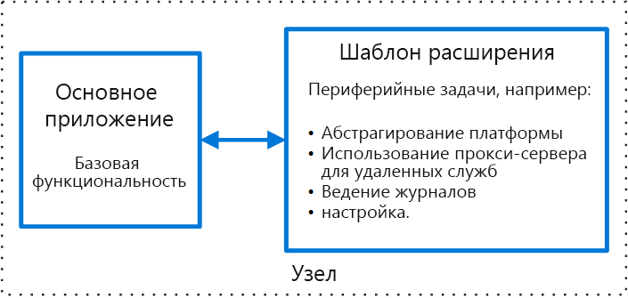

# Шаблон расширенияSidecar pattern

Чтобы обеспечить изоляцию и инкапсуляцию, развертывайте компоненты приложения в отдельном процессе или контейнере.Deploy components of an application into a separate process or container to provide isolation and encapsulation. Этот шаблон также может включать возможность создания приложений, состоящих из разнородных компонентов и технологий.This pattern can also enable applications to be composed of heterogeneous components and technologies.

Он называется *расширением*, так как напоминает коляску, присоединенную к мотоциклу.This pattern is named *Sidecar* because it resembles a sidecar attached to a motorcycle. В шаблоне расширение присоединяется к родительскому приложению и предоставляет для него вспомогательные функции.In the pattern, the sidecar is attached to a parent application and provides supporting features for the application. Жизненный цикл расширения и родительского приложения один и тот же, так как расширение создается и удаляется вместе с родительским приложением.The sidecar also shares the same lifecycle as the parent application, being created and retired alongside the parent. Иногда шаблон расширения называют шаблоном-компаньоном, который является шаблоном декомпозиции.The sidecar pattern is sometimes referred to as the sidekick pattern and is a decomposition pattern.

## Контекст и проблемаContext and Problem

Для приложений и служб часто нужны связанные функции, такие как мониторинг, ведение журналов, конфигурация и сетевые службы.Applications and services often require related functionality, such as monitoring, logging, configuration, and networking services. Эти периферийные задачи можно реализовать в качестве отдельных компонентов или служб.These peripheral tasks can be implemented as separate components or services.

Если они тесно интегрированы в приложении, то могут выполняться в одном процессе в качестве приложения, за счет чего обеспечивается эффективное использование общих ресурсов.If they are tightly integrated into the application, they can run in the same process as the application, making efficient use of shared resources. Однако это также означает, что они неэффективно изолированы и сбой в одном из этих компонентов может повлиять на остальные или же на все приложения.However, this also means they are not well isolated, and an outage in one of these components can affect other components or the entire application. Кроме того, они обычно должны быть реализованы на том же языке, что и родительское приложение.Also, they usually need to be implemented using the same language as the parent application. В результате компонент и приложение тесно связаны друг с другом.As a result, the component and the application have close interdependence on each other.

Если приложение делится на службы, каждую из них можно создать с использованием разных языков и технологий.If the application is decomposed into services, then each service can be built using different languages and technologies. При этом обеспечивается дополнительная гибкость, но у каждого компонента есть собственные зависимости, а также ему необходимы языковые библиотеки для доступа к базовой платформе и ресурсам родительского приложения.While this gives more flexibility, it means that each component has its own dependencies and requires language-specific libraries to access the underlying platform and any resources shared with the parent application. Кроме того, развертывание этих функций в качестве отдельных служб может привести к задержкам в приложении.In addition, deploying these features as separate services can add latency to the application. При управлении кодом и зависимостями для этих языковых интерфейсов операции могут усложниться, особенно размещение, развертывание и управление.Managing the code and dependencies for these language-specific interfaces can also add considerable complexity, especially for hosting, deployment, and management.

## РешениеSolution

Разместите набор задач вместе с основным приложением внутри их собственного процесса или контейнера, предоставляя однородный интерфейс для служб на платформе для разных языков.Co-locate a cohesive set of tasks with the primary application, but place them inside their own process or container, providing a homogeneous interface for platform services across languages.

Служба-расширение необязательно входит в приложение, хотя и подключена к нему.A sidecar service is not necessarily part of the application, but is connected to it. Она всегда работает с родительским приложением.It goes wherever the parent application goes. Службы-расширения поддерживают процессы или службы, развернутые с помощью основного приложения.Sidecars are supporting processes or services that are deployed with the primary application. К мотоциклу можно присоединить лишь одну коляску, и у каждого мотоцикла отдельная коляска.On a motorcycle, the sidecar is attached to one motorcycle, and each motorcycle can have its own sidecar. Таким же образом служба-расширение работает с родительским приложением.In the same way, a sidecar service shares the fate of its parent application. Для каждого экземпляра приложения размещен и развернут экземпляр расширения.For each instance of the application, an instance of the sidecar is deployed and hosted alongside it.

Преимущества шаблона расширения:Advantages of using a sidecar pattern include:

- Расширение не зависит от среды выполнения и языка программирования основного приложения, поэтому не нужно разрабатывать такой шаблон для каждого языка.A sidecar is independent from its primary application in terms of runtime environment and programming language, so you don't need to develop one sidecar per language.

- Расширение может получить доступ к тем же ресурсам, что и основное приложение.The sidecar can access the same resources as the primary application. Например, оно может наблюдать за системными ресурсами, используемыми основным приложением и им самим.For example, a sidecar can monitor system resources used by both the sidecar and the primary application.

- При обмене данными между расширением и основным приложением задержки не возникают, так как они тесно связаны.Because of its proximity to the primary application, there’s no significant latency when communicating between them.

- Даже для приложений, которые не предоставляют механизм расширения можно использовать расширение для расширения функциональных возможностей, подключив его как собственный процесс, в том же узле или вложенном контейнере в качестве основного приложения.Even for applications that don’t provide an extensibility mechanism, you can use a sidecar to extend functionality by attaching it as its own process in the same host or sub-container as the primary application.

Шаблон расширения часто используется с контейнерами и называется контейнером-расширением или контейнером-компаньоном.The sidecar pattern is often used with containers and referred to as a sidecar container or sidekick container.

## Проблемы и рекомендацииIssues and Considerations

- Определите формат развертывания и упаковки, который будет использоваться для развертывания служб, процессов или контейнеров.Consider the deployment and packaging format you will use to deploy services, processes, or containers. Контейнеры особенно хорошо подходят для шаблона расширения.Containers are particularly well suited to the sidecar pattern.
- При разработке службы-расширения проявите тщательность при выборе механизма межпроцессного взаимодействия.When designing a sidecar service, carefully decide on the interprocess communication mechanism. Если это целесообразно в соответствии с требованиями по производительности, попробуйте использовать технологии, независимые от языка или платформы.Try to use language- or framework-agnostic technologies unless performance requirements make that impractical.
- Перед переводом функциональной возможности в расширение определите оптимальный способ ее работы — в качестве отдельной службы или стандартной управляющей программы.Before putting functionality into a sidecar, consider whether it would work better as a separate service or a more traditional daemon.
- Кроме того, определите, можно ли внедрить функциональную возможность в виде библиотеки или же с помощью стандартного механизма расширения.Also consider whether the functionality could be implemented as a library or using a traditional extension mechanism. Языковые библиотеки могут иметь более тесный уровень интеграции и меньше нагрузки на сеть.Language-specific libraries may have a deeper level of integration and less network overhead.

## Когда следует использовать этот шаблонWhen to Use this Pattern

Используйте этот шаблон в следующих случаях:Use this pattern when:

- В основном приложении используется разнородный набор языков и платформ.Your primary application uses a heterogeneous set of languages and frameworks. Компонент, расположенный в службе-расширении, может использоваться приложениями, написанными на разных языках и с использованием различных платформ.A component located in a sidecar service can be consumed by applications written in different languages using different frameworks.
- Компонент принадлежит удаленной команде или другой организации.A component is owned by a remote team or a different organization.
- Компонент или функция размещается на том же узле, что и приложение.A component or feature must be co-located on the same host as the application
- Вам нужна служба, имеющая тот же жизненный цикл, что и основное приложение, но при этом она должна обновляться независимо от приложения.You need a service that shares the overall lifecycle of your main application, but can be independently updated.
- Вам нужен точный контроль над ограничениями ресурсов для конкретного ресурса или компонента.You need fine-grained control over resource limits for a particular resource or component. Например, вам может понадобиться ограничить объем памяти, который используют отдельные компоненты.For example, you may want to restrict the amount of memory a specific component uses. Компонент можно развернуть в качестве расширения и управлять использованием памяти независимо от основного приложения.You can deploy the component as a sidecar and manage memory usage independently of the main application.

Этот шаблон будет неприменим в следующих случаях:This pattern may not be suitable:

- Если необходимо оптимизировать межпроцессное взаимодействие.When interprocess communication needs to be optimized. Обмен данными между родительским приложением и службами-расширениями вызывает дополнительные нагрузки, в частности задержки в вызовах.Communication between a parent application and sidecar services includes some overhead, notably latency in the calls. Это неприемлемый компромисс для активных интерфейсов.This may not be an acceptable trade-off for chatty interfaces.
- Для небольших приложений, где стоимость ресурса при развертывания службы-расширения для каждого экземпляра выше, чем преимущество изоляции.For small applications where the resource cost of deploying a sidecar service for each instance is not worth the advantage of isolation.
- Если службу нужно масштабировать по-другому или независимо от основного приложения,When the service needs to scale differently than or independently from the main applications. лучше развернуть компонент как отдельную службу.If so, it may be better to deploy the feature as a separate service.

## ПримерExample

Шаблон расширения применяется во многих сценариях.The sidecar pattern is applicable to many scenarios. Несколько распространенных примеров:Some common examples:

- API инфраструктуры.Infrastructure API. Команда разработчиков инфраструктуры создает службу, развертываемую вместе с каждым приложением, а не языковую клиентскую библиотеку для доступа к инфраструктуре.The infrastructure development team creates a service that's deployed alongside each application, instead of a language-specific client library to access the infrastructure. Служба загружается как расширение и предоставляет общий уровень для служб инфраструктуры, включая ведение журнала, данные среды, хранилище конфигураций, обнаружение, проверку работоспособности и контрольные службы.The service is loaded as a sidecar and provides a common layer for infrastructure services, including logging, environment data, configuration store, discovery, health checks, and watchdog services. Расширение также отслеживает среду размещения и процесс родительского приложения (или контейнера) и записывает сведения в централизованную службу.The sidecar also monitors the parent application's host environment and process (or container) and logs the information to a centralized service.
- Управление NGINX и HAProxy.Manage NGINX/HAProxy. Разверните NGINX с помощью службы-расширения, которая отслеживает состояние среды, а затем обновляет файл конфигурации NGINX и перезапускает процесс, если требуются изменения в состоянии.Deploy NGINX with a sidecar service that monitors environment state, then updates the NGINX configuration file and recycles the process when a change in state is needed.
- Расширение-посредник.Ambassador sidecar. Разверните [службу-посредник](./ambassador.md) в качестве расширения.Deploy an [ambassador](./ambassador.md) service as a sidecar. Приложение вызывает посредник, который обрабатывает журнал запросов, маршрутизацию, автоматическое выключение и другие функции, связанные с подключением.The application calls through the ambassador, which handles request logging, routing, circuit breaking, and other connectivity related features.
- Разгрузка прокси-сервера.Offload proxy. Разместите прокси-сервер NGINX перед экземпляром службы node.js для обработки содержимого статических файлов для службы.Place an NGINX proxy in front of a node.js service instance, to handle serving static file content for the service.

## Связанные руководстваRelated guidance

- [Шаблон посредникаAmbassador pattern](./ambassador.md)
