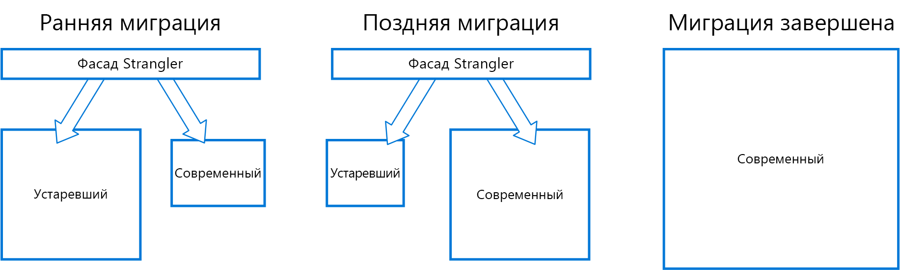

# Шаблон подавления

Пошаговая миграция устаревшей системы с постепенной заменой определенных компонентов новыми приложениями и службами. Компоненты устаревшей системы постепенно удаляются, и со временем новая система полностью возьмет на себя все ее функции, что позволяет вывести старую систему из эксплуатации. 

## Контекст и проблема

Средства разработки, технологии размещения и архитектуры, на основе которых создается любая система, часто устаревают с течением времени. По мере добавления новых функций и возможностей неуклонно растет сложность старых приложений, что еще больше затрудняет обслуживание и добавление новых компонентов.

Но полная замена сложной системы часто сопряжена с огромными трудностями. Во многих случаях предпочтительнее переходить на новую систему постепенно, сохраняя старую систему для обработки тех возможностей, которые еще не реализованы в новой. Выполнение двух разных версий одного приложения означает, что клиенты должны знать, в какой их них находятся нужные компоненты. И эти сведения нужно обновлять во всех клиентах каждый раз, когда вы переносите очередной компонент или службу.

## Решение

Поэтапно заменяйте компоненты новыми приложениями и службами. Создайте оболочку, которая перехватывает все запросы к устаревшим системам серверной части. Эта оболочка будет выбирать, куда направить такие запросы: к устаревшему приложению или к новой службе. Так вы сможете перенести компоненты в новую систему постепенно, не изменяя интерфейс для пользователей, которые даже не заметят, что происходит поэтапная миграция.

  

Эта модель позволяет снизить риски миграции и распределить усилия разработчиков по времени. Пока оболочка безопасно направляет пользователей к правильному приложению, вы можете добавлять компоненты в новую систему в комфортном темпе, сохраняя при этом работоспособность старого приложения. Через некоторое время все функции будут перенесены в новую систему и устаревшая система больше не будет нужна. Когда этот процесс завершится, вы сможете отключить и удалить старую систему.

## Проблемы и рекомендации

- Отдельного внимания потребуют службы и хранилища данных, которые одновременно используются в новой и устаревшей системах. Следите за тем, чтобы обе системы могли получать доступ к этим ресурсам.
- Организуйте новые приложения и службы так, чтобы их можно было легко отключить и заменить во время следующей миграции.
- В определенный момент, когда миграция завершится, созданную для этого шаблона оболочку нужно убрать или преобразовать в адаптер для клиентов устаревших версий.
- Следите за тем, чтобы оболочка обновлялась параллельно с перенесенной версией.
- Следите за тем, чтобы оболочка не стала единой точкой отказа или узким местом производительности.

## Когда следует использовать этот шаблон

Используйте этот шаблон при поэтапной миграции серверной части приложения на новую архитектуру.

Эту схему не стоит применять в следующих случаях:

- если запросы к системам серверной части невозможно задерживать;
- если система относительно невелика и ее легко полностью заменить.

## Связанные руководства

- [Anti-Corruption Layer pattern](./anti-corruption-layer.md) (Шаблон уровня защиты от повреждения)
- [Схема маршрутизации шлюза](./gateway-routing.md)

 

